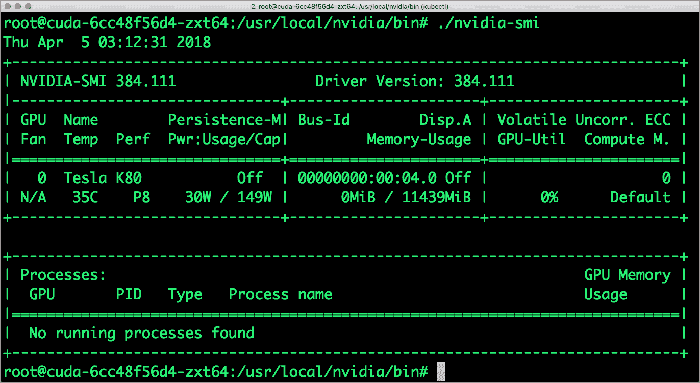

# Google Kubernetes 引擎中的 GPU 入门

> 原文：<https://thenewstack.io/getting-started-with-gpus-in-google-kubernetes-engine/>

在本系列的最后一部分，我[介绍了 Nvidia-Docker](https://thenewstack.io/primer-nvidia-docker-containers-meet-gpus/) 从容器访问 GPU。在本教程中，我将向您介绍从 Kubernetes 访问 GPU 的步骤。

Google Kubernetes Engine (GKE)是第一个为客户提供 GPU 的托管 Kubernetes 平台之一。基于英伟达特斯拉 K80 和 P100 GPU，GKE 使得在云中大规模运行容器化的机器学习作业、图像处理和金融建模成为可能。该功能目前在谷歌云平台的特定地区提供测试版。

作为 Kubernetes 的倡导者，以及一名崭露头角的机器学习开发人员，我非常兴奋地看到 GPU 的可用性。这种能力将为部署在 Kubernetes 上的机器学习作业带来高度可扩展的训练和推理。

假设您有一个有效的 GCP 帐户，并且在您的开发机器上配置了 Google Cloud SDK，那么您可以启动一个由 GPU 支持的 Kubernetes 集群。

让我们从验证 GCP 云中可用的加速器和支持的区域开始。

```
$  gcloud beta compute accelerator-types list


```

该输出证实了 Nvidia Tesla K80 和 P100 GPU 加速器在一些地区的可用性。

我们现在将在 asia-east1-a 区域启动一个 GKE 集群，该区域有两个节点。这是一个没有 GPU 节点的普通集群。在配置好集群之后，我们将添加几个带有 GPU 的节点。

```
$  gcloud container clusters create k8s-gpu  \

--num-nodes=2  \

--zone asia-east1-a  \

--cluster-version  1.9.4-gke.1

$  kubectl get nodes

```


集群就绪后，我们现在将创建一个包含 GPU 特定节点的节点池。节点池是群集中具有相同配置的节点实例的子集。

当我们创建容器集群时，指定的节点数量和类型成为默认节点池。然后，我们可以向群集中添加不同大小和类型的额外自定义节点池。任何给定节点池中的所有节点都彼此相同。

以下命令将创建一个新的节点池，并将其添加到现有群集中。这种方法的优点是每个节点池都可以单独扩展。尽管我们最初只添加了一个节点，但我们可以根据工作负载轻松扩展或收缩池。

```
$  gcloud beta container node-pools  \

create gpu-pool  \

--num-nodes=1  \

--accelerator type=nvidia-tesla-k80,count=1  \

--zone asia-east1-a   \

--cluster k8s-gpu

```

上面使用的命令加载了开关。注意开关*–加速器*，它提到了要使用的 GPU 类型以及 GPU 的数量。可以向池中的一个节点添加多个 GPU。

现在，集群多了一个 GPU 支持的节点。


当一个 GPU 节点添加到集群中时，GKE 会在该特定节点上运行一个插件作为 pod。

检查 kube-system 名称空间中的 pod 将确认这一点。

```
$  kubectl get pods  -n=kube-system<em> </em>

```


我们还需要安装设备驱动程序作为 DaemonSet，它针对集群中的每个 GPU 节点。Google 提供了一个带有 DaemonSet 定义的 [YAML 文件](https://raw.githubusercontent.com/GoogleCloudPlatform/container-engine-accelerators/k8s-1.9/nvidia-driver-installer/cos/daemonset-preloaded.yaml)。

安装需要几分钟才能完成。安装后，Nvidia GPU 设备插件通过 Kubernetes APIs 公开 Nvidia GPU 容量。

```
$  kubectl create  -f  <a  href="https://raw.githubusercontent.com/GoogleCloudPlatform/container-engine-accelerators/k8s-1.9/nvidia-driver-installer/cos/daemonset-preloaded.yaml">https://raw.githubusercontent.com/GoogleCloudPlatform/container-engine-accelerators/k8s-1.9/nvidia-driver-installer/cos/daemonset-preloaded.yaml</a>

```

几分钟后，驱动程序出现在 kube-system 名称空间中。


我们已经准备好在集群上运行 GPU 工作负载。让我们首先部署一个 Ubuntu 16:04 映像来检查 Nvidia 配置。

```
$  kubectl run cuda  \

--image=ubuntu:16.04  \

--env="LD_LIBRARY_PATH=/usr/local/nvidia/lib64:/usr/local/nvidia/bin"  \

--limits="nvidia.com/gpu=1"  \

--rm  -it  --  /bin/bash

```

上面的命令创建了一个名为 cuda 的部署，GPU 限制设置为 1。根据作为节点池的一部分添加到节点的 GPU 数量，我们可以将 GPU 资源分配给 pod。该命令还设置了一个环境变量，用于将二进制文件和库添加到 pod 中。

如果一切顺利，我们应该在 Ubuntu 容器的外壳里面。

导航到 */usr/local/nvidia/bin* 目录，运行常用的 *nvidia-smi* 命令。



恭喜你！您已经准备好在 Kubernetes 上运行大规模并行工作负载。

如果您正在运行一个 pod 而不是一个部署，那么使用下面的带有 *nodeSelector* 的声明来创建亲缘关系。这将确保 pod 总是被安排在具有 GPU 的节点上。

```
apiVersion:  v1

kind:  Pod

spec:

   containers:

   -  name:  my-gpu-container

     resources:

       limits:

        nvidia.com/gpu:  2

   nodeSelector:

     cloud.google.com/gke-accelerator:  nvidia-tesla-p100  # or nvidia-tesla-k80

```

在本教程的下一部分，我们将创建一个机器学习训练作业，在 GKE 集群上构建一个 Caffe 模型。这是一个利用 Kubernetes 和 GPU 联合力量的令人兴奋的用例。敬请期待！

特征图像:在 [Nvidia GPU 技术会议](https://thenewstack.io/nvidia-embraces-kubernetes-for-scalable-deep-learning/)上展示的由 GPU 从 2D MRI 图像中生成的心脏的 3D 可视化。

<svg xmlns:xlink="http://www.w3.org/1999/xlink" viewBox="0 0 68 31" version="1.1"><title>Group</title> <desc>Created with Sketch.</desc></svg>