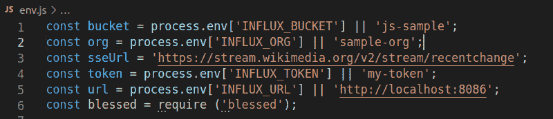

# JavaScript 和 InfluxDB 入门

> 原文：<https://thenewstack.io/getting-started-with-javascript-and-influxdb/>

[Telegraf](https://www.influxdata.com/time-series-platform/telegraf/) 是为 [InfluxDB](https://www.influxdata.com/) 收集数据的首选方式。尽管在某些用例中，客户端库更好，比如在解析服务器端事件流时。在本教程中，您将学习如何读取数据流，将其作为时间序列存储到 InfluxDB 中，并使用 [InfluxDB 的 JavaScript 客户端库](https://www.influxdata.com/blog/getting-started-with-javascript-and-influxdb-2-0/)对数据进行查询。

本教程中的所有代码都可以在 [GitHub](https://github.com/nickmancol/InfluxJS) 上的这个 repo 中免费获得。

## 什么是时序数据库？

 [尼古拉斯·博霍克斯

Nicolas 是 Merqueo 的数据架构师。他是一些初创公司开发团队的成员，并在美洲创办了三家公司。他热衷于复杂性建模和使用数据科学来改善世界。](https://portal.draft.dev/writers/rec9dkij8xc5TobPu) 

[时序数据库](https://www.influxdata.com/time-series-database/)是一种专门的数据存储类型，主要提供存储和查询数据的工具，这些数据的维度以时间为单位。好的例子包括每小时特定时刻的温度、股票市场中股票的价格或者高峰时间某个区域的汽车数量。

基于时间的[数据集](https://github.com/awesomedata/awesome-public-datasets#timeseries)有很多例子。并非所有类型的数据都适合时序数据库。一个例子是用于在机器学习空间中训练分类问题的 [Iris](https://scikit-learn.org/stable/auto_examples/datasets/plot_iris_dataset.html) 数据集。也不是用于预测的巨大数据集。

时序数据库通常用于分析应用程序日志和收集传感器数据。应用程序和传感器不断产生数据流，其属性不同于基于时间的维度。在本教程中，数据源是维基媒体基金会提供的最近变更的[事件流](https://wikitech.wikimedia.org/wiki/Event_Platform/EventStreams)。该数据跟随[服务器发送的事件](https://en.wikipedia.org/wiki/Server-sent_events)，可以通过 HTTP 直接使用。

示例 Node.js CLI 应用程序由两个组件组成。第一个使用流消息，并将它们作为数据点写入 InfluxDB 数据库。其次，有一个阅读器查询数据库，将查询结果显示为一个简单的折线图。x 轴表示时间，y 轴表示序列的值。


## 教程先决条件

这个例子是使用 Ubuntu 20.04 和 Node.js v14.17.3 (npm v6.14.13)测试的——使用[节点版本管理器(NVM)](https://www.fullstacktutorials.com/tutorials/nodejs/node-version-manager-nvm.html) 安装。由于有许多版本的 Node.js 可用，NVM 有助于轻松管理和测试代码。该示例还从本地 InfluxDB 2.0 数据库中写入和读取数据。

如果没有本地安装，可以按照[安装指南](https://docs.influxdata.com/influxdb/v2.0/install/)，然后创建一个样本[组织](https://docs.influxdata.com/influxdb/v2.0/organizations/create-org/)、[桶](https://docs.influxdata.com/influxdb/v2.0/organizations/buckets/create-bucket/)和[令牌](https://docs.influxdata.com/influxdb/v2.0/security/tokens/create-token/)。

创建令牌后，使用本地安装的值设置以下环境变量的值:

*   流入 _ 组织
*   涌入 _ 桶
*   涌入 _ 令牌
*   涌入 _ 网址

这些变量是在 env.js 文件中读取的，带有一些默认值。



## 安装库

InfluxDB JavaScript 客户端是一个标准的 Node.js 模块，可以从命令行安装:

```
```sh
npm install  @influxdata/influxdb-client
npm install  @influxdata/influxdb-client-apis
```

```

也可以用一行代码作为浏览器的依赖:

```
```html
<script type="module">
// import latest release from npm repository
import  {InfluxDB}  from  'https://unpkg.com/@influxdata/influxdb-client/dist/index.browser.mjs'
<script>
```

```

在这个例子中，除了 InfluxDB JavaScript 客户端之外，一些其他库也用于呈现目的:

*   asciichart:纯 JavaScript 的控制台 ASCII 折线图
*   祝福:一个类似 curses 的库，带有一个高级终端接口 API(“curses”是一个用于类似 Unix 系统的终端控制库)
*   粉笔:终端字符串样式做对了
*   event source:event source 客户端的纯 JavaScript 实现

这些都不是使用 InfluxDB JavaScript 客户端所必需的。

### 建立联系

一旦安装了依赖项并设置了环境变量，就可以连接到 bucket 了。对于这个例子，writer.js 和 reader.js 用从环境中读取的 url 和令牌实例化一个 InfluxDB 对象:

```
```javascript
new  InfluxDB({url,  token})
```

```

该对象提供了实例化不同 API 客户端的方法，例如 Writer 或 Query。

### 插入数据

要在 InfluxDB 中插入数据，您必须遵循[线路协议](https://docs.influxdata.com/influxdb/v2.0/reference/syntax/line-protocol/)。这为构成数据点的四个元素定义了一个结构:

*   Measurement:这是您要插入数据的表的名称
*   标记集:一组逗号分隔的键=数据属性值
*   字段集:一组逗号分隔的 key =数据维的值，数据可以是浮点型(默认)、整数、整数、字符串、布尔型
*   时间戳(可选):Unix 时间戳

幸运的是，InfluxDB JavaScript 客户端提供了一个包装器类，用于与 Writer API 一起插入一个或多个数据点。下面的代码显示了如何连接到事件源，并为每条消息实例化一个要添加到桶中的点:

```
  ```javascript
  #!/usr/bin/env node
const  {InfluxDB,  Point,  HttpError}  =  require('@influxdata/influxdb-client');
const  {url,  token,  org,  bucket,  sseUrl}  =  require('./env');
var EventSource  =  require('eventsource');
const  {hostname}  =  require('os');

//Creates a writer with "seconds" as precision
const writeApi  =  new  InfluxDB({url,  token}).getWriteApi(org,  bucket,  's');
//Sets the common tags for this writer
writeApi.useDefaultTags({location:  hostname(),  source:'wikimedia',  sseUrl:sseUrl  });

console.log(`Connecting  to  EventStreams  at  ${sseUrl}`);
var eventSource  =  new EventSource(sseUrl);

eventSource.onmessage  =  function(event)  {
    // event.data will be a JSON string containing the message event.
    const  d  =  JSON.parse(event.data);
    if(  d.length  !=  undefined  ){
        const dataPoint  =  new Point('edition')
            .tag(  'user',d.user  )
            .tag(  'isBot',  d.bot  )
            .floatField('value',  d.length.new)
        writeApi.writePoint(  dataPoint  );
        console.log(  dataPoint  );
        writeApi
        .flush().then(()  =>  {})
        .catch(e  =>  {
            console.log('\nFinished ERROR: '  +  e);
        });
    }
};
  ```

```

注意，在第 9–11 行中,`writeApi`是用`organization`和`bucket`环境变量实例化的，而且还有一个精度值。在这种情况下是`seconds`，它定义了要写入的数据的时间戳维度的粒度；在处检查其他可能的值[。](https://github.com/influxdata/influxdb-client-js/blob/94f87594517999fd42e0322a82d22a5c6fd394f7/packages/core/src/options.ts#L84%5D)

此外，您可以为要写入的每个数据点设置一些默认标记，在本例中是数据源。还要注意，客户端为您提供了用其他值扩展这个默认标记集的选项；对于每个数据点，添加`user`和`isBot`标签。

写入的字段是所做更改的长度(第 23 行)，`writePoint`方法接受 Point 实例，然后刷新 writeApi 实例。您应该始终关闭 writeApi，以便刷新挂起的更改并关闭挂起的计划重试执行。对于事件源推送的每条消息，writer.js 都会无限期运行。

### 查询数据

一旦数据在桶中，InfluxDB JavaScript 客户机就提供另一个 API 客户机来查询数据。在这个例子中，`InfluxDB`对象运行一个查询，该查询返回在过去 10 秒内由`isBot`标记分组的数据点的数量:

```
```javascript
const query  =  '\
from(bucket:"js-sample")\
|> range(start: -10s)\
|> filter(fn:(r) => r._measurement == "edition")\
|> group(columns: ["isBot"])\
|> count()\
';
```

```

查询是用 [Flux](https://docs.influxdata.com/influxdb/v2.0/query-data/get-started/) 功能数据脚本语言编写的。这是为在 InfluxDB 2.0 上查询、分析和操作数据而设计的。API 的/query 兼容性端点仍然支持以前的语言 InfluxDB 类似 SQL 的查询语言，但是建议使用新语言的全部功能。

如您所见，该查询定义了存储桶、数据范围、要应用的过滤器、要应用的分组列和数据函数。下面的函数向您展示了如何针对`QueryApi` :
运行查询

```
```javascript
function queryExample(fluxQuery)  {
    const queryApi  =  new  InfluxDB({url,  token}).getQueryApi(org)
    queryApi.queryRows(fluxQuery,  {
        next(row,  tableMeta)  {
            const  o  =  tableMeta.toObject(row);
            pushRow(o);
            render();
        },
        complete()  {  
            console.log('FINISHED')
        },
        error(error)  {
            console.log('QUERY FAILED',  error)
        },
    });
}
```

```

对于返回的每一行，数据被解析为一个对象，并传递给一个函数，该函数基于`isBot`属性将数据存储在一个数组中。该系列的两个数组，机器人和人类，然后使用 asciichart 库进行渲染。阅读器的完整代码如下所示:

```
```javascript
const  {InfluxDB}  =  require('@influxdata/influxdb-client');
const  {url,  token,  org,  bucket,  chart,  screen}  =  require('./env');
const chalk  =  require('chalk');
var asciichart  =  require  ('asciichart');
const maxLength  =  100;
const bots  =  [];
const humans  =  [];
var config  =  {
    height:  18, // any height you want
    colors:  [
        asciichart.blue,
        asciichart.red,
        asciichart.default,  // default color
        undefined,  // equivalent to default
    ]
}

const query  =  `\
from(bucket:"${bucket}")\
|>  range(start:  -10s)\
|>  filter(fn:(r)  =>  r._measurement  ==  "edition")\
|>  group(columns:  ["isBot"])\
|>  count()\
`;

demo();

async function demo()  {
    for  (let index  =  0;  index  <  300;  index++)  {
        queryExample(  query  );
        await sleep(500);
    }
}

function queryExample(fluxQuery)  {
    const queryApi  =  new  InfluxDB({url,  token}).getQueryApi(org)
    queryApi.queryRows(fluxQuery,  {
        next(row,  tableMeta)  {
            const  o  =  tableMeta.toObject(row);
            pushRow(o);
            render();
        },  complete()  {}
        ,  error(error)  {
            console.log('QUERY FAILED',  error)
        }
    });
}

function pushRow(row)  {
    if  (bots.length  >=  maxLength)  {
        bots.shift  ();
    }
    if  (humans.length  >=  maxLength)  {
        humans.shift  ();
    }

    row.isBot  ==  'true'  ?  bots.push(  row['_value'])  :  humans.push(  row['_value']);
}

function render(){
    if(bots.length  !=  0  && humans.length != 0) {
        const plt = asciichart.plot ([bots,humans], config).split ('\n');
        chart.setLine  (0,  chalk.blue('Bots: '+bots[bots.length-1])  +  ' '  +  chalk.red('Humans: '+humans[humans.length-1]));
        plt.forEach  ((line,  i)  =>  {
            chart.setLine  (i  +  1,  line);
        });
    }
    screen.render();
}

function sleep(ms)  {
    return new Promise(resolve  =>  setTimeout(resolve,  ms));
}
```

```

### 附加文档和功能

InfluxDB JavaScript 客户端还提供了额外的功能(比如 HealthAPI 和其他包装类),简化了生产就绪管道的构建。查看[客户端](https://github.com/influxdata/influxdb-client-js/blob/94f87594517999fd42e0322a82d22a5c6fd394f7/packages/apis)和 InfluxDB [API](https://docs.influxdata.com/influxdb/v2.0/api/) 文档了解更多详细信息。

## 结论

像 [InfluxDB](https://www.influxdata.com/) 这样的时序数据库提供了专门的功能和工具来存储和分析具有高摄取率的数据点，例如物联网(IoT)数据。这个示例有助于理解 InfluxDB JavaScript 客户端收集大量流数据的功能。客户端是一个简单的标准 Node.js 模块，它允许您向 InfluxDB 实例无摩擦地写入数据或从中读取数据。

<svg xmlns:xlink="http://www.w3.org/1999/xlink" viewBox="0 0 68 31" version="1.1"><title>Group</title> <desc>Created with Sketch.</desc></svg>