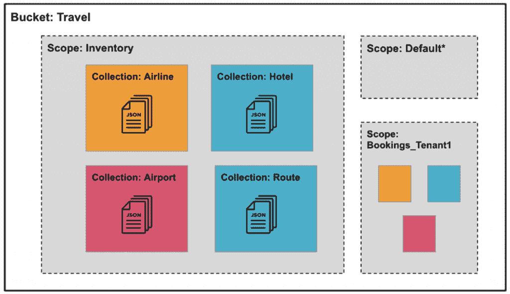
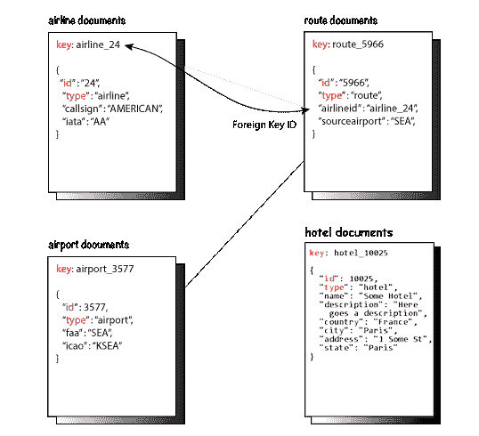

# NoSQL 和 Java 入门

> 原文：<https://thenewstack.io/getting-started-with-nosql-and-java/>

对于使用 Java 的开发人员来说，连接到正确的数据库可以为他们的组织带来显著的好处，同时从长远来看也使他们的工作更加容易。对于将 NoSQL 的灵活性和敏捷性与熟悉的 SQL 相结合的数据库来说尤其如此。

在本文中，我将简要介绍 NoSQL 数据库的情况，并带您浏览一个与 NoSQL 数据库交互的简单 Java 示例的结构。

## **NoSQL 数据库技术的现状**

 [Jagadesh Munta

Jagadesh 是 Couchbase 的首席软件工程师。他在软件开发生命周期、QA、DevOps 和架构方面拥有 20 多年的经验。在加入 Couchbase 之前，Jagadesh 曾在 Oracle 和 Sun Microsystems 担任技术职务。](https://www.linkedin.com/in/jagadeshmunta/) 

NoSQL 数据库将数据存储为 JSON 文档，而不是包含列和行的关系表。一些 NoSQL 数据库提供了 SQL 和本地文档 API 两种编程接口。NoSQL 数据库的类型包括文档数据库、键值存储、宽列数据库和图形数据库。

众所周知，NoSQL 数据库能够高效地存储和处理大量数据，已经成为许多现代企业的基础技术。许多 NoSQL 数据库在云中作为完全托管的数据库即服务(DBaaS)或用于内部安装。开发人员使用各种编程语言和 API 中的 SDK 与这样的数据库进行交互。

在我们进入代码示例之前，看看示例数据以及它在数据库(通常称为数据模型)中是如何组织的会很有帮助。

## **数据模型**

在数据组织的最高级别，该数据库包含一个或多个存储桶。每个存储桶可以包含一个或多个作用域，每个作用域可以包含一个或多个集合。集合中有 JSON 文档。

这种层次结构类似于关系数据库，其中数据库具有模式、表和行等。这个文档数据库的分层数据容器模型非常好地映射到关系模型:bucket =数据库，scope =模式，collection =表，document =行。

这种映射允许您通过集合中的文档数据模型或使用 SQL 的关系模型来访问数据。

本例中的样本称为“Travel Sample”，这是一个航空旅行信息系统的数据集。

旅游样本数据集的文档(JSON)数据模型如下所示。



主要实体是航空公司、机场、航线，将航空公司、机场和酒店连接成一个独立的实体。

下图显示了航空旅行系统中各种文档之间的关系。它显示了每个文档包含的主键、ID 和类型字段，以及每个文档类型中的其他代表性字段。



现在，我们准备看看这个样本数据集上的一些基本数据访问操作。

## **代码示例**

现在已经介绍了基本的概念，让我们看看如何连接到数据库，为要处理的 bucket 和 collection 建立一个上下文，执行简单的键值操作和查询，最后修改数据库中的一些数据。

## **连接到数据库集群**

连接字符串通常由主机 URL (IP 名称/地址)组成，后跟用户名和密码。使用这个连接字符串，可以获得一个到数据库集群的连接对象。在本例中，我们使用 localhost (127.0.0.1)作为数据库主机。您可能希望替换适合您的数据库集群的数据库名称、用户名和口令。到数据库集群的连接由一个集群对象表示。

```
class  Program  {
    public static void main(String[]  args)  {
    var cluster  =  Cluster.connect(
      "dbName",  "username",  "password"
    );

```

## **为适当的集合设置上下文**

现在让我们为一个非常具体的数据集建立一个上下文:一个名为“travel-sample”的存储桶，它已经包含了 Travel Sample 数据集集合。下面的代码将我们当前的上下文设置为“travel-sample”中的默认集合

```
    var bucket  =  cluster.bucket("travel-sample");
    var collection  =  bucket.defaultCollection();

```

## **基本键值操作(获取文档)**

键值(KV)或数据服务提供了最简单的方法来检索或改变已知键的数据。下面的`get`方法检索与一个键相关联的特定数据(值)。在这种情况下，关键字是“airline_10”

```
 try  {
        var result  =  collection.get("airline_10");
        System.out.println(result.toString());
          }
 catch  (DocumentNotFoundException ex)  {
      System.out.println("Document not found!");
    }
  }
}

```

## **使用 SQL 查询行**

下面是执行 SQL 查询的一段代码，从 Travel 示例数据集中检索 Malibu 市的酒店名称。

```
try  {
      var query  =  
        "SELECT h.name, h.city, h.state "  +
        "FROM `travel-sample` h "  +
        "WHERE h.type = 'hotel' "  +
          "AND h.city = 'Malibu' LIMIT 5;";

      QueryResult result  =  cluster.query(query);
      for  (JsonObject row  :  result.rowsAsObject())  {
        System.out.println("Hotel: "  +  row);
      }
    }  catch  (DocumentNotFoundException ex)  {
      System.out.println("Document not found!");
    }
  }
}

```

## **使用命名或位置参数进行查询**

查询方法可以有命名参数或位置参数。

下面是一个命名参数示例:

代码继续访问 travel-sample 数据库(特别是姓名、城市和州的存储桶)。`queryOptions()`方法允许定制各种 SQL 查询选项。

```
  try  {
      var query  =  
        "SELECT h.name, h.city, h.state "  +
        "FROM `travel-sample` h "  +
        "WHERE h.type = $type "  +
          "AND h.city = $city LIMIT 5;";

      QueryResult result  =  cluster.query(query,
        queryOptions().parameters(
          JsonObject.create()
            .put("type",  "hotel")
            .put("city",  "Malibu")
        ));
          result.rowsAsObject().stream().forEach(
        e->  System.out.println(
          "Hotel: "  +  e.getString("name")  +  ", "  +  e.getString("city"))
      );
    }  catch  (CouchbaseException ex)  {
      System.out.println("Exception: "  +  ex.toString());
    }
  }
}

```

位置参数允许用占位符替换方法参数的顺序。

```
    try  {
      var query  =  
        "SELECT h.name, h.city, h.state "  +
        "FROM `travel-sample` h "  +
        "WHERE h.type = $1 "  +
          "AND h.city = $2 LIMIT 5;";

      QueryResult result  =  cluster.query(query,
        queryOptions().parameters(JsonArray.from("hotel",  "Malibu"))      );
    result.rowsAsObject().stream().forEach(
        e->  System.out.println(
          "Hotel: "  +  e.getString("name")  +  ", "  +  e.getString("city"))
      );
  }  catch  (CouchbaseException ex)  {
      System.out.println("Exception: "  +  ex.toString());
    }
  }
}

```

## **使用子文档查找操作**

子文档是文档的一部分，您可以自动有效地更新和检索。

在下面的代码中，`lookupIn`操作查询“airport_1254”文档中的某个路径(这里是`geo.alt`路径)。这段代码允许我们使用`subdoc get`操作:`(get("geo.alt"))`来检索文档路径。

```
try  {
      LookupInResult result  =  collection.lookupIn(
        "airport_1254",
        Collections.singletonList(get("geo.alt"))
      );

      var str  =  result.contentAs(0,  String.class);
      System.out.println("Altitude = "  +  str);
 }  catch  (DocumentNotFoundException ex)  {
      System.out.println("Document not found!");
    }
  }
}

```

## **使用子文档变异操作**

变异操作修改文档中的一个或多个路径。在下面的代码中，mutateIn 操作用于通过使用完整的文档级 upsert 来修改`airline_10`，这将使用参数(`country`、`Canada`)创建现有路径的值。

```
 try  {
      LookupInResult result  =  collection.lookupIn(
        "airline_10",  Collections.singletonList(get("country"))
      );
      var str  =  result.contentAs(0,  String.class);
      System.out.println("Sub-doc before: ");
      System.out.println(str);

    }  catch  (PathNotFoundException  e)  {
      System.out.println("Sub-doc path not found!");
    }
    try  {
      collection.mutateIn("airline_10",  Arrays.asList(
        upsert("country",  "Canada")
      ));
    }  catch  (PathExistsException  e)  {
      System.out.println("Sub-doc path exists!");
    }
    try  {
      LookupInResult result  =  collection.lookupIn(
        "airline_10",  Collections.singletonList(get("country"))
      );
      var str  =  result.contentAs(0,  String.class);
      System.out.println("Sub-doc after: ");
      System.out.println(str);
  }  catch  (PathNotFoundException  e)  {
      System.out.println("Sub-doc path not found!");
    }

  }
}

```

## **使用向上插入功能**

Upsert 用于插入新记录或更新现有记录。如果文档不存在，将会创建它。Upsert 是*插入*和*更新*的组合。

`.put`方法允许用户将映射插入到地图中。如果传递了现有的键，新值将替换以前的值。

```
    JsonObject content  =  JsonObject.create()
      .put("country",  "Iceland")
      .put("callsign",  "ICEAIR")
      .put("iata",  "FI")
      .put("icao",  "ICE")
      .put("id",  123)
      .put("name",  "Icelandair")
      .put("type",  "airline");

    collection.upsert("airline_123",  content);

    try  {
      LookupInResult lookupResult  =  collection.lookupIn(
        "airline_123",  Collections.singletonList(get("name"))
      );

      var str  =  lookupResult.contentAs(0,  String.class);
      System.out.println("New Document name = "  +  str);
    }  catch  (PathNotFoundException ex)  {
      System.out.println("Document not found!");
    }

  }
}

```

上面使用的样本数据集和代码示例来自分布式 NoSQL 云数据库 [Couchbase](https://www.couchbase.com) 。说到数据库即服务，请访问五车二的 Couchbase，了解现代企业如何通过内置的多模式和移动同步功能在各种用例中提供灵活性，并推动大规模毫秒级数据响应。

这些以及更多的例子可以在 Couchbase Playground 找到并运行。要联系社区中其他志同道合的开发者以获得更多灵感，请访问 [Couchbase 论坛](https://forums.couchbase.com/)。对于那些刚刚开始学习 Java 的人来说，另一个值得考虑的资源是由 Couchbase 学院提供的免费在线 Java 开发人员认证课程。

<svg xmlns:xlink="http://www.w3.org/1999/xlink" viewBox="0 0 68 31" version="1.1"><title>Group</title> <desc>Created with Sketch.</desc></svg>