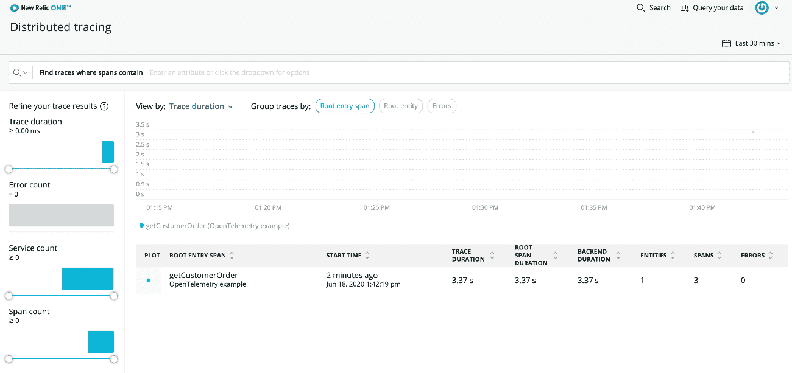
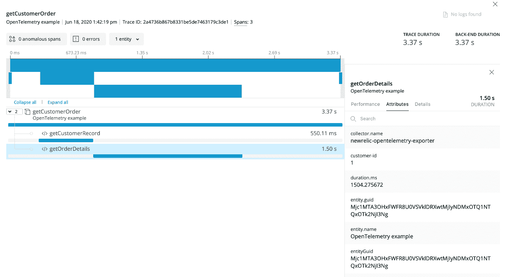
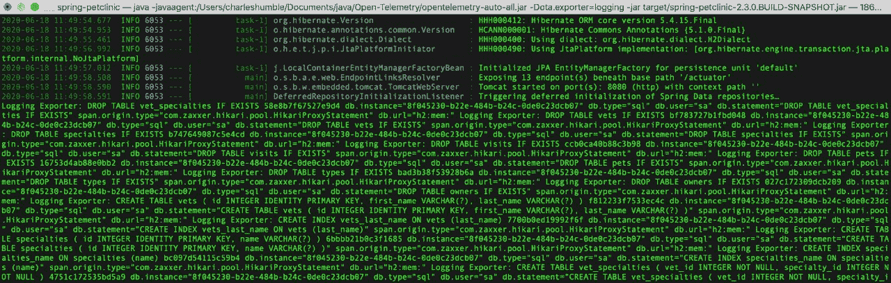
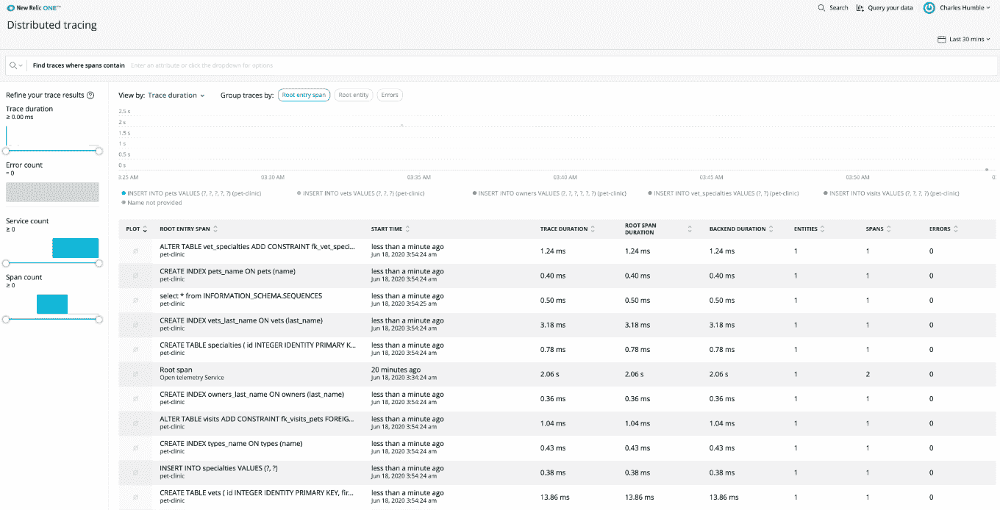

# Java open telemetry 入门

> 原文：<https://thenewstack.io/getting-started-with-opentelemetry-for-java/>

[](https://www.linkedin.com/in/charleshumble/)

[Charles Humble](https://www.linkedin.com/in/charleshumble/)

[Charles 是一名远程工程团队的领导，拥有软件交付和内容方面的经验。](https://www.linkedin.com/in/charleshumble/)

[](https://www.linkedin.com/in/charleshumble/)[](https://www.linkedin.com/in/charleshumble/)

[OpenTelemetry](https://opentelemetry.io/) 是通过合并 OpenTracing 和 OpenCensus 创建的开源遥测框架。它的目标是健壮、可移植并易于跨多种语言实现，它提供了一组 API、库、代理和收集器服务来从您的应用程序中捕获分布式跟踪和指标。它还向后兼容 OpenTracing 和 OpenCensus，这意味着您可以从这些项目中的任何一个迁移到 OpenTelemetry，而无需进行任何重大更改。

实际上，OpenTelemetry 标准化了遥测数据的外观，但它没有标准化分析工具。最终结果是，不同的供应商能够创新分析组件，而开发团队可以轻松地货比三家，尝试不同的开源和专有产品，以找到最符合他们需求的产品。从长远来看，希望 OpenTelemetry instrumentation 也将内置到越来越多的库和框架中，减少开发人员需要手动操作的次数。

三月底，OpenTelemetry 团队[宣布](https://medium.com/opentelemetry/opentelemetry-is-officially-in-beta-352fa859db10)第一个测试版，预计将在 2020 年下半年正式发布。第一个测试版包括一个规范和 SDK，用于检测用 [Erlang](https://github.com/open-telemetry/opentelemetry-erlang) 、 [Go](https://github.com/open-telemetry/opentelemetry-go) 、 [Java](https://github.com/open-telemetry/opentelemetry-java) 、 [JavaScript](https://github.com/open-telemetry/opentelemetry-js) 和 [Python](https://github.com/open-telemetry/opentelemetry-python) 编写的应用程序。OpenTelemetry 发布的每个 SDK 都包含常见用例的示例，以帮助您入门。这些示例提供了说明如何检测 HTTP/gRPC 服务器和客户机、数据库连接器等的工作代码。

鉴于它仍处于测试阶段，显然还不适合生产使用。但支持供应商——包括亚马逊(AWS X-Ray)、Dynatrace、谷歌云监控+ Trace、Honeycomb、Lightstep、微软(Azure Monitor)、New Relic 和 Splunk——已经迅速为其中一些 SDK 提供了[开源出口商](https://opentelemetry.io/registry/)。这意味着开发人员可以通过这些供应商的工具，以及通过使用[普罗米修斯](https://prometheus.io/)和[耶格](https://www.jaegertracing.io/)等工具，开始探索 OpenTelemetry 提供的功能。

在本文中，我们将了解该项目的背景，介绍一些关键术语，并介绍手动和自动检测 Java 应用程序的基础知识。我们将把生成的数据发送到[新遗迹一号](https://newrelic.com/platform)。

## **背景**

现代互联网服务通常被实现为复杂的大规模分布式系统，这些系统可能由多个微服务构成，甚至可能由不同的团队开发并以不同的语言编写。通常这些架构都有隐藏的依赖关系:正如 Leslie Lamport [的名言](https://www.microsoft.com/en-us/research/publication/distribution/)“在分布式系统中，一台你甚至不知道存在的计算机的故障会导致你自己的计算机无法使用。”

为了理解这样一个系统，一种分布式跟踪机制——允许工程师在单个请求跨越服务边界时跟踪该请求——是非常宝贵的。使用分布式跟踪，您可以发现请求中的延迟，并识别瓶颈和故障。与事件、日志和度量一起，它是可观察性的四个关键组成部分之一。

OpenTelemetry 包括一个标准收集器，可以接收各种有线格式的数据，包括 Jaeger、Zipkin 和 OpenCensus。收集器可以配置为以这些格式中的任何一种格式输出，加上像 New Relic One 这样的商业观测工具。它还可以分散到多个目的地。

最近很多关于分布式追踪的工作都受到了 Dapper 的影响，这个分布式追踪系统最初是由 Google 开发和使用的。特别是，OpenTelemetry 中使用的大量术语和相应的心理模型可以追溯到该项目。

与任何技术一样，为了掌握 OpenTelemetry，了解一些术语是很有用的:

*   **Trace** :分布式系统中请求活动的记录。迹是有向无环的跨度图。
*   **Spans** :命名的、定时的操作，表示跟踪中的单个操作。跨度可以嵌套形成一个跟踪树。每个轨迹包含一个根跨度，它通常描述端到端延迟和(可选的)其子操作的一个或多个子跨度。
*   **度量**:关于服务的原始度量，在运行时捕获。OpenTelemetry 定义了三种度量工具——计数器、测量和观测器。观察器支持异步 API 按需收集指标数据，每个收集间隔收集一次。
*   **上下文**:一个 span 包含一个 **span 上下文**，这是一组全局唯一的标识符，代表每个 span 所属的唯一请求，代表跨服务边界移动跟踪信息所需的数据。OpenTelemetry 还支持**关联上下文**，它可以携带任何用户定义的属性。不需要相关上下文，并且组件可以选择不携带或存储该信息。
*   **上下文传播:**在服务之间捆绑和传输上下文的方式，通常通过 HTTP 头。上下文传播是 OpenTelemetry 系统的关键部分，除了跟踪之外还有一些有趣的用例——例如在进行 A/B 测试时。请注意，OpenTelemetry 支持多种上下文传播协议，为了避免问题，在整个应用程序中使用单一方法非常重要。例如，如果您在一个服务中使用 W3C 规范，那么您需要在系统的任何地方都使用它。以下是当前支持的选项:

在撰写本文时，W3C 规范正在被标准化，这将是新项目的合理选择。

## **手动仪表**

如果您有非常快速且可重复的服务，那么构建定制的手动工具就没有必要了。但是对于运行时间更长的服务和更复杂的系统，它可能是合适的。OpenTelemetry 提供了一个追踪器，可以在整个应用程序中使用定制的工具，使用起来非常简单。

概括地说，开始使用 OpenTelemetry 需要四个步骤:安装 open telemetry；安装仪器适配器；配置 SDK 并修饰您的应用程序代码。

下面是一个简单的例子，展示了如何创建一个 tracer，添加一个根和两个子跨度以及一些属性，并将数据导出到 New Relic。这个例子使用了 Maven，但是您也可以使用 Gradle。请注意，API 仍在积极开发中，可能会在未来版本中发生变化。

要运行该示例，您需要一个新的 Relic One 帐户。如果你还没有，你可以[注册](https://newrelic.com/signup/)一个 30 天的免费试用账户。您将需要一个 Insights Insert API 密钥，您可以通过帐户设置… API 密钥… Insights API 密钥在 New Relic One 中获得。将您的密钥添加到 String apiKey。如果您在欧盟新遗迹数据中心，您还需要通过 URI 覆盖手动指示这一点，如代码示例所示。新的遗留文件包括[欧盟 API 终点的完整列表](https://docs.newrelic.com/docs/using-new-relic/welcome-new-relic/get-started/our-eu-us-region-data-centers#endpoints)。

```
package com.conissaunce.otelnrexample;

import static io.opentelemetry.sdk.resources.ResourceConstants.SERVICE_NAME;

import com.newrelic.telemetry.Attributes;
import com.newrelic.telemetry.opentelemetry.export.NewRelicSpanExporter;
import io.opentelemetry.OpenTelemetry;
import io.opentelemetry.context.Scope;
import io.opentelemetry.sdk.OpenTelemetrySdk;
import io.opentelemetry.sdk.trace.export.BatchSpanProcessor;
import io.opentelemetry.trace.Span;
import io.opentelemetry.trace.Status;
import io.opentelemetry.trace.Tracer;
import java.net.URI;
import java.util.logging.Logger;

public  class  MyApp  {

 private static final Logger logger  =  Logger.getLogger(MyApp.class.getName());

 public static void main(String[]  args)  {

 //Configure the New Relic SDK.
 String apiKey  ="Put Your API key here!";

 //Create a NewRelicSpanExporter for the EU datacentre - you can leave out the uriOverride if you are in the US
 NewRelicSpanExporter exporter  =  NewRelicSpanExporter.newBuilder()
 .apiKey(apiKey)
 .uriOverride(URI.create("https://trace-api.eu.newrelic.com/"))
 .commonAttributes(new Attributes().put(SERVICE_NAME,  "OpenTelemetry example")).build();

 //Build the OpenTelemetry BatchSpansProcessor with the NewRelicSpanExporter
 BatchSpanProcessor spanProcessor  =  BatchSpanProcessor.newBuilder(exporter).build();

 //Add the rootSpan processor to the default TracerSdkProvider
 OpenTelemetrySdk.getTracerProvider().addSpanProcessor(spanProcessor);

 //Create an OpenTelemetry Tracer
 Tracer tracer  =  OpenTelemetry.getTracerProvider().get("opentel-example",  "1.0");

 //Create a basic rootSpan.  You only need to specify the name of the rootSpan. The start and end time of the
 // rootSpan is automatically set by the OpenTelemetry SDK.
 Span rootSpan  =  tracer.spanBuilder("getCustomerOrder").startSpan();

 //Key:value pairs can be used to affix metadata to spans, events, metrics, and distributed contexts in order to
 // query, filter, and  analyze trace data.  Add a simple attribute to our rootSpan.
 rootSpan.setAttribute("Root-span-attribute",  1);

 try  (Scope scope  =  tracer.withSpan(rootSpan))  {

 //Just pause to pretend we're doing something
 Thread.sleep(300);

 //Add a couple of child spans to the root span
 Span childSpan  =  tracer.spanBuilder("getCustomerRecord").startSpan();

 logger.info("Active Span: "  +  tracer.getCurrentSpan().toString());
 Thread.sleep(500);
 childSpan.end();

 Span childSpan2  =  tracer.spanBuilder("getOrderDetails").startSpan();
 childSpan2.setAttribute("customer-id",  1);
 childSpan2.setAttribute("order-no",  100);

 Thread.sleep(1500);
 childSpan2.end();

 Thread.sleep(1000);

 }  catch  (Throwable  t)  {
 Status status  =  Status.UNKNOWN.withDescription("Cunning error message goes here!");
 rootSpan.setStatus(status);
 }  finally  {
 rootSpan.end();  // closing the scope does not end the rootSpan, this has to be done manually
 spanProcessor.shutdown();
 }
 }
}

```

## Maven 依赖性

```
<dependency>
 <groupId>io.opentelemetry</groupId>
 <artifactId>opentelemetry-api</artifactId>
 <version>0.5.0</version>
</dependency>
<dependency>
 <groupId>io.opentelemetry</groupId>
 <artifactId>opentelemetry-sdk</artifactId>
 <version>0.5.0</version>
</dependency>
<dependency>
 <groupId>io.opentelemetry</groupId>
 <artifactId>opentelemetry-sdk</artifactId>
 <version>0.5.0</version>
</dependency>
<dependency>
 <groupId>com.newrelic.telemetry</groupId>
 <artifactId>telemetry</artifactId>
 <version>0.6.0</version>
</dependency>
<dependency>
 <groupId>com.newrelic.telemetry</groupId>
 <artifactId>opentelemetry-exporters-newrelic</artifactId>
 <version>0.5.0</version>
</dependency>
<dependency>
 <groupId>com.newrelic.telemetry</groupId>
 <artifactId>opentelemetry-exporters-newrelic</artifactId>
 <version>0.5.0</version>
</dependency>

```

运行示例后，要查找您的跨度，请转到[https://one.newrelic.com/](https://one.newrelic.com/)，并从主页中选择“分布式跟踪”。



如果您单击标记为“getCustomerOrder”的根范围，您将看到一个扩展视图，允许您查看子范围和其他数据。



## **汽车仪表**

除了支持手动检测，OpenTelemetry 项目还包括一个 Java 代理 JAR，可以附加到任何 Java7+应用程序。代理将动态地注入字节码，以从许多流行的库和框架中捕获遥测数据，允许开发人员收集遥测数据，而不必手动检测他们的应用程序，或者实际上根本不做任何代码更改。

虽然这里的粒度小于手动检测您自己的代码，但它确实提供了一个很好的起点，并且还克服了必须手动检测第三方库中发生的事情的问题。此外，尽管 OpenTelemetry 项目是新的，但支持的库的范围已经相当广泛了[,因为它建立在为 OpenCensus 和 OpenTracing 所做的现有工作之上。](https://github.com/open-telemetry/opentelemetry-java-instrumentation#supported-java-libraries-and-frameworks)

OpenTelemetry 包括一个简单的日志导出器，它提供了一个简单的机制，通过在控制台中查看数据来验证跨度是否被创建。因此，它对调试非常有帮助。

亲自尝试一下:

下载最新版本和[日志导出器](https://github.com/open-telemetry/opentelemetry-java-instrumentation/releases)。

找个合适的 app。你可以使用自己的应用程序，或者抓取类似于[春天宠物诊所](https://github.com/spring-projects/spring-petclinic)的东西。

如下启动应用程序:

```
java  -javaagent:path/to/opentelemetry-auto-all.jar  \
-Dota.exporter=logging
-jar target/*.jar

```

您应该会在控制台窗口中看到遥测记录信息:



如果你扫描你的控制台，你可以看到版本信息:

```
[opentelemetry.auto.trace  2020-06-16  10:15:48:157  +0100]  [main]  INFO io.opentelemetry.auto.tooling.TracerInstaller  -  Installed span exporter:  io.opentelemetry.auto.exporters.logging.LoggingExporter
[opentelemetry.auto.trace  2020-06-16  10:15:48:160  +0100]  [main]  INFO io.opentelemetry.auto.tooling.VersionLogger  -  opentelemetry-auto  -  version:  0.3.0~f4fde658d

```

您还可以看到，随着 Spring Pet Clinic 应用程序开始进行数据库工作，许多跨度正在被创建。比如:

```
span.origin.type="com.zaxxer.hikari.pool.HikariProxyStatement"  
db.url="h2:mem:"  Logging Exporter

```

将此数据发送给新遗迹抓取器[新遗迹导出器](https://github.com/newrelic/opentelemetry-exporter-java)。

您可以使用
来构建它

与上面的手动植入示例一样，您将需要一个新的 Relic One 帐户和一个 Insights Insert API 密钥。如何做到这一点的细节包含在手动仪器中。

现在，从命令行使用 Insights Insert 键运行以下命令。如果你的新遗物帐户是在欧盟，你将需要包括手动 URI 覆盖。否则，您可以忽略该参数:

```
java  -javaagent:path/to/opentelemetry-auto-<version>.jar  \
-Dota.exporter.jar=path/to/opentelemetry-exporter-newrelic-auto-<version>.jar  \
-Dota.exporter.newrelic.api.key=INSIGHTS_INSERT_KEY  \
-Dota.exporter.newrelic.service.name=your-service-name  \
-Dota.exporter.newrelic.uri.override=https://trace-api.eu.newrelic.com/ \
-jar myapp.jar

```

如果您遇到这个问题，您可以使用以下系统属性为运行在自动检测代理中的导出程序打开调试日志记录:

```
-Dio.opentelemetry.auto.slf4j.simpleLogger.log.com.newrelic.telemetry=debug

```

如果您希望为运行在自动检测代理中的导出程序启用审计日志记录，请使用这个系统属性:

```
-Dota.exporter.newrelic.enable.audit.logging=true

```

要在新遗迹一号中找到你的跨度:进入 https://one.newrelic.com/的并在主页中选择“分布式追踪”。



## **接下来的步骤**

open telemetry[Java quick start](https://github.com/open-telemetry/opentelemetry-java/blob/master/QUICKSTART.md)提供了一个如何使用跟踪器的例子。

New Relic GitHub 项目有一个文件，[BasicExample.java](https://github.com/newrelic/opentelemetry-exporter-java/blob/master/opentelemetry-exporters-newrelic/src/test/java/com/newrelic/telemetry/opentelemetry/examples/BasicExample.java)，它提供了如何为应用程序设置自定义遥测并将其发送到 New Relic 的示例代码。这个例子包含了一些我们在这里没有涉及到的主题，包括指标。GitHub 项目还提供了一个[编写的例子](https://github.com/newrelic/opentelemetry-exporter-java/blob/master/README.md)。

最后，OpenTelemetry 项目有一个活跃的 [Gitter](https://gitter.im/open-telemetry/community) ，在那里你可以参与社区并了解更多。

<svg xmlns:xlink="http://www.w3.org/1999/xlink" viewBox="0 0 68 31" version="1.1"><title>Group</title> <desc>Created with Sketch.</desc></svg>