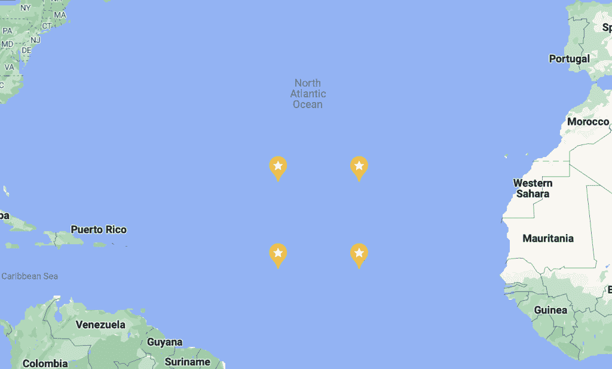

# Python 和地理时态分析入门

> 原文：<https://thenewstack.io/getting-started-with-python-and-geo-temporal-analysis/>

使用地理时态数据可能会很困难。除了通常与[时间序列分析](https://www.influxdata.com/time-series-analysis-methods/?utm_source=vendor&utm_medium=referral&utm_campaign=2022-07_spnsr-ctn_python-and-geo-temporal-analysis_tns)相关的挑战之外，比如您希望实时访问大量数据，处理纬度和经度通常涉及三角学，因为您必须考虑地球的曲率。这在计算上非常昂贵。它会导致成本上升，减缓项目进度。幸运的是， [InfluxDB 的地理时态包](https://docs.influxdata.com/influxdb/cloud/query-data/flux/geo/?utm_source=vendor&utm_medium=referral&utm_campaign=2022-07_spnsr-ctn_python-and-geo-temporal-analysis_tns)就是用来处理这些问题的。

 [苏珊娜·布罗德尼茨

苏珊娜是 InfluxData 网站的技术营销作家。在此之前，她在奥柏林学院学习物理，并在北卡罗来纳大学威尔明顿分校担任物理海洋学研究员。](https://www.linkedin.com/in/susannah-brodnitz/) 

这个包用 [S2 几何](https://s2geometry.io)来做这个。S2 系统将地球划分成单元，以帮助计算机更快地计算位置。与许多其他投影不同，它基于球体而不是平面，因此没有间隙或重叠区域。您可以选择不同的级别来改变每个单元格的大小。有了这个系统，计算机可以检查两点之间有多少个细胞，从而估计出它们之间的距离。

在很多情况下，你可以从 S2 计算中得到的估计足够精确，而且对计算机来说比三角学快得多。在你需要精确答案的情况下，使用 S2 几何仍然可以加快速度，因为计算机可以先得到粗略的估计，然后只做真正需要的昂贵的计算。

## 从示例开始

在本例中，我们将计算特定区域和不同时间窗口的海洋平均表面温度，以及标准偏差。我们将在 Jupyter 笔记本中的 InfluxDB 的 Python 客户端库中工作。这里有一些关于这些话题的其他博客文章。

我是通过 Anaconda 使用 Jupyter 笔记本的，所以我的第一步是通过在命令窗口中键入以下命令在 Anaconda 中安装 InfluxDB。

``conda install -c conda-forge influxdb``

 `然后，根据提示，我必须用

`conda update -n base -c defaults conda`

本例中使用的文件是 NetCDF 格式的，所以我还必须安装以下程序来阅读它

`conda install -c conda-forge netcdf4`

NetCDF 文件是科学数据的常用格式。本例中使用的数据是 Roemmich-Gilson Argo 温度气候学，可从“2004-2018 RG Argo 温度气候学”页面上的第二个链接[获得这些数据来自海洋中数以千计的漂浮物在不规则的时间和不规则的地点进行的测量，这些数据被平均到网格产品中，每个月的值在 1 个网格上。](https://sio-argo.ucsd.edu/RG_Climatology.html)

在您的 Jupyter 笔记本中，首先运行以下命令来导入本示例所需的各种包。

```
import matplotlib.pyplot as plt
import numpy as np
import datetime
import pandas as pd
import influxdb_client,  os,  time
from influxdb_client import InfluxDBClient,  Point,  WritePrecision,  WriteOptions
from influxdb_client.client.write_api import SYNCHRONOUS
import netCDF4 as nc

```

## 清理数据

运行以下命令来读取文件。

```
file_name  =  '/filepath/RG_ArgoClim_Temperature_2019.nc'
data_structure  =  nc.Dataset(file_name)

```

如果跑

`print(data_structure.variables.keys())`

那么下面应该是输出。

`dict_keys(['LONGITUDE', 'LATITUDE', 'PRESSURE', 'TIME', 'ARGO_TEMPERATURE_MEAN', 'ARGO_TEMPERATURE_ANOMALY', 'BATHYMETRY_MASK', 'MAPPING_MASK'])`

这些是文件中存储数据的各种数组。我们感兴趣的是`LONGITUDE, LATITUDE, TIME, ARGO_TEMPERATURE_MEAN`和`ARGO_TEMPERATURE_ANOMALY`。要从文件中读取数据，运行

```
lon  =  data_structure.variables['LONGITUDE']
lat  =  data_structure.variables['LATITUDE']
time  =  data_structure.variables['TIME']
temp_mean  =  data_structure.variables['ARGO_TEMPERATURE_MEAN']
temp_anom  =  data_structure.variables['ARGO_TEMPERATURE_ANOMALY']

```

要查看每个数组的尺寸，运行

```
print(lon.shape)
print(lat.shape)
print(time.shape)
print(temp_mean.shape)
print(temp_anom.shape)

```

你应该看到

```
(360,)
(145,)
(180,)
(58,  145,  360)
(180,  58,  145,  360)

```

有 360 个经度值，145 个纬度值，180 个时间值。还有 58 个压力值。由于我们只对表面的海洋温度感兴趣，这是最低的压力，我们将对数组进行子集划分，以获取第一个压力指数。

你还会注意到平均温度没有时间维度。该数据集将温度分为整个时间序列的平均值和平均值的月差，称为异常。要获得每个月的实际温度，我们只需将平均值和异常值相加。

如果你试图显示数组中任意一点的值，你应该会看到

```
temp_anom[0,0,0,0]

masked_array(data=1.082,
 mask=False,
 fill_value=1e+20,
            dtype=float32)

```

现在，每个值都在一个数组中，就像在 netCDF 文件中一样。运行下面的代码来获得简单的数组值:

```
lon  =  lon[:]
lat  =  lat[:]
time  =  time[:]
temp_mean  =  temp_mean[:]
temp_anom  =  temp_anom[:]

temp_anom[0,0,0,0]

1.082

```

时间单位是数据集开始以来的月数。要创建一个可理解的日期时间向量，请运行以下命令。

`time_pass=pd.date_range(start='1/1/2004', periods=180, freq='MS')`

要创建地表温度数组，请使用以下代码将第一个压力指数的平均值和异常值数组相加。

`ocean_surface_temp=np.empty((180,145,360))`

对于范围内的时间(180):

`ocean_surface_temp[itime,:,:]=temp_mean[0,:,:]+temp_anom[itime,0,:,:]`

## 将数据写入 InfluxDB 云

现在我们想要的数据已经在一个格式良好的数组中，我们可以开始将它发送到 [InfluxDB Cloud](https://cloud2.influxdata.com/signup/?utm_source=vendor&utm_medium=referral&utm_campaign=2022-07_spnsr-ctn_python-and-geo-temporal-analysis_tns) 。为了节省存储空间，在这个例子中，我们不打算上传全部数据，只上传大西洋中一个 10 度乘 10 度的盒子中 10 年的数据。我为此选择的坐标是北纬 15.5 度到 25.5 度，西经 34.5 度到 44.5 度，或者纬度指数 80 到 90 度，经度指数 295 到 305 度。



为了最有效地向 InfluxDB 发送数据，我们将创建一个数据点数组。我们将每个点称为`ocean_temperature`，这个名称将被设置为它的度量。

要使用 InfluxDB 中的 geo-temporal 包，您需要发送包含纬度和经度字段的数据，因此我们的每个点都将包含纬度、经度和温度字段。在 InfluxDB 中，如果同时有两个字段值，则您上传的下一个值将覆盖上一个值。这对我们来说是一个问题，因为我们的数据同时具有纬度、经度和温度的许多值。

防止数据被覆盖的一个简单方法是给每个点一个位置标签。在我们的数据中，有许多测量是同时进行的，但没有两个测量是在同一时间同一地点进行的。您可以同时为您不希望被覆盖的点开发其他独特的标签，如这里的[所述](https://docs.influxdata.com/influxdb/v2.2/write-data/best-practices/duplicate-points/?utm_source=vendor&utm_medium=referral&utm_campaign=2022-07_spnsr-ctn_python-and-geo-temporal-analysis_tns)。

```
points_to_send  =  []
for itime in range(120):
    for ilat in range(80,  90):
        for ilon in range(295,  305):
            p  =  Point("ocean_temperature")
            p.tag("location",  str(lat[ilat])  +  str(lon[ilon]))
            p.field("lat",  lat[ilat])
            p.field('lon',  lon[ilon])
            p.field('temp',  ocean_surface_temp[itime,ilat,ilon])
            p.time(time_pass[itime])
            points_to_send.append(p)

```

然后在 InfluxDB UI 中，从“load data”侧栏创建一个桶和令牌，如这些截图所示。


您的组织是您的帐户电子邮件，url 是您的云帐户的 url。

```
token=token
org  =  org
url  =  url
bucket  =  bucket

```

这里我们将批量大小设置为 5000，因为这样会使事情更有效率，如这里[的文档](https://docs.influxdata.com/influxdb/v2.2/write-data/best-practices/optimize-writes/?utm_source=vendor&utm_medium=referral&utm_campaign=2022-07_spnsr-ctn_python-and-geo-temporal-analysis_tns)中所述。

```
with InfluxDBClient(url=url,  token=token,  org=org)  as client:
    with client.write_api(write_options=WriteOptions(batch_size=5000))  as write_api:
        write_api.write(bucket=bucket,  record=points_to_send)

```

## 查询数据

现在数据在 InfluxDB 中，我们可以查询它了。我将使用几个查询来逐步展示每个命令的作用。首先，设置查询 API。

`client = influxdb_client.InfluxDBClient(url=url, token=token, org=org)`

query_api = client.query_api()

在您的 Jupyter 笔记本中，每个查询都是一个 Flux 代码字符串，然后您可以用查询 API 调用它。在所有这些情况下，对于如何处理查询结果，我们有许多选择。对于第一个，我将打印前几个结果，以确保它们有效，最后我们将以一个图结束。

这个查询只是收集所有的纬度、经度和温度字段。

```
query1='from(bucket: "sample_geo")\
  |> range(start: 2003-12-31, stop: 2020-01-01)\
  |> filter(fn: (r) => r["_measurement"] == "ocean_temperature")\
  |> filter(fn: (r) => r["_field"] == "lat" or r["_field"] == "temp" or r["_field"] == "lon")\
  |> yield(name: "all points")'

```

这个查询返回纬度。

```
query2='from(bucket: "sample_geo")\
  |> range(start: 2003-12-31, stop: 2020-01-01)\
  |> filter(fn: (r) => r["_measurement"] == "ocean_temperature")\
  |> filter(fn: (r) => r["_field"] == "lat")\
  |> yield(name: "lat")'

```

要执行这些查询中的任何一个，并打印分数和前几个结果，您可以运行下面的命令，改变您传递的查询。

```
result  =  client.query_api().query(org=org,  query=query2)
results  =  []
for table in result:
    for record in table.records:
        results.append((record.get_value(),  record.get_field()))
print(len(results))
print(results[0:10])

```

现在我们将开始使用地理时态包。`geo.shapeData`函数重新格式化数据，并为每个点分配一个 S2 像元 ID。指定纬度和经度字段名称，在本例中为“lat”和“lon ”,以及您想要的 S2 像元级别。在这种情况下，我选择了 10，这相当于平均 1.27 平方公里。你可以在这里阅读关于细胞水平的[。](https://s2geometry.io/resources/s2cell_statistics.html)

接下来我们将使用`geo.filterRows`函数来选择我们想要计算平均温度的地区。我选择了一个以北纬 20.5 度、西经 39.5 度为中心的 150 公里的圆，但是你可以选择任何类型的盒子、圆或多边形，如这里描述的。

默认情况下，数据按 s2_cell_id 分组，因此要计算整个区域的移动平均值，我们必须运行 group 函数，并告诉它不按任何值分组，这样该区域中的所有数据就被分组在一起。然后，您可以使用`aggregateWindow`功能计算您选择的时间窗口内的运行平均值和标准偏差。

将所有这些放在一起，下面的代码每三个月和每年计算并绘制这个圆的平均值，以及每三个月的标准偏差，我在下面的图中用误差线表示。

```
query3='import "experimental/geo"\
from(bucket: "sample_geo")\
    |> range(start: 2003-12-31, stop: 2020-01-01)\
    |> filter(fn: (r) => r["_measurement"] == "ocean_temperature")\
    |> geo.shapeData(latField: "lat", lonField: "lon", level: 13)\
    |> geo.filterRows(region: {lat: 20.5, lon: -39.5, radius: 150.0}, strict: true)\
    |> group()\
    |> aggregateWindow(column: "temp",every: 3mo, fn: mean, createEmpty: false)\
    |> yield(name: "running mean")\
    '

query4='import "experimental/geo"\
from(bucket: "sample_geo")\
    |> range(start: 2003-12-31, stop: 2020-01-01)\
    |> filter(fn: (r) => r["_measurement"] == "ocean_temperature")\
    |> geo.shapeData(latField: "lat", lonField: "lon", level: 13)\
    |> geo.filterRows(region: {lat: 20.5, lon: -39.5, radius: 150.0}, strict: true)\
    |> group()\
    |> aggregateWindow(column: "temp",every: 3mo, fn: stddev, createEmpty: false)\
    |> yield(name: "standard deviation")\
    '

query5='import "experimental/geo"\
from(bucket: "sample_geo")\
    |> range(start: 2003-12-31, stop: 2020-01-01)\
    |> filter(fn: (r) => r["_measurement"] == "ocean_temperature")\
    |> geo.shapeData(latField: "lat", lonField: "lon", level: 13)\
    |> geo.filterRows(region: {lat: 20.5, lon: -39.5, radius: 150.0}, strict: true)\
    |> group()\
    |> aggregateWindow(column: "temp",every: 12mo, fn: mean, createEmpty: false)\
    |> yield(name: "running mean")\
    '

result  =  client.query_api().query(org=org,  query=query3)
results_mean  =  []
results_time  =  []
for table in result:
    for record in table.records:
        results_mean.append((record["temp"]))
        results_time.append((record["_time"]))

result  =  client.query_api().query(org=org,  query=query4)
results_stddev  =  []
for table in result:
    for record in table.records:
        results_stddev.append((record["temp"]))
result  =  client.query_api().query(org=org,  query=query5)

results_mean_annual  =  []
results_time_annual  =  []
for table in result:
    for record in table.records:
        results_mean_annual.append((record["temp"]))
        results_time_annual.append((record["_time"]))

plt.rcParams["figure.figsize"]  =  (10,7)
plt.errorbar(results_time,results_mean,results_stddev)
plt.plot(results_time_annual,results_mean_annual)
plt.xlabel("Time")
plt.ylabel("Degrees C")
plt.title("Average Ocean Surface Temperature")

```


## 更多资源

在 Python 中使用 InfluxDB 使得地理时态分析更加高效。我希望这个你可以用这个软件包做的各种计算的例子能给你一些启发。这真的是冰山一角。您还可以使用该软件包来计算距离、查找交叉点、查找特定区域是否包含特定点等等。对于包含更多点的更复杂的数据集，它甚至可以在节省计算方面发挥更大的作用。

为[时序数据](https://www.influxdata.com/what-is-time-series-data/?utm_source=vendor&utm_medium=referral&utm_campaign=2022-07_spnsr-ctn_python-and-geo-temporal-analysis_tns)构建的平台和 S2 细胞系统的结合非常强大。要了解更多信息，你可以在我们的文档[这里](https://docs.influxdata.com/influxdb/cloud/query-data/flux/geo/?utm_source=vendor&utm_medium=referral&utm_campaign=2022-07_spnsr-ctn_python-and-geo-temporal-analysis_tns)中阅读 Flux geo-temporal 包，并在这里观看我们的主题为[的会见开发者迷你系列。](https://www.youtube.com/watch?v=OlT1-kMNdCs)

<svg xmlns:xlink="http://www.w3.org/1999/xlink" viewBox="0 0 68 31" version="1.1"><title>Group</title> <desc>Created with Sketch.</desc></svg>`