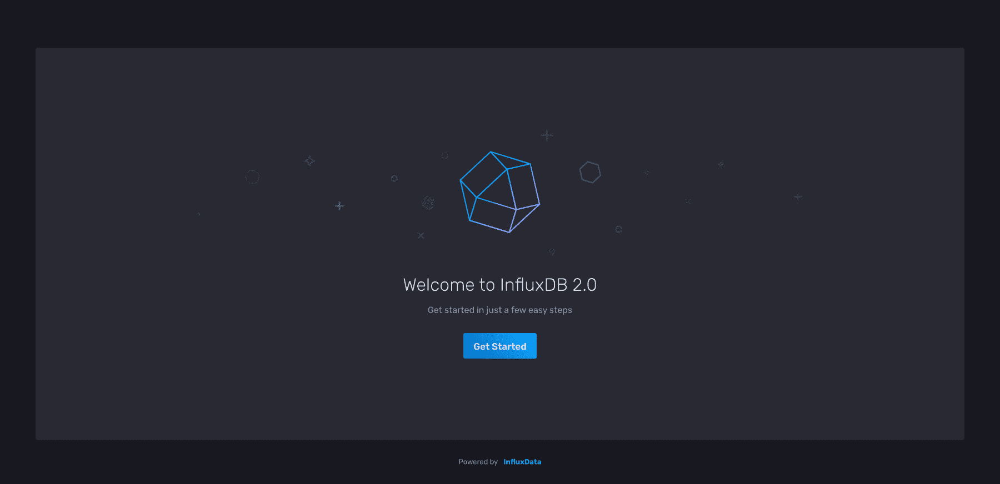
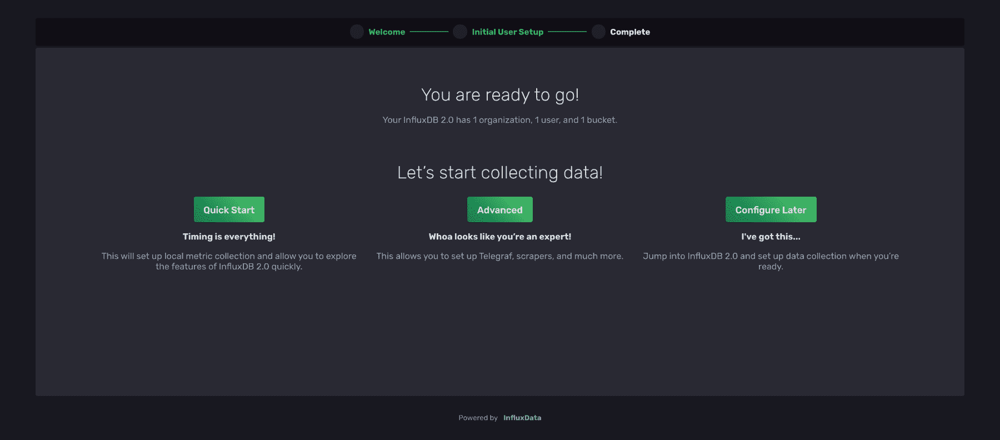
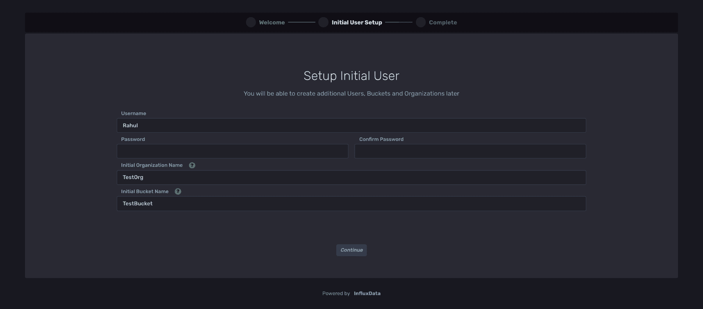
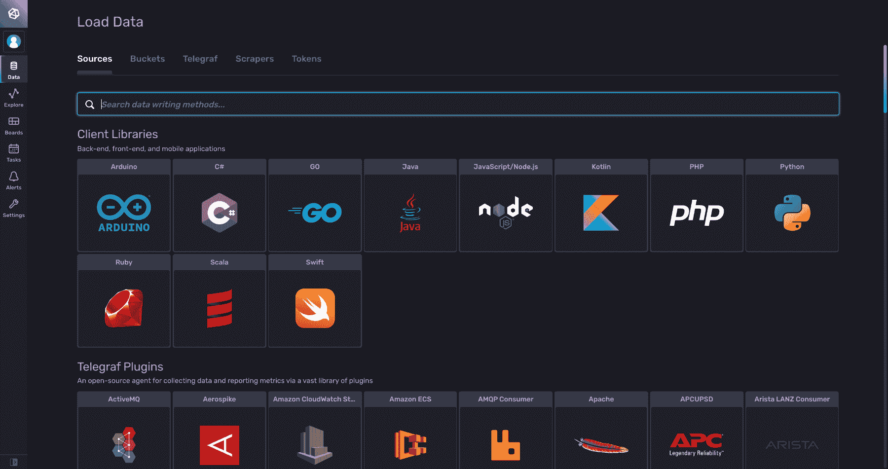
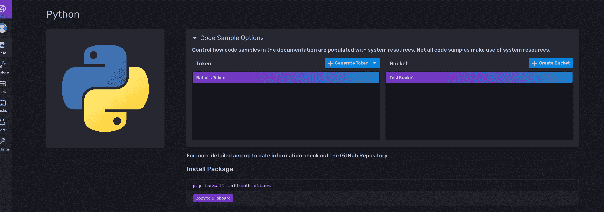
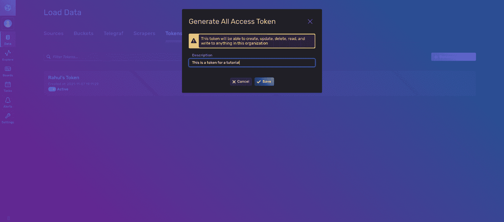
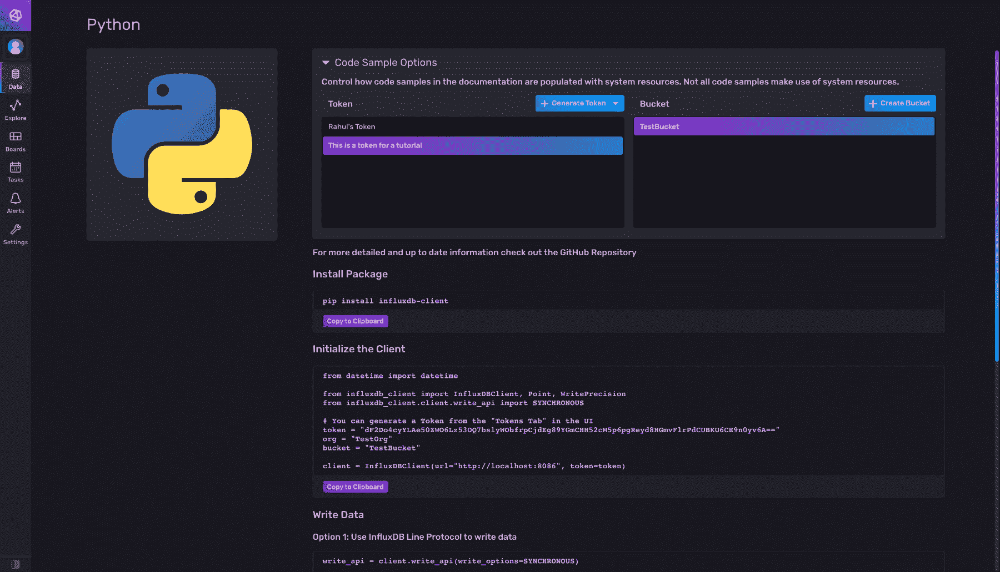

# Python 和 InfluxDB 入门

> 原文：<https://thenewstack.io/getting-started-with-python-and-influxdb/>

[](https://portal.draft.dev/writers/recwGa0upzWgR7IDq)

[Rahul baner JEE](https://portal.draft.dev/writers/recwGa0upzWgR7IDq)

[Rahul baner JEE 是一名计算机工程专业的学生，喜欢摆弄不同的库/API。](https://portal.draft.dev/writers/recwGa0upzWgR7IDq)

[](https://portal.draft.dev/writers/recwGa0upzWgR7IDq)[](https://portal.draft.dev/writers/recwGa0upzWgR7IDq)

尽管时间序列数据可以存储在 MySQL 或 PostgreSQL 数据库中，但这并不是特别高效。如果您想存储每分钟都在变化的数据(一年要存储 50 多万个数据点！)可能来自成千上万个不同的传感器、服务器、容器或设备，您不可避免地会遇到可伸缩性问题。在使用关系数据库时，对这些数据进行查询或执行聚合也会导致性能问题。

另一方面，时间序列数据库(TSDB)是为存储时间序列数据点而优化的。这在以下情况下特别有用:

*   分析股票价格的金融趋势。
*   销售预测。
*   监控 API 或 web 服务的日志和指标。
*   出于安全目的，监控来自汽车或飞机的传感器数据。
*   跟踪智能电网等物联网设备的用电情况。
*   在比赛中跟踪运动员的生命体征和表现。

[InfluxDB](https://www.influxdata.com/) 已经创建了一个开源的[时间序列数据库](https://www.influxdata.com/time-series-database/)，使得开发者更容易处理[时间序列数据](https://www.influxdata.com/what-is-time-series-data/)。本文将向您展示如何使用 Python 设置 InfluxDB，处理使用 Yahoo Finance API 获取的股票数据。

你可以在[这个 repo](https://github.com/rahulbanerjee26/InfluxDB-Tutorial) 里访问本教程写的所有代码。

## 为什么要用 InfluxDB？

InfluxDB 带有一个预建的仪表板，您可以在其中分析您的时间序列数据，而无需做太多基础工作。我们不要忘记，它的表现优于 Elasticsearch 和 Cassandra。

它有一个可以在本地运行的免费开源版本，还有一个云版本支持主要的云服务，如 AWS、GCP 和 Azure。

## 使用 Python 设置 InfluxDB

在开始之前，确保你的电脑上安装了 [Python 3.6 或更高版本的](https://www.python.org/downloads/)。你还需要一个虚拟环境。本文使用 [venv](https://docs.python.org/3/library/venv.html#module-venv) ，但是您也可以使用 conda、pipenv 或 pyenv。

最后，用[通量查询](https://docs.influxdata.com/flux/v0.x/get-started/)的一些经验。

本指南使用模块 [influxdb-client-python](https://github.com/influxdata/influxdb-client-python) 与 influxdb 进行交互。该库仅支持 InfluxDB 2.x 和 InfluxDB 1.8+，需要 Python 3.6 或更高版本。

都准备好了吗？让我们开始安装和连接客户端库。

如果您的计算机上安装了 Docker，您可以使用下面的命令运行 InfluxDB 的 Docker 映像:

```
bash
docker run  --name influxdb  -p  8086:8086  influxdb:2.1.0

```

如果你没有 Docker，[在这里](https://docs.influxdata.com/influxdb/v2.1/install/)为你的操作系统下载软件并安装。如果你在 Mac 上运行 InfluxDB，你可以使用 Homebrew 来安装它:

```
bash
brew install influxdb

```

如果你正在运行 Docker 镜像，你可以直接进入 [localhost 8086](http://localhost:8086/) 。但是，如果您下载并安装了该软件，则需要在命令行中输入以下内容:

您应该会在`localhost 8086`上看到以下屏幕:



单击**开始* *，这会将您重定向到以下页面:



对于本教程，请选择**快速入门* *并在此页面输入您的信息:



您也可以稍后创建组织和存储桶，但是现在，只需为这些字段中的每一个选择一个简单的名称。

注册后，您应该会发现自己在仪表板页面上。单击**加载数据**然后选择**Python**客户端库。



您现在应该会看到下面的屏幕:



在**令牌* *下，应该已经有一个令牌列出来了。但是，如果您愿意，您可以为本教程生成一个新的令牌。单击**生成令牌**并选择* *所有访问令牌* *，因为您将在本教程的后面更新和删除数据。

请注意，InfluxDB 将在此时发出警告，但是您现在可以忽略它。



现在，您必须设置一个 Python 虚拟环境。为教程创建一个新文件夹:

```
bash
mkdir influxDB-Tutorial

```

然后把你的目录换到新文件夹:

创建虚拟环境:

激活它。

```
bash
source venv/bin/activate

```

最后安装 InfluxDB 的客户端库:

```
bash
pip install influxdb-client

```

创建一个名为`__init.py__`的新文件，然后返回 InfluxDB UI:



选择适当的令牌和桶，然后复制**初始化客户端* *下的代码片段，并将其粘贴到 Python 文件中。如果您更改您的令牌/存储桶选择，代码片段将自动更新。

接下来，运行您的 Python 文件:

如果终端中没有显示错误消息，则您已经成功连接到 InfluxDB。

为了遵循最佳做法，您可以将凭据存储在。环境文件。创建一个名为`.env`的文件，存储以下信息:

```
bash
TOKEN  =  'YOUR TOKEN'
ORG  =  'YOUR ORG NAME'
BUCKET  =  'YOUR BUCKET NAME'

```

然后安装``python-dotenv` `module to read the .env variables:`` 

 `````
bash
pip3 install python-dotenv

```

Finally, update your Python file to load the data from the .env file:

Note that you will need to change the `url`参数如果你用的是 InfluxDB 云账号的话。URL 将取决于您选择的云区域。云网址可以在这里的文档中找到。

在本教程的后面部分，将需要导入 DateTime 模块和 InfluxDB 库的代码行。在开始时将所有的重要陈述放在一起是一个很好的做法。但是，如果您愿意，也可以在必要时导入它们。

或者，您可以将您的凭证存储在扩展名为`.ini`或`.toml`的文件中，并使用`from_config_file`函数[连接到 InfluxDB](https://influxdb-client.readthedocs.io/en/stable/api.html#influxdb_client.InfluxDBClient.from_config_file) 。

## 使用 influxdb-client-python 进行 CRUD 操作

本文使用 Python 中的 [yfinance](https://pypi.org/project/yfinance/) 模块来收集一些历史股票数据。使用以下命令安装它:

您可以使用下面的代码片段来获取数据:

```
python
import yfinance as yf
data  =  yf.download("MSFT",  start="2021-01-01",  end="2021-10-30")
print(data.to_csv())

```

确保将文件名参数传递给`to_csv`方法；这将在本地存储 CSV，以便您稍后可以读取数据。

或者，您可以从 [GitHub repo](https://github.com/rahulbanerjee26/InfluxDB-Tutorial/blob/main/Data/MSFT.csv) 中获取 CSV 文件。

接下来，创建一个类并添加 CRUD 操作作为它的方法:

如果您正在使用 InfluxDB 的云实例，您将希望用适当的[云区域替换 URL 参数。](https://docs.influxdata.com/influxdb/cloud/reference/regions/)

要创建一个类的实例，使用这个命令:

```
python
IC  =  InfluxClient(token,org,bucket)

```

## 写入数据

InfluxDBClient 有一个叫做`write_api`的方法，用于将数据写入数据库。下面是这个方法的代码片段:

InfluxDBClient 支持异步和同步写入，您可以根据需要指定写入类型。有关异步写入的更多信息，请参见“[如何在`influxdb-client`中使用 Asyncio。”](https://github.com/influxdata/influxdb-client-python#how-to-use-asyncio)

`data`参数可以用三种不同的方式编写，如下所示:

### 线路协议字符串

```
python
# Data Write Method 1
IC.write_data(["MSFT,stock=MSFT Open=62.79,High=63.84,Low=62.13"])

```

注意，字符串必须遵循特定的格式:

```
measurementName,tagKey=tagValue fieldKey1="fieldValue1",fieldKey2=fieldValue2 timestamp

```

在 tagValue 和第一个 fieldKey 之间有一个空格，在最后一个 fieldValue 和 timeStamp 之间有一个空格。解析时，这些空格用作分隔符；因此，您必须按照上面显示的方式对其进行格式化。还要注意，在这种情况下，我假设第一个字段值`fieldValue1`是一个字符串，而`fieldValue2`是一个数字。因此，`fieldValue1`应该出现在引号中。

还要注意，时间戳是可选的。如果没有提供时间戳，InfluxDB 将使用其主机的系统时间(UTC)。你可以在这里阅读更多关于[线路协议](https://docs.influxdata.com/influxdb/v2.1/reference/syntax/line-protocol/)。

### 数据点结构

```
python
# Data Write Method 2
IC.write_data(
[
Point('MSFT')
.tag("stock","MSFT")
.field("Open",62.79)
.field("High",63.38)
.field("Low",62.13)
.time(int(datetime.strptime('2021-11-07','%Y-%m-%d').timestamp()))
],
)

```

如果你不想处理线路协议中的格式字符串，你可以使用 Point()类。这确保您的数据被正确地序列化为线路协议。

### 词典风格

```
python
# Data Write Method 3
IC.write_data([
{
"measurement":  "MSFT",
"tags":  {"stock":  "MSFT"},
"fields":  {
"Open":  62.79,
"High":  63.38,
"Low":  62.13,
},
"time":  int(datetime.strptime('2021-11-07','%Y-%m-%d').timestamp())
},
{
"measurement":  "MSFT_DATE",
"tags":  {"stock":  "MSFT"},
"fields":  {
"Open":  62.79,
"High":  63.38,
"Low":  62.13,
},
}
],write_option=ASYNCHRONOUS)

```

在这个方法中，您传递两个数据点，并将 write 选项设置为`ASYNCHRONOUS`。这是 Python 友好的，因为数据是作为字典传递的。

所有不同的数据写入方式都被归纳在下面的要点中:

接下来，插入 MSFT 股票和 AAPL 股票的所有数据。由于数据存储在 CSV 文件中，您可以使用第一种方法——线路协议字符串——来写入数据:

您可以通过将文件路径和字符串从 MSFT 更改为 AAPL 来插入 AAPL 股票的数据:

```
python3
AAPL_file  =  open('Data/AAPL.csv')
csvreader  =  csv.reader(AAPL_file)

```

### 读取数据

`InfluxDBClient`也有一个叫做`query_api`的方法，可以用来读取数据。您可以将查询用于各种目的，例如基于特定日期筛选数据、聚合某个时间范围内的数据、查找某个时间范围内的最高/最低值等等。它们类似于您在 SQL 中使用的查询。从 InfluxDB 读取数据时，您需要使用查询。

下面的代码是针对我们类的 read 方法:

这里，它接受一个查询，然后执行它。查询的返回值是与查询匹配的 Flux 对象的集合。Flux 对象有以下方法:

```
.get_measurement()
.get_field()
.values.get(“<your tags>”)
.get_time()

```

下面显示了两个查询示例，演示了`query_data`函数的运行。第一个查询返回 MSFT 股票自 2021 年 10 月 1 日以来的最高值，第二个查询返回 MSFT 股票 2021-10-29 的最高值。

确保根据需要在查询开始时更改存储桶名称。在我的例子中，我的桶名是*TestBucket*。

### 更新数据

与写入和查询 API 不同，InfluxDB 没有更新 API。以下陈述摘自他们关于如何处理重复数据点的[文档。](https://docs.influxdata.com/influxdb/v2.1/write-data/best-practices/duplicate-points/)

对于具有相同测量名称、标记集和时间戳的点，InfluxDB 创建新旧字段集的联合。对于任何匹配的字段键，InfluxDB 使用新点的字段值

要更新一个数据点，您需要有名称、标记集和时间戳，只需执行一个写操作。

### 删除数据

您可以使用`delete_api`删除数据。下面是一些演示如何删除数据的代码:

删除功能需要数据点的测量值。下面的代码展示了删除函数的一个简单用例:

InfluxDB 的文档包括一个写数据的最佳实践列表。还有一些关于数据布局和模式设计的[最佳实践](https://www.influxdata.com/blog/data-layout-and-schema-design-best-practices-for-influxdb/)，您应该遵循它们以获得最佳结果。

## 时间序列数据库的一些实际使用案例

本文研究了一个存储股票价值的 TSDB 的简单用例，这样您就可以分析历史股票价格并预测未来价值。但是，您也可以处理物联网设备、销售数据和任何其他随时间变化的数据序列。

其他一些实际使用案例包括:

1.  [利用 Tensorflow 和 InfluxDB 进行时间序列预测](https://www.influxdata.com/blog/introduction-time-series-forecasting-tensorflow-influxdb/)
2.  [将 InfluxDB 与 IFTTT 集成，监控您的智能家居](https://www.influxdata.com/blog/monitoring-smart-home-influxdb-ifttt/)
3.  [监控你的网速](https://www.influxdata.com/blog/how-monitor-internet-speed-telegraf-influxdb-cloud/)

## 结论

希望本指南能够帮助您建立自己的 InfluxDB 实例。您学习了如何使用 InfluxDB 的 Python 客户端库构建一个简单的应用程序来执行 CRUD 操作，但是如果您想更仔细地了解一些内容，您可以在这里找到带有完整源代码的 [repo。](https://github.com/rahulbanerjee26/InfluxDB-Tutorial/blob/main/__init__.py)

查看 InfluxDB 的开源 TSDB 。它拥有包括 Python、C++和 JavaScript 在内的十种编程语言的客户端库，还拥有许多内置的可视化工具，因此您可以确切地看到您的数据在做什么。

<svg xmlns:xlink="http://www.w3.org/1999/xlink" viewBox="0 0 68 31" version="1.1"><title>Group</title> <desc>Created with Sketch.</desc></svg>``