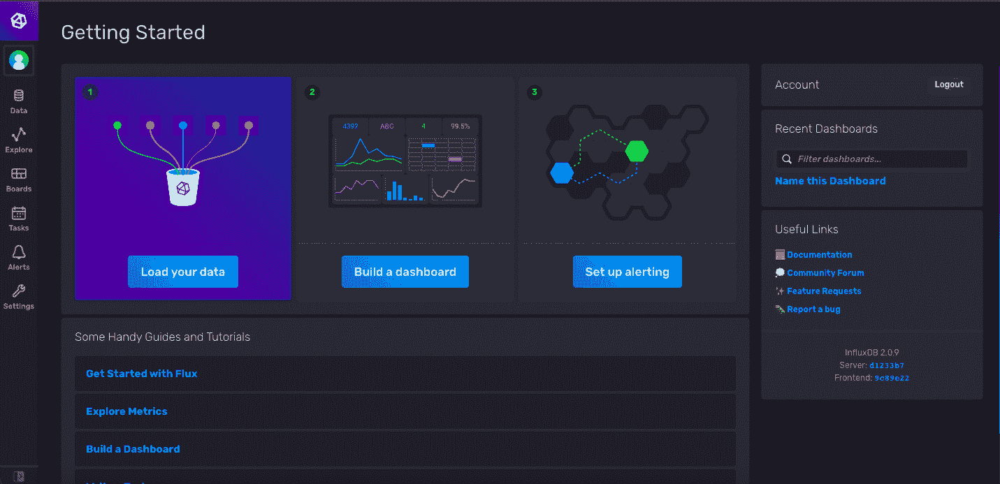
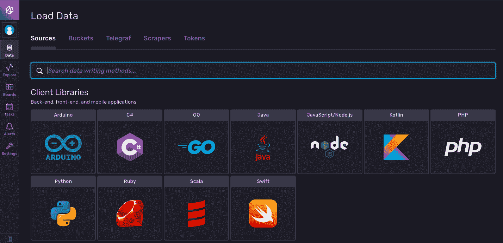
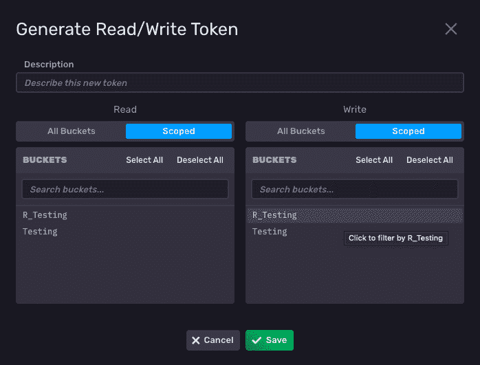
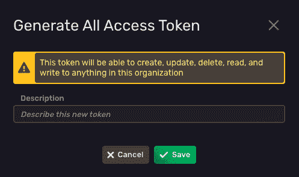
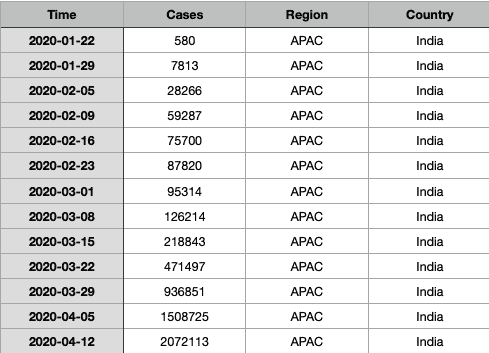
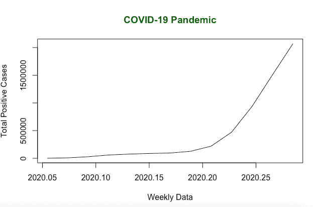
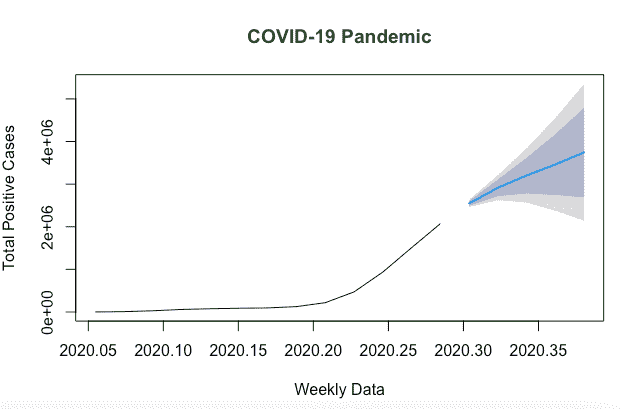

# R 和 InfluxDB 入门

> 原文：<https://thenewstack.io/getting-started-with-r-and-influxdb/>

[](https://portal.draft.dev/writers/recjlZQEVnGmUF1tj)

[Gou rav Singh Bais](https://portal.draft.dev/writers/recjlZQEVnGmUF1tj)

[Gou rav 是 ValueMomentum Inc .的应用机器学习工程师，他擅长开发机器学习/深度学习管道、再培训系统以及将数据科学原型转化为生产级解决方案。在过去的三年里，他一直在同一领域工作，并为许多客户服务，包括财富 500 强公司，这使他有机会积累经验和技能，为机器学习社区做出贡献。](https://portal.draft.dev/writers/recjlZQEVnGmUF1tj)

[](https://portal.draft.dev/writers/recjlZQEVnGmUF1tj)[](https://portal.draft.dev/writers/recjlZQEVnGmUF1tj)

作为数据专业人员，您可能会遇到一些自变量(输入变量)很少的数据集。一个变量是时间，另一个变量可以是任何类型的依赖于时间的列，例如酒店的预订数量或航班上的乘客数量。

这种类型的数据被称为“时间序列数据”，它具有某种类型的趋势并捕捉某个时间点。存储这种类型的数据有多种方式，例如关系数据库或文件，如 CSV 或 Excel。但是，这些选项不是为有效存储时序数据而设计的。进入时序数据库，该数据库是专门为高效快速存储[时序数据](https://www.influxdata.com/what-is-time-series-data/)而设计的。

在各种用例中，[时序数据库](https://www.influxdata.com/time-series-database/) (TSDB)的性能明显优于其他存储机制。考虑几个:

1.  **存储物联网数据:**时间序列数据库可以轻松地连续定期存储物联网数据，其中季节性模式、平均消耗和低效率都可以通过时间序列分析来确定，时间序列分析提供了带时间戳的数据点。
2.  **监控应用程序和基础架构:**公司可以存储有关其应用程序和基础架构使用情况的数据，以后可以使用这些数据来执行异常检测或基础架构需求预测等任务。一些网络和移动应用程序在 TSDB 中记录自己的事件，如点击按钮、播放视频或分享一些内容。他们可以绘制用户的旅程，突出困难或性能瓶颈，并使用这些事件简化更复杂的操作。
3.  **零售店销售预测:**零售店收集数据来预测销售额，这有助于他们管理供应链。
4.  **实时分析:**时序数据库可以用来存储用于实时分析的数据，比如自动驾驶汽车数据。为自动驾驶汽车生成的数据是如此庞大和依赖于时间，以至于不可能将其存储在关系数据库中。时序数据库提供了更快的写入和查询机制，有助于自动驾驶汽车实时执行操作。

此外，对于这种数据类型，使用时序数据库比使用其他存储机制有几个优点。以下是几个原因:

1.  **可伸缩性**:时序数据库专门处理更大数量的最终一致性写入，甚至在分布式存储上也是如此，这意味着关心数据的人更少焦虑。
2.  **可用性**:在 TSDB 中存储数据是不够的。人们必须能够快速访问它，以做出数据驱动的决策。在这里，数据可以随着时间的推移而聚合，从而使交易更快、更高效。
3.  **提高生产率**:时间序列数据库以简单的 API 形式易于访问，并且可以使用不同的编程语言进行访问。

一个广泛使用的时间序列数据库是 [InfluxDB](https://www.influxdata.com/) 。InfluxData 公司创建了 InfluxDB，这是一个开源时间序列数据库。它是用 Go 编写的，用于存储和检索任何用例的时间序列数据，包括运营监控、应用衡量标准、物联网(IoT)传感器数据和实时分析。

想了解更多关于 InfluxDB 的好处，可以参考 InfluxData [网站](https://www.influxdata.com/products/influxdb/)。

在本文中，您将了解使用 R 语言开始使用 InfluxDB 需要做些什么，从安装、设置、查询、编写开始，最后使用 R 构建一个简单的时序应用程序。

## InfluxDB 客户端库

使用任何编程语言与 InfluxDB 交互的客户端必须能够连接到数据库，以便可以执行不同的数据库操作。influxdb-client-r 库可以用来通过 r 连接到 influxdb，它是一个支持写数据、读数据和获取数据库状态等操作的包。这个客户端库与 InfluxDB 版一起工作。

让我们从使用 2.0 版本设置 InfluxDB 开始。InfluxDB 可以在不同的平台上使用，比如 Windows、Linux 和 macOS。尽管在任何平台上安装它都很简单，但本文中的例子都是在 macOS Big Sur 上测试的。

或者，您可以使用 [InfluxDB Cloud](https://www.influxdata.com/products/influxdb-cloud/) 在几分钟内快速获得一个免费的 InfluxDB 实例，而无需在您的机器上本地安装任何东西。

InfluxDB 可以用家酿安装在 macOS 上:

```
```
$  brew update
$  brew install influxdb influxdb-cli
```

```

或者，InfluxDB 可以在这里手动下载[。](https://docs.influxdata.com/influxdb/v2.0/install/)

一旦安装了 InfluxDB，就可以使用下面的代码启动它:

第一次启动 InfluxDB 时，它会要求您设置帐户，可以使用 UI[localhost:8086](localhost:8086)或命令行界面(CLI)进行设置。对于 UI 设置，您必须打开 localhost URL 并提供初始设置所需的信息。如果您正在使用 CLI，您将需要使用 InfluxDB 客户端来完成，可以在终端中使用以下代码启动该客户端:

对于初始设置，请注意以下细节:

**用户名:**初始用户可以选择任意用户名。

**密码**:您需要创建并确认数据库访问的密码。

**组织名称**:您需要选择初始组织名称。

**存储桶名称**:初始存储桶名称是必需的，您可以创建任意数量的存储桶。

**保持期**:您的存储桶在删除数据之前存储数据的时间。您可以选择**never**或将其留空以获得无限的保留期。

要在其他平台上安装 InfluxDB，请参考下面的[链接](https://docs.influxdata.com/influxdb/v2.0/install/)。

一旦安装了 InfluxDB 并完成了设置，就可以登录到[localhost:8086](localhost:8086)。您应该会看到这样的屏幕:



InfluxDB 主页

您可以浏览一下仪表板中包含的各种模块，尽管本文将主要关注那些可以连接到 InfluxDB 客户端的模块。从数据模块开始:



InfluxDB 加载数据

在这里，您可以观察到不同的部分，如**来源**、**铲斗**、 **Telegraf** 、**刮刀**和**令牌**。要使用 R 与 InfluxDB 交互，您需要检查**桶**和**令牌**部分。要连接到数据库，您需要生成一个只有您可以访问的私有令牌(密钥),允许您连接到不同的存储桶。

要生成此令牌，请导航至**令牌**选项卡。在右侧，您会看到一个**生成令牌**按钮。该按钮有两个不同的部分:

–**读/写令牌**:该令牌提供对不同存储桶的读和写访问，这些访问可以被限制在范围内(特定的存储桶)或提供给所有可用的存储桶。有了这个令牌，您只能读写组织中的数据。



生成读/写令牌 InfluxDB

–**全访问令牌**:这个令牌提供对动作的完全访问，比如读、写、更新或删除每个存储桶。这将是推荐的令牌，通过它您可以连接到任何可用的存储桶，而无需任何显式配置，并且可以执行所有需要的操作，如读取、写入、更新和删除。



全访问令牌

出于本文的目的，您需要生成一个**全访问令牌**。生成令牌后，您可以随时通过登录本地主机控制台来访问它。

既然已经设置好了 InfluxDB，就可以下载 R 和 [RStudio](https://www.rstudio.com/) 来编写和测试代码了。安装 R 非常简单。你可以在这里下载[包，然后打开安装。安装 R 之后，您可以下载 RStudio，它将是您用来编写 R 代码的 IDE。你可以在这里下载 r studio](https://cran.r-project.org/)。

在这个阶段，您已经拥有了连接 InfluxDB 所需的几乎所有工具和技术。作为最后一步，您需要为 R 安装 InfluxDB 客户端库，可以使用下面一行代码下载这个库:

```
```
install.packages("influxdbclient")
```

```

如果你把它安装在 RStudio 上，其他的依赖项会和基础库一起下载。但是，如果没有自动下载依赖项，您可以使用下面的代码行单独下载它们:

```
```
install.packages(c("httr",  "bit64",  "nanotime",  "plyr"))
```

```

## 建立联系

下一步将是在 R 中导入 [InfluxDB 客户端库，并创建一个 InfluxDB client 的实例，该实例可用于与数据库交互并执行所有操作集。建立数据库连接所需的参数包括:](https://github.com/influxdata/influxdb-client-r)

*   **令牌**:这是您使用控制台生成的访问令牌。您可以登录到 InfluxDB 仪表板，并从那里复制令牌。
*   **Bucket:** 这需要您将要操作的 Bucket 的名称。您可以选择初始存储桶或使用仪表板创建新的存储桶。
*   **组织:**这是您在 InfluxDB 的初始设置过程中指定的组织。

由于此连接将在本地进行，因此连接脚本应该如下所示:

如果您使用的是云帐户，请确保 URL 参数与您的云帐户所在的地区相匹配，而不是使用 localhost。您可以在文档中找到 [URL 端点](https://docs.influxdata.com/influxdb/cloud/reference/regions/)。

## 插入数据

现在您已经建立了到 InfluxDB 的连接，是时候使用数据来执行不同的数据库操作了。为了理解这些操作，让我们来看看 2020 年 1 月至 2020 年 4 月全球[新冠肺炎病例](https://github.com/gouravsinghbais/Getting-Started-with-R-and-InfluxDB/blob/master/covid_data.csv)的一些样本数据:



抽样资料

此示例数据包含以下字段:

*   **日期**:进行观测的日期。
*   **案例:**当天活动的 COVID 案例数。
*   **地区:**报告病例的地点的标识符。
*   **国家:**进行观测的地方。

要读取 R 中的数据帧，您需要编写以下代码行:

让我们首先将这些数据插入 InfluxDB。为此，使用`write()`方法，该方法接受如下参数:

```
```
client$write(data,  bucket,  precision,  measurementCol,
tagCols,  fieldCols,  timeCol,  object)
```

```

**注:**以上方法只是简单的函数定义，不是代码的一部分。

此方法采用以下参数:

*   **数据:**存储在数据库中的数据帧或数据点列表。
*   **存储桶:**存储数据的存储桶名称。
*   **精度:**时间戳的精度。
*   **measurement col**:influx db 中的度量类似于关系数据库中的表名。
*   **标签列:**该列表示与数据相关的元数据。
*   **字段列:**要存储在数据库中的列名。
*   **timeCol:** 数据中的时间戳列。
*   **对象:**调试写操作的对象。

要使用`write()`方法在 InfluxDB 中存储新冠肺炎数据，您需要确保您的时间戳列(日期)是 POSIXct 格式。

来自`write()`函数的响应可以是 NULL、True 或一个错误。为了调试`write()`函数并检查数据是如何写入数据库的，您可以分配一个对象:`lp`。

## 查询数据

现在您已经将带有时间戳的数据存储在数据库中，让我们尝试读取数据。为了使用 R 客户机查询数据，使用了`read()`函数，它需要一个[通量](https://docs.influxdata.com/influxdb/cloud/query-data/get-started/)查询。对于查询，您可以使用您为写入数据而创建的同一个客户端，也可以创建一个新的 InfluxDB 客户端并执行相同的操作。

让我们分解一下上面的查询。从关键字“from”开始，您需要首先指定 bucket 名称，然后是您希望选择数据的时间范围，最后是一组条件。在上面的查询中，条件指定不包括数据库中的开始和停止列。

结果包含指定时间段内数据库中每个条目的数据帧列表。要检查它的实例，可以使用下面的代码:

现在您已经查询了数据，让我们利用这些数据进行预测。在这里，您将根据检索到的数据训练一个时间序列模型，并尝试预测未来五天的情况。让我们根据查询后的结果创建一个数据框架:

一旦创建了数据框架，就需要进行一些更改，以便对其应用时间序列模型。通常，这个阶段是数据预处理。

预处理之后，现在是时候创建数据的时序表示了。这将使用以下代码来完成:



输入数据

最后，让我们将数据放入预测模型，并对未来五天进行预测:



模型预测法

这就是如何访问数据并将其用于[时间序列预测](https://www.influxdata.com/time-series-forecasting-methods/)，这只是时间戳数据的一个实际用例。整个实现可以在[这里](https://github.com/gouravsinghbais/Getting-Started-with-R-and-InfluxDB)找到。

有关优化 InfluxDB 性能的更多信息和最佳实践，请参考[文档](https://docs.influxdata.com/influxdb/cloud/write-data/best-practices/)。

## 结论

阅读完本文后，您现在知道了如何在您的系统中设置 [InfluxDB](https://www.influxdata.com/) ，以及如何使用 R 语言创建客户机并为您的时序用例读写数据。InfluxDB 的一个主要优势是它支持几乎所有主要的编程语言。

存储时序数据有多种选择，但像 InfluxDB 这样的时序数据库可以更快、更大规模地存储。一些用例，如物联网应用、自动汽车或实时应用分析，需要一次插入数万到数十万个条目的数据。时间序列数据库以非常高的速度实时执行这项任务，这使得任何开发人员都可以很容易地对它们进行调整，开发实时时间序列应用程序。一定要考虑部署 InfluxDB，以便在您自己的应用程序中使用这些强大的功能。

<svg xmlns:xlink="http://www.w3.org/1999/xlink" viewBox="0 0 68 31" version="1.1"><title>Group</title> <desc>Created with Sketch.</desc></svg>