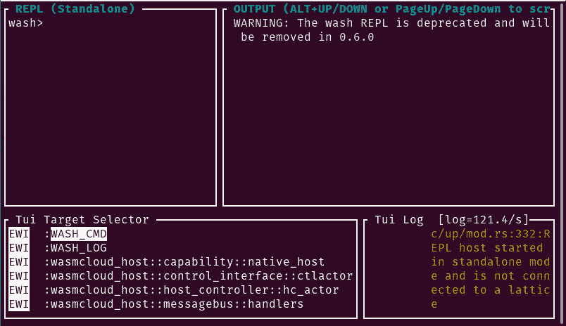
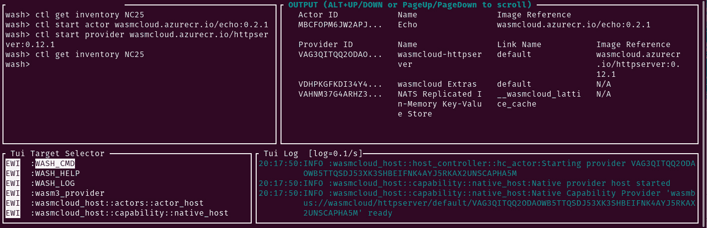

# wasmCloud 入门

> 原文：<https://thenewstack.io/getting-started-with-wasmcloud/>

WasmCloud 是一个平台，旨在帮助开发者创建安全、可移植、可重用的组件(称为 *actors* )。它利用 WebAssembly 实现了极大的可移植性，因此您可以保护、部署、维护、观察和升级软件，同时减少必须复制和粘贴的样板文件的数量。

[WasmCloud](https://github.com/wasmCloud/wasmCloud) 是围绕以下五个核心理念从头开始设计的:

*   生产力
*   企业级安全性
*   成本效益
*   轻便
*   表演

如果您刚刚听说 WebAssembly，请务必先阅读以下文章:[什么是 WebAssembly，为什么需要它？](https://thenewstack.io/what-is-webassembly-and-why-do-you-need-it/)、[用 Rust 构建 web assembly App](https://thenewstack.io/build-a-webassembly-app-with-rust/)、[如何用 Emscripten 将 C 代码编译成 web assembly](https://thenewstack.io/how-to-compile-c-code-into-webassembly-with-emscripten/)。

为了结束 WebAssembly 系列，我们将介绍使用 wasmCloud 的最初步骤。

我将在 Ubuntu Server 20.01 上演示，但是您应该能够理解任何基于 Debian 的发行版，任何支持 snap、Fedora 或 macOS(但不包括 M1 MAC)的 Linux 发行版。

说完这些，让我们开始安装吧。

## 安装铁锈

在安装 wasmCloud 之前，我们先安装 Rust。不是绝对依赖，但是推荐。登录到您的 Linux 服务器，打开一个终端窗口，使用以下命令安装 Rust:

`curl --proto '=https' --tlsv1.2 -sSf https://sh.rustup.rs | sh`

出现提示时，键入 1 表示继续安装(默认)，然后按键盘上的 Enter 键。Rust 的安装应该没有任何错误。安装完成后，您需要使用以下命令获取 Rust 的环境变量:

`source $HOME/.cargo/env`

此时，Rust 已经安装完毕，可以运行了。

## 安装 wasmCloud

现在我们可以安装 wasmCloud 了。首先要做的是为软件添加必要的存储库。为此，请返回到您的终端窗口，发出以下命令:

`curl -s https://packagecloud.io/install/repositories/wasmcloud/core/script.deb.sh | sudo bash`

该命令还应该为您更新 apt。如果没有，您可以使用以下命令手动完成:

`sudo apt-get update`

apt 成功更新后，使用以下命令安装必要的 wasmCloud 软件:

`sudo apt-get install wasmcloud wash -y`

## wasmCloud 入门

安装 wasmCloud 后，您就可以启动您的第一台 wasmCloud 主机了。使用以下命令执行此操作:

`wash up`

您的终端将被分成四个窗格(**图 1** )。



图 wasmCloud 实例已经启动，可以使用了。

这是一台预配置的 wasmCloud 主机。你的终端窗口应该至少有 250×50 个字符，否则，你将不得不处理换行，这将使一切有点混乱。同样重要的是，当您部署您的参与者和提供者时，您要在部署时记下每个参与者和提供者的 id(在右下窗格中找到)。事后检索这些 id 可能很困难，因为它们会被截断。

要查看正在运行的主机，请发出以下命令:

`ctl get hosts`

该命令的输出应该列出一个主机 ID 和该主机的正常运行时间(以秒为单位)。要获取主机的清单列表，请发出以下命令:

`ctl get inventory ID`

其中 ID 是主机 ID。

接下来我们要做的是运行我们的第一个演员。WasmCloud 提供了一个方便的 Echo sample actor(它仅仅是 Echo 输入),可以通过以下命令启动:

`ctl start actor wasmcloud.azurecr.io/echo:0.2.1`

一旦您启动了 actor，您应该在右上方的窗格中看到进度，这将显示 Actor 从主机 ID 开始(其中 ID 是主机的 ID)。Echo actor 只包含一个操作符，该操作符将响应传递的 HTTP 请求，并将回显发送的请求。但是为了让它工作，我们必须用下面的命令启动 HTTP 服务器提供程序:

`ctl start provider wasmcloud.azurecr.io/httpserver:0.12.1`

现在，让我们使用以下命令再次查看主机清单:

`ctl get inventory ID`

其中 ID 是主机 ID。

这一次，您应该看到包含了 Echo actor 和 HTTP provider(**图 2** )。



图 2:我们的 Echo actor 和 HTTP provider 现在正在主机上运行。

既然我们已经启动了参与者和提供者，我们必须将它们连接起来，这样它们才能正常工作。为此，您将需要 Actor ID 和 Provider ID(您应该在部署它们时复制下来)。

要将这两者连接在一起，命令将是:

`ctl link ACTORID PROVIDERID wasmcloud:httpserver PORT=8080`

其中 ACTORID 是 Echo actor 的 ID，PROVIDERID 是 HTTP 提供者的 ID。

您应该会看到类似这样的内容:

`Advertised link (MBCF) <-> (VAG3) successfully`

让我们与我们新联系的演员互动。打开您的托管服务器的第二个终端，发出命令:

`curl localhost:8080/echo`

您应该会看到返回的:

```
{"method":"GET","path":"/echo","query_string":"","headers":{"accept":"*/*","user-agent":"curl/7.68.0","host":"localhost:8080"},"body":[]}

```

这是对您的关联参与者和提供商的成功致电。

要退出 wasmCloud 控制台，只需键入 *exit* 即可。请记住，一旦您退出，您的参与者和提供者将不再可用(因此，如果您想使用它们，您必须再次部署它们)。

恭喜你，你已经向 wasmCloud 迈出了第一步。要了解这个强大工具的更多信息，请查看 [wasmCloud 应用程序开发文档](https://wasmcloud.dev/app-dev/)。

<svg xmlns:xlink="http://www.w3.org/1999/xlink" viewBox="0 0 68 31" version="1.1"><title>Group</title> <desc>Created with Sketch.</desc></svg>