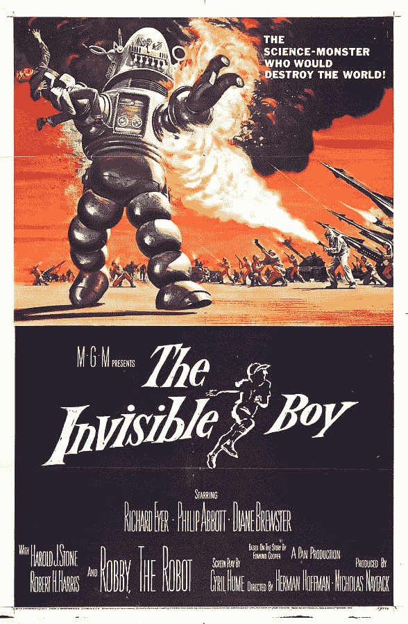

# 玩具机器人的幽灵过去了

> 原文：<https://thenewstack.io/ghost-toy-robots-past/>

上周， *Fast Company* [回顾了上世纪 50 年代](https://www.fastcompany.com/3066169/robot-revolution/the-toy-robot-sensation-that-time-forgot)，当时第一批受欢迎的机器人玩具开始出现在美国的圣诞树下。机器人罗伯特是“一个 14 英寸高的塑料大块头，可以说几句话，用一个拴着的遥控器转动，并用他的机械臂抓住物体。”

但他也是一个无辜的预兆，预示着更伟大的事情即将到来…

早在 1954 年，这个微型机器人的原型就被设想为电影《T4》中的主角这部电影的复杂情节涉及一个可以驾驶宇宙飞船的心灵感应机器人，并最终在发明者和他的儿子被外国间谍绑架时救出他们。

https://www.youtube.com/watch?v=a-Ng_Qgy0Bw

它做作的情节是一个迷人的提醒:机器人是如何开始在公众意识中变得越来越重要的。“虽然罗伯特从未出现在电影中，”Fast Company 报道说，“他自己得到了很多宣传，在 1954 年西尔斯圣诞目录中首次亮相，要价不到 6 美元，按 2016 年的美元计算约为 54 美元。”

为了暗示托博尔的心灵感应，这个玩具也是遥控的——尽管在 1954 年，那只是意味着一根很长的线。这种灰色的模制塑料显然还是一种新奇的东西，因为大多数玩具都是用锡做的，是从海外进口的。一部冗长且相当平淡的电视广告戏剧化地展示了这种尖端玩具的设计和生产。(“现在是左臂。然后，头。最后装上右臂……”)

尽管它确实警告孩子们罗伯特“可以用他的 x 光眼看穿你”

当然，眼睛是由小灯泡照亮的……但很高兴知道罗伯特找到了一个欣赏他的观众，被全国各地宠爱他的孩子或他们溺爱他的父母捧了起来。

《快速公司》引用了一篇报纸文章，声称这款玩具是该玩具公司迄今为止最成功的产品，在他成功之后，他们推出了一系列机器人罗伯特 t 恤和手电筒。一个 9 英尺高的罗伯特复制品甚至在辛辛那提市中心的玩具店迎接游客。据报道，在道格拉斯·塞克 1956 年的伤感情景剧《总有明天》中，他也曾出现在芭芭拉·斯坦威克的怀中

[https://www.youtube.com/embed/clgI3jvwZzw?feature=oembed](https://www.youtube.com/embed/clgI3jvwZzw?feature=oembed)

视频

在自动化出现之前的遥远的几十年里，机器人罗伯特获得了另一项荣誉，据 *Fast Company* 报道:“在我们真正理解机器人能做什么之前很久就抓住了人们的想象力。”20 世纪 50 年代标志着洗衣机和汽车变速器等消费品自动化的开始，罗伯特在某种程度上代表了 imaginarium 流行文化。

“那是我们要去的地方，”洛杉矶古董玩具收藏家贾斯汀·平肖(Justin Pinchot)说。“这是国家的发展方向，也是世界的发展方向，走向更多的自动化和更少的工作。”

罗伯特可能已经带领新一代进入了他们自动化的未来——但他并不孤单。如果你在 YouTube 上搜索“机器人罗伯特”，你还会找到另一个来自 20 世纪 50 年代中期的作品——一个名为 Robbie 的真实世界真人大小的机器人，由澳大利亚科学教师伯纳德·史密斯创造，旨在展示机械设备在我们日常生活中的潜力。

罗比是由废金属制成的——罗比的手是由自行车刹车卡钳制成的，其他二战后的零件包括野马战斗机的尾轮。他由两个 12 伏汽车电池(和 11 个来自飞机的 24 伏电池)供电，内部有超过 200 码的电线。

“如果你按下遥控器上的正确按钮，他会听从你的命令，”视频中欢快的播音员说——在一个可怕的无知的画外音中，他乐于暗示机器人是家庭主妇的未来替代品。但根据维多利亚博物馆的说法，罗比的人形“反映了人们对未来可能的想象”——一个有机械仆人来实现他们每一个奇想的世界。”

[https://www.youtube.com/embed/2Bdgllb8k6I?feature=oembed](https://www.youtube.com/embed/2Bdgllb8k6I?feature=oembed)

视频

而且不止于此。第二年，电影《禁忌星球》推出了自己的[机器人 Robby](https://en.wikipedia.org/wiki/Robby_the_Robot)——使用了与《托博尔大帝》惊人相似的宣传海报

这个罗比成为了科幻小说的偶像，他出演了第二部电影——《隐形男孩》这意味着罗比已经回到了 20 世纪，在那里他建造了一台超级计算机，可以让这个男孩隐形，尽管根据维基百科上的一个情节摘要，“很明显，这台超级计算机是邪恶的，并打算利用一颗军事卫星接管世界。”

在接下来的几年里，罗比还在各种电视节目中客串，包括在*迷失太空*中与机器人的一场令人难忘的对抗——尽管具有讽刺意味的是，这两个机器人是由同一个道具设计师[设计的](https://en.wikipedia.org/wiki/Robert_Kinoshita)，他也创造了托博尔。

[https://www.youtube.com/embed/NuJtf5-aPuk?feature=oembed](https://www.youtube.com/embed/NuJtf5-aPuk?feature=oembed)

视频

几十年过去了，罗比在更多的电视节目中客串——比如《亚当斯一家》、《暮光之城》(T16)甚至是《哥伦布》、《来自加州大学洛杉矶分校的男人》(The Man from U.N.C.L.E .)和《默克·明迪》(Mork & Mindy)。

如果我们从来没有得到过我们的咔嗒咔嗒的机器人仆人的世界，至少它提醒了我们正在做的梦——以及人类不断修补我们的技术和玩具的冲动。伯纳德·史密斯的侄女甚至在 YouTube 上关于机器人罗比的视频下面留下了一条评论，暗示史密斯对这两者都有好感。

“我叔叔的房子里总是收藏着各种不同完整程度的有点令人不安的发明，但他在一个房间里有一个很棒的火车布局，他也一直在做，但从未完成。”

* * *

# WebReduce

<svg xmlns:xlink="http://www.w3.org/1999/xlink" viewBox="0 0 68 31" version="1.1"><title>Group</title> <desc>Created with Sketch.</desc></svg>