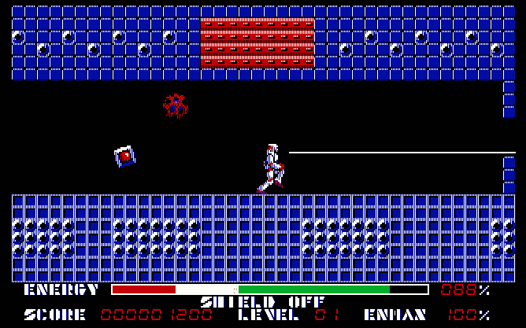

# 过去假期的幽灵:旧电脑游戏在存档网站上获得第二次播放

> 原文：<https://thenewstack.io/ghosts-holidays-past/>

你有很多时间休息，假期里有很多家人要看望。但是曾经有一段时间，节日不仅仅是家庭和食物。在我们年轻的时候，在你们年轻的时候，很可能有一段时间，假期意味着新的软件！

这在今天仍然是正确的，但数字发行的兴起确实削弱了在圣诞节早上或光明节晚上打开游戏包装的兴奋感。得到一张 [Steam](http://store.steampowered.com/) 礼品卡和打开一个装满磁盘和手册的超大纸箱是不一样的。如果你和我们一样老，你可能还记得游戏带有版权保护轮和覆盖层的时候。

那些日子已经过去很久了，但是他们的影子仍然留在网上，这要感谢 Archive.org[的一个非常敬业的团队。这些人一开始是通过](https://archive.org/)[从磁盘上保存实际的数据并储存起来以供下载，但是在过去的两年里，他们已经显著地提高了他们的水平。](https://archive.org/details/tosec)

档案团队(一个“流氓档案员的松散集体，在 [Efnet](http://www.efnet.org/) 上的#archiveteam 聚会”)一直忙于将 [MESS](https://github.com/jsmess/jsmess) 和 MAME 移植到 JavaScript。 [MAME](https://archive.org/details/emularity_engine_jsmame) ，你可能知道多街机模拟器，但混乱更乱。它是多机模拟器，支持从 Sega Genesis 到 Apple II 的所有东西。

通过将这些模拟器移植到 JavaScript，Archive.org 团队已经能够建立[软件库](https://archive.org/details/softwarelibrary)和[控制台客厅](https://archive.org/details/consolelivingroom)，以及[历史软件集合](https://archive.org/details/historicalsoftware)，所有这些都可以在浏览器中播放。

因此，我们怀着极大的愉快和无限的怀旧之情，沿着数字游戏历史的轨迹走一走，来看看这个系列中一些更有意义和开创性的游戏。

我们不妨从头开始。Archive.org 的苹果二代图书馆在网上是首屈一指的。你可以从一切开始:旧学校仿真收集(TOSEC)档案的**一切**曾经发布的苹果二代是[可在这里](https://archive.org/details/Apple_2_TOSEC_2012_04_23)。如果你稍微老一点，Apple IIgs TOSEC 档案在这里是。

大多数 Apple II 软件都在 5KB 到 10 KB 的范围内，所以，正如你可以想象的那样，每个档案的大小都超过 200 MBs，这一事实令人印象深刻。事实上，苹果 IIgs TOSEC 档案超过 300 兆字节。那是很多的。

xder

然而，TOSEC 档案的一个问题是，它们通常包含太多的内容。TOSEC 档案往往包括游戏的每一个可能的发行版本，从欧洲发行版到发现的测试版，再到残破的补丁版本，而不是一个游戏的一个副本。处理 TOSEC 文件可能会很困难，所以我们建议查看一下 [No-Intro](https://archive.org/details/No-Intro-Collection_2016-09-06) 集合，它们也托管在 Archive 中，尽管是以一种更微妙的方式。无介绍集只包括每个游戏的一个工作副本。

但是为什么还要下载呢？存档团队在 JavaScript 仿真平台上的辛勤工作意味着没有人再需要下载任何东西。苹果二代游戏库中最好的游戏已经可以在早上 4 点的和[苹果二代游戏库](https://archive.org/details/softwarelibrary_apple_games)在线玩了。目前关于这些库的工作主要是破解旧游戏，这将吸引那些喜欢反编译汇编语言的人。对于真正的历史爱好者来说， [Akalabeth](https://archive.org/details/Akalabeth_1980_California_Pacific_Computer) 也可以在浏览器中播放。这是启动终极创造者[理查·盖瑞特](https://richardgarriott.com/)职业生涯的游戏。

当然，苹果 II 型电脑并不是 Archive.org 唯一模仿的电脑。对于我们当中的英国人来说，有一个健康的选择 [ZX 光谱](https://archive.org/details/softwarelibrary_zx_spectrum)软件，它在浏览器中也可以工作。看起来这个频谱更容易模拟，因为这里几乎没有什么东西是不能在浏览器中运行的，不像大多数其他支持的平台。

在我看来，没有比 [Skool Daze](https://archive.org/details/zx_Skool_Daze_1985_Microsphere_a) 更好的了，这是他们所谓的典型的英国儿童游戏。Skool Daze 让你跟随你的同学在一所数字学校周围，跟随他们去上课，用弹弓射击他们，并避免会给你分配惩罚的老师。当然，也有一些 [007 游戏](https://archive.org/details/zx_007_Live_and_Let_Die_1988_Domark)来圆这个特殊的英国的吸引力。

在美国，你很可能是在 DOS 电脑上玩游戏长大的。档案室也有你的资料。DOS 游戏档案充满了隐藏的宝石，其中一些仍在优化，以便在浏览器中播放。到目前为止，这里最受欢迎的游戏是[俄勒冈小径](https://archive.org/details/msdos_Oregon_Trail_The_1990)，但在档案中还有许多其他宝石:[波斯王子](https://archive.org/details/msdos_Prince_of_Persia_1990)、[模拟城市](https://archive.org/details/msdos_SimCity_1989)和[德国 U 艇模拟器](https://archive.org/details/msdos_Das_Boot_German_U-Boat_Simulation_1990)都立即浮现在脑海中。

如果你是在口袋里装着 25 美分硬币而不是一串声卡 IRQ 的环境中长大的，也许你会觉得在[网络游戏厅](https://archive.org/details/internetarcade)更自在，在那里玩家可以在浏览器中玩[后卫](https://archive.org/details/arcade_defender)、 [Q-bert](https://archive.org/details/internetarcade) 和[报童](https://archive.org/details/arcade_paperboy)。

回到那个时代， [Atari 2600](https://archive.org/details/atari_2600_library) 在 Archive.org 也受支持。[河流突袭](https://archive.org/details/atari_2600_river_raid_1982_activision_carol_shaw_ax-020_ax-020-04)可以玩，同样可以玩的还有[吃豆人](https://archive.org/details/PacMan1981Atari)和[陷阱](https://archive.org/details/Pitfall_Activision_1982)。你甚至可以玩臭名昭著的 [ET 游戏](https://archive.org/details/E.T._The_Extra-Terrestrial_1982_Atari_NTSC)。然后还有[冒险](https://archive.org/details/atari_2600_adventure)，发明了复活节彩蛋的游戏[光环 2600](https://archive.org/details/atari_2600_halo_2600) ，本世纪编写的为数不多的 2600 游戏之一，

你也可以用它变得更现代一点。例如，如果你有一个[世嘉创世纪](https://archive.org/details/sega_genesis_library)，这里也有:[真人快打](https://archive.org/details/sg_Mortal_Kombat_1992_Acclaim_Arena_Entertainment_Midway_Probe)、[刺猬索尼克](https://archive.org/details/sg_Sonic_the_Hedgehog_Rev_1_1991_Sega_JP-KR_en)、街头霸王 II 和[狮子王](https://archive.org/details/sg_Lion_King_The_1994_Virgin)都可以玩。

真人快打

该系列的其他亮点包括 [Atari 7800 库](https://archive.org/details/atari_7800_library)、 [Amstrad GX4000](https://archive.org/details/gx4000_library) 、[超级 A'Can 系统](https://archive.org/details/superacan_library)，甚至还有 PDP-1(第一款数字游戏)的[太空战](https://archive.org/details/pdp1_spacewar)。

希望这些游戏足够让你度过新年。你看，我们甚至还没有触及 Archive.org 非游戏软件的表面。它还托管类似 [VisiCalc](https://archive.org/details/VisiCalc_1979_SoftwareArts) (第一个电子表格)、一系列 [Mac OS 7.1 软件](https://archive.org/details/softwarelibrary_mac)和[著名档案馆](https://archive.org/details/softwaresites)的档案，比如 [Tucows](https://archive.org/details/tucows) ！如果你仍然没有得到足够的乐趣，请登录 Efnet 上的#archiveteam 并说“我想帮忙！”

亚历克斯·汉迪是艺术和数字娱乐博物馆的创始人和负责人，这是一家 501c3 的非营利性视频游戏博物馆，位于加利福尼亚州奥克兰市中心。MADE 通过跨越 30 多个系统的可播放展品和免费的儿童编程课程来保存我们的数字遗产。MADE 还承担软件保护工作，例如它重新推出了 1986 年为 C64 发布的第一个虚拟世界《栖息地》。“栖息地”现在以 Neohabitat.org 的名字重新上线。

<svg xmlns:xlink="http://www.w3.org/1999/xlink" viewBox="0 0 68 31" version="1.1"><title>Group</title> <desc>Created with Sketch.</desc></svg>