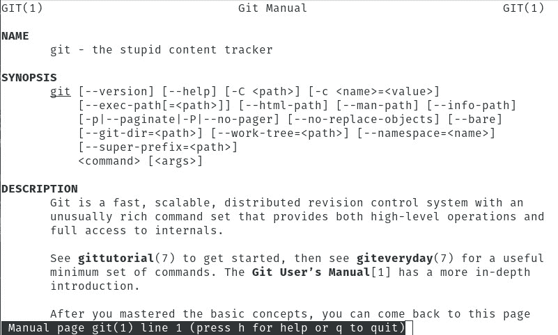

# Git 15 岁:Git 如何改变我们的编码方式

> 原文：<https://thenewstack.io/git-at-15-how-git-changed-the-way-we-code/>

15 年前，许多 Linux 内核开发人员放弃了他们的版本控制系统 BitKeeper。为什么？拥有 BitKeeper 版权的人 Larry McVoy 声称某个内核开发人员对 BitKeeper 协议进行了逆向工程，因此取消了其产品的免费使用权。

Linux 创建者 Linus Torvalds 寻找一个替代品来存放 Linux 内核代码。经过仔细考虑，托瓦尔兹意识到没有一个[可用选项](/a-brief-history-of-git-in-numbers/)足够有效来满足他的需求:

*   一个系统所做的与并行版本系统所做的相反。
*   它将支持分布式工作流(类似于 BitKeeper)。
*   它必须提供防止腐败的保障。
*   该项目必须能够满足 Linux 内核开发的强烈需求。
*   打补丁不会超过三秒钟。

鉴于托瓦尔兹作为开发人员的能力，他很快意识到他唯一的选择是自己开发工具。因此，2005 年 4 月 7 日，托瓦尔兹先生启动了他的新项目， [git](https://git-scm.com/) 。根据托瓦尔兹的说法，这个项目是以他自己的名字命名的。

发出命令 *man git* ，你会看到 git 的官方名称包含了一点幽默(**图 1** )。

**图 1:** 愚蠢的内容追踪器。

自从最初发布以来，git 已经成为一个非常高效且易于使用的工具。Git 也是这个星球上使用最广泛的源代码管理系统之一。根据 2018 Stack Overflow 年度开发者调查(去年他们包括了一个版本控制问题)，87.2%的开发者使用 git。

### 什么是 git？

对于那些少数从未体验过 git 的开发人员(或者不是开发人员，但很好奇的人)，git 是一个开源版本控制系统(VCS)。VCS 是一种工具/系统/服务，用于管理文档、计算机程序、网站以及几乎任何信息集合的变更。关于软件开发，VCS 帮助开发团队管理源代码随时间的变化。

> “别担心，我们都去过那里。我们都犯过错误。Git 可以让你轻松地撤销所有可能犯下的错误。”马里奥·丹尼奇

但是 git 完成这项任务的方式与大多数版本控制系统略有不同。大多数系统将信息存储为基于文件的更改列表，因此文件和随时间对文件所做的更改都会被存储。另一方面，Git 将数据视为微型文件系统上的一系列快照。每当开发人员提交或保存项目时，git 都会对这些文件进行快照，并存储对快照的引用。Git 更进一步，对文件进行比较，不存储任何没有改变的文件，而是链接回先前存储的(相同的)文件。

这种存储快照的方法使得 git 非常高效。

Git 也可以在本地和远程工作。开发人员在他们的计算机上安装 git，然后可以提取项目，在本地使用它们，并将它们的更改推回。基本的 git 工作流程如下:

1.  用 git 托管工具(比如 GitLab)创建一个存储库(一个项目)。
2.  将存储库克隆到您的本地机器上。
3.  将文件添加到您的本地存储库中。
4.  提交更改。
5.  将更改推回到远程托管的项目。

### 改变我们的编码方式

但是 Git 如何改变了开发的前景呢？随便问问世界上的任何一个开发者，你都会得出“深刻”的结论

事实上，[系统 76](http://www.system76.com) 的 Web 工程主管 Sean Callen 说，“很难量化来自 SVN 和 IBM Rational ClearCase 的 git 到底有多好。”然而，Callen 补充道，“以前的工具感觉很笨重，协作从来不像 git 那样流畅。将 GitHub 融入其中，你将获得其他产品无法比拟的体验。”然而，更重要的是，Callen 认为 git 无疑使他的工作变得更加容易。

但是，自早期以来，git 做出了哪些改变呢？“我有点痴迷于一个干净的 git 历史，”Callen 说，并详细说明了“对 **git-rebase** 和 **git-cherry-pick** 的改进使得在维护可用历史的同时与其他人协作成为可能。”这些 [**git-rebase**](https://git-scm.com/docs/git-rebase) 和[**git-cherry-pick**](https://git-scm.com/docs/git-cherry-pick)工具不仅帮助了 Sean 自己的工作，还帮助了其他团队成员。

[Nextcloud](https://www.nextcloud.com) 的首席开发者/高级软件工程师[马里奥·丹尼奇](https://www.linkedin.com/in/mariodanic)说:“当 Git 作为一种新奇事物出现时，看到它呈现事物的‘不同方式’是很有趣的。“虽然 Git 背后的想法保持不变，但整体体验(对我来说)已经发生了巨大的变化，这是因为外观的改进，它不仅在复杂的情况下使用更简单，而且降低了初级开发人员所需的入门和教育门槛。”

说到工具，Callan 宣称命令行界面(CLI)是必由之路。“我尝试过一些图形用户界面，但我一次又一次地发现，我回到 CLI 来完成工作。git 的强项之一很可能是其平易近人的 CLI。Callen 声称，在这个 CLI 中，git 多年来已经建立了“大量的工具，进一步增强了 CLI 体验，如 GitHub 自己最近发布的 CLI 工具”。

### 未来会怎样？

谁也说不准 git 的未来会怎样。现在 git 志愿者开发发布了自己的 CLI 工具，程序员和程序员团队可以用该软件做的事情已经没有限制了。但是程序员想从未来的 git 版本中得到什么呢？如果 Callan 有他的方式，他会很高兴 git 什么都不做。“我很高兴使用 git，以及这些年来它为我带来的良好表现。从企业到小型初创企业、流行的开源或个人项目，我想不起有哪一次我觉得 git 有所欠缺。”

“git 最开始的一个大缺点是缺乏文档。我认为这种情况正在得到越来越多的纠正，”丹尼奇说。至于它最明显的缺点，丹尼奇警告说，“虽然它肯定被开发人员广泛传播和采用，但刚入门的初级人员仍然有 git 有点‘难’的观念，因为它一开始就是这样的。我想，随着人们认识到事实并非如此，随着他们对它了解得更多，这种情况将很快消失，但这需要时间。”

丹尼奇建议新用户，“别担心，我们都经历过。我们都犯过错误。Git 可以让你轻松地撤销所有可能犯下的错误。”

[Git 15 岁了:现在怎么样？](https://thenewstack.simplecast.com/episodes/git-is-15-years-old-what-now)

<svg xmlns:xlink="http://www.w3.org/1999/xlink" viewBox="0 0 68 31" version="1.1"><title>Group</title> <desc>Created with Sketch.</desc></svg>