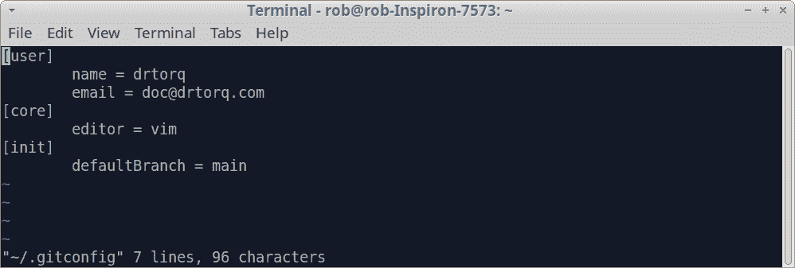
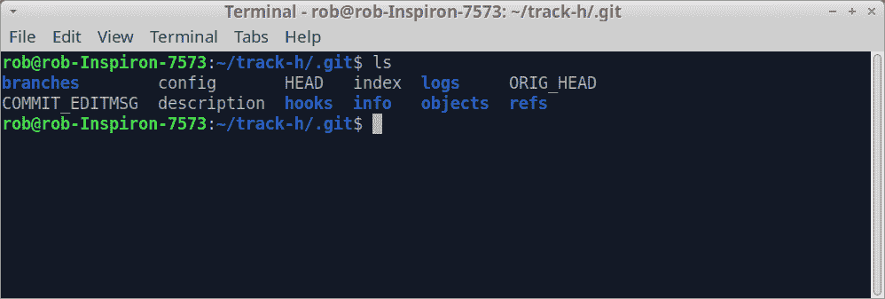
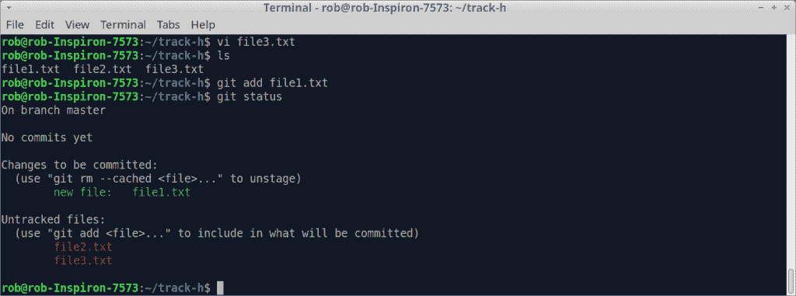
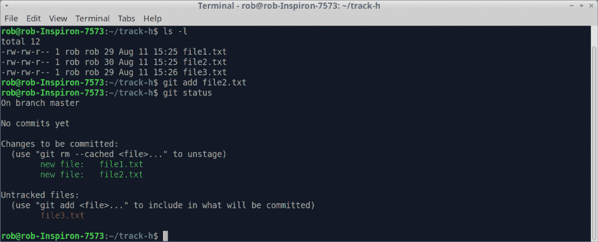
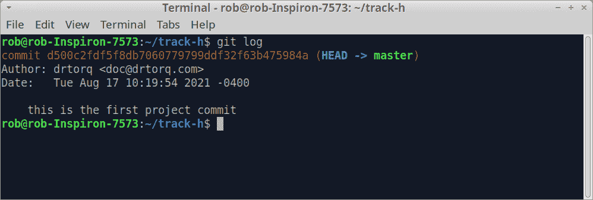

# 用于管理小项目的 Git

> 原文：<https://thenewstack.io/git-for-managing-small-projects/>

这篇文章是 git 系列教程的第一篇，git 是世界上使用最广泛的开源代码管理软件。请定期查看未来的文章。

我是一名技术作家，不是一名成熟的软件开发人员。偶尔一次可能更准确。管理各种 CAD/CAM 系统、编写应用程序需求、进行软件/硬件集成等等是我在美国公司工作期间的家常便饭。

现在，我[制作微控制器项目](https://thenewstack.io/author/rob-reilly/)的原型，探索最新的新技术，并为我的蒸汽朋克兴趣、指南故事和会议技术讲座提升 3D 打印技能。

开源的 [git](https://manpages.debian.org/stretch/git-man/git.1.en.html) 软件看起来总是能帮我整理固件版本、应用程序变更、故事草稿和项目文件。跟踪小型、快速发展的项目，比如我亲身实践的技术故事，是一件非常麻烦的事情。不管出于什么原因，我就是不喜欢 git。当然，找到各种可供重用的内容和代码也是一个巨大的挑战。当我的编辑最近问我是否想创建一个 git 教程系列时，我很自然地说“是的”git 会让我的生活变得更好吗？我还不知道…我们会一起找到答案的。

本系列探索 git 如何为小型的真实硬件/软件项目工作。对于新用户来说，Git 显得神秘而复杂。的确如此。不管怎样，我们将熟悉 git 的工作方式，并看看它是否适合我们的特定需求。随着本系列的进展，我们将更深入地研究细节、奇怪的怪癖以及如何调整工作流程。首版将从在 Linux 笔记本电脑上安装 git 开始，并在终端中使用一些命令来建立一个基本系统。

## 什么是 Git，为什么要用它？

git 用于跟踪和管理文件中的变化。它主要处理文本文件，尽管其他文件类型也可以用[插件和扩展](https://opensource.com/life/16/8/how-manage-binary-blobs-git-part-7)来处理。这很好，因为我用文本文件做了很多工作，尽管不一定总是源代码。git 还可以让多个开发人员快速高效地在同一个项目上轻松合作。跟踪和历史是可用的，即使在离线时。该系统通过分支支持非线性开发，并且是开源的。git 与其他版本控制系统的不同之处在于，它使用快照的概念来索引、记录变更和保存项目内容。每个提交都是第一个或父项目快照的后代。不出所料，git 使用树结构来索引、记录和存储更改。

## 把 git 放到你的 Linux 笔记本上

我使用 Linux 来满足我所有的计算需求。我的新款戴尔笔记本配备了酷睿 i7 英特尔处理器、NVidia GeForce 显卡、16 GB 内存和闪电般速度的 500GB 固态硬盘。这台机器能够同时运行 Chrome 浏览器、LibreOffice、FreeCad 和 Prusa slicer 程序，而且不费吹灰之力。Xubuntu 是我在 XFCE 桌面上选择的 Ubuntu 20.04.2 LTS 版本。使用现代的 Linux 笔记本简直是一种享受。

其他硬件，如各种 Raspberry Pi、BeagleBone、RockPi 等，通常以独立和服务器角色与 ARM 版本的 Linux 一起运行。本系列主要使用命令行来满足基于 Linux 的机器的需求。您当然可以使用 git 在 Raspberry Pi 上维护项目。

git 也可以在 Windows 和 Mac 上使用。讨论的原则可以转移到这些机器上，尽管我不会讨论与这些平台相关的任何细节。

将 git 放在 Linux 笔记本上有两种方法。使用软件包管理器，如 synaptic。或者在 Linux 终端的命令行中使用 apt。

从桌面启动新立得，搜索“git ”,然后勾选安装框。点击“应用”按钮，程序很快就可以使用了。新立得还安装了 git-doc、git-man 和其他一些支持包。请务必查看带有“git”前缀的 synaptic 程序列表，以了解您可能想要安装和试用的其他有趣的支持应用程序。

从命令行安装 git 几乎一样简单。

打开桌面上的终端。

接下来，进行正常的 apt 包安装程序，按照要求输入密码。

`rob-notebook: sudo apt update`
`rob-notebook: sudo apt upgrade`

一段时间后，主 git 应用程序及其支持程序将会安装。

接下来，用您的身份信息和一些偏好来个性化 git。这很重要，因为 git 日志会改变，所以每个人都知道谁在项目中做什么。它使协作变得透明且易于遵循。

`rob-notebook: git config --global user.name drtorq`
`rob-notebook: git config --global user.email doc@drtorq.com`
`rob-notebook: git config --global core.editor vim`

使用以下命令查看当前设置的配置参数。

`rob-notebook: git config --list`

如果您熟悉 vi (VIM)或其他 Linux 文本编辑器，您还可以编辑~/。gitconfig 文件，用于参数调整。

`rob-notebook: vi ~/.gitconfig`

vi 中的 git 配置打印输出

## 将 git 用于一个简单的项目

git 项目实例需要在您的笔记本电脑上有一个本地工作目录。创建一个新目录，然后向下移动到该目录开始。

`rob-notebook: cd ~`
`rob-notebook: mkdir track-h`
`rob-notebook: cd track-h`

git-init 命令创建一个包含许多其他目录和文件的. git 子目录。cd 放入。git 目录来看看。请注意，如果您在 man 中查找 git，您会注意到这些命令是用连字符连接的。

`rob-notebook: man git`

我将在本文正文中继续使用命令断字约定，因为这样阅读起来会更容易一些。在 Linux 终端中使用该命令时，请记住删除连字符。

`rob-notebook: cd .git`
`rob-notebook: ls`

中的文件。git 目录

## 将文件添加到 git 存储库中

一个 git 存储库，无论是在本地的 Linux 笔记本上还是在云中，都是组成项目的文件的集合。它可能包含已跟踪和未跟踪的文件、项目历史、相关文件(如自述文件)以及随时间推移对所有这些文件所做的更改。

Git 有三个常规部分，工作目录、暂存区和 git 存储库。

在我们的例子中，track-h 是工作目录。要编辑并包含在项目中的文件被复制到该目录中。此时，文件只存在于目录中，没有被 git 跟踪。Staging 指定了我们想要为项目的每个新快照或提交主动跟踪和排队的文件。转移是通过“添加”命令完成的。我们将暂存文件“提交”到 git 存储库中，永久保存每个项目快照的内容和历史。每次提交都是项目的索引快照。

一旦一个目录被初始化为 git 存储库，复制您的项目文件。

我制作了三个示例文件，file1.txt、file2.txt 和 file3.txt。每个文件都有一行文本，“这是[xxxx]文本文件。”，其中[xxxx]是一个数字。

git-add 命令将一个文件名插入 git 存储库列表，并开始跟踪它的活动。

`rob-notebook: git add file1.txt`

使用 git-status 命令检查文件状态。

`rob-notebook: git status`

下图显示了本地存储库中文件的当前状态。

添加到 git 索引的文件

现在，将第二个文件添加到索引中。

`rob-notebook git add file2.txt`

这里的状态显示我们现在正在跟踪两个文件。请注意，此时没有跟踪 file3.txt。

添加到 git 索引的第二个文件

随时使用 git-status 查看文件的当前状态。

假设您编辑 file1.txt，在第一行之后加上“这是第二行文本”。现在，git-status 显示您已经编辑了该文件，并且当最终“提交”时，它是该文件的当前版本换句话说，我们仍然在临时区域中更改文件。您可以随心所欲地这样做，git 会提醒您正在更改现有文件。

假设您想要丢弃对文件的所有编辑，并返回到最初添加文件时的原始状态。使用 restore 命令。

`rob-notebook: git restore file1.txt`

如果想完全停止跟踪 file1.txt 怎么办？使用 git rm 命令。

`rob-notebook: git rm --cached file1.txt`

现在，git 状态将显示 file1.txt 是一个未被跟踪的文件，同样只驻留在 track-h 目录中。它不会添加到转移索引中，也不会提交到新的快照中。

## 使变化更加持久

将我们编辑过的文件放在工作目录中，并将它们的名称添加到存储库索引中，我们可以将它们“提交”到项目的快照中。git-commit 命令满足了这个目的。在我们这样做之前，应该再次“添加”编辑过的文件，告诉 git 下一次提交时一切都是我们想要的。

`rob-notebook: git add file1.txt file2.txt file3.txt`

或者，您可以只处理用-all 选项编辑过的所有文件。

`rob-notebook: git add -all`

接下来，使用 git-commit。

`rob-notebook: git commit -m “first files committed to our project”`

m 选项在提交中添加了一条消息，这样您就可以获得项目更改的摘要。

使用 git-log 命令获取提交的摘要。

`rob-notebook: git log`

git 日志打印输出

请注意，作者和日期信息出现在打印输出的顶部。我们的“总结”显示在底部。顶部的巨大数字是这个特定提交的内部存储库索引。提交号的右边是分支引用，在我们的例子中默认为“master”

对文件做一些编辑，然后执行 git-add-all 和 git-commit。查看 git-status 和 git-log 来了解工作流。

## 包裹

这是结束这篇基础文章的好地方。下一次，一旦我们将内容放入 git，我们将继续检查树结构，分析提交并获取内容。

*在[doc@drtorq.com](mailto:doc@drtorq.com)或 407-718-3274 联系 [Rob "drtorq" Reilly](/author/rob-reilly/) 咨询、演讲约定和委托项目。*

<svg xmlns:xlink="http://www.w3.org/1999/xlink" viewBox="0 0 68 31" version="1.1"><title>Group</title> <desc>Created with Sketch.</desc></svg>