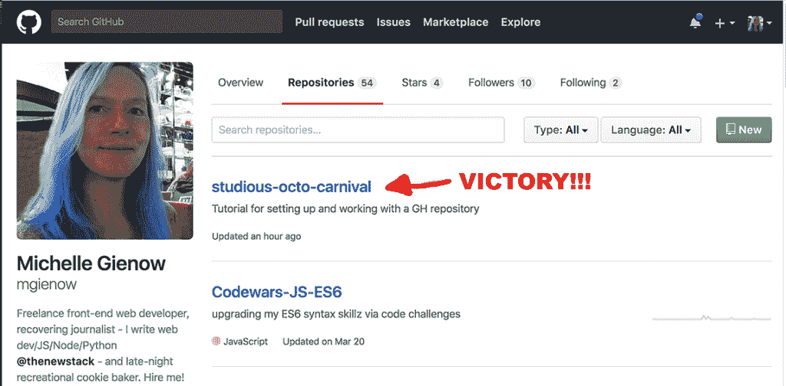

# 程序“with GitHub 入门

> 原文：<https://thenewstack.io/git-with-the-program-getting-started-with-github/>

你好，git 的投资者们，欢迎来到我们关于版本控制软件 git 和 GitHub 的指南的第二部分——git 驱动的开源世界中心，数百万开发者在这里存储他们的项目。

[在第一部分](https://thenewstack.io/tutorial-git-for-absolutely-everyone/)中，我们讨论了 git 以及如何开始使用它。Git 是一个真正了不起的工具:虽然实际上相当复杂，但除了我们上次介绍的[基本操作](https://thenewstack.io/tutorial-git-for-absolutely-everyone/)，初学者可以立即开始使用 git 最重要的功能，根本不需要了解太多。

至此，您已经了解了以 git 为中心的工作流的基本原理，以及如何进行基本的版本控制:创建存储库、准备和提交变更。下一步是将您的项目部署到 GitHub。Git 本身是一个命令行工具，存在于您的笔记本电脑中。然而，git-init 项目围绕的中心是字面上的枢纽——[GitHub.com](https://github.com/)——开发者上传和存储他们的项目，其他人可以查看和贡献他们的项目。

## 欢迎来到 GitHub

我将告诉你一个科技界肮脏的小秘密:许多开发者并不都很擅长 GitHub。

“Git”通过网络漫画 xkcd。经许可使用。

这种普遍的羞耻与另一个不那么秘密的秘密直接冲突:如今，一个开发人员的真实简历不是一张列出以前经历的纸——而是你的 GitHub 页面。未来的雇主会直接进入你的页面，查看你做过的项目类型、你的提交历史，甚至打开存储库查看你的实际代码。从专业角度来说，这有点像裸体。(实际上，对于一个编码者来说，这就跟裸体一模一样)。

这两个数据点的交集:作为现代 web 环境中的开发人员，理解驱动 git 和 GitHub 的工作流是非常必要的。换句话说，系统是如何工作的，为什么我们要执行它的每一步。一旦你内化了这种理解，如何做实际上变得相当容易——甚至不言自明。

我坚信这一点，所以当我教授前端 web 开发入门课程时，在接触 HTML、CSS 或 JavaScript 之前，我们会从 git 和 GitHub 的全面基础开始。

### 重要的事情先来

让我们从在 GitHub 上设置一个帐户开始。这很简单:建立一个用户名和你希望与你的 GitHub 存在相关联的电子邮件。专业建议 1:花一分钟想想你的用户名。这将永远与你的职业身份密不可分，所以你最好把你的名字和姓氏结合起来。(如果您有一组常见名字，这可能是一个小的“该用户名已经存在”错误消息问题，但是我们相信您可以解决这个问题)。专业提示 2:每一个可以想到的用户名组合“foo”和“bar”都已经被使用了。

创建和使用 GitHub 账户是完全免费的。让我们都停下来感激一下，这个惊人的资源首先存在，而且它没有花费单个开发者一毛钱。

**你的 GitHub 账户现在将以 https://github.com/yournamehere**的身份存在

从现在开始，我们将使用[我自己的 GitHub 页面](https://github.com/mgienow)作为例子。显然，随着您的继续，将任何写有“mgienow”的内容(我的第一个首字母/姓氏 GitHub 句柄(因为“蓝发 JS 女神”看起来太吹牛了))更改为您自己的 GitHub 句柄。

最后一个提示:此时，每次你从命令行访问 GitHub——推送(上传)或拉取(下载)项目文件——它都会询问你的 GitHub 密码。有一种方法可以让 git 自动使用您的密码进行身份验证，这样您就不需要每次都输入密码了。根据你的操作系统不同，这个过程会有很大的不同，所以请访问 [GitHub 密码缓存指南](https://help.github.com/articles/caching-your-github-password-in-git/)并遵循为你的特定场景定制的说明。

### 创建您的第一个存储库

一旦您闪亮的新 GitHub 帐户建立，下一步就是创建一个远程存储库。首先点击右上角的“加号”符号:

这将弹出一个对话框；点击“new repository”(现在不用担心其他选项)。然后 GitHub 会为您生成页面来创建一个新的 repo。GitHub 会检测您的操作系统来相应地呈现其用户界面，如果您使用的是不同版本的 MacOS、Windows 或 Linux，我的截图可能与您的结果不完全匹配。不用担心:所有的框都以相同的方式填充。

接下来，填空:

**存储库名称**:大多数情况下，当处理一个真实的项目时，使用一个适合你的项目的存储库名称是有意义的。然而，GitHub 总是会建议一个随机生成的库名，这通常很有趣。因为这是一个练习，而且因为我一直想实际使用 rando 标记之一，所以今天的示例项目从此被称为“好学-八月-嘉年华”对于我们今天的练习，请用 GitHub 建议的好名字来命名您的存储库。从现在开始，用这个名字代替“好学十月嘉年华”

**描述**:今天，“设置和使用 GitHub 库的教程”下一次，一旦培训轮关闭，键入你的实际项目做什么。

**公有 vs 私有**:“公有”是免费 GitHub 账号的唯一选项。任何有你 GitHub 地址的人都可以看到你上传的任何东西——这就是为什么这是开源的。如果你需要你的隐私，[付费的 GitHub 账户](https://github.com/pricing)也允许你创建私人仓库。个人开发者计划的当前价格为每月 7 美元。

**初始化**:“初始化”步骤由您决定。在我们的第一个 git 教程中，我们创建了一个本地 README 文件作为项目的一部分。由于我们将把一个项目推上 GitHub，我们不想创建一个新的 README。

在游戏的这个阶段，我们不需要担心”。git ignore”——尽管这最终会派上用场，但就需求和能力而言，它超出了我们目前的范围——同样的还有[许可](https://choosealicense.com/)。

### 准备你的项目去 GitHub

大多数初学者首先在自己的电脑上创建一个项目，然后将整个 enchilada 上传到 GitHub。您也可以首先创建 GitHub 存储库，将其下载到您的计算机上，然后填充内容。无论哪种方式，结果都是一样的，但是“先创作，后出版”的模式是大多数人自然遵循的模式，所以这就是我们在这里所做的。

让我们用一个新的示例项目逐步完成整个过程，因为内部化 git——和 GitHub——工作流很重要。

1.  回到第一个教程，使用命令行创建一个名为“好学-八月-嘉年华”的项目目录(文件夹)(记住:在我们上一步创建自己的存储库时，使用 GitHub 建议的任何随机名称)。
2.  光盘放入新目录(
3.  Initialize the directory as a local git repository with “git init”

因此，就工作流而言，我们在这里所做的是创建一个项目文件夹，在其中放置几个文件，然后使用 git-init“打开”版本控制。

我们接下来的步骤也来自上一教程:暂存文件，然后提交它们。请记住，这与拍摄当前整个项目的快照，并给它一个标题(提交消息)来描述您所做的事情是一样的。第一次提交几乎总是被称为“初始提交”或“首次提交”

*   **准备项目**:“git add *”会给你的项目目录和其中的所有东西拍一张快照，就像现在这样。
*   **提交项目** : "git commit -m "First commit " "告诉 git 保存这个"快照"和提交消息作为标题信息。

### 将 Git 与 GitHub 链接起来

这是一个神奇的时刻:我们将把你在本地制作的东西与你的 GitHub 库连接起来。从现在起，你将能够来回移动内容到你内心的内容！

现在回到 GitHub。当我们初始化新的回购协议时，我们得到了如下所示的屏幕:

我们将从命令行推送我们现有的、刚刚创建的存储库。最简单的方法是点击右边的剪贴板图标(在第二个框中，“…或者，从命令行上传一个新的存储库”)，然后粘贴到终端。然而，我强烈建议现在就把所有的东西都输入进去——它建立了那些 git 肌肉记忆，也帮助我们跟踪我们在做什么和为什么做。

*   添加远程:“Git remote add origin https://github.com/mgienow/studious-octo-carnival.git"告诉你机器上的 Git 将这个链接添加到你的项目中。让我们来分解一下链接:GitHub.com 是主机，你把它放在你的个人 GitHub 账户中，所以接下来是你的 GitHub 句柄。最后，您的项目名称带有一个“.git”扩展名，因为它现在是一个 git 文件——一个包含项目中打包的所有内容的信封，是在您执行“git init”时创建的。如果您看不到它，请不要担心—您不需要看到它，git 会支持您。
*   现在用力！“git push -u origin master”是将您的项目实际发送到远程的命令。
*   1.  “推”是上传它的 git 术语。
    2.  “-u”表示上游:您的项目向上流向主机存储库。
    3.  “来源”指的是它来自哪里:你电脑上的项目
    4.  “母版”指的是现在活在你的 GitHub repo online 中的母版副本。

### 奇迹发生了！！！！

你怎么知道？首先，没有错误信息。？？？

第二，可以通过输入“git status”进行检查。当你看到美丽的文字，“关于枝主。您的分支是最新的“原点/主”没有承诺，工作树干净”这意味着你回家自由。

干净，宝贝！喔。每次我成功地将代码推送到 GitHub 时，我仍然会有一点点冲动。

但是胜利的真正证据在于你的 GitHub 账户:这个库现在显示在你的 GitHub 库页面上。注意你头像旁边第一行的标签:概览是你的主页，储存库是你所有回复的列表，按时间顺序排列，是最近添加/处理的。

您可以点击回购标题进入其项目页面:

W00T，在那里！

### 今天令人敬畏的成就的摘要

*   我们创建了一个 GitHub 账户，从而在建立专业开发者的身份上迈出了一大步。
*   我们在 GitHub 上创建了一个新的项目资源库。
*   我们在自己的计算机上创建了一个示例项目，将其初始化为一个 git 实体，对其进行登台和提交，并将其推送到 GitHub。

感觉好吗？太好了。现在再做五次。我是认真的:这是 git 工作流的核心。创建->登台->提交->推送。在进行任何其他 GitHub 工作之前，您需要完全熟悉所有这些步骤。我们将在下周回来讨论为什么 origin 被称为 origin，为什么 master 被称为 master，什么真正位于上游，分支，分叉 git 的所有奥秘都被揭示了。现在走开去做你的作业。说真的。在我们的示例项目中创建一些新文件，并推送这些文件。然后开始第二个示例项目，并在提交第一个提交之前练习为它创建一个新的回购。快走吧。很好。

<svg xmlns:xlink="http://www.w3.org/1999/xlink" viewBox="0 0 68 31" version="1.1"><title>Group</title> <desc>Created with Sketch.</desc></svg>