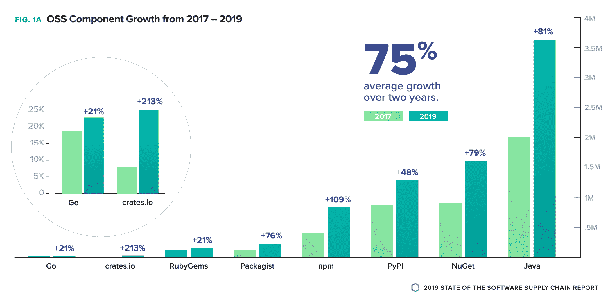

# GitHub 收购 npm，为微软在 Node/JavaScript 社区中赢得一席之地

> 原文：<https://thenewstack.io/github-acquires-npm-buying-microsoft-a-presence-in-the-node-javascript-community/>

两家公司周一宣布，代码库服务 [GitHub](https://github.com/) 正在收购 Node.js 和 JavaScript 模块的卓越软件注册表 [npm](https://www.npmjs.com/) 。

GitHub 计划投资 npm 的基础设施，希望为该平台带来一些急需的现代化，GitHub 首席执行官 [Nat Friedman](https://twitter.com/natfriedman) 在[一篇博客文章](https://github.blog/2020-03-16-npm-is-joining-github/)中承诺。这也可能有助于将快速增长的注册管理机构从过去几年遭受的巨大财务和人事动荡中解脱出来。

“我们将进行必要的投资，以确保 npm 快速、可靠和可扩展，”弗里德曼写道。“我们将积极与 JavaScript 社区合作，获取您的想法，帮助我们定义 npm 的未来。”

npm 服务包含 130 万个包，目前每个月有 750 亿次下载。 [Node.js](https://nodejs.org/en/) 运行时使开发人员可以轻松下载帮助运行他们自己的软件的包，这些依赖项也被称为，也广泛用于 JavaScript 社区的其他部分。

GitHub 承诺保持公共注册表的免费使用，并带来实质性的改进。弗里德曼发誓，该公司希望“改善核心体验”。“我们感到兴奋的一些更大的功能是[工作区](https://github.com/npm/rfcs/blob/de8d71c0453f5cf443d3ef2f47e313f12dd6aaf9/accepted/0000-workspaces.md)以及对发布和多因素身份验证体验的改进，”他写道。

从长远来看，GitHub 将致力于将 npm 集成到 GitHub 中，这可能会加强开源依赖项供应的安全性。这项工作将允许开发者“追踪从 GitHub pull 请求到修复它的 npm 包版本的变化，”Friedman 写道。

像 GitHub 本身一样，npm 通过 npm Pro、Teams 和 Enterprise 等服务支持私有注册中心。这些服务将继续提供，并通过与 GitHub 软件包(一个多语言软件包注册中心)的集成得到增强。弗里德曼写道:“今年晚些时候，我们将允许 npm 的付费用户将他们的私人 npm 包转移到 GitHub 包——让 npm 专注于成为 JavaScript 的一个伟大的公共注册中心。”

此次收购对 GitHub 母公司微软来说也是一个好的举措，在过去的几年里，微软一直在扩展其在开源社区的影响力。反过来，微软将能够为 npm 运营带来财务稳定，同时最大限度地利用这些资产，新堆栈的分析师[劳伦斯·赫克特](https://thenewstack.io/author/lawrence-hecht/)指出。

来源:Sonotype。

## 没有灰姑娘的故事

NPM(Node Package Manager 的缩写)最初创建于 2009 年，是作为共享 JavaScript 模块的在线包管理器而设计的。npm.inc 公司成立于 2014 年，旨在扩展必要的技术以满足其巨大的需求。在这个过程中，它遇到了许多问题，尤其是安全性，以及随之而来的左键盘包的不可用性[，这使得无数的 JavaScript 程序无法运行。尽管这项服务越来越受欢迎，但它仍然面临着盈利问题。它还面临着对劳工管理和高管雇佣的批评。](https://thenewstack.io/the-kik-kerfuffle/)

npm inc 的联合创始人艾萨克·施鲁特在一篇博客文章中写道:“这不是一个 10 亿美元创业公司的灰姑娘故事，我们受到了打击，但最终，我们做对了我们的社区、团队和职业，我为我们取得的成就感到非常自豪。”。

对这一消息的初步反应似乎是积极的。“在 GitHub 收购 npm 的情况下，到处都是好消息(并且很好地解决了 npm 的货币化问题)，”亚马逊网络服务开发者传道者和长期开源观察家 [Matt Asay](https://www.linkedin.com/in/mjasay/) 在[一条推特](https://twitter.com/mjasay/status/1239630862800408586?s=20)中写道。

“今天关于 GitHub 将收购 npm 的消息是一个积极和合理的步骤，可以确保 JavaScript 开发人员的开源 npm 注册表的稳定性和安全性。我们了解并信任 GitHub 领导者，他们拥有丰富的经验，能够在众多重要贡献的基础上继续发展，正是这些贡献让 npm 成为今天领先的开源包管理资源。”在一份声明中， [OpenJS 基金会](https://openjsf.org/)执行董事罗宾·银说。

*新的 Stack 贡献者 B. Cameron Gain 和 Mike Melanson 对本文有贡献。*

<svg xmlns:xlink="http://www.w3.org/1999/xlink" viewBox="0 0 68 31" version="1.1"><title>Group</title> <desc>Created with Sketch.</desc></svg>