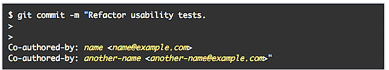

# GitHub 在一次提交中增加了对多名合作作者的认证

> 原文：<https://thenewstack.io/github-adds-crediting-multiple-co-authors-single-commit/>

在 dev life 中，很少有事情像在 GitHub 贡献图上填充那些绿色小方块那样令人满意。然而，当在一个团队项目中工作时，即使几个人对工作做出了同等的贡献，有时那个绿色的小方块也会被认为是其他人的承诺。

不过，从今天起， [GitHub 现在支持多个提交作者](https://help.github.com/articles/creating-a-commit-with-multiple-authors/)。在一个对越来越复杂、越来越协作的开源项目进行越来越彻底的代码审查的世界里，现在可以准确地看到有多少手指贡献了任何特定的一块馅饼(以及这些手指到底属于谁)。

现在，开发人员可以很容易地看到谁对每个提交做出了贡献——不管有多少贡献者。每个贡献者都可以在拉取请求和他们的贡献图中找到归属。

这也非常容易做到。它从通常的提交消息开始。然后，要向任何提交添加共同贡献者，只需创建一行空白——这让 GH 知道更多的提交即将到来——然后在提交消息的末尾添加一个或多个“共同作者”的预告片。格式为“合著-全名<an.email>”。唯一的问题是，每个合著者的电子邮件必须是与他们的 GitHub 帐户相关联的电子邮件。 </an.email>

新的提交及其所有合作者将在您下次推送时出现在 GH 上。这就够了！现在让演职员表滚动…

专业提示:追踪一个与生长激素相关的电子邮件地址是非常棘手的。您可以通过共享以下信息来帮助合著者找到他们的首选电子邮件地址:

*   要找到 GitHub 提供的不回复邮件，请导航到“保持我的邮件地址私密”下的邮件设置页面
*   要找到用于在计算机上配置 Git 的电子邮件，请在命令行上运行 git config user.email。

<svg xmlns:xlink="http://www.w3.org/1999/xlink" viewBox="0 0 68 31" version="1.1"><title>Group</title> <desc>Created with Sketch.</desc></svg>