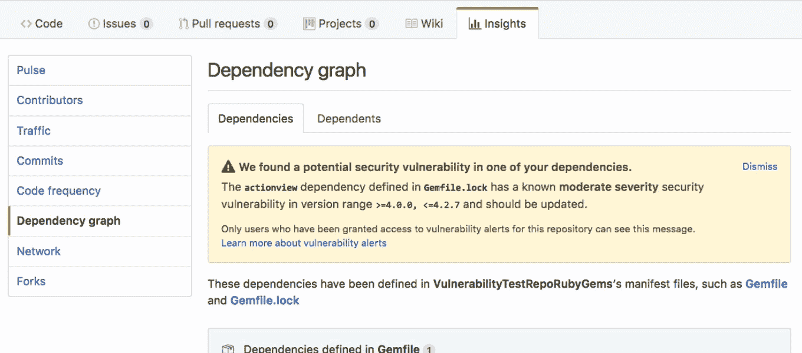

# GitHub 应用机器学习来提醒你的项目依赖

> 原文：<https://thenewstack.io/github-applies-machine-learning-alert-project-dependencies/>

GitHub 是世界领先的共享代码库，是数百万开源软件项目的家园，从微小的单一功能包到技术世界的编程支柱，例如，哦， [React](https://facebook.github.io/react-native/) ，或者这个叫做 [Linux](https://github.com/torvalds/linux) 的小东西。这意味着，如果你构建软件，你的代码几乎肯定至少依赖于那些便利的 [GitHub](https://github.com/) 托管的开源项目之一。正如我们现在在去年的[左翼联盟](https://thenewstack.io/the-kik-kerfuffle/)灾难后所熟知的那样，这会导致意想不到的后果。

感觉脆弱了吗？

GitHub 的数据和分析团队充分意识到需要管理日益复杂的项目依赖关系，并在互连的开源生态系统中保持代码的安全性，因此增加了两个新功能，旨在提高安全性，并在项目依赖关系的浑水中创造透明度。

## 相互依赖并不那么匿名

这项工作的第一阶段是[依赖图形](https://help.github.com/articles/listing-the-packages-that-a-repository-depends-on/)，于上个月在 [GitHub Universe](https://githubuniverse.com/) 上宣布，并在平台上发布。位于任何 GitHub 存储库的“insights”选项卡下，依赖图显示了您的项目连接到的所有包和应用程序——以及所有依赖于您的代码的项目。而且从来没有离开过你的回购。

依赖图形目前可用于基于 JavaScript 和 Ruby 的项目，Python 将于 2018 年初推出。

## 打开图表

本周， [GitHub 还推出了](https://github.com/blog/2470-introducing-security-alerts-on-github)其安全计划的下一步:一个主动警报系统，每当你的项目的一个依赖项与已知的公共安全漏洞相关联时，它就会主动通知用户。公共回购将通过其依赖关系图自动启用安全警报，但私人回购需要选择加入。默认情况下，管理员将是安全警报的第一响应者，但任何具有 repo 访问权限的人，从个人到整个团队，都可以在 repo settings 下添加为警报接收者。

当针对潜在漏洞触发警报时，通知将突出显示任何受影响的依赖关系。新的安全警报系统最先进的功能是使用机器学习，包括用 GitHub 社区中已知的安全版本(如果存在)进行替换的建议。

[GitHub 负责数据科学和分析的工程经理 Miju Han](https://github.com/mijuhan) 向新堆栈介绍了新功能，她称之为“对我们的客户和用户来说都是一件大事”——既包括它们是如何产生的，也包括公司希望将它们带到哪里。

“我不会说 Equifax 漏洞是一个催化剂，它在我们已经在做这件事的时候突然出现，但它确实展示了当你有依赖关系时，漏洞是如何成倍增加的，”韩说。“这对每个人来说都是个问题。所以我们想知道如何管理这种情况，并希望防止下一个 Equifax，因为这是不可避免的。”

她指出，依赖带来的安全风险正在稳步增长。许多项目很容易就有超过 100 个依赖项，这对一个开发团队来说也是一个很大的工作量。“Equifax 首席执行官指责一名工程师没有做好自己的工作，这就是为什么会发生泄露，但当你的系统依赖于一个人和一个混乱的馈送时，这不是一个安全的系统，”她说。

有了依赖关系图，就可以自动跟踪漏洞，并通过 API 获得信息。该服务还使用[机器学习](/category/machine-learning/)来建议修复易受攻击的软件。

“今天的发布只是这一旅程的开始，但我们完全打算继续朝着完全自我修复系统的梦想前进，在这个系统中，我们不仅可以识别漏洞并提出补救措施，还可以通过智能的数据应用无缝地解决它们。”她说。

而这仅仅是 GitHub 使用机器学习的开始。韩预见到有一天，机器学习可以帮助完成更复杂的任务，甚至有一天可以帮助编写代码。这个“自我完成代码”的梦想，韩承认这是一个遥不可及的事情，一个我们可能在有生之年都看不到的特征。但是基础是有的。

“通过 GitHub，我们可以访问丰富的数据世界，我们丰富数据，解析数据，然后对数据进行注释和分解。越来越多地在代码块上抽象信息，而不仅仅是单独的代码行。接下来是提取更多关于这些块如何执行的数据，因此我们有一个代码更容易理解的世界，并让新人来处理它——这将使它更具性能，更安全，”她说。

“有了这种数据应用和自动化，我们不仅可以专注于软件或代码行，还可以专注于想法——创造软件开发的未来。”

Janko Ferli 通过 [Unsplash](https://unsplash.com/photos/YP3WCRJzPOI) 拍摄的特写图像。

<svg xmlns:xlink="http://www.w3.org/1999/xlink" viewBox="0 0 68 31" version="1.1"><title>Group</title> <desc>Created with Sketch.</desc></svg>