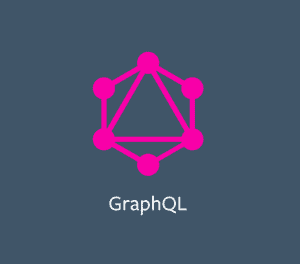
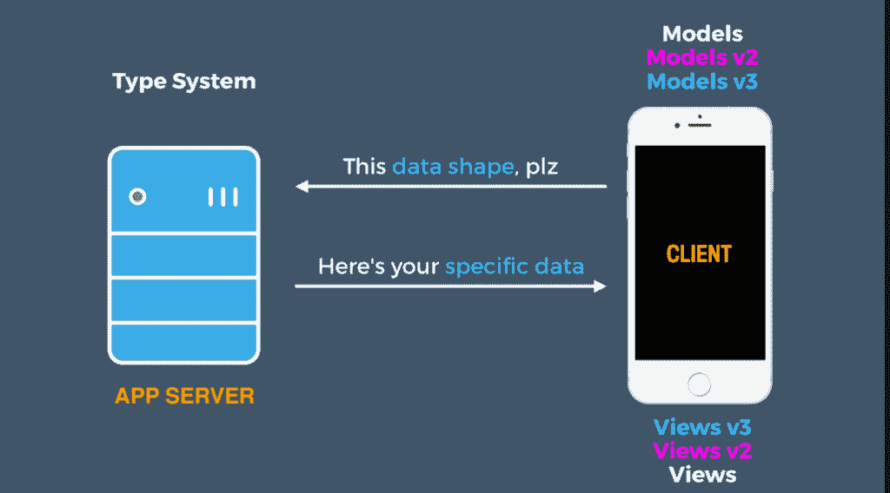
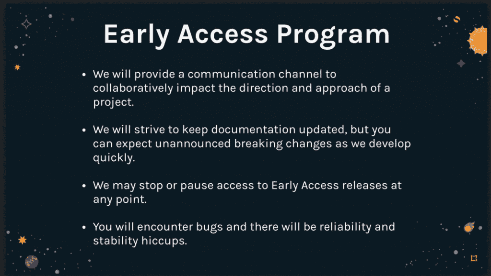

# GitHub 转储脸书 GraphQL 的 REST 调用

> 原文：<https://thenewstack.io/github-dumps-rest-graphql-api/>



`

为了简化网站的远程查询服务，GitHub 正在将其 API(应用程序编程接口)从 REST 调用转移到脸书的 GraphQL API。

在该公司最近的用户大会上，GitHub 平台工程经理 [Kyle Daigle](https://www.linkedin.com/in/kyledaigle) 解释说，该公司在扩展其基于 REST 的服务时遇到了一些问题，给关注预算的开发人员和管理人员带来了很多痛苦。

自从第一个用户向 GitHub 提交代码以来，该公司在过去的九年里呈指数级增长。据 GitHub 首席执行官兼联合创始人克里斯·万斯特拉斯称，现在[每天有超过 10，000 名新用户](https://octoverse.github.com)提交他们的第一个代码。

## REST API

根据一篇宣布切换的博客，REST API 负责 GitHub 数据库层 60%以上的请求。这部分是因为，就其本质而言，超媒体导航需要客户机反复与服务器通信，这样它才能获得所需的所有信息。

用 REST 检索请求的数据可能需要多次 API 调用，尤其是在移动应用程序上。那很贵。因此，设计团队正在寻找一种方法来获得更细粒度的数据回报。

第二个问题变得很明显，因为该公司的服务扩展到满足其需求，超过 600 万用户拥有 25 万个应用程序。REST API 没有提供他们需要的功能，包括保证用户提供的参数的类型安全，生成客户端补丁，以及为他们的代码生成文档。

此外，Daigle 解释说，当有必要对 REST API 进行更改时，他们发现很难知道谁会受到影响，从而导致不必要的后果。

## 测试

稍微调查一下就发现有很多可用的工具。他们认为一个好的测试项目应该是在评论上实现表情符号反应。Daigle 说，“一两个人花了一两周的时间”来创建一个概念证明，用于评估工具。



GraphQL 使用面向对象编程来定位数据请求并减少对服务器的调用。

他们发现的工具之一是 GraphQL，这是脸书在 2012 年开发的，用来解决自己的移动应用问题。[脸书软件工程师、GraphQL 的联合创始人丹·斯查费](https://twitter.com/dlschafer)表示，该团队摒弃了旧的顺序检索数据的方式，创建了一个新的地图，展示了他们希望如何在粒度级别上使用数据。

通过在您的代码中定义对象，您可以发出一个请求来获取您的前三个存储库的名称、它们的星号总数、分叉数、观察器数和开放问题数。

GraphQL 查询代码:

```
{

  viewer  {
    login
    bio
    location
    isBountyHunter
 }
}

```

返回结果:

```
{
  "data":  {
  "viewer":  {
  "login":  "octocat",
  "bio":  "I've been around the world, from London to the Bay.",
  "location":  "San Francisco, CA",
  "isBountyHunter":  true
  }
  }
}

```

这种在粒度级别请求数据的能力将工作流从解析大量 JSON blobs 的限制中解放出来，实现了各种新的可能性。

Daigle 的团队发现 GraphQL 文档简洁，实现服务器也很简单。来自博文:

*利用我们在支持 REST API 方面的经验，我们迅速实现了现有的服务，以便与 GraphQL 协同工作。这包括设置日志记录请求和报告异常、OAuth 和 AuthZ 访问、速率限制以及提供有用的错误响应。我们测试了我们的模式，以确保的每个部分都有文档记录，我们编写了 linters，以确保我们的命名结构是标准化的。*

然后他们进行了测试。戴格尔只有一个词来形容他们的反应:哇。

## **实现 GraphQL**

由于 GitHub 是 GraphQL 的第一个外部商业用户，脸书与 GitHub 工程师密切合作推出了该产品。在前进的基础上，每个 GitHub 新项目都将建立在 GraphQL 上，该团队正在努力改造当前的功能以与 GraphQL 一起工作。

斯查费说，GraphQL 令人兴奋的一部分是它给 GitHub 带来了很多变化。斯查费说，在过去，一旦一个特性被发布，REST API 就必须被添加进去。现在，GitHub 工程师正在努力将旧功能迁移到新的 GraphQL API 平台上。

Daigle 解释说，新的项目功能(也在 GitHub Universe 上推出)是使用 REST API 构建的，但 GitHub 工程师构建了 GraphQL 对象，以便使未来的转换更容易。他说，GraphQL 花了几个小时来构建，但 REST API 花了“长得多的时间”他说，他们很高兴能转向这种新的协议。

“我不希望这成为对 REST 的谴责，”Daigle 说，“但我们现在有不同的需求，GraphQL 可以为我们解决。”

## 想参与进来吗？

GitHub 工程师正在寻找希望参与其中的社区成员。早期接入计划现已推出，他们正在寻求集成商的反馈。Daigle 警告说，这是一个测试版，可能会有错误。

新的 GitHub 社区(也在 GitHub Universe 上推出)将用于跟踪反馈。



GitHub 工程团队还创建了两个新的开源项目来实现 GraphQL:

哇，真的。

专题图片:GitHub 平台工程经理 Kyle Daigle 解释团队对他们的第一次 GraphQL 测试的反应。由 T.C. Currie 拍摄。

<svg xmlns:xlink="http://www.w3.org/1999/xlink" viewBox="0 0 68 31" version="1.1"><title>Group</title> <desc>Created with Sketch.</desc></svg>