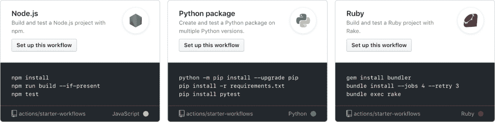

# GitHub 扩展到持续集成和部署

> 原文：<https://thenewstack.io/github-expands-into-continuous-integration-and-deployment/>

鉴于压倒性的用户需求，代码库服务 [GitHub](https://github.com/) 扩展了其 Actions 工作流功能，以包括持续集成和持续交付( [CI/CD](https://thenewstack.io/category/ci-cd/) )功能，旨在帮助用户跨不同平台(包括 Linux、macOS 和 Windows)构建、测试和部署项目。该服务支持 Node.js、Python、Java、PHP、Ruby、C/C++、。NET、Android 和 iOS，以及在容器或虚拟机中运行工作流的能力。

GitHub 产品设计高级总监 [Max Schoening](https://www.linkedin.com/in/max-schoening) 在接受新堆栈的采访时表示，这些功能包括许多你可能期待的 CI/CD 工具的功能，如实时日志或矩阵构建，让你可以并行测试项目的多个版本。

“当我们去年开始构建 Actions 时，我们真正想做的事情之一是构建一些东西，让开发人员以同样的方式重新组合他们的工具，就像我们在编写应用程序代码时站在巨人的肩膀上一样，”Schoening 说。

GitHub Actions 能够从更多的推或拉请求中触发动作；例如，某人第一次加入一个项目或开始一个问题。动作存储在存储库中，并且是可引用的，这意味着您可以像编辑代码一样编辑、重用、共享和派生它们，当然，还可以与其他 GitHub 功能集成，例如 GitHub Package Registry，用户可以访问它和 GitHub 动作。

GitHub 产品管理高级总监 Jeremy Epling 说，CI/CD 到目前为止一直是“相当单一的”，他补充说，GitHub CI/CD 行动可能会带来 GitHub 希望的民主化效果，不仅是代码，还有用于构建和交付代码的流程。

“我们相信，只要把它放在 GitHub 的环境中，人们就会开始以稍微不同的方式思考这些工作流，因为这与他们对开源的看法非常接近，”Epling 说。“因为这些工作流和操作只是存储库中的文件，所以实际上你可以去看看另一个开源项目，你不仅可以使用他们的代码，还可以派生他们的工作流，重用这些工作流，定制它们，并像其他一些项目一样工作。他们中的一些人拥有非常棒、完善的工作系统和流程。”

虽然动作将像网站上托管的任何其他代码一样可重用，但该公司也指出，新用户将根据项目语言和“其他因素”获得建议的工作流程

当 GitHub Actions 去年推出时，一些人指责该公司在 GitHub 市场与自己的合作伙伴竞争，但 Epling 指出，Actions 可以与其他 CI/CD 提供商结合使用。

“我们认为 Actions 不仅仅做 CI/CD，我们还认为它可以与其他 CI/CD 提供商很好地配合。不必非此即彼。他们真的可以同时使用这两种东西，”艾普林说。“同时，会有一些人希望将操作用于 CI/CD，我们的目标是确保我们为选择将操作用于 CI/CD 的客户提供所有功能。”

[GitHub Actions](https://github.com/features/actions) 目前对所有用户都是免费的，并将在 11 月 13 日全面上市时切换到现收现付的定价模式，但对公共存储库仍然免费。GitHub Enterprise Server 客户明年可以期待一个混合选项，用于本地虚拟机的自托管运行程序也即将推出。

来自 Pixabay 的孙静特写图片。

<svg xmlns:xlink="http://www.w3.org/1999/xlink" viewBox="0 0 68 31" version="1.1"><title>Group</title> <desc>Created with Sketch.</desc></svg>