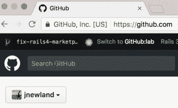

# GitHub 全押在 Kubernetes 上

> 原文：<https://thenewstack.io/github-goes-kubernetes-tells/>

当 GitHub 在 2008 年推出时，该网站运行于 Ruby on Rails 之上。然而，八年后，组织的基础设施已经开始承受世界领先的版本控制库的负荷。GitHub 在许多方面都有巨大的增长，不仅仅是在用户数量和对 github.com 和 api.github.com 的请求率方面。工程人员也增加了，随之而来的是对现场可靠性工程(SRE)团队服务的需求增加。

为了支持其他各种内部计划，SRE 团队越来越多地放弃旨在直接改善 GitHub.com 用户体验的项目。随着 GitHub 服务数量的增加，独立支持每个服务的团队数量也在增加——这意味着站点可靠性团队在服务器维护、供应和其他与其主要任务无关的任务上花费了越来越多的时间。

由于 SRE 团队的可用性，GitHub 的其他工程师受到了限制，甚至行动迟缓。GitHub 首席网站可靠性工程师杰西·纽兰(Jesse Newland)说:“新服务可能需要几天、几周甚至几个月的时间来部署，这取决于它们的复杂性和我们团队的可用性。”。“我们非常需要为这些工程师提供一个自助服务平台，让他们可以在构建新服务时进行试验，甚至部署和扩展它们。”

因此，一年前的 2016 年 8 月，纽兰的团队与平台和开发者体验团队开始了一个联合项目，以评估平台即服务解决方案。开源的 [Kubernetes](/category/kubernetes/) 容器编排引擎，由谷歌开发，由[云本地计算基金会](https://www.cncf.io/)维护，迅速成为主要竞争者。

“Kubernetes 项目是我见过的维护和管理最好的开源项目之一，围绕它的社区非常棒——这个项目的每个角落都有非常棒的人，”Newland 说。“我相信这项技术将帮助其他人以更理智的方式运行项目，不仅是在 GitHub，而是在所有地方。”

## 来到集装箱

这并不是 GitHub 第一次涉足容器领域。“我们已经将它们用于多种用途，如 CI、测试和隔离，但还没有用它们来处理大量生产工作负载，”他解释道。“所以我们有了一些经验，虽然不深。但我们确实对正反两方面都很熟悉——比如 Dockerfile 格式——这当然很有帮助。”

在这个项目的最初阶段，团队决定将组织最关键的工作负载之一的迁移作为目标:github.com 和 GitHub API。纽兰说:这是一个深思熟虑的决定，受到许多因素的影响。其中包括对自助式容量扩展工具的需求、随着时间的推移增加这一特定工作负载的可移植性的愿望，以及对新平台在未来几年内持续存在的愿望。

“鉴于我们选择迁移的工作负载的关键性质，我们知道在为任何生产流量提供服务之前，我们需要建立高度的运营信心，”Newland 说。

## Kubernetes 风格的黑客周

组装了一个小的试验项目来构建 Kubernetes 集群和部署工具，以支持即将到来的 hack week，从而获得一些关于该平台的实践经验。这也是一个合适的场景，让许多不同的团队同时尝试集群和部署 GitHub 对平台的全面组织需求的小规模版本。

纽兰说，这个被称为“黑客周”的活动是一个完美的试验场。这是“一个低风险的实验环境，可以在 Kubernetes 中试验 GitHub 的工作方式，也是我们第一次调查的良好质量标准——因为 hack week 是关于大部分工作的软件的！”然而，更重要的是，该公司的开发人员喜欢有一个可重复的环境来测试他们对所有必要子系统的更改。

简而言之，GitHub 第一次深入 Kubernetes 取得了真正的成功。“我们对这个项目的体验以及在黑客周范围内使用它的工程师的反馈都是非常积极的，并支持扩大这个实验，”纽兰总结道。"有了这个积极的经验，我们开始计划更大规模的推广."

(此外，纽兰说，hack week 成为了“玩”其他 GitHub 应用程序的模式，这些应用程序将受益于一个独立的环境，在必要时按需创建，而不是在一组固定的登台服务器上创建。“根据我的经验，非生产或暂存环境往往会随着时间的推移而逐渐腐烂，因为它们没有得到真正的维护或重视，至少在您需要它们的时候是这样，这可能会导致各种各样的问题，”Newland 说。“因此，我们很高兴能够在整个 GitHub 中将这种模式应用到任何对预生产测试环境有类似需求的应用程序中。”)

## 这条路是由建筑造成的

该团队没有为整个 Kubernetes 迁移建立一个固定的时间表，而是采取了一种以成就为导向的方法。我们的目标是在现有的性能和错误率的相对目标范围内进行迁移，而不是对任何完成期限做出硬性承诺。

“我们或多或少地知道我们想去哪里，在这个过程中选择了一些接近的目标，并提出了猜测的日期，只是为了给团队提供一些紧迫感，”纽兰说。他解释说，这是一种渐进的方法:“微小的实验将少量的流量引导到这个新平台，看看我们是否达到了目标，然后再尝试更大的步骤。”

下一个关键的成就:建立一个“回顾实验室”

“我们知道，我们需要使用 Kubernetes 原语，如 Pods、Deployments 和 Services，来设计、原型化和验证当前由我们的前端服务器提供的服务的替代品，”Newland 说。“一些验证可以通过在容器中运行现有的测试套件来执行，而不是在配置为模拟前端服务器的服务器上运行，但我们还需要建立信心，以确定该容器作为更大的 Kubernetes 资源集的一部分是如何表现的。”

决定构建“审查实验室”——一个基于 Kubernetes 的部署环境，支持对 Kubernetes 和将在其上运行的服务的组合进行探索性测试，类似于现有的 GitHub 环境，称为“分支实验室”。

该团队在 2016 年的剩余时间里建立了审查实验室，并在此过程中交付了多个子项目。其中包括在 [AWS 虚拟私有云](https://aws.amazon.com/vpc/)中运行的 K8s 集群，使用哈希公司的 [Terraform](https://www.terraform.io/) 和 [kops](https://github.com/kubernetes/kops) 的组合进行管理；github.com 和 api.github.com 的档案；YAML 代表了 50 多种库伯内特资源；以及一组测试短暂 Kubernetes 集群的 Bash 集成测试，Newland 将其描述为“在项目开始时大量使用，以获得对 Kubernetes 的信心。”

最终的结果是一个基于聊天的界面，用于为任何拉取请求创建一个相当于 GitHub 的独立部署。“我们对这种环境让工程师能够以自助方式进行实验和解决问题的方式感到非常满意，”纽兰说。他解释说，在内部发布时，审查实验室环境使大量工程师接触到了一种新的部署方式，并通过感兴趣的工程师的反馈帮助站点可靠性团队建立了信心，以及在持续使用期间没有注意到任何变化的工程师的反馈缺失。

## 金属上的 Kubernetes

Review lab 成功启动，Newland 和他的团队在 2016 年假期结束后回来，准备专注于在 GitHub 的物理环境上工作的 Kubernetes 集群，并开始通过流量进行迁移。

“我认为特别有趣的一点是，我们正在金属上运行 Kubernetes 集群——实际的物理机器。Kubernetes 生态系统非常专注于在云提供商上运行，大多数文档都基于此，”Newland 说。“我们面临着在物理数据中心获得可行设计的挑战。有一些前科散布在周围，但我们发现的大多数博客帖子和讨论都是由在家中运行 Kubernetes 集群的人发起的。因此，几名团队成员实际上开始在家里实施 Kubernetes，作为一项实验和一个学习机会。”

“事实上，我自己家里的几台自动化设备现在都是由 Kubernetes 驱动的，”纽兰补充道。

不用说，需要进行一些非常有趣的调整。为了满足 GitHub 旗舰服务的性能和可靠性要求(部分依赖于对其他数据服务的低延迟访问), GitHub 的 Kubernetes 基础设施需要支持该公司物理数据中心和 pop 中的“金属云”。

纽兰的团队小心翼翼地进行着:“在阅读了不下十几遍凯尔西·海托华的《不可或缺》 [Kubernetes 的《艰难的道路》](https://github.com/kelseyhightower/kubernetes-the-hard-way)之后，我们将一些手动配置的服务器组装成一个临时的 Kubernetes 集群，该集群通过了我们用来测试我们的 AWS 集群的同一组集成测试，”纽兰说。

沿着通往移民站的轨道还有几个小站，包括:

*   使用 [Calico 软件定义网络](https://www.projectcalico.org/)提供商提供的开箱即用功能，以 [IP-in-IP](https://docs.projectcalico.org/v2.2/usage/configuration/ip-in-ip) 模式快速交付集群，同时稍后允许探索 GitHub 网络基础设施的对等性
*   构建一个小工具，以 GitHub 内部傀儡和秘密系统可以使用的格式生成每个集群所需的认证机构和配置。
*   以一种允许用户提供已经配置好的集群名称以便在供应时加入的方式来管理两个实例角色的配置——Kubernetes 节点和 [Kubernetes API 服务器](https://kubernetes.io/docs/admin/kube-apiserver/)。
*   构建一个小型的基于 Go 的服务来使用容器日志，将键/值格式的元数据附加到每一行，并将它们发送到主机的本地 Syslog 端点。
*   增强 GitHub 的内部负载平衡服务以支持 [Kubernetes 节点端口](https://kubernetes.io/docs/concepts/services-networking/service/#type-nodeport)服务。

“所有这些艰苦工作的结合导致一个集群通过了我们的内部验收测试，”纽兰说。他说，鉴于此，该团队有理由相信，相同的输入集(审查实验室使用的 Kubernetes 资源)、相同的数据集(通过 VPN 连接的网络服务审查实验室)和相同的工具将产生类似的结果。

他总结道:“在不到一周的时间内，我们能够将整个工作负载从运行在 AWS 上的 Kubernetes 集群迁移到运行在我们的一个数据中心内的集群，其中大部分时间用于内部沟通和排序，以防迁移产生重大影响。”。

## 最后的倒计时

在 GitHub metal cloud 上创建了一个成功且稳定的组装 Kubernetes 集群的模式之后，是时候开始减轻 GitHub 前端服务器的部分负载了。

“在 GitHub，工程师们通常会通过创建一个展示新功能的 Flipper 功能来验证他们正在构建的新功能，然后在可行时选择使用它，”Newland 说。在增强了部署系统以将一组新的 Kubernetes 资源部署到与现有前端服务器并行的 Github-production 名称空间之后——并且增强了 Github 负载平衡器以支持基于受 Flipper 影响的 cookie 将员工请求路由到不同的后端——该团队允许 Github 员工选择进入一个实验性的 Kubernetes 后端。

“来自内部用户的负载帮助我们发现问题，修复错误，并开始建立信心，”纽兰说。“我们还将少量流量路由到该集群，以证实我们对负载下的性能和可靠性的假设，从每秒 100 个请求开始，后来扩展到对 github.com 和 api.github.com 的请求的 10%。”

一些问题出现了，包括将集群与 GitHub 现有的负载平衡基础设施集成。“运行高可用性集群的文档掩盖了这种实现中负载平衡器的必要特征——这不是一个缺陷，只是不是一个经常使用的东西，”他说。“我们正在绘制新的水域图，并且正在更具体地理解这个问题。当我们这样做时，我们希望与社区分享。”

该团队准备将 100%的流量路由到 Kubernetes，他们选择在每个站点的多个集群上运行 GitHub 的前端操作，自动将请求从不健康的集群转移到其他健康的集群。“因此，我们没有将所有鸡蛋放在一个 Kubernetes 集群中，而是与几个集群一起运行——这样，如果出现任何问题，我们只会失去一部分当时应该为请求提供服务的服务器，”Newland 解释说。“我们改变了设计，以便能够在我们测试中发现失败的领域提供合理的服务。”

最终，从内部到外部 Kubernetes 的过渡持续了一个月，同时将性能和错误率小心地保持在目标范围内。“我在这里是因为我喜欢解决问题，”纽兰说。"但我也对不创造任何不必要的新东西感兴趣."

## 人类的角度

“作为一名网站可靠性工程师，我的愿望是构建工具，让软件开发人员比我更有创造力——构建有创造力和创新性的解决方案，然后帮助其他人在 GitHub 上使用它们，”纽兰总结说。“这个项目让我深受鼓舞——我们设置的审查实验室环境使我们的工程师能够自己尝试新事物和实验，而以前他们需要等待 SRE 团队的帮助。他们不再受 SRE 员工数量的限制。我们已经看到工程师们尝试用不同的方法来替换我们软件栈的大块——审查实验室和 Kubernetes combo 使他们不仅能够自己做到这一点，而且超越了 SRE 团队可能想都没想过的事情……”

“我已经可以看到迁移到 Kubernetes 如何在 GitHub 创造一个更快速创新的环境——这种创新将使用户受益，并最终使整个软件行业受益。”

<svg xmlns:xlink="http://www.w3.org/1999/xlink" viewBox="0 0 68 31" version="1.1"><title>Group</title> <desc>Created with Sketch.</desc></svg>