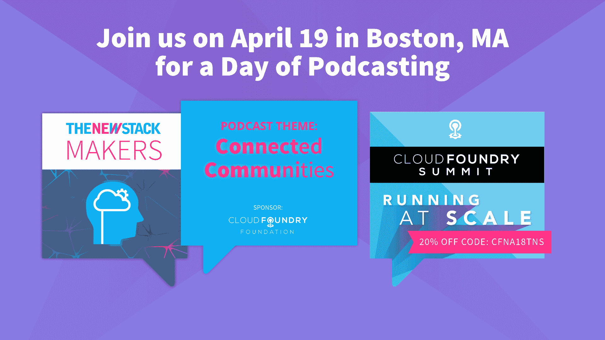

# GitHub 预测 2018 年最热开源趋势

> 原文：<https://thenewstack.io/github-predicts-hottest-2018-open-source-trends/>

作为世界上最大的开源项目库，GitHub 处于一个独特的位置，可以见证开发人员在做什么。GitHub 工作人员最近筛选了该网站 2017 年的数据，以确定他们预测将在 2018 年蓬勃发展的[顶级开源趋势](https://github.com/blog/2499-open-source-project-trends-for-2018)。

数据集:来自 200 多个国家的 2400 多万人参与了 GitHub 项目，涉及 2500 多万个存储库。通过分析整个网站上天文数字的活动量——包括贡献者、访问者和明星活动——GitHub 研究人员能够说出他们预计在 2018 年看到的开源项目趋势。其中包括跨平台开发、深度学习和支持技能发展的资源——这些发现得到了 2017 年最受欢迎项目、脸书的 [React](https://reactjs.org/) JavaScript 库和谷歌的 [Tensorflow](https://www.tensorflow.org/) 机器学习框架的支持。

根据 GitHub 公布的调查结果，该公司研究了三种不同类型的活动。它确定了 2016 年至少有 2000 名贡献者、2017 年贡献者增幅最大的前 100 个项目。它还确定了 2017 年项目回购访问量增幅最大的前 100 个项目。它还确定了 2017 年获得最多新星的前 100 个项目。结合这些列表，该公司将项目分组为广泛的社区，寻找列表顶部最具代表性的社区。

那么，2017 年最热门的项目和社区结果将合乎逻辑地预示未来一年的增长领域和趋势。这就是出现的情况:

*   跨平台开发:专注于跨平台 web 开发的项目经历了最大的活动增长。最受关注的项目与 [Angular](https://angular.io/) ，React 和[electronic](https://electronjs.org/)有关，所有这些项目在 2017 年吸引了更多的访问者和贡献者。特别是， [Angular/angular-cli](https://github.com/angular/angular-cli) 在过去的一年中，其贡献者基础增加了一倍多。
*   深度学习:TensorFlow 的访客数量在 2017 年也增加了一倍多，而 [TensowFlow/models](https://github.com/tensorflow/models) repo 的访客数量增加了五倍多。 [Keras](https://keras.io/) 和 Mozilla[deep speech](https://github.com/mozilla/DeepSpeech)的贡献和访客也有显著增长。
*   1337 学习:支持职业发展和/或技能发展的项目——其中许多项目于 2017 年启动——是去年 GitHub 中最受关注的项目之一。“学习编码”教育项目，为工程师/开发人员工作面试准备实践资源，以及不同语言和技能(如项目管理)的最佳实践指南都非常受欢迎。
*   集装箱化: [Docker](https://www.docker.com/) 和 [Kubernetes](https://kubernetes.io/) 都是 2017 年越来越受关注的焦点。在众多贡献者的排名中，Docker 是 GitHub 上所有项目的前十名之一，而 K8s 则是“最多评论的项目”类别的前十名——事实上，也是去年 GitHub 上讨论最多的项目。

《新堆栈》采访了 GitHub 的项目总监 Miju Han，以了解更多关于趋势报告的信息——以及我们这些在 Gitiverse 的人如何利用这些信息。

**是否有计划在 2019 年再次回顾，看看预测是否符合目标**？

我们很乐意做后续报道。我们将继续从多个角度投资数据——我们将开始讲述越来越多关于 GitHub 的故事视为我们的责任，特别是因为我们知道变化是技术的永恒。

**我们可以用哪些有用或实用的方法来应用这些信息**？

嗯，发展最快的社区通常也有蓬勃发展的社区，我们知道这是开始为开源项目做贡献的最大吸引力之一。因此，这是识别潜在的开源领域的一种方式。

求职者可能会对越来越受欢迎的面试资源特别感兴趣，比如杨顺泰的[科技面试手册](https://github.com/yangshun/tech-interview-handbook)或约翰·沃沙姆的[编码面试大学](https://github.com/jwasham/coding-interview-university)，这些资源的增长令人瞩目。这个项目的发展部分反映了 GitHub 日益国际化的受众，我们看到他们每天都在增加——它目前被翻译成 5 种语言，还有 17 种语言正在翻译中！无论求职者是否正式学习过计算机科学，获得开发工作的资源比以往任何时候都要多。

然后，从招聘等式的另一面来看，许多雇主寻求创建开源网站，以此来跟上新技术的发展，并创建招聘渠道。有趣的是，我们的列表中包含了许多开源项目，当然，这些项目都来自微软、苹果、Airbnb、脸书、谷歌、Mozilla 和 GitHub 等公司。其他想做同样事情的公司可以从他们的书上记下来。

与此同时，由企业发起的开源项目是一种越来越重要的方式，可以让人们更容易获得尖端技术。从苹果的 Turi Create 的 README.md 中拿一个例子:“你不必是一个机器学习专家，就可以在你的应用程序中添加推荐、对象检测、图像分类、图像相似性或活动分类。”

**你认为 GitHub track 展示的趋势与全球科技领域的趋势**有多接近？

GitHub 上的活动是技术发展的一面镜子。我们增长最快的列表包括当今最重要的技术趋势，如机器学习和集装箱化。我们还可以看到一个更大的故事，随着跨平台开发和设计的重叠和显著增长，移动在设计数字体验中的作用越来越大。

有趣的是，这是从 2016 年到 2017 年的增长。如果问题只是“2017 年哪个空间的新项目最多？”我们肯定会看到大量加密货币的存在，这可以说是我们列表中唯一缺失的技术趋势。

**从调查中你最喜欢的收获是什么**？

值得注意的是，一些发展最快的项目也是一些最大的项目。事实上， [TensorFlow/models](https://github.com/tensorflow/models) 在 2017 年的访问量是 2016 年的 5.5 倍，这充分说明了机器学习在今天的重要性，更不用说 TensorFlow 在过去两年的成功了。

Node.js 仍然是增长最快的社区之一，这一事实进一步证明了它将存在很长时间！

<svg xmlns:xlink="http://www.w3.org/1999/xlink" viewBox="0 0 68 31" version="1.1"><title>Group</title> <desc>Created with Sketch.</desc></svg>