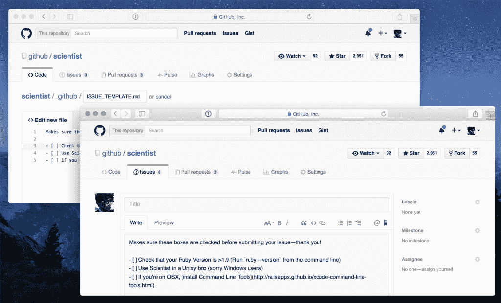

# GitHub 回应用户对问题跟踪的不满

> 原文：<https://thenewstack.io/github-responds-user-dissatisfaction-issue-tracking/>

作为对上周由 600 多名项目维护者签名的[公开信](https://github.com/dear-github/dear-github)的明显回应，托管 Git 资源库 [GitHub 已经更新了](https://github.com/blog/2111-issue-and-pull-request-templates)问题和拉请求的模板。

“当重要细节缺失时，很难解决问题。现在，项目维护人员可以为问题添加模板，并将请求拉至项目，帮助贡献者在线程开始时添加正确的细节。这是我们根据社区反馈对问题和请求进行的许多改进中的第一项。”GitHub 产品经理 Ben Bleikamp 写道。

“如果你担心你的项目根目录会变得混乱，我们还增加了对. github/ folder 的支持。您可以将 CONTRIBUTING.md、ISSUE_TEMPLATE.md 和 PULL_REQUEST_TEMPLATE.md 文件放入。github/然后一切都会按预期运行。[查看文档](https://help.github.com/articles/helping-people-contribute-to-your-project/)了解关于该功能的更多信息，”Bleikamp 写道。

新的 GetHub 模板

GitHub 还推出了一些其他新功能。本周，[存储库上传](https://github.com/blog/2105-upload-files-to-your-repositories)得到了升级，使得加载存储库像在你的博客上放照片一样简单。

“你很快就可以跳过命令行，直接将文件上传到你的存储库，而不必离开浏览器，”产品设计师 Aaron Shekey 说。

这封“亲爱的 GitHub”信以其克制和合理的建议而闻名，上个月在[黑客新闻](https://news.ycombinator.com/item?id=10904671)上获得了 463 个回复，以及更多关于额外修改的建议。他们说，在等待这些问题的进展多年后，作者终于公开了他们的投诉。

这封信列举了许多限制用户高效工作的问题，并提供了潜在的解决方案。作者列举了可用于跟踪项目缺陷的[问题](https://guides.github.com/features/issues/)功能的许多缺点，包括不能提供足够的信息。此外，问题和拉请求通常是在不遵守 CONTRIBUTING.md 投稿指南的情况下创建的。

GitHub 的基础设施不是开源的，因此不允许项目维护人员自己进行修改。

第二天，GitHub 的社区主任 Jono Bacon 感谢了发帖者的建设性批评，并承诺会研究他们的请求。

“显然，我不能做出任何坚定的承诺，因为我不在产品团队中，但我可以确保这一点得到正确的关注。我还想和我的同事一起探索我们如何能够对未来的功能和开发计划更加清晰，看看我们是否可以减少一些模糊性，”培根写道。

用户很高兴看到来自 GitHub 的一些回应，根据评论，这在过去是缺乏的。培根立刻被认出来了。

“不是任何人，”malexw 说。" Jono 写了一本关于建立开发者社区的书:【http://www.artofcommunityonline.org/ "

rjtobin 插话说，“很久以前，他还创建并主持了一个精彩的 Linux 播客:【http://www.lugradio.org/”

然而，对看到实际进展的怀疑仍然存在，而且不仅仅是在评论线程上。Julian Dunn，Chef 的产品经理，在几天后写了一封回复“亲爱的 GitHub”的信[,解释为什么他们不太可能看到任何回复。](http://www.juliandunn.net/2016/01/14/dear-dear-github-from-your-local-friendly-product-person/)

“如果我是 GitHub 的产品经理，对你的请求的回答可能是‘不’，这并不是因为我认为你的功能请求不合法。这是因为它们对付费用户的影响不是很大。作为一家开发者必须吃饭的公司，GitHub 很可能会优先考虑这些客户。”

## **GitLab 跳入**

GitLab 的产品副总裁 Job van der Voort(GitLab 与 GitHub 一样提供托管 Git 帐户)利用这个机会[解决了在致 GitHub 的公开信中提到的每一个问题](https://about.gitlab.com/2016/01/15/making-gitlab-better-for-large-open-source-projects/)，并解释了 Git lab 如何已经提供了项目维护者正在寻找的解决方案。

“我们希望 GitLab 成为任何软件项目的最佳场所，无论开源与否，无论规模大小。

[GitHub 开源社区的信](https://github.com/dear-github/dear-github)显然不是写给我们的，但是我们对信中提到的问题想了很多。我们看到了许多这样的事情发生，并且已经为之努力了很长时间，不仅仅是因为我们自己开发了一个繁忙的公共问题跟踪器。"

GitLab 社区版有一个名为“[让 GitLab 成为大型开源项目的最佳场所](https://gitlab.com/gitlab-org/gitlab-ce/issues/8938)”的新问题

但是 GitHub 已经加快步伐，为问题和拉请求提供模板，这是亲爱的 GitHub 信中的一个关键问题。

由 [T.C. Currie](http://www.tccurrie.com) 拍摄的特写图片。

<svg xmlns:xlink="http://www.w3.org/1999/xlink" viewBox="0 0 68 31" version="1.1"><title>Group</title> <desc>Created with Sketch.</desc></svg>