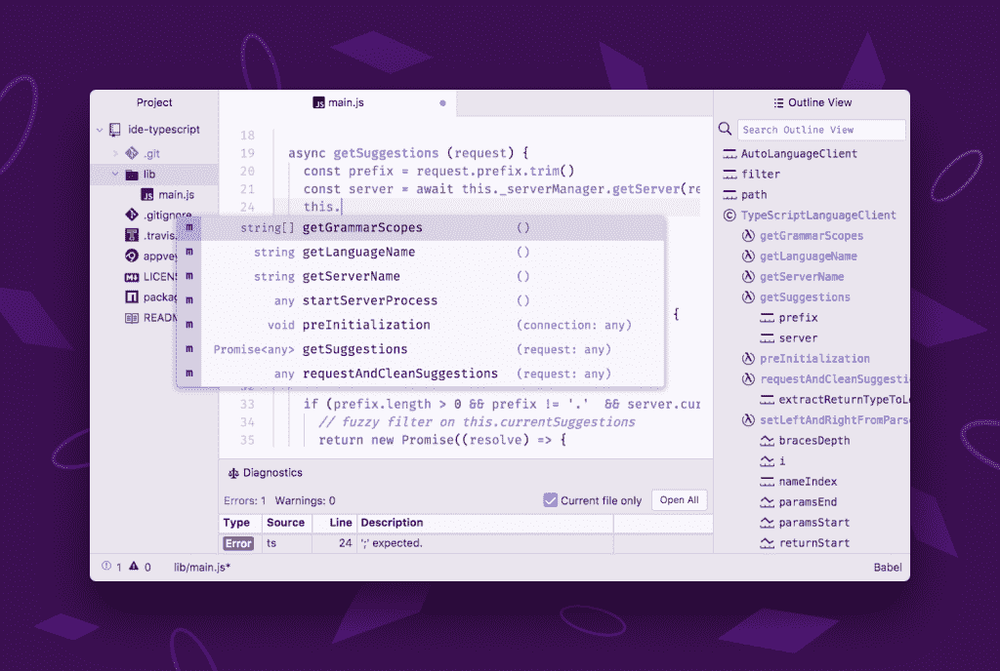

# GitHub 的 Atom 文本编辑器获得了完整的 IDE

> 原文：<https://thenewstack.io/githubs-atom-text-editor-gets-full-ide/>

本周带来了一种新的方式来提高你的 git:[GitHub](https://github.com/)宣布发布 [Atom-IDE，](https://atom.io/packages/atom-ide-ui)一套旨在为 [Atom](https://atom.io/) 带来 IDE 风格功能的包。作为 GitHub 的定制开源文本编辑器，Atom 是一个桌面应用程序——由 HTML、JavaScript、CSS 和 [Node.js](https://nodejs.org/) 集成构建——运行在 GH 的 [Electron](https://electron.atom.io/) 框架上。

从学生到专业人员，Atom 已经是所有开发人员的首选工具。其直观的用户界面，几乎与 GitHub 融合的 Vulcan-mind 级别的集成，以及易用性吸引了新的程序员——或者任何其他想直接开始工作的人。Atom 跨操作系统工作，并提供了方便的内置特性，如智能自动完成和内置的包管理器，开箱即可工作。对于那些有特殊需求的人或者喜欢摆弄配置文件的人来说，Atom 还被设计成完全可黑客化，呃，完全可定制的。

现在是 Atom-IDE，它将一些最新、最有用的功能打包在一起，实现便捷的一站式购物。

Atom 工程经理 Ian Olsen 表示:“今天的发布是 Atom 迈向更一流 IDE 功能的第一步。它包括与五种语言服务器的现成集成，适用于使用 Javascript、Typescript、Flow、C#、Java 和 PHP 的开发人员

Atom workspace 旨在高度可定制，以满足任何开发人员的独特需求。鉴于围绕 Atom 的强大开源社区已经贡献了数以千计的附加特性和功能，Atom-IDE 有什么不同之处呢？最根本的答案是，在表面之下没有什么真正新的东西。但是作为基础模型的一组精选附加包，Atom-IDE 可以节省时间。

“Atom 长期以来跨越了文本编辑器和成熟的 IDE 之间的界限。它的超模块化体系结构允许想要 IDE 功能的用户拥有它，而不会牺牲那些不想要的用户的体验，”Olsen 解释道。也就是说，将 Atom 配置为完全集成的开发环境确实需要时间和设置。因此，GitHub 团队设计了 Atom-IDE，将最受欢迎的功能方便地预打包到一个易于携带的包中。

你会问盒子里是什么？更智能的上下文感知自动完成，加上大量的代码导航功能，包括大纲视图，转到定义并找到所有参考资料。还包括其他方便的功能，如悬停显示信息、错误和警告(诊断)以及文档格式化。

用于类型脚本的 Atom-IDE 用户界面

Olsen 说:“Atom IDE 为 Atom 添加了 IDE 用户所期望的深层语言意识。“使用此版本中包含的丰富工具，开发人员可以提高工作效率。所有让生活更简单的东西:自动完成、自动格式化、代码大纲视图和诊断错误视图。”

最重要的是，Atom-IDE 利用语言服务器的能力为您的代码和项目提供深入的语法分析。你可以将 GitHub 添加到已经采用了[语言服务器协议](http://langserver.org/)的组织列表中——包括[微软](https://www.microsoft.com/)、 [Eclipse](https://eclipse.org/ide/) 、 [SourceGraph](https://sourcegraph.com/) 、 [Palantir](https://www.palantir.com/) 、[红帽](https://www.redhat.com/en)和[脸书](https://www.facebook.com/Engineering/)。(由微软创建，LSP 为编程语言分析器定义了一种通用语言，以便在客户机和服务器之间进行交流。)

开始使用 Atom-IDE 很简单。用户可以利用 Atom 的“安装包”对话框(设置>安装包和主题)来搜索并安装 [atom-ide-ui](https://atom.io/packages/atom-ide-ui) 包，以建立 ide 用户界面。之后，就是识别和安装您选择的 IDE 语言支持包的问题了:

*   typescript 和 JavaScript([IDE-TypeScript](https://github.com/atom/ide-typescript/)):Atom-IDE 的 TypeScript 包利用了微软的 TypeScript 服务器，封装在 SourceGraph 团队维护的语言服务器协议中。
*   Olsen 说:“我们在脸书的好朋友已经发布了 [ide-flowtype](https://github.com/flowtype/ide-flowtype) ，为 Atom 带来了流类型注释系统的强大功能。
*   C# ( [ide-csharp](https://github.com/atom/ide-csharp/) ):语言服务器的最早例子之一是用于 C#语言的 OmniSharp。GH 利用 node-omnisharp 包为 Atom for C#带来了许多类似 IDE 的特性。
*   Java([ide-Java](https://github.com/atom/ide-java/)):Atom 团队在 Eclipse foundation 和 Red Hat 奠定的语言服务器基础上构建了 Java 包。你将需要安装一个 Java 8 运行时来运行，然后就可以享受更丰富的编辑器设施。
*   PHP ( [ide-php](https://github.com/atom/ide-php/) ):它利用 FelixFBecker 的 [PHP 语言服务器来提供对 PHP 脚本语言的支持。(需要安装 PHP 7 运行时)。](https://github.com/felixfbecker/php-language-server)

(要使用 Atom-IDE，需要 Atom 1.17+。GitHub 建议使用 Atom Beta 1.21，它附带了所有必要的进程控制和文件监控，以确保语言服务器按照预期运行。也就是说，基于[语言客户端](https://github.com/atom/atom-languageclient)的包应该在安装了 atom-ide-ui 的情况下开箱即用。)

## 合作的努力

在开发 Atom-IDE 的过程中，GitHub 团队与脸书的工程师密切合作。奥尔森说，这是一个互利的安排。“脸书的核素团队在 Atom 中构建 ide 功能方面有多年的经验，因此获得他们的帮助是显而易见的，”他说。[毕竟，核素](https://nuclide.io/)已经存在了——一个建立在 Atom 之上的包，用来支持使用 [React Native](https://facebook.github.io/react-native/) 、Flow 和 [Hack](http://hacklang.org/) 的项目。

“他们很高兴将核素最引人注目的部分带给更广泛的受众，GitHub 的 Atom 团队也很高兴能够获得他们的专业知识，”Olsen 说。

## Atom-IDE 的下一步

Atom-IDE 即将推出:更多语言！也就是说，在开源社区的帮助下。

“这五个只是开始；我们计划在社区的帮助下，扩大 Atom-IDE 可以支持的语言数量，”Olsen 说。“我们希望支持所有优秀的语言，包括 [Rust](https://www.rust-lang.org/) 、 [Go](https://golang.org/) 、 [Python](https://www.python.org/) 等。”

同时，如果您最喜欢的语言还没有得到支持，但是已经有了支持它的语言服务器，那么您可以——通过开源软件的魅力——实际上创建自己的 Atom-IDE 包！GitHub 提供了 [atom-languageclient npm 库](https://github.com/atom/atom-languageclient)来提供主要特性的通用自动连接，以及下载支持文件和转换等辅助工具。

GitHub 还希望下一步能得到支持，使 Atom-IDE 成为真正的 IDE:实际上将应用程序的运行和编辑置于 Atom 的保护之下。所以赶快行动起来，检查一下，开始黑吧。我们指的是工作。

<svg xmlns:xlink="http://www.w3.org/1999/xlink" viewBox="0 0 68 31" version="1.1"><title>Group</title> <desc>Created with Sketch.</desc></svg>