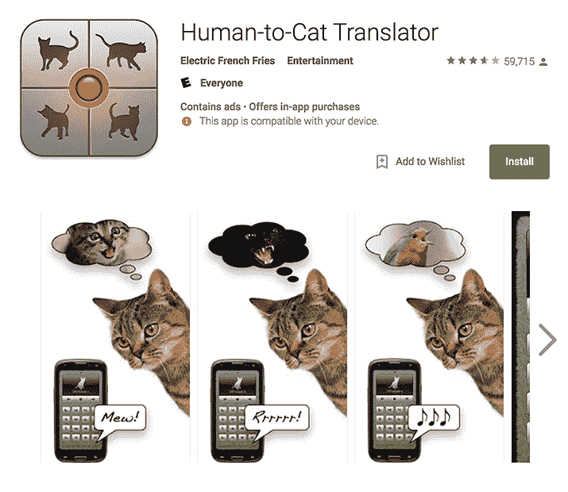

# GitHub 有了新的桌面客户端。我们应该关心吗？

> 原文：<https://thenewstack.io/githubs-got-new-desktop-client-care/>

上周，GitHub 推出了桌面 1.0(T1)，这是一款围绕 CLI 工作流程设计的 GUI 门户应用，受到了绝大多数 GitHub 用户的青睐。新的桌面客户端是对原始 GitHub 桌面客户端的彻底检查，在[电子](https://github.com/electron/electron)，GitHub 的开源框架与 JavaScript 后端和 [Chromium](https://github.com/ChromeDevTools/devtools-frontend) 前端上从头开始重建。

开发界的反应是集体“是啊，不管怎样”耸耸肩，然后继续推命令行代码。

我承认我也是一个失败者。我不认识一个使用 GitHub 桌面的开发者，不管是老的还是新的。但在我最初下意识地拒绝了上周二的声明后，我突然想起了开发这款应用的开发人员。当然，是某个地方的一些开发者费力地给我们带来了像 [Man Poke](http://thetechgeek.com/appsolutely-stupid-man-poke/) 和 [Human To Cat Translator](https://play.google.com/store/apps/details?id=com.electricfrenchfries.htct.free) 这样完全无用的应用。但这是 GitHub！当然，它的内部开发团队一定对开发一款能让我们的工作生活更好、更轻松的应用程序略知一二。

所以我决定自己去看一看:下载 GitHub Desktop 1.0，看看它能做什么。对此我并不是一个完全的 00b，因为我第一次玩 GitHub 的时候，我基本上是被 GitHub 玩回来的——这个网站强迫第一次使用它的用户下载客户端。(我尽职尽责地这么做了，只不过那时候它是最初的 Mac 风格的原生桌面应用程序)。它在我的硬盘上逗留了一两天，但即使是超级初学者我也更喜欢 bash，而且我从未回头。

## 为没有 Linux 支持的程序员制作一个工具，srsly？

伴随任何新事物的通常是黑客的仇恨，桌面 1.0 上的词是缓慢，臃肿，像我的孩子狼吞虎咽馅饼一样狼吞虎咽。所以，进去的时候，我在站岗。但是，一旦用它动手，发现自己又惊又喜。这是一个简洁的小 Git 客户端，紧凑且启动相当快。使用量确实迅速攀升至 120MB，但随后稳定下来。这似乎有点过分，但 Slack——也是一个电子应用程序——在我的机器上消耗了超过 500MB。此外，与 Slack 不同，当 GitHub Desktop 1.0 在后台空闲时，几乎不使用任何 CPU。

我不会浪费你或我的时间来详细描述 UX。你可以自己试试，你会喜欢或者不喜欢。或者像我一样，你会非常喜欢桌面应用程序，但是看不到它如何适合你自己的个人工作流程。

不过，有几个我很喜欢的便利功能。最重要的是在请求被合并到存储库时查看请求的能力，桌面客户端在通常的 GitHub 浏览器界面上简化了这个过程。此外，我喜欢我可以直接从浏览器一键克隆回购，当我这样做时，桌面客户端礼貌地打开。桌面 1.0 中对差异的视觉检查也有了很大的改进。说到桌面，我希望有一个实用程序可以在出现问题、代码被推送等时生成桌面通知。—那该多酷啊？—但如果有一个也不明显，至少在我第一次检查的时候，我还没有花时间去挖掘它。

## BYO Linux？

不过，有一件事让我很困惑:鉴于 Desktop 1.0 从 5 月份开始就已经处于测试版，而现在终于是正式版了，我惊讶地发现该应用程序没有 Linux 版本。为没有 Linux 支持的程序员制作一个工具，srsly？开源社区加入进来，因为太棒了，现在至少有一个桌面应用程序的 Linux 版本在运行，这个版本由耿创建。

我可以理解为什么 GitHub 没有投入资源来构建一个 Linux 版本的 GitHub 桌面，至少没有优先考虑。(该公司声称最终会解决这个问题——GitHub 关于这个主题的一个公开问题主题已经被正式标记为“未来工作”但是:基本上，整个 GitHub 都是为程序员构建的，我们大多数人都可以自己完成。也许一个新的、更加用户友好的 GitHub GUI 是为了让其他人也能获得 GitHub 的荣耀:设计师、艺术家和那些对任何类型的编码都不熟悉的人。他们都不太可能在 Linux shell 中工作。

## 那么，桌面 1.0 对 Devs 有什么作用呢？

我决定向 GitHub 客户端应用工程总监[菲尔·哈克](https://haacked.com/about/)询问这个问题。

“即使对于 git 命令行“瘾君子”，我们也认为有一些特性可以补充有经验的开发人员的工作流程，”Haack 告诉我。他本人是一名日常桌面 1.0 用户，并以举例的方式提供了一些自己使用该应用程序的经验:

“通常，我会在我的编辑器和 shell 中工作，编写代码，运行命令来安装包，等等。然后，在某个时候，我需要提交一些不相关的工作。理想情况下，我的提交历史应该讲述我们所做的改变。每个提交应该代表相关工作的逻辑分组——就像代码中的方法应该做一件事情一样。

*Git 有部分提交的概念。如果一个文件有 10 个更改，您可能希望将其中的 5 个更改提交到一个提交中，而将另外 5 个提交到另一个提交中。或者，您可能希望将来自多个文件的更改聚合到一个提交中。在命令行上这样做有点棘手，很难想象所有的变化。*

*GitHub 桌面擅长于此。从 Changes 设置中，开发人员可以看到他们工作目录中的所有更改。他们可以选中要包括的文件，也可以取消选中要从提交中排除的文件。此外，他们可以通过单击来选择特定的变更，以包含或排除特定的变更代码块。很厉害！*

最棒的是，如果我是超级用户，我可能会在 shell 中。为了减少从 shell 到创建提交的摩擦，您可以运行“github”命令。“.”表示当前目录。它可以是存储库的完整路径。GitHub Desktop 将启动并将焦点切换到当前目录，这样开发人员可以快速创建一个 commit 并继续他们的工作。”

## 我们应该关心桌面 1.0 的另一个原因

开发人员不是单独工作的。是的，我们最终负责构建软件，但是开发过程包括各种帮助。并不是所有的都属于技术人员。例如:尽管市场部的人可能很烦人，但他们正努力做好自己的工作，实际销售我们的产品。设计师负责右脑的创意。所以——听我说——也许关心 GitHub Desktop 的另一个原因是因为它是一种帮助他们更好地完成工作的方式，通过友好的 GUI 提供 git 的基本功能。例证:1.0 中的一个新特性是图像差异——非常适合图形设计版本化。

也许可以把 GitHub 的桌面 1.0 看作是一个类似于人类到猫的翻译器的应用程序，只面向非技术人员的开发人员？

重点是，如果 GitHub Desktop 真的能够让 Git-For-every one 至少成为部分现实，那么该应用最终会让开发人员的生活变得更容易——只是不是以你最初认为的方式。的确，我们可能需要提前投入一些实践时间，向各种非技术团队成员展示如何实际使用它。(专业提示:通过向他们展示如何使用表情符号来打破僵局！).

但是:想象一下一个美好的世界的潜在回报，在这个世界中，我们可以开始通过桌面来处理至少一些变更和版本控制，而不是召开另一个会议。我们将永远拥有 CLI。但是也许是时候寻找一个折中的办法，在那里我们可以和团队的其他成员见面。GitHub Desktop 1.0 可能是插上这面旗帜的地方。

<svg xmlns:xlink="http://www.w3.org/1999/xlink" viewBox="0 0 68 31" version="1.1"><title>Group</title> <desc>Created with Sketch.</desc></svg>