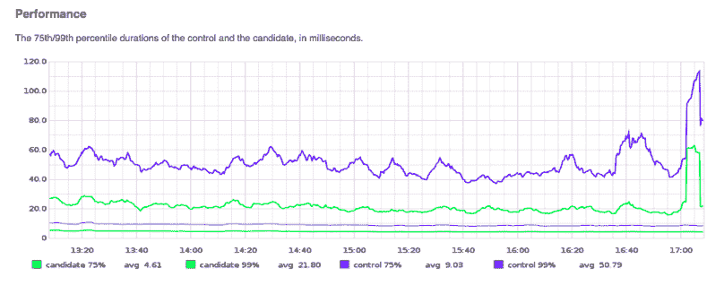

# GitHub 的科学家弱化了更新遗留代码的恐惧

> 原文：<https://thenewstack.io/githubs-scientist-softens-terror-updating-legacy-code/>

每个开发人员都知道恐惧的时刻——从旧系统切换到代码更新的系统。无论运行多少测试，总会出现意想不到的小故障，让客户不满意，让开发人员争先恐后地尽快修复错误。

GitHub 首席工程师杰西·托特(Jesse Toth)说:“当你扳动开关时，这是最可怕的时刻。

周三，GitHub 发布了 [Scientist](https://github.com/github/scientist) 1.0，这是由 Toth 的团队开发的基于 Ruby 的开源工具，旨在解决这个问题。

Scientist 的目标是开发人员，他们在生产中使用遗留系统，并致力于过渡到更现代的系统。它可以用于将大量关键的旧代码转换成更现代的格式，比如将 Fortran 应用程序平滑地移植到 Ruby 中。在正式启用之前，开发人员可以在真实环境中用真实数据测试新代码。

“现在我可以看着它一点一点地变化，所以当按下开关的时候，我可以充满信心地这样做，”托斯说，他已经与科学家模式合作了几年。

当 GitHub 工程师需要重写权限代码时——GitHub 应用程序中最关键的系统之一——科学家诞生了。该系统已经发展到无法再扩展的地步。托特说，随着大数据从传统系统转移到使用更敏捷、更现代代码的系统，有很多公司都面临类似的情况。

科学家提供了生产代码(控制)和测试环境中的代码(候选)之间的差异的度量。该模式包装了两个代码集，以在运行时提供两者之间差异的度量。

GitHub 确实利用了[抽象分支](http://martinfowler.com/bliki/BranchByAbstraction.html)，这是一种架构模式，通过在要交换的代码周围创建一个抽象层来进行大规模的代码更改。然而，这种模式是有限的，根据托斯。“它并不能真正确保新系统的行为与旧系统相匹配，只是新系统将在所有调用旧系统的地方被调用。”

它所做的*而不是*是验证数据或者确认新系统一旦被调用就能正常工作。

输入 Scientist，它围绕候选对象(新代码)创建一个轻量级抽象。这种抽象称为实验，与控件(生产代码)一起运行，在运行时比较两组代码。任何差异都会被记录下来，执行持续时间也是如此，这对系统管理员来说是至关重要的数据。Scientist 为系统管理员和开发人员提供大量信息，但对最终用户不可见。

在《科学家的密码》写作期间，托斯在通勤途中观看了从奥克兰到旧金山的新海湾大桥的建设。她在这两个过程中看到了许多相似之处。

该模式允许测试和 bug 修复与生产代码并行进行，同时确保流量每天都到达目的地。Running Scientist 消除了新代码成功的不确定性。

科学家有很多令人兴奋的事情。首先，它可以双向捕捉虫子。它不仅会向您展示新代码与生产代码的不同之处，以确保新代码按预期执行，还会捕捉源代码中的数据错误。

科学家为传统测试方法无法捕捉的错误提供数据，无论测试写得或执行得有多好。由错误的源数据引起的错误。

一个返回错误数据的科学家实验。

托特在博客中解释道:“既然软件有缺陷，只要有足够的时间和容量，你的数据也会有缺陷。”“数据质量问题可能会导致您的系统以未经测试或明确不属于规范的方式运行…因此，虽然重写系统的测试覆盖率非常重要，但与传统系统的行为相比，系统如何以生产数据作为输入来运行是唯一真正测试其正确性的方法。”

托特说，为了在转换后有信心，这归结于数据。“数据必须正确，数据必须安全。”

此外，科学家不仅处理快乐路径场景，还可以提供异常数据。它足够复杂，只有在异常不匹配时才提供数据(例如，如果生产代码和新代码中的异常行为相同，将被忽略)。

“一旦你有了一些错配数据，”托斯澄清道，“你就可以开始调查个体错配，看看为什么控制组和候选组的表现不一样。通常您会发现新代码有一个错误或者缺少了遗留代码的一部分行为，但是有时您会发现错误实际上存在于遗留代码或者您的数据中。纠正错误来源后，您可以再次开始实验，并重复此过程，直到两个代码路径之间不再有不匹配。”

但是等等，还有更好的。Scientist 是完全可扩展的，并且足够灵活，可以处理小到单个方法，大到像 GitHub 许可代码转移这样的多年项目。

监控运行时使用情况。

GitHub 工程博客上最近的一篇文章， [Move Fast and Fix Things](http://githubengineering.com/move-fast/) 提供了使用 Scientist 简化简短重写的例子。

托特已经在《科学现场》工作了几年，她对打开开关的信心大增。GitHub 的团队希望与其他开发者分享这种信心。

虽然 Scientist 是用 Ruby 编写的，但 Toth 说这种模式可以用在任何语言中。她知道 Node js 和 C#中已经有了一个版本，而. net 版本正在开发中。她对这些翻译感到兴奋，并希望在未来看到更多。

有一些警告。

科学家只提供数据；它不会告诉你做什么或建议修改来修复任何运行时问题。它明智地把这个问题留给了工程师。

它在读操作上最有效，但并不意味着用于任何有副作用的代码。Toth 解释说:“候选代码路径写入与控件相同的数据库，使缓存无效，或者修改影响原始生产行为的数据，这是危险和不正确的。

她还警告说，在生产中使用 Scientist 会影响性能。“新的实验应该慢慢地、小心地引入，并且应该密切监视它们对生产性能的影响，”Toth 建议道他们应该尽可能长地运行以获得信心，而不是让他们无限期地运行，特别是对于昂贵的操作。"

尽管如此，这仍然是令人兴奋的事情。

“我喜欢我能像建造桥梁一样建造软件，”托特说。

她可能已经拆除了几十年的开发人员成年礼，当打开新代码开关时的恐惧感。对于我们 OG 开发者来说，这种经历将会变成一个故事，传递给新来的孩子们，当他们闭上眼睛按下开关时，他们不会感到恐惧。

通过 Pixabay 的特征图像。

<svg xmlns:xlink="http://www.w3.org/1999/xlink" viewBox="0 0 68 31" version="1.1"><title>Group</title> <desc>Created with Sketch.</desc></svg>