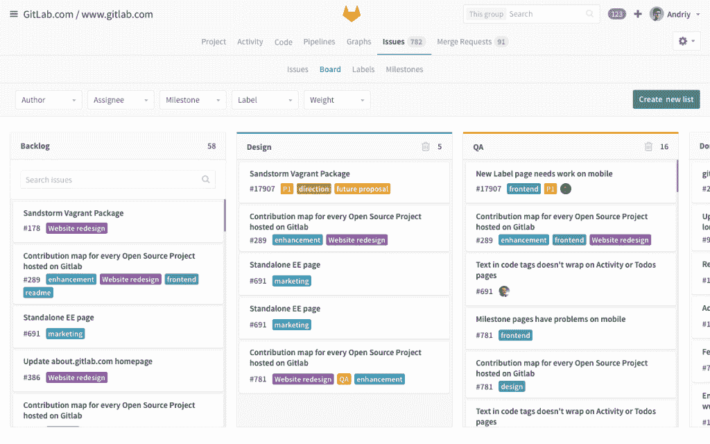
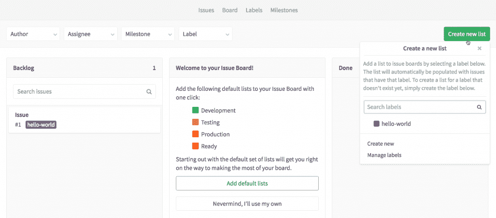
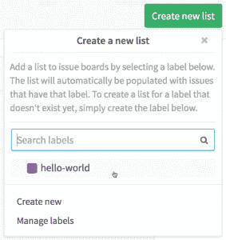

# GitLab 问题板:基于经验构建的项目管理工具

> 原文：<https://thenewstack.io/gitlab-issue-board-project-management-tool-built-experience/>

流程管理是一个与大数据密切相关的话题。像瀑布、Scrum 和敏捷这样的老的开发风格不适合当今持续开发环境中要求的快速发布时间表。工程师、维护人员和项目经理试图将新流程塞进旧系统，就像灰姑娘的继姐妹试图把脚塞进玻璃鞋。

与此同时，工程师们正在看 GitHub 等网站上针对个人项目的自动化开源流程管理，想知道为什么他们不能在日常工作中使用这一流程。

GitLab 的内置问题板提供了一种管理问题的新方法。您的问题以卡片的形式显示在白板上，这样您可以更容易地看到您的功能或产品发布。

现在你可以了。本周，GitLab 发布了新的发行版。使用 GitLab 的经验开发，其他开源公司使用 [innersource](https://thenewstack.io/github-bloomberg-talk-using-innersource-build-open-source-project-development-behind-company-firewalls/) 流程。发布板是一个软件项目管理工具，[可用于](https://about.gitlab.com/solutions/issueboard/#video-explainer)组织新功能或应用的开发。

## 内源反馈发行板功能

PayPal、彭博、博世、Autodesk 和 SanDisk 一直在与 GitLab 密切合作，实施 [innersource](https://about.gitlab.com/2016/07/07/trends-version-control-innersourcing/) ，该软件在公司防火墙后使用开源流程。

正如[本月早些时候](https://thenewstack.io/github-bloomberg-talk-using-innersource-build-open-source-project-development-behind-company-firewalls/)报道的那样， [Panna Pavangadkar](https://twitter.com/pannasingh) ，彭博的工程开发人员体验全球主管，自 2014 年在彭博快速跟踪 innersource 以来，一直在收集最佳实践。她一直在与 GitLab 和 [Danese Cooper](https://www.linkedin.com/in/danesecooper) 分享它们，Danese Cooper 是 PayPal[技术人员中的杰出成员，他是该公司内部采购的领导者，并向 Pavangadkar 介绍了这一概念。](https://www.paypal.com/us/webapps/mpp/home)

GitLab 结合了所有 innersource 客户端的最佳实践和 GitLab 在开发问题板时的发布管理经验。但它更进了一步，结合了《国际计算机应用杂志(IJCA)》[2013 年关于有效发布管理流程的研究](http://citeseerx.ist.psu.edu/viewdoc/download?doi=10.1.1.403.1791&rep=rep1&type=pdf)的发现。

这使得问题板是全面的，并且是根据经验而不是理论设计的。多么有趣的概念。

## 那么，问题板是怎么回事呢？

对于刚刚采用 GitLab 或标准化其流程的团队来说，问题板还提供了默认列表，可用于一次点击创建问题板。

GitLab 首席执行官兼联合创始人 [Sid Sijbrandij](https://www.linkedin.com/in/sijbrandij) 表示，一个优势是跨项目的可见性增加。问题板允许相互依赖的开发团队更有效地进行计划。

“对于跨团队来说，只需点击问题卡，打开问题，跟随评论，并查看任何链接的合并请求，就可以更容易地深入到彼此的工作中，”他说。

另一个好处是，当前的 GitHub 和 GitLab 用户会非常熟悉它。Sijbrandij 说:“使用 GitLab 现有的标签功能也意味着你将拥有与产品其他部分相同的过滤和排序能力。”

## 自动化

每个开发团队都有自己的工作流程。发行板是灵活的。团队可以创建列表并在黑板上重新排序，以反映他们的工作流程。

过程的自动化是关键。“列表”代表开发过程中的步骤。“列表”是基于你的标签。"当你创建列表时，相应的问题会出现在列表中."因此，问题板可以解决现有的 GitLab 问题。

更新列表是自动的。“当你在列表之间移动问题时，问题上的标签会自动更新，”Sijbrandij 解释道。“这个新标签显示在问题跟踪器和问题本身上，因此即使您团队中的某个人没有查看问题板，他们也会记录下问题的进展情况。”

## 将这一切结合在一起

GitLab 创建了一个包含从想法到产品的 10 个步骤的列表，对整个软件生命周期过程进行建模:

*   聊天对话→ [Mattermost](https://github.com/mattermost) 搭载 GitLab
*   问题创建→ GitLab 问题
*   计划板→ GitLab 发行板
*   IDE → Koding + GitLab 集成
*   版本控制→ GitLab 存储库
*   持续集成→ GitLab CI 和 GitLab 容器注册表
*   代码审查→ GitLab 合并请求
*   持续交付→ GitLab 部署
*   Chatops →计划与 Cog 一起发货
*   反馈->使用周期分析计划发货

此外，内置的状态报告允许项目中的所有团队成员了解整个过程。

## 想了解更多？

GitLab 将于 9 月 1 日周四举办一场网络研讨会，演示问题板和 GitLab 8.11 的其他新功能。在此注册。

<svg xmlns:xlink="http://www.w3.org/1999/xlink" viewBox="0 0 68 31" version="1.1"><title>Group</title> <desc>Created with Sketch.</desc></svg>