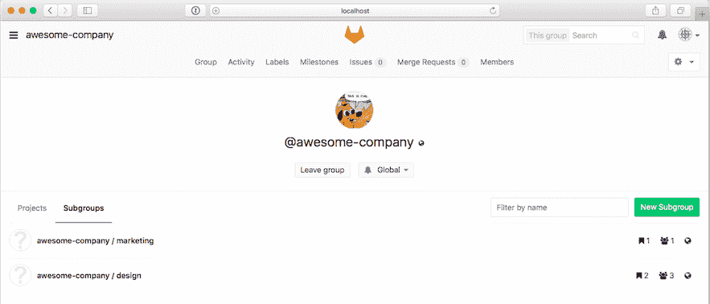
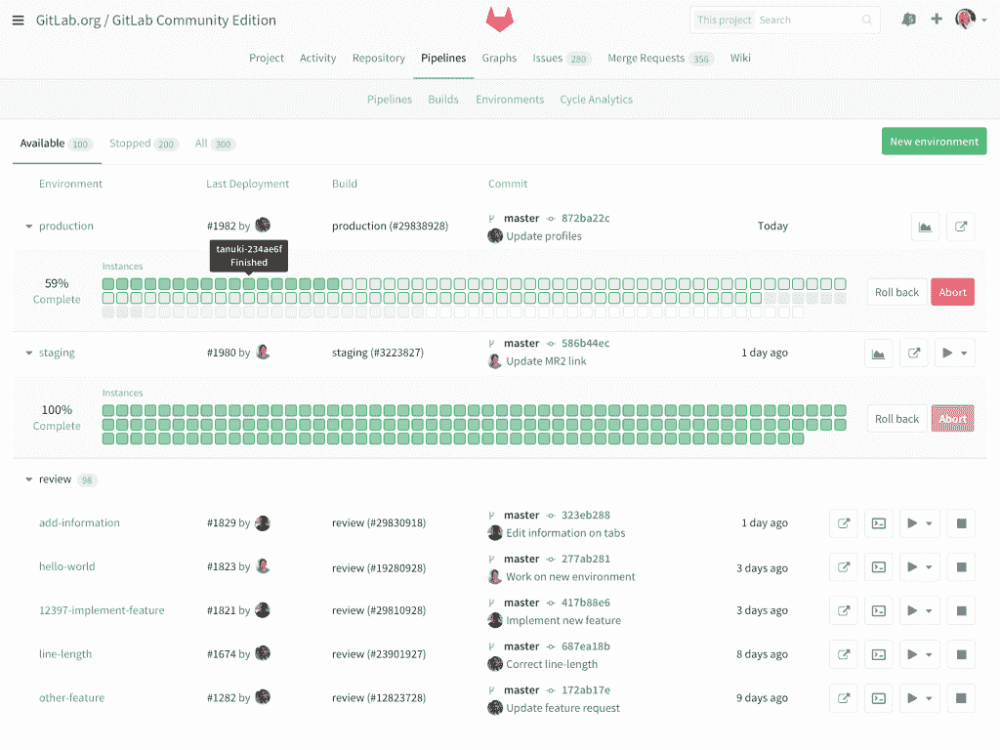
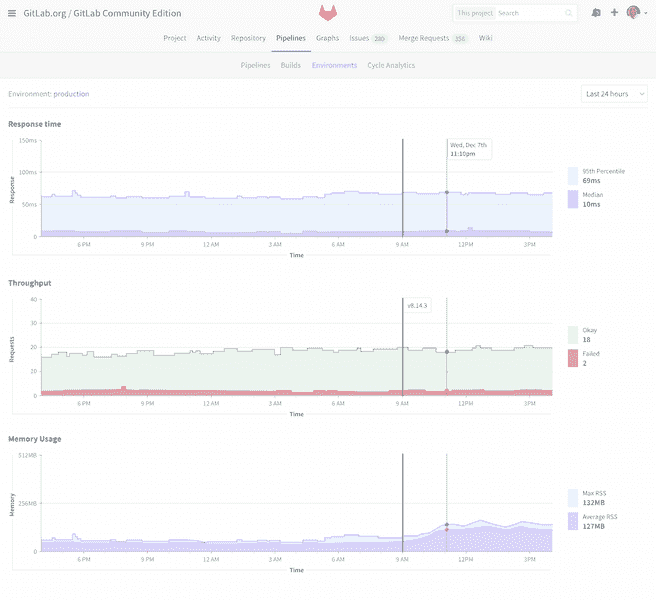

# GitLab 现在提供与 Prometheus 的端到端监控

> 原文：<https://thenewstack.io/gitlab-now-offers-end-end-monitoring-prometheus/>

Git lab[发布了 GitLab](http://www.gitlab.com) 自托管 Git repository manager 的 9.0 版本，其中包含了许多新功能，让用户的生活更加轻松，包括对[普罗米修斯](https://prometheus.io/)监控工具的内置支持。

企业构建产品和组织团队的方式已经发生了巨大的变化，然而他们一直使用的工具并没有以同等的速度发展。“企业迫切需要更好的协作解决方案，提供跨团队的可见性和问责制，以及一个更好的衡量和监控开发过程的公式，”GitLab.com 产品副总裁 Job van der Voort 在一份声明中说。

GitLab 9.0 包含的特性将它的工具包扩展到了应用程序监控，并提供了对特定团队项目的更全面的控制和洞察。具体的新功能和优势包括:

“新建子组”页面

一个新的子群功能将允许大规模的团队创建层次化的小组，并分配开发的所有权，以反映他们自己的每个项目的组织结构。使用嵌套玩偶的图像，这种新功能使用户可以灵活地在组内创建组，无论项目的配置如何。这使企业能够根据组织层次结构分配任务，从而在项目内部和项目之间实现更好的控制和可见性。

部署监视页面

新的部署板让团队从头到尾观察软件部署。这种可见性使开发和运营用户能够在整个过程中监控部署。他们可以轻松识别流程中断的位置，并且只需单击一下就可以停止或回滚流程。

端到端环境监控

GitLab 9.0 现在默认通过云原生的 Prometheus 环境监控特性进行性能监控，无需安装和维护单独的监控系统。一个由云本地计算基金会支持的项目，

Prometheus 是一个系统监视系统，它收集和显示来自已配置目标的度量，并评估规则表达式以触发警报。在这个初始版本中，Prometheus 将跟踪在 [Kubernetes](/category/kubernetes/) 容器编排引擎上运行的用户持续集成和部署(CI/CD)环境的 CPU 和内存利用率。该公司计划利用这个普罗米修斯基地最终支持更广泛的指标，将监控数据与公司的部署板融合在一起。

团队现在可以通过代码监控来监控他们的项目，从想法到部署。Prometheus 使开发人员能够完全在 GitLab 内交付完整的开发生命周期。

[云本地计算基金会](https://www.cncf.io/)是新堆栈的赞助商。

<svg xmlns:xlink="http://www.w3.org/1999/xlink" viewBox="0 0 68 31" version="1.1"><title>Group</title> <desc>Created with Sketch.</desc></svg>