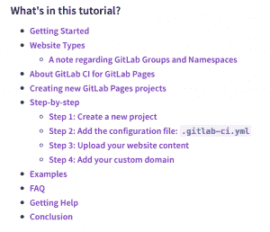
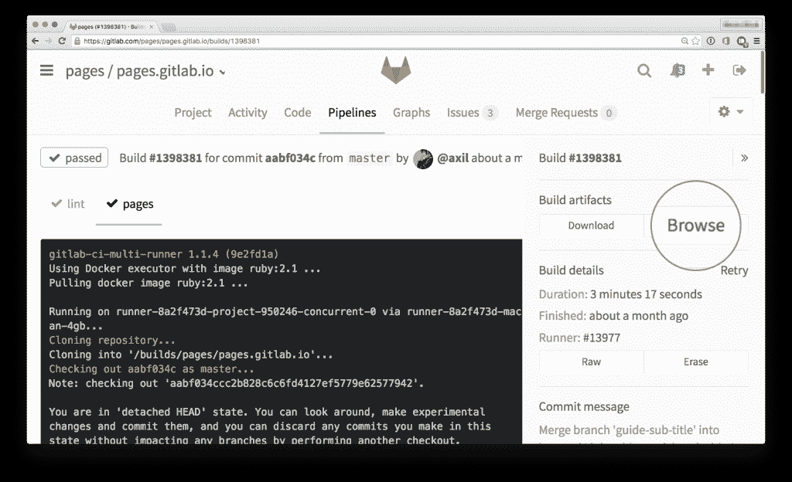

# GitLab 现在提供免费的静态网页托管

> 原文：<https://thenewstack.io/gitlab-releases-free-static-web-page-hosting/>

为了响应社区的请求， [GitLab](https://gitlab.com/) 推出了一项新服务，让开发者能够免费托管静态网页，名为 GitLab Pages，community edition (CE)。

入门指南

GitLab 的产品副总裁乔布·范德沃特(Job van der Voort)在葡萄牙里斯本接受电话采访时表示，企业版已经推出约一年了。六个月前[他宣布了不延长社区表格页面的决定](https://gitlab.com/gitlab-org/gitlab-ce/issues/14605)。他结束了这个问题，但保持线索开放。

他说，一些评论者，主要是喜欢 GitLab 环境的小企业，要求提供社区版或至少更实惠的小企业选项。一个月前，范德沃特重返论坛，推翻了这一决定。

Kevin Minehart 是众多要求 GitLab 重新考虑的社区成员之一。“考虑一个存储库集成的静态站点的用例，”他写道，列举了几个:

*   *托管项目文档。这对我们非常有用，因为我们使用[静态站点生成器] ( [Slate](https://github.com/lord/slate) )来为我们的公共 REST API 创建更好的文档。*
*   *博客。*
*   *演示文稿&安装说明。*
*   *软件版本/夜生活的公开列表？分发二进制文件？*

van der Voort 说，我们没有想到的是，人们开始将它用于 GitLab 没有考虑到的功能，如发布文档或测试结果。

他解释说，这代表着网站部署和使用方式的转变。目前，大多数网站都建立在内容管理系统(CMSes)上。人们一直想转向静态网页，但传统上很难建立并运行一个网页，部分原因是没有标准化的方法。

“这是非常繁重的工程。从 0 到 1 非常非常艰难，”范德沃特说。他说，随着时间的推移，随着社区开始使用该产品并添加他们自己的代码，这将变得更加容易。

不用部署 CMS，用户可以部署任何他们选择的[静态网站生成器](https://www.staticgen.com/)，例如[杰基尔](http://jekyllrb.com/)、[雨果](http://gohugo.io/)或 [Hexo](https://hexo.io/) 。与 CMS 内置的动态网页不同，静态网页在后台没有数据库。范德沃特说，内容是静态的，所以信息就是全部。改变内容的唯一方法就是重建网站。“你生成的网站是一个单一的图像，任何你想做的改变，你都需要重建网站，”他说。

据 van der Voort 说，人们关注静态网页的原因之一是缺乏高速缓存使其速度非常快，高达 6 倍。唯一的动作是需要提供 HTML。这消除了几乎所有的缓存需求。

范德沃特说，另一个主要原因是安全。如果不定期更新，CMS 驱动的网站很容易受到安全攻击，尤其是如果核心 CMS 引擎可以暴露在网络上。对于静态网站，服务器上唯一的东西就是静态内容:所以即使有人可以直接访问您的网站，他们也只能将内容更改为特定的网页。你只需要运行生成器软件，通常是离线运行，来重新加载原始页面。

van der Voort 解释说，从最终用户的角度来看，与动态或静态网页交互是没有区别的。特别是对于市场营销，文档网站正在转向静态网站。他以 Vox Media 为例说，有很多面向客户的静态网站。

对于内容的创建者来说，唯一的区别是他们在 GitLab 中创建并将更改推送到存储库，而不是更新 CMS。GitLab 提供了社区工具来简化这一过程。

GitLab Pages 使用 [GitLab 持续集成](https://docs.gitlab.com/ee/ci/quick_start/README.html#creating-a-.gitlab-ci.yml-file) (CI)社区已经熟悉的工具，包括所有的协作特性。静态站点只是另一个存储库。范德沃特说，他们创建了一个静态网站，而不是创建一个测试或其他东西。

“我们只是简化了整个过程。”

每个帐户在每个项目中获得 10GB 的磁盘空间，在每个页面中获得 1GB 的工件空间，以及无限的总磁盘空间。点击此处获取关于如何通过 GitLab [启动自己的静态网页的详细说明。](https://about.gitlab.com/2016/04/07/gitlab-pages-setup/)

<svg xmlns:xlink="http://www.w3.org/1999/xlink" viewBox="0 0 68 31" version="1.1"><title>Group</title> <desc>Created with Sketch.</desc></svg>