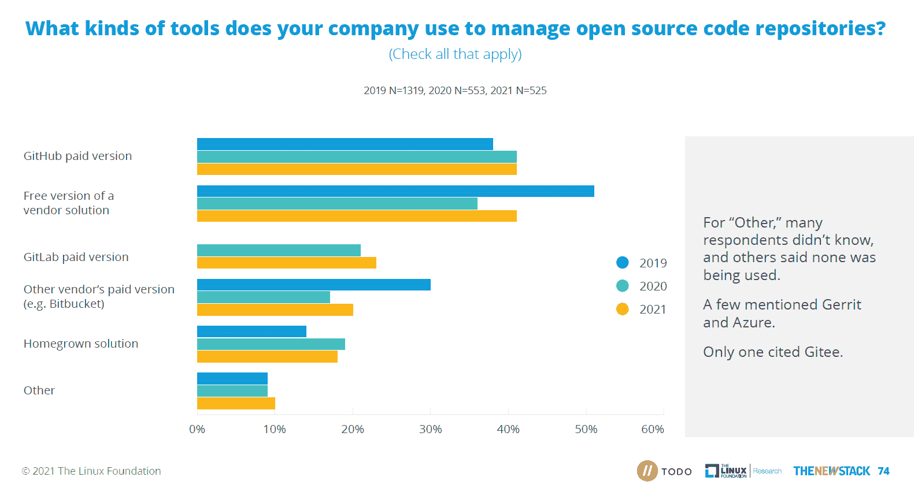

# GitLab 在中国蓬勃发展，并且开源

> 原文：<https://thenewstack.io/gitlab-thrives-in-china-and-with-open-source/>

GitLab 的增长和最近的 IPO 背后的趋势经常被误解。我们自己最近的[调查](https://thenewstack.io/more-organizations-report-benefits-of-open-source-programs/)发现，2021 年将有更多的公司付费给 GitLab 来管理开源库。与此同时，自 2019 年以来，向 GitHub 以外的公司支付帮助管理代码回购的人从 30%上升到 37%。

更值得注意的是 GitLab 在中国的实力:在 2021 年 JetBrains [的一项调查](https://www.jetbrains.com/lp/devecosystem-2021/methodology/)中，57%的中国受访者报告称他们使用 git lab 进行工件/存储库管理，相比之下，使用 GitHub 的受访者比例为 35%。随着 GitLab 继续推动自己成为 DevOps 平台，它将继续宣传自己是公司可以依赖的单一工具链，也是平台团队为开发人员提供的更大产品的一部分。

2015 年，我们[告诉](https://thenewstack.io/gitlab-opens-entire-development-process-reflecting-demand-for-trust-authenticity/)读者 GitLab 已经向公众开放了它的开发过程。在 2017[年末](https://thenewstack.io/week-numbers-not-developers-use-ci-cd/)和 2018[年初](https://thenewstack.io/jenkins-kubernetes-cd-pipelines/)，GitLab CI 与一款名为 Jenkins 的免费工具(现已由 [CloudBees](https://www.cloudbees.com/?utm_content=inline-mention) 商业化)竞争，作为开发人员向数字海洋和新生的 Kubernetes 平台部署应用的方式。

到 2019 年，衡量 GitLab 和 GitHub 的市场份额变得很明显是有问题的，因为没有人能够就他们竞争的实际市场的参数达成一致。在一系列文章中，本专栏询问 GitLab 和 GitHub 是否将只在利基市场竞争，或者作为 DevOps 和 CI/CD 服务的捆绑商。

两年后，GitLab 成功首次公开募股；那一次，它宣称自己是一个“DevOps 平台”。虽然跟踪了无数的产品和功能，但竞争似乎主要是捆绑商和平台提供商，但即使这样也很难定义。

JetBrains 的大规模全球调查"【2021 年开发者生态系统状态"询问公司是否与特定的工具堆栈或平台相关联。大约四分之一的受访者提到了 Atlassian 及其吉拉、Bitbucket、Crucible、Confluence 和 Trello 产品，微软(Azure devo PS/微软 TFS/VSTS，Office 365)、谷歌(Cloud，G Suite，Hangouts)、GitHub 和 GitLab 都与大约五分之一的组织有关联。这些产品的功能范围很广，包括源代码协作、问题跟踪和工作流管理。

Atlassian 在采用多平台方法的公司中做得最好。三分之一的研究依赖于两个或更多的工具平台，其中 60%使用 Atlassian 产品。在只依赖一个工具堆栈的研究中，这个数字下降到 22%。

相比之下，在那些只依赖于一个平台的公司中，44%依赖于微软或微软拥有的 GitHub，这是 Atlassian 数字的两倍。像 Atlassian 和 GitLab 这样的公司与微软和谷歌竞争开发一整套适合开发者偏好的工具。然而，即使他们确实拥有客户想要的堆栈，一些首席信息官和企业购买者仍会倾向于依赖单一供应商的方法。

GitLab 的“土地和扩张”战略专注于超越使用一种产品或服务的少数开发人员和 DevOps 工程师。成功的平台公司在相邻市场提供产品和服务，进行追加销售，并在客户组织中积累额外的用户。

目前，该公司正专注于与 DevOps 工程师和基础设施开发人员的“落地”。担任该工作角色的 2，521 名受访者更有可能在多个用例中使用 GitLab，包括工件/存储库管理——39%的 DevOps 工程师使用 GitLab，相比之下，普通研究参与者中只有 33%使用 git lab。

## **GitLab 在中国的使用圈数 GitHub**

GitHub 仍然是世界上使用最多的开源代码库，拥有大量活跃的注册用户， [GitHub 的 Octoverse 状态](https://octoverse.github.com/)可以证明这一点。然而，GitHub 在前共产主义国家的采用率很低。

GitLab 由一名乌克兰人创建，调查的赞助商 JetBrains 由一名俄罗斯人创建，该研究被广泛分发，并被翻译成除英语之外的 9 种语言。虽然人们总是担心在线调查的抽样问题，但 GitLab 在中国、俄罗斯和乌克兰的采用率却非常高。

整整三分之一的中国受访者声称他们的公司依赖于 GitLab 工具堆栈，是依赖于 GitHub 堆栈的 16%的两倍。这与美国和加拿大形成对比，在美国和加拿大，24%的人依赖 GitHub 平台，相比之下，只有 10%的人依赖 GitLab。

当只看用于工件和存储库管理的工具时，同样的动态展开了。在中国，57%的人将 GitLab 用于工件或管理，而在美国和加拿大，这一比例仅为 17%。虽然“35%”在中国使用 GitHub，但该公司在这一类别中处于全球领先地位，在印度的 [GitHub 开发者社区中有 58%的人](https://github.com/github/india)在这一使用案例中使用 GitHub。

GitLab 在中国显示了实力，因为政府认为开源代码管理具有重要的战略意义，特别是 GitHub 已经成为审查问题的痛处。中国政府试图将 [Gitee 提升为全国冠军和 GitHub 的替代品](https://interconnected.blog/can-you-nationalize-open-source/)，这很可能给了 GitLab 在中国扩张的时间和空间。

GitLab 利用了这个机会。2021 年 3 月，GitLab 和它的金融合作伙伴[创建了一家中国本土公司姬胡](https://about.gitlab.com/blog/2021/03/18/gitlab-licensed-technology-to-new-independent-chinese-company/)，在不占用资本的情况下在中国扩张。这似乎是专注于中国的全国性战略的高潮，而不是进入中国市场的起点。

## 开源社区对 GitLab 的采用

GitLab 和 Gitee 在需要管理软件代码的公司中赢得了客户，这些软件代码大体上仍然保存在私人仓库中，不向公众开放。目前，大多数开源项目仍然可以在 GitHub 上使用，即使项目的实际协作是使用不同的系统完成的。虽然大多数开源开发者可能有 GitHub 账户，但这并不意味着这是他们首选的平台。

这让我们看到了 GitLab 在企业开源开发者中的表现。相对于 GitHub，GitLab 的采用率有所提高。根据 New Stack、 [Linux Foundation Research](https://training.linuxfoundation.org/training/course-catalog/?utm_content=inline-mention) 和 TODO Group 对 500 多家公司的调查，[到 2021 年，53%的人使用 GitHub 实现开源合规，32%的人使用 GitLab(高于 2020 年的 30%)。这些公司的许多产品可以被认为是](https://github.com/todogroup/osposurvey/blob/master/2021/results_2021.pdf) [DevOps](https://thenewstack.io/category/devops/) [工具](https://thenewstack.io/category/tools/)的供应商，并且法规遵从性通常是代表[安全](https://thenewstack.io/category/security/)功能完成的。

在过去的几年中，对托管和管理开源项目代码库的付费服务的需求不断增加。根据同样的开源项目办公室调查，GitHub 遥遥领先，因为大多数开源贡献者都拥有该服务的账户，但 GitLab 正在迎头赶上。

根据我们的调查，去年向 GitLab 付费购买工具来管理开源库的公司从 21%上升到 23%。更重要的是，自 2019 年以来，向 GitHub 以外的公司支付帮助管理代码回购的人从 30%上升到 37%。

市场上的另一个产品是 Atlassian 的 [Bitbucket](https://stackshare.io/stackups/bitbucket-vs-github-vs-gitlab) 。尽管看起来没有增长，但该产品在金融服务领域仍然非常强劲。在这项研究中，37%的金融服务受访者表示，除了 GitLab 和 GitHub(如 Bitbucket)之外，他们还使用付费供应商的产品，而这项研究的平均水平仅为 20%。

在管理 11 个或更多开源项目的公司中，66%付费使用 GitHub，是 GitLab 的 29%的两倍多。为了让 GitLab 的“土地和扩张”战略发挥作用，其新客户将需要开始创建新的开源项目，从事依赖 GitLab 的上游项目，否则该公司可能必须从竞争对手那里抢走现有客户。

GitLab、GitHub 和 Atlassian 将继续争夺开源社区的人心。让我们看看这种竞争是如何进行的，以及其他较小的公司是否会成为附带损害。

GitHub 付费版 2020 年为 40.76%，2021 年为 41.23%。图形设计师在制作这张图表时将数字四舍五入。

### 之前关于 GitLab 在新堆栈上的数据新闻

### 推荐阅读:泰勒·朱厄尔的《开发者主导的景观》

<svg xmlns:xlink="http://www.w3.org/1999/xlink" viewBox="0 0 68 31" version="1.1"><title>Group</title> <desc>Created with Sketch.</desc></svg>