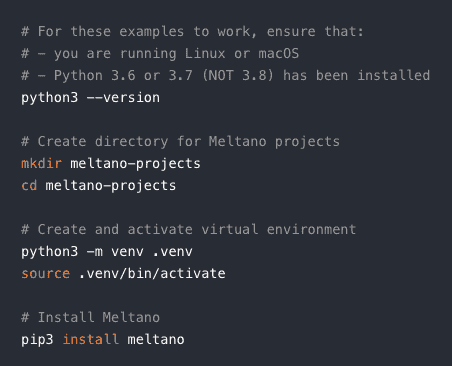

# GitLab 的 Meltano 展示了为什么开源是“唯一”的未来

> 原文：<https://thenewstack.io/gitlabs-meltano-shows-why-open-source-is-the-only-future/>

[GitLab](https://about.gitlab.com/) 赞助本帖。

GitLab 的开源 [Meltano](https://meltano.com/) 数据管道管理项目可能会失败。它还可能成为管理和协调数据管道的行业标准平台。无论如何，虽然结果可能介于两者之间，但 Meltano 作为一个案例研究了开源开发的挑战，以及为什么从失败中学习最终会带来丰厚的回报。

Meltano 最初是为了解决一个常见的 DevOps 问题，该问题与缺乏管理数据管道的内部专业知识有关。许多组织当然可以使用数据平台来汇集和分析来自不同来源的数据。这些来源可能从谷歌分析或谷歌广告到 CRM，但组织往往缺乏资源来支付这样一个高性能的系统。Meltano 的创造者希望它能够为 DevOps 团队提供 [ETLs](https://en.wikipedia.org/wiki/Extract,_transform,_load) 的提取、加载和转换功能。

Meltano 在 GitLab 的负责人 Douwe Maan 说:“许多商业工具，如那些支持数据集成的工具，实际上并没有被市场的很大一部分所利用，这意味着有许多公司可以利用他们的数据做一些事情，但他们并没有真正这样做，因为他们无法克服财务障碍。“因此，我们希望通过构建一个真正伟大的开源版本来实现公平竞争和数据集成工具的商品化。”

但这不仅仅是 GitLab 的一个开源项目。Meltano 被视为满足了一个巨大的需求，类似于 GitLab 在大受欢迎之前提供了一个开源替代方案作为 Git 存储库。

“Meltano 项目是我们在数据领域开源的测试案例。我们试图看看我们是否可以在一个不同的市场复制 GitLab 的故事，这个市场确实缺乏一个有竞争力的开源解决方案来解决每个公司都有的问题，”Maan 说，他是 GitLab 初创阶段的第一批员工之一。“当 GitLab 创建时，它被视为一个开源的替代方案，非常有用，实际上可以与公司目前付费的工具相竞争。”

GitLab 可能还需要几年时间才能将 Meltano 的服务商业化，供组织采用。同样，从 GitLab 作为一个开源项目创建到 GitLab 可能有“商业机会”变得显而易见，至少有一年的时间间隔，Maan 说。

“这就是整个旅程的开始，当然，当 GitLab 成为开放核心时，GitLab 仍然为开源版本贡献大部分代码，同时提供企业版和 24/7 支持，”Maan 说。

然而，梅尔塔诺并非没有挑战。例如，GitLab 的联合创始人兼首席执行官锡德·西布兰迪杰在“新堆栈制造商”播客中说，GitLab 的项目人员已经减少，因为“成功需要的时间比我们预期的长”。

然而，“它的前提是应该有一个开源的 ETL 框架来加载数据。这仍然是正确的，”Sijbrandij 说。“所以，我们会继续投资，直到我们确信我们的前提一开始就是错的。”

GitLab 计划只要这个项目可行就支持它。Sijbrandij 提供了亚马逊如何基于项目可行性的长期愿景继续支持项目的比较。

“亚马逊以投资时间比竞争对手稍长的计划并使其开花结果以及非常耐心而闻名。我认为重要的是，只要假设不变，你就要继续投资。“你不会放弃，但有时你必须改变自己的做事方式。应该有一个开源 ETL 框架来加载数据的前提仍然是正确的，所以我们将继续投资，直到我们确信我们的前提首先是错误的。”

这个项目是另一个例子，说明了为什么采用开源不再是未来软件开发的事实模型。它的采用现在在大多数软件领域中激增。

“开源是大多数广泛使用的软件的合理结果，”Sijbrandij 说。“过去，你有商业软件，它是‘要么接受，要么放弃’开源将给人们带来更多的自由，更低的软件价格，更多的修改自由，以及更少的供应商限制——我认为这是一件好事。"

*8 月 26 日加入 GitLab Virtual Commit，聆听来自美国空军、美国陆军、GNOME 基金会、State Farm、西北互助银行、谷歌等机构的演讲者讲述问题的解决、文化的改变以及发布时间减半。[今天免费注册](https://about.gitlab.com/events/commit/)。*

亚马逊网络服务是新堆栈的赞助商

通过 Pixabay 的特征图像。

目前，新堆栈不允许直接在该网站上发表评论。我们邀请所有希望讨论某个故事的读者通过推特(Twitter)或脸书(T2)与我们联系。我们也欢迎您通过电子邮件发送新闻提示和反馈:[反馈@thenewstack.io](mailto:feedback@thenewstack.io) 。

<svg xmlns:xlink="http://www.w3.org/1999/xlink" viewBox="0 0 68 31" version="1.1"><title>Group</title> <desc>Created with Sketch.</desc></svg>