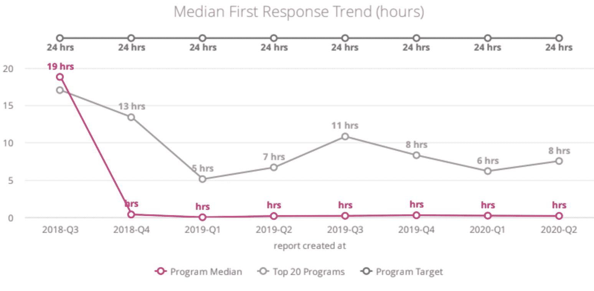
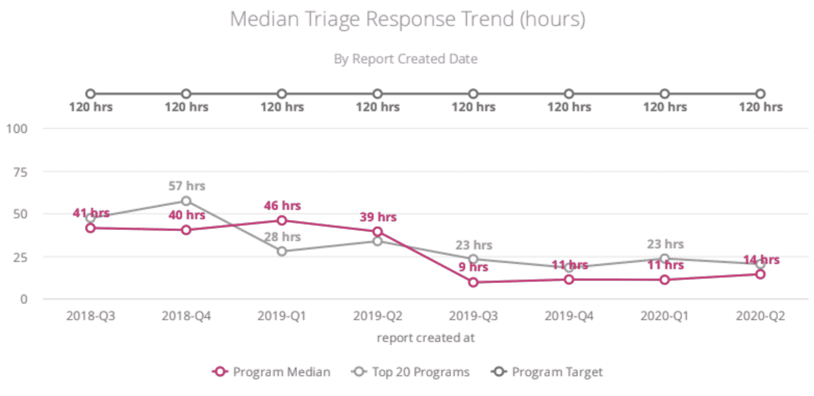
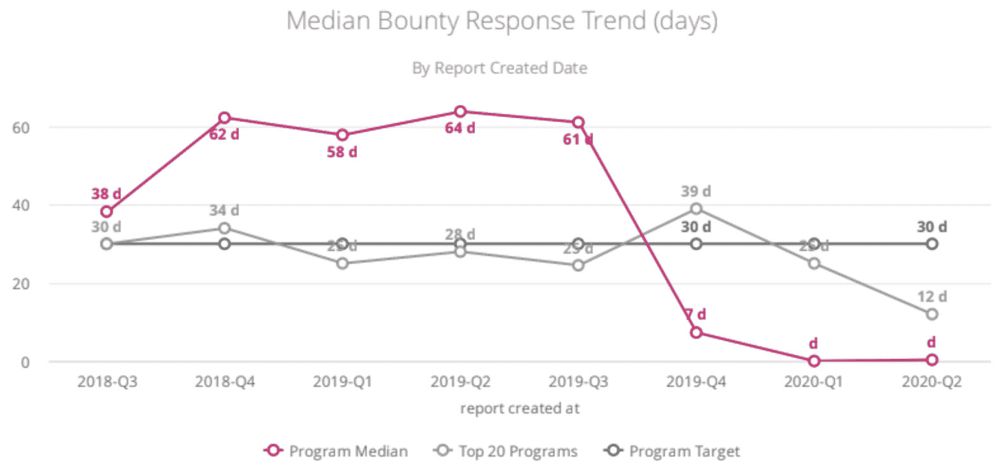
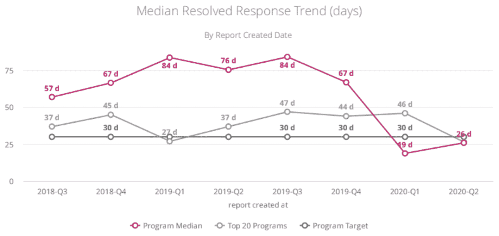

# GitLab 运行 Bug 赏金程序的 5 大技巧

> 原文：<https://thenewstack.io/gitlabs-top-5-tips-for-running-a-bug-bounty-program/>

[GitLab](https://about.gitlab.com/) 赞助本帖。

GitLab 于 2018 年 12 月公开了我们的 bug bounty 计划，从那时起，我们已经提交了 2110 份报告，并感谢了 246 名黑客。当谈到运行一个 bug 赏金程序时，我们当然不知道所有的事情；我们所知道的是，我们在前进的过程中不断学习和重复。本着[协作](https://about.gitlab.com/handbook/values/#collaboration)和[透明](https://about.gitlab.com/handbook/values/#transparency)的精神，我们想分享一些我们学到的关于建立一个既成功又符合[我们的价值观](https://about.gitlab.com/handbook/values)的 bug 赏金项目的技巧。

## 技巧 1:区分什么是关键的(和重要的)

 [詹姆斯·里奇

James 在信息安全领域拥有超过 10 年的经验，专门从事应用程序安全和安全软件开发。他目前是 GitLab 的应用安全团队经理，致力于提高 DevOps 生命周期所有阶段的安全标准。James 拥有伦敦大学国王学院的计算机安全硕士学位和东北州立大学的计算机科学学士学位。](https://www.linkedin.com/in/james-ritchey-7b378335/) 

老实说，在您的组织中，没有人愿意花费大量的时间来分类、安排、调查、调试或修复低严重性的问题。成本效益很可能就是没有意义。

严重程度高和严重的漏洞是您希望激励研究的地方，因为根据定义，它们对您的组织更有影响。就严重程度高且严重的漏洞而言，了解这些潜在的公司灭绝事件非常重要。将他们视为一流实体的第一步是为他们支付有竞争力的薪酬，并尽快奖励奖金。用高额奖金来激励他们应该会激励更多类似性质的报告。

早在 2019 年 11 月，我们[就提高了对高严重性和关键严重性漏洞的奖励](https://about.gitlab.com/blog/2019/11/18/were-increasing-bounties-in-our-bug-bounty-program/)。对于关键漏洞，我们从 12K 增加到 20K，对于高漏洞，我们从 7K 增加到 10K。我们还[直接根据我们的一些 bug 赏金研究员的反馈，缩短了对这些同类漏洞的赏金支付时间](https://about.gitlab.com/blog/2019/09/24/reducing-time-to-payout-and-launching-a-bug-bounty-anniversary-contest/)。

这没什么好惊讶的，但是增加奖金很快就见效了。事实上，在奖金增加后的 7 个月里，我们看到高严重性提交增加了 45%，严重漏洞提交增加了 73%。我们感谢大量的报告，因为每一份报告都让我们离更安全的环境更近了一步；最终，对我们的程序负责任地披露这种类型的错误的成本只是与大型恶意攻击相关的风险和成本的一小部分。

为了进一步激励严重程度高和严重的漏洞，以及在全球业务不可预测的时期实现成本节约，我们最近(2020 年 6 月 30 日)[将低和中等严重程度漏洞的奖金减半](https://hackerone.com/gitlab/updates)。与此同时，我们将**项目中的赏金时间从 90 天减少到最长 45 天**，并打算继续迭代，以便我们可以进一步缩短这个时间框架。

## 技巧 2:倾听利益相关者的反馈

关于你的虫子奖励计划有很多利益相关者。举几个例子，至少从 GitLab 的角度来看，有:

*   Bug 赏金报告者:那些发现并报告漏洞的人
*   安全团队:筛选漏洞的人
*   产品:那些计划修复漏洞的人
*   工程:修复漏洞的人
*   Bug bounty 程序合作伙伴/供应商:(在我们的例子中，就是 HackerOne)托管您的程序的平台和支持团队。

这些利益相关者中的每一个对我们产品的安全性和我们项目的成功都有着不可思议的价值。因此，联系他们并听取他们对你的计划的反馈和需求是很重要的，因为这是改进、简化和可能创新的机会。

利益相关者反馈带来切实改进的快速示例:

*   记者经常询问何时安排修复的更新，这促使我们的团队开发了一个自动化机器人，根据相关 GitLab.com 问题的到期日和目标里程碑，无缝共享修复 eta。
*   安全和产品团队表达了同时跟踪多个安全问题的困难，因此我们创建了一个上报引擎，它可以有效地发现突出的安全问题，并从分类到补救和关闭高效地跟踪它们。你可以在下面读到更多。
*   此外，正如我们上面提到的，你可以感谢你的黑客伙伴，他们要求更快地支付中、高和关键漏洞的费用。
*   此外，感谢 HackerOne 的建议，我们已经能够有效地校准奖金数额、分流时间和奖金率时间。他们还为我们提供了关于分类的最佳实践建议，应对记者的挑战性情况，甚至[何时将我们的臭虫奖励计划公之于众](https://www.hackerone.com/resources/customer-story/gitlabs-approach-to-security)。

## 秘诀 3:反应灵敏，关注时间

我们很快就认识到，无论是在我们的沟通还是在我们的修复中，反应灵敏对于黑客的参与和整个项目的成功都是非常重要的。

我们的主要关注领域是:

### 初始响应时间

将这些记录下来有助于建立预期，并让记者参与进来，了解更多信息。我们内置了自动化功能，可以提供后续响应的预计时间和修复的预计时间。

从提交报告到报告的第一次公共活动(包括添加公共评论、更改报告状态或更改报告严重性)所经过的时间。注意:您可以看到自动化真正起了作用！由 HackerOne 提供的指标。

### 分诊时间到了

你越快分类，记者越快知道他们的 bug 是有效的还是重复的。这也加快了付款速度，这总是好的。

从提交报告到报告变为已分类状态所经过的时间。由 HackerOne 提供的指标。

### 赏金时间到了

我们在分类时奖励部分奖金，中度奖励 500 美元，高度或关键报告奖励 1000 美元。这是我们根据黑客反馈做出的改进。这里的假设是，记者(以及我们所有人)都喜欢口袋里有钱，因为他们能更快更好地完成工作。

从报告被审核到支付奖金所经过的时间。由 HackerOne 提供的指标。

### 该修理了

我们都同意，没有什么比听到自己不是第一个发现 bug 的人更让人兴奋的了。快速修复错误减少了重复报告的机会。您可以查看我们的手册，以更好地了解我们如何根据漏洞严重性确定补救措施的优先级并进行跟踪。我们一直在努力解决积压的问题，并始终符合或超过负责任披露的行业标准时间表。当然还有需要改进的地方！

从提交报告到关闭报告所经过的时间。由 HackerOne 提供的指标。

## 技巧#4:自动化扩展

拥有大量潜在的 bug 赏金报告者，而只有一个小的安全团队，很容易被大量的报告淹没。这就是为什么尽可能实现自动化很重要。通信和报告管理是自动化的主要目标领域。

以我们的程序为例，我们的挑战之一是跟踪和驱动等待修补的缺陷，直到修复状态。我们很快意识到，他们很容易迷失在音量和噪音中。为了帮助管理这种状态下的错误，我们的自动化团队开发了一个升级引擎，该引擎可以跟踪每个错误的进度，并确保它们得到正确的分类、标记和安排，并满足我们的[平均修复时间(MTTR)目标](https://about.gitlab.com/handbook/engineering/security/#severity-and-priority-labels-on-security-issues)。这有助于在漏洞过期、标签不足或需要升级时通知漏洞生命周期中涉及的所有团队。

## 技巧 5:对安全问题保持透明

没有一个产品或应用程序是 100%安全的。

我鼓励组织对你的安全问题保持透明。我们承认这有时会很困难。看看这个手册条目:[只有在困难的时候透明才是有价值的](https://about.gitlab.com/handbook/values/#transparency-is-only-a-value-if-you-do-it-when-it-is-hard)，这也适用于我们的安全实践。

### 安全透明度

*   清晰公开地展示了您对保护您的产品和组织的重视和承诺。
*   可以通过激发新的报告来进一步保护产品。公开披露安全漏洞降低了投稿的门槛，因为它允许研究人员在其他研究人员的发现基础上学习和发展。GitLab 经常会收到一些报告，这些报告是在解决问题后公开发表的以前的报告的启发或基础上编写的。
*   扩大公众对安全研究员的认可。对于昆虫赏金记者来说，这往往不仅仅是钱的问题。他们希望得到公众的认可，并能够谈论、炫耀甚至在博客上发表他们的发现。因此，如果研究人员知道他们的工作将被发表，公开披露可以增加对昆虫奖金计划的参与。

确定何时公开您的安全问题是另一回事。我们已经发现我们自己的[漏洞披露的最佳时机是 30 天或更少](https://gitlab.com/gitlab-org/gitlab/-/issues?scope=all&utf8=%E2%9C%93&state=closed&label_name%5B%5D=HackerOne)。对于拥有 SaaS 产品的组织来说，如果你已经升级了你的软件并且用户已经更新了，那么立即发布细节应该是你的目标。如果您提供托管或内部解决方案，您的披露时间表将取决于您的产品。我们根据每个版本的用户数量以及如何与我们的发布时间表保持一致来制定我们的发布时间表。

我们为我们的项目到目前为止取得的发展和成功感到自豪，并感谢为我们的项目做出贡献的安全研究人员的持续贡献和独创性。我们还没有完全弄清楚，根据上面列出的指标和用户反馈，我们肯定还有需要改进的地方。我们定期在 twitter 上发布我们的[月度项目指标](https://twitter.com/gitlab/status/1281620212622794752)，你可以随时在 HackerOne 上查看我们的[黑客活动和项目统计数据。我们的目标是为了我们的黑客、我们的客户和开源社区的利益，继续改进和加强我们的计划。如果您对我们如何继续改进有任何问题或想法，请告诉我们。黑客快乐！](https://hackerone.com/gitlab?view_policy=true)

通过 Pixabay 的特征图像。

*目前，新堆栈不允许在该网站上直接发表评论。我们邀请所有希望讨论某个故事的读者通过 [Twitter](https://twitter.com/thenewstack) 或[脸书](https://www.facebook.com/thenewstack/)访问我们。我们也欢迎您通过电子邮件发送新闻提示和反馈: [feedback@thenewstack.io](mailto:feedback@thenewstack.io) 。*

<svg xmlns:xlink="http://www.w3.org/1999/xlink" viewBox="0 0 68 31" version="1.1"><title>Group</title> <desc>Created with Sketch.</desc></svg>