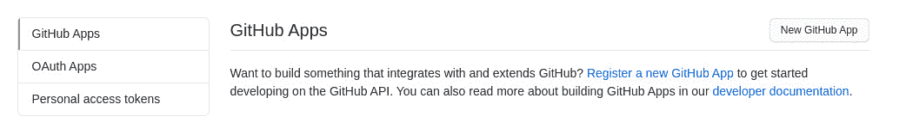
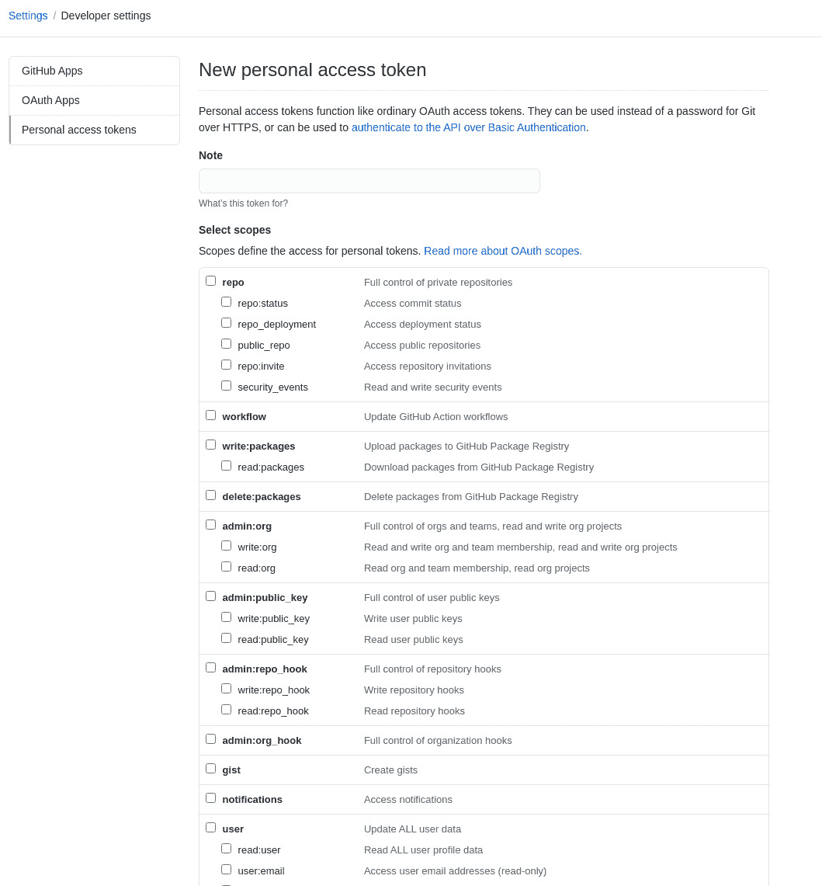

# GitOps Home:使用 Kubernetes 和 Flux 自动部署代码

> 原文：<https://thenewstack.io/gitops-at-home-automate-code-deploys-with-kubernetes-and-flux/>

Flux 是一个基于云本地计算基金会(T2)的开源工具栈，它可以使 Kubernetes 集群与外部配置源保持同步，比如 GitHub 上的存储库。有了这些，当有新代码准备好部署时，您就可以设置更新的自动化。通过这种" [GitOps](https://thenewstack.io/what-is-gitops-and-why-it-might-be-the-next-big-thing-for-devops/) "方法，您将体验到 [Flux](https://fluxcd.io/) 的以下优势:

*   您不必授权您的持续集成(CI)系统访问 Kubernetes 集群。
*   每个代码更改都是原子的和事务性的。
*   您的审计日志将保存在 Git 中。
*   每个事务要么成功，要么彻底失败。
*   您的 DevOps 生命周期完全以代码为中心，因此您不需要新的基础设施。

Flux 可以部署在[亚马逊网络服务](https://aws.amazon.com/?utm_content=inline-mention)、谷歌云、微软 Azure，甚至是你自己托管的数据中心。我想带你看一下在 AlmaLinux 8 上安装 Flux 的过程。要完成这项工作，您需要一个 Kubernetes 集群的运行实例，以及一个 GitHub 帐户。为了在两者之间建立联系，您还必须生成一个 GitHub 个人访问令牌。

让我们启动并运行 Flux，这样您就可以通过持续部署来增强您的 Kubernetes 和 GitHub 连接。

## 创建 GitHub 访问令牌

首先要做的是生成一个 GitHub 个人访问令牌。为此，请登录您的 GitHub 帐户，点击主窗口右上角的个人资料图片。从下拉菜单中选择设置。在“Settings(设置)”窗口中，从左侧导航栏中选择“Developer Settings(开发人员设置)”,然后单击“Personal access token(个人访问令牌)”(图 1)。



图 GitHub 开发者设置窗口，您可以在其中选择生成新的个人访问令牌。

在出现的窗口中，单击生成新令牌。然后会提示您为新令牌命名，并为存储库选择必要的选项(图 2)。



图 2:在 GitHub 上配置新的个人访问令牌。

选择必要的选项后，向下滚动并单击生成令牌。当令牌生成完成时，请确保复制新令牌，因为您稍后会用到它。

## 安装助焊剂

下一步是安装助焊剂。请记住，这必须安装在 Kubernetes 集群中，所以在开始安装 Flux 之前，请确保它已经启动并运行。登录到您的 Kubernetes 控制器，使用以下命令安装 Flux:

`curl -s https://fluxcd.io/install.sh | sudo bash`

安装完成后，使用以下命令完成安装:

`. <(flux completion bash)`

在这一点上，有一个软件依赖性没有在文档中列出。我花了大约五个小时试图让 Flux 工作，却总是失败。直到(心血来潮)我试图手动安装模块时，我才发现系统上需要的工具。一旦我安装了 Go，我就可以成功地运行 flux install 命令了。这是另一个大公司或项目的例子，它们的文档对用户没有好处。所以要安装 Go，使用以下命令:

```
wget https://golang.org/dl/go1.16.4.linux-amd64.tar.gz
tar xvzf go1.16.4.linux-amd64.tar.gz
sudo mv go  /usr/local/
export PATH=$PATH:/usr/local/go/bin
source  ~/.profile

```

您还需要安装 Kind，因此如果您的 Kubernetes 集群还没有包含该工具，请使用以下命令安装它:

`curl -Lo ./kind https://kind.sigs.k8s.io/dl/v0.11.0/kind-linux-amd64`

`chmod +x ./kind`

`mv ./kind /usr/bin/kind`

使用以下命令创建 Kubernetes 集群:

`kind create cluster`

以上命令需要一些时间才能完成。

现在，还记得您之前创建的个人访问令牌吗？这里是需要的地方。使用以下命令将令牌设置到您的 shell 环境:

`export GITHUB_TOKEN=<your-token>`

使用命令设置您的 GitHub 用户名:

`export GITHUB_USER=<your-username>`

其中，您的-token 是您从 GitHub 复制的个人访问令牌，您的-user 是您的 GitHub 用户名。

最后，使用以下命令安装必要的 flux 组件:

`flux install`

完成后，您应该会看到:

```
✚  generating manifests
✔  manifests build completed
►  installing components in flux-system namespace
◎  verifying installation
✔  kustomize-controller:  deployment ready
✔  helm-controller:  deployment ready
✔  notification-controller:  deployment ready
✔  source-controller:  deployment ready
✔  install finished

```

## 运行引导命令

接下来，我们将运行 bootstrap 命令，将 Flux 连接到您的个人 GitHub 存储库。该命令如下所示:

`flux bootstrap github --owner=$GITHUB_USER --repository=REPOSITORY --path=clusters/CLUSTER --personal`

其中:

*   用户名是您的 GitHub 用户名
*   REPOSITORY 是您想要同步的 GitHub 存储库
*   集群是您将为本地存储库指定的名称(可以与存储库使用的名称相同)

让我们让它更有用一点。以上命令适用于个人存储库。很有可能你有一个团队存储库，不止一个开发人员在那里工作。用于引导组织存储库的 Flux 命令如下所示:

`flux bootstrap github --owner=ORGANIZATION --repository=REPOSITORY --team=TEAM1SLUG --team=TEAM2SLUG --path=clusters/CLUSTER`

其中:

*   ORGANIZATION 是与 GitHub 存储库相关联的组织。
*   存储库是要使用的存储库的名称。
*   TEAM*SLUG 是为每个团队生成的 slug GitHug(源自团队名称)

## 避开安装错误

按照上面的步骤安装 flux 应该没有任何问题。如果您的 Kubernetes 集群由云服务提供商(如 AWS、Google Cloud、Azure、Linode 或 Rackspace)托管，并且您已经安装了所有必要的组件，这一点尤其正确。但是，如果您已经将 flux 部署到一个本地集群，并且在运行 bootstrap 命令时出现组件故障错误，那么这些错误很可能可以通过安装 Flux 来解决，而无需将其清单存储在 Git 存储库中。这是通过以下命令完成的:

`kubectl apply -f https://github.com/fluxcd/flux2/releases/latest/download/install.yaml`

如果您仍然收到错误，您可能想走`fluxctl`路线。这是通过以下步骤完成的。

首先，使用以下命令安装 fluxctl:

`sudo snap install fluxctl`

安装 fluxctl 后，使用以下命令导出您的 GitHub 用户名:

`export GHUSER="USER"`

现在，我们可以使用以下命令将 flux 安装到集群:

`fluxctl install --git-user=${GHUSER} --git-email=${GHUSER}@users.noreply.github.com --git-url=git@github.com:${GHUSER}/flux-get-started --git-path=namespaces,workloads --namespace=flux | kubectl apply -f -`

使用命令部署 flux:

`kubectl -n flux rollout status deployment/flux`

## 你可以用通量做的事情

希望 flux 已经成功安装，您可以从您的 Git 存储库中获取清单，并使用以下命令进行自我更新:

`flux reconcile source git flux-system`

如果您对 manifest 做了任何更改，您可以发出以下命令:

`flux install`

以上命令会将新的清单更改应用到您的集群。

假设您想使用 Flux 进行自动图像更新。为此，您必须按照以下步骤安装带有必要组件的 flux。

使用以下命令导出必要的环境变量:

`export GITHUB_TOKEN=<your-token>`

`export GITHUB_USER=<your-username>`

其中，您的-token 是您的 GitHub 访问令牌，您的-username 是您的 GitHub 用户名。

使用以下命令安装带有自动化映像组件的 flux:

`flux bootstrap github --components-extra=image-reflector-controller,image-automation-controller --owner=$GITHUB_USER --repository=flux-image-updates --branch=main --path=clusters/my-cluster --read-write-key --personal`

使用以下命令克隆此演示存储库:

`git clone git@github.com:@GITHUB_USER/flux-image-updates.git`

切换到新创建的目录:

`cd flux-image-updates`

对其中一个文件进行一些更改，或者向存储库中添加一个自述文件。

接下来，使用以下命令提交和推送更改:

`git add -A`

`git commit -m "Made changes to the test repository"`

`git push origin main`

Flux 最终会检测到这些变化并加以应用。

当然，您的里程可能会随着流量的变化而变化。这完全取决于您如何部署您的 Kubernetes 集群(如果您已正确部署)，以及您如何实施 GitOps 和 CI/CD 策略。

<svg xmlns:xlink="http://www.w3.org/1999/xlink" viewBox="0 0 68 31" version="1.1"><title>Group</title> <desc>Created with Sketch.</desc></svg>