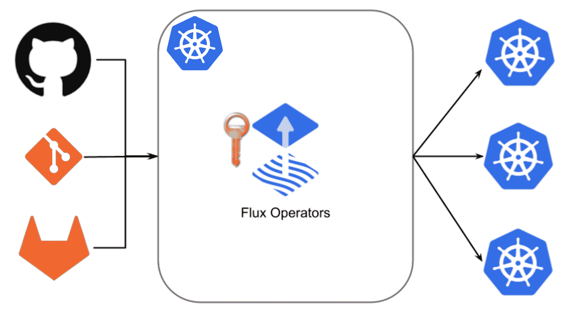
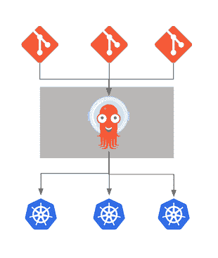

# Kubernetes 上的 GitOps:在 Argo CD 和 Flux 之间作出决定

> 原文：<https://thenewstack.io/gitops-on-kubernetes-deciding-between-argo-cd-and-flux/>

[Christian Hernandez](https://www.linkedin.com/in/chernandez1982/)

[Christian 是一名技术专家，拥有基础设施工程、系统管理、企业架构、技术支持和管理方面的丰富经验。他运营一个两周一次的 GitOps twitch 流，在那里他关注 GitOps 实践和使用云原生架构的 DevOps。](https://www.linkedin.com/in/chernandez1982/)

如果你听说过 GitOps 及其好处，你可能遇到过云原生计算基金会的两个开源项目:Argo CD 和 Flux。这些项目的成员都参与了 CNCF 的 OpenGitOps 计划，并且都在孵化项目。使用 GitOps，您可以提高可靠性和速度，减少停机时间，并享受自动自我修复等其他好处。

当构建一个 Kubernetes 集群时，构建代码的实际过程与前端的防火墙、负载平衡器和供应系统一样重要。在 Kubernetes 中构建应用程序持续集成/持续交付(CI/CD)管道的方法有很多，但在本文中，我们将特别关注持续部署的两个选项: [Flux](https://fluxcd.io/) 和 [Argo CD](https://argoproj.github.io/cd/) 。

下面是探索这两个项目之间差异的结果。两者都有其用途，都维护得相当好，都有活跃的社区。

## 当前景观

## 类似

大多数人在研究这两个工具时面临的部分挑战是，大多数人发现有很多相似之处。因此，本节将总结两者的相似之处，并链接到相关文档。

### 机密管理

GitOps 在 git 中存储真实来源的做法在存储 Kubernetes 的秘密方面有一些争议。这与秘密通常包含像密码或令牌这样的敏感信息这一事实有关，这些秘密只是被编码。

[Flux](https://fluxcd.io/docs/guides/sealed-secrets/) 和 [Argo CD](https://argo-cd.readthedocs.io/en/stable/operator-manual/secret-management/) 都有处理秘密加密的机制。

### Webhook 接收器

Webhooks 可用于帮助与传统的、事件驱动的工作流进行即时协调。这并不能代替对账循环，而是作为一种“按需”对账，如果您不想在提交回购后等待的话。

这是 [Flux](https://fluxcd.io/docs/guides/webhook-receivers/) 和 [Argo CD](https://argo-cd.readthedocs.io/en/stable/operator-manual/webhook/) 有类似方法的另一个领域。

### 警报和通知

警报是 CI/CD 工作流的重要组成部分。当资源状态发生变化、部署新的应用程序版本以及运行状况检查通过或失败时，这些通知会发送信息。用户倾向于在报告通道上使用这些状态更新，如 Slack 或嵌入在 git 提交状态检查中。

Flux 提供了一种机制用于[报警和发出通知](https://fluxcd.io/docs/guides/notifications/)，Argo CD 通过其插件机制使用 [Argo CD 通知](https://argocd-notifications.readthedocs.io/en/stable/)。

### 映像更新自动化

映像更新是通知 GitOps 控制器新映像已经创建并被推送到存储库中的过程。这有助于加快推出新版本应用程序的过程。

Flux 有一个叫做[图像更新自动化](https://fluxcd.io/docs/guides/image-update/)的概念，Argo CD 有一个 [Argo CD 图像更新器](https://argocd-image-updater.readthedocs.io/en/stable/)。

## 差异

这两个工具之间有如此多的相似之处，以至于大多数用户都想找到它们的不同之处。这一节将重点介绍不同之处，并将比上一节更深入一些。

### 安装/引导

Flux 和 Argo 都需要安装在要管理的集群上。安装完成后，需要将它们配置为从 git 存储库中读取 YAML 文件。在这个初始配置步骤中，您一起安装和配置，这被称为“引导”这就是差异开始变得明显的地方。

**Flux** 
Flux[安装/自举](https://fluxcd.io/docs/cmd/flux_bootstrap/)机制可以一起做，是推荐的入门方式。在引导过程中，Flux 在 GitHub 或 GitLab 上创建一个存储库(也可以使用通用的“git”模式)，然后在同一个 git repo 中创建安装和连接到 repo 的所有清单。

Flux 安装程序然后将管理/同步集群的责任“移交”给安装在集群上的 *flux 系统*，指向刚刚创建的 repo。

**阿尔戈 CD**

Argo CD 没有用于引导的本地机制，并且对如何配置它没有意见。[安装](https://argo-cd.readthedocs.io/en/stable/getting_started/#1-install-argo-cd)就是:通过 YAML 清单安装 Argo 光盘组件。它将剩下的配置工作留给了最终用户。

### 调和可配置性

和解是 GitOps 的核心。基于控制理论中的[闭环控制回路](https://en.wikipedia.org/wiki/Control_theory#Open-loop_and_closed-loop_(feedback)_control)的思想，GitOps 控制器持续检查并纠正系统中的任何漂移。这两个项目都提供了配置协调工作方式的方法，但在一些关键领域有所不同。

**通量**

Flux 是建立在 [GitOps Toolkit](https://fluxcd.io/docs/components/) 之上的，它有不同的组件。通量调节回路可在每个[组件](https://fluxcd.io/docs/components/)处配置。例如，您可以每五分钟检查一次 git 存储库，但是每 10 分钟进行一次同步。这使您能够错开协调发生的方式。

**阿尔戈 CD**

阿尔戈光盘协调是一个全球性的设置。这是一个可以通过 [Argo CD 配置图](https://github.com/argoproj/argo-cd/blob/master/docs/operator-manual/argocd-cm.yaml#L240)修改的设置。默认情况下，该时间设置为三分钟，最终用户可以更改。虽然您可以选择全局或按应用程序禁用协调，但您只能全局设置协调时间。这意味着您不能为每个[应用](https://argo-cd.readthedocs.io/en/stable/core_concepts/)设置不同的对账时间。

### 应用交付

这两个工具都支持原始 Kubernetes 清单(YAML)、 [Kustomize](https://kustomize.io/) 和 [Helm](https://helm.sh/) 。然而，这是另一个领域，其中每个工具处理如何应用 YAML 清单或部署掌舵图的方式存在很大差异。

**通量**

Flux 大量使用 Kustomize。它的 [Kustomize 控制器](https://fluxcd.io/docs/components/kustomize/)渲染并应用 Flux 从源代码库中同步的所有清单，即使使用原始的 Kubernetes YAML。如果没有检测到 Kustomize，Flux 将动态创建一个 Kustomize wasn 文件。您可以使用`DependsOn`来创建 Kustomizations 之间的依赖关系。

通量也有原生支持头盔。它的[掌舵控制器](https://fluxcd.io/docs/components/helm/)管理你想要部署到集群上的所有掌舵图表。Flux 使用本地 Helm golang 库在集群上部署一个 Helm 版本。您还可以利用[舵图挂钩](https://helm.sh/docs/topics/charts_hooks/)进行订购。如果您使用的是中心/分支模型(稍后将详细介绍 multicluster ),您还可以看到安装在其他集群上的导航图。类似于 Kustomize 控制器，您可以使用`DependsOn`来创建依赖关系。

**阿尔戈 CD**

Argo CD 也支持 Kustomize 和原始 Kubernetes YAML。但是，它可以直接应用原始 YAML 文件，而不使用 Kustomize。这可能会产生 Argo CD 应用程序不能立即同步的副作用，因为需要在[重试](https://github.com/argoproj/argo-cd/blob/master/docs/operator-manual/application.yaml#L111-L116)中重新应用资源，或者使用 Argo CD 中内置的排序。

如果检测到 Kustomize，Argo CD 相当于 kubectl `apply -f`或 kubectl `apply -k`。这是故意的，因为 Argo CD 的创建者想尽可能地模仿 kubectl 客户机。使用 [syncwaves 和 phases](https://argo-cd.readthedocs.io/en/stable/user-guide/sync-waves/) ，您还可以更好地控制单个资源(即特定的 YAML 文件)的排序。这允许您一次应用一个 YAML 清单。

Argo CD 也支持头盔，但是使用的方式不同。Argo CD 并不直接使用 Helm golang 库，而是使用 Helm 来渲染模板文件，并将它们直接传输到 kubectl。舵图钩子被转换成 Argo CD 同步波/钩子(下一步会详细介绍)。这样做的副作用是，用户无法对群集使用 Helm 命令行界面(CLI ),因为 Helm install 并未被首先调用(即 helm ls 将返回空值)。

### Web 用户界面

web 用户界面不会改变这两种工具的功能，但是值得注意一下它们的区别。这两个工具都有一个功能丰富的 CLI，不会妨碍功能。

**通量**

Flux 本身没有网络用户界面。大约一年前开始有一个[实验性 UI](https://github.com/fluxcd/webui) ，但是没有正式的。有像 [Weave GitOps Core](https://github.com/weaveworks/weave-gitops) 这样基于 Flux 的开源平台，它们有一个 UI。

**阿尔戈 CD**

Argo CD 有一个丰富的用户界面，并且在设计时就考虑到了用户界面，所以它从一开始就存在。它还集成了 Argo CD 的访问控制策略(下一步将详细介绍),并具有显示“只读”仪表板的能力。

### RBAC

对于基于角色的访问控制，每个工具不仅采用不同的技术方法，还采用不同的哲学方法。这是通量和 Argo CD 显著不同的另一个领域。

**通量**

Flux 严格依赖于 Kubernetes 的 RBAC 能力；它不管理自己的用户、权限、身份、认证或授权。没有“流量用户”或“流量管理员”Flux 的权限受到绑定到其运行的服务帐户的角色的限制。这是为了符合 Kubernetes 对服务帐户的最低特权惯例。

**阿尔戈 CD**

Argo CD 有一个[基于访问控制列表的 RBAC](https://argo-cd.readthedocs.io/en/stable/operator-manual/rbac/) ，独立于 Kubernetes。Argo CD 还有一个单独的组/用户机制，也是独立于 Kubernetes 的。通常，用户设置 Argo CD 的服务帐户，并使用 Argo CD 的用户/组机制管理用户。或者用户可以使用两者的组合来获得期望的结果。

Argo 光盘上的 RBAC/访问系统是非常精细的。虽然设置起来很复杂，但它非常灵活。Argo CD 认证机制可以与任何支持 OpenID Connect (OIDC) 或使用 Dex 代理它的提供商[集成。](https://argo-cd-docs.readthedocs.io/en/latest/operator-manual/sso/)

### 多集群

多集群管理是一项挑战。好消息是:这两种工具都有助于多集群管理以及将工作负载部署到您可能拥有的不同集群。这两个工具有相似的模型，但是实现不同。这两个工具都不能安装集群，并依赖于其他工具来完成，如 [CAPI](https://github.com/kubernetes-sigs/cluster-api) 、[交叉平面](https://github.com/crossplane/crossplane)或[开放集群管理](https://github.com/open-cluster-management)。

**通量**

Flux 的概念是通过 Kustomization(和 HelmRelease)的`KubeConfig`设置连接到远程集群。集中式“管理集群”是可能的，其中一个 Flux 实例管理许多集群上的工作负载。借助参考架构，通过[设计和流程](https://github.com/fluxcd/flux2-multi-tenancy)实现多集群。无需将集群的概念直接构建到 Flux 中，Flux 就可以通过一个公共接口来管理集群。

**阿尔戈 CD**

Argo CD 可以配置为“拉”(每个集群上的 Argo CD 实例)或“推”(一个 Argo CD 实例连接到多个集群)。Argo CD 有一个固有的概念[星团](https://argo-cd.readthedocs.io/en/stable/operator-manual/declarative-setup/#clusters)。用户可以安装一个中央“中枢”Argo CD 实例并将许多集群连接到它，而不必在每个集群中安装 Argo CD。

【T2

## 结论

这只是开始！GitOps 工作组是 [OpenGitOps](https://opengitops.dev/) 的管理机构，OpenGitOps 是 CNCF 的一个沙盒项目，它设置了供应商中立的开源标准、最佳实践和以社区为中心的教育，以帮助组织采用结构化、标准化的方法来实施 GitOps。根据这套标准，Argo CD 和 Flux 项目都旨在为 GitOps 从业者提供工具选择。

要全面了解每个工具，包括最佳实践、参考架构和白皮书，请访问 [OpenGitOps 博客](https://opengitops.dev/blog)并查看 GitHub 上的[文档。GitOps 工作组正在基于这篇文章进行更深入的比较，您可以通过](https://github.com/open-gitops/documents)[本 PR](https://github.com/open-gitops/documents/pull/47) 查看。

我们邀请任何有兴趣参与这一进程的人前往[https://opengitops.dev/](https://opengitops.dev/)或[https://github.com/gitops-working-group/](https://github.com/gitops-working-group/)或在 [CNCF Slack 账户](https://slack.cncf.io/)的***#****opengitops*和***#****WG-gitops*频道中找到我们。

<svg xmlns:xlink="http://www.w3.org/1999/xlink" viewBox="0 0 68 31" version="1.1"><title>Group</title> <desc>Created with Sketch.</desc></svg>