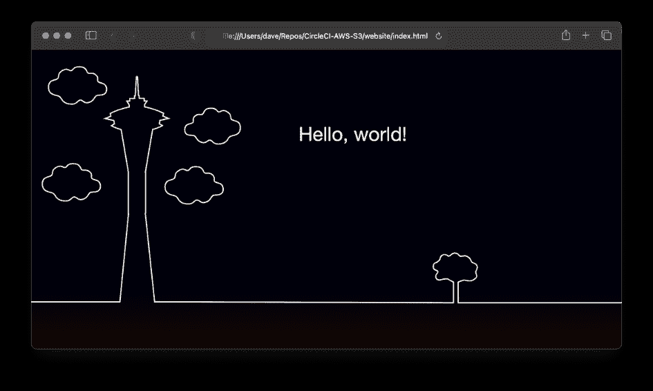
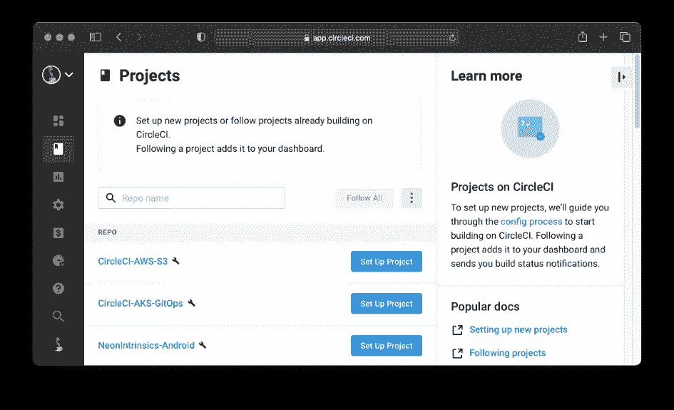
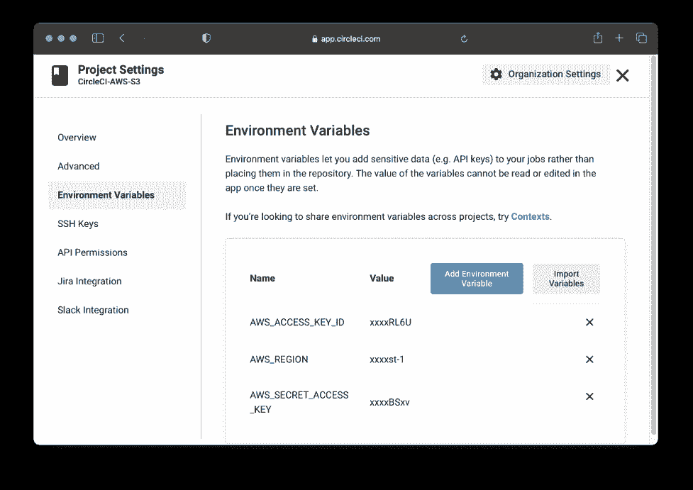
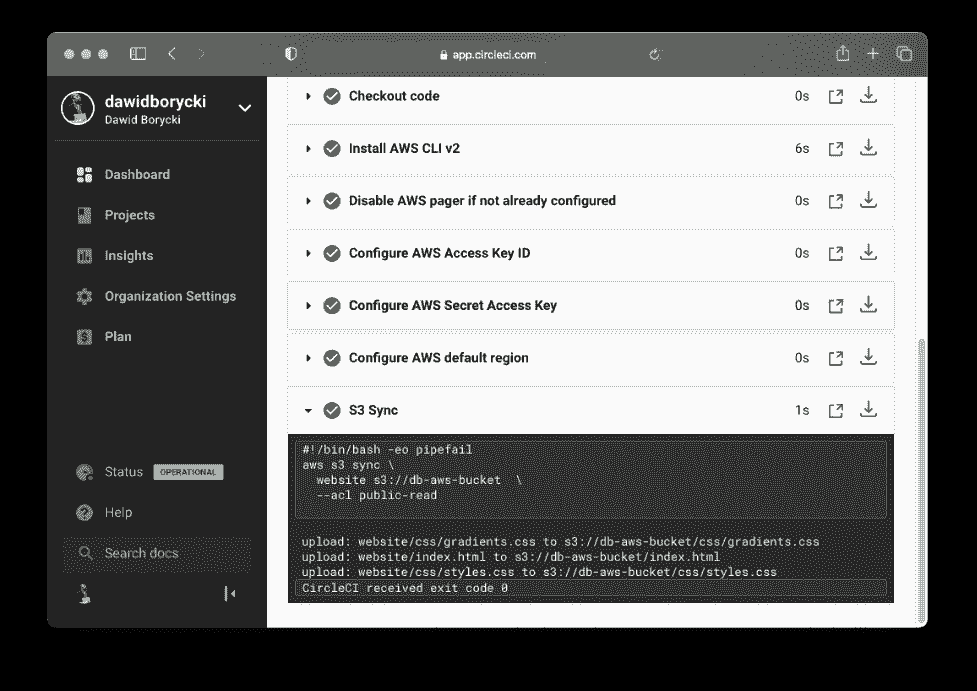
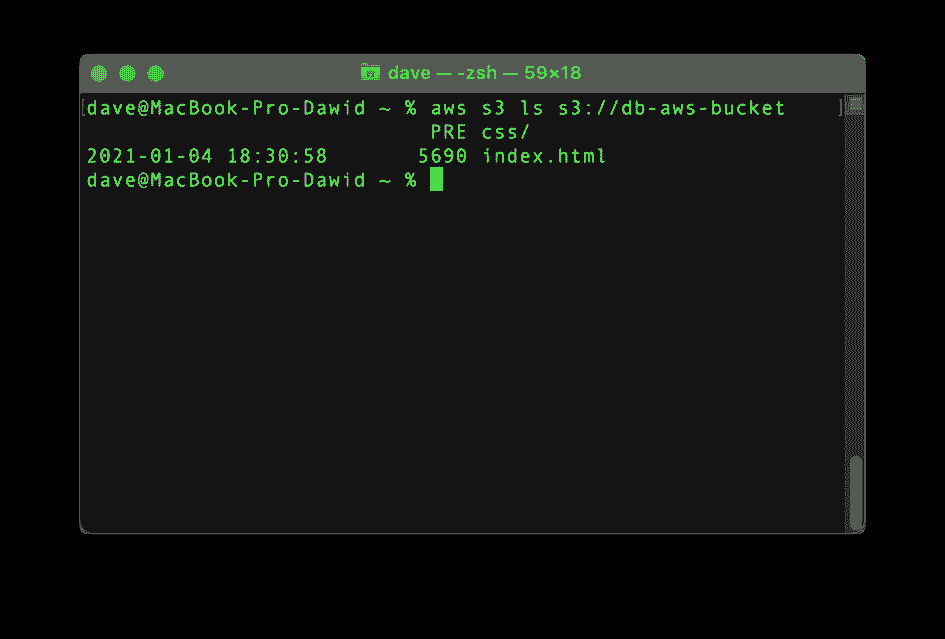
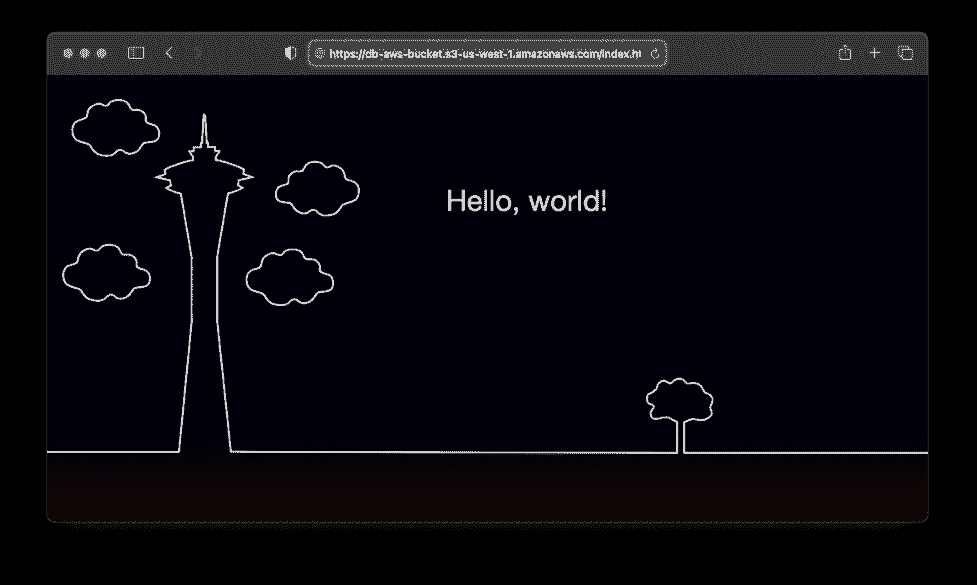
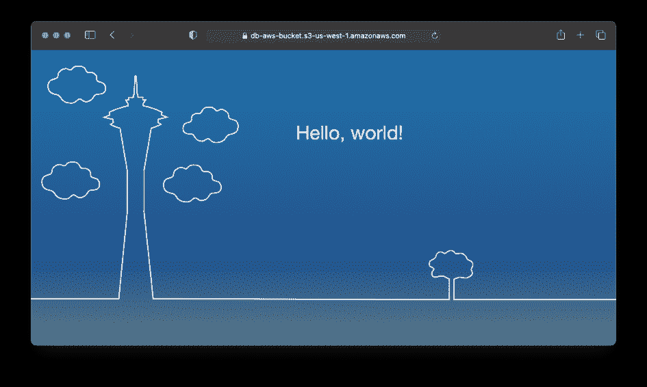

# 您可能没有考虑过的 GitOps 用例

> 原文：<https://thenewstack.io/gitops-use-cases-you-may-not-have-considered/>

[](https://www.linkedin.com/in/powellronald/)

 [罗恩·鲍威尔

罗恩有空间物理学的背景，曾作为卡西尼小组成员分析土星磁层中的等离子体。他现在在加州旧金山的 CircleCI 公司工作，作为一名开发人员，倡导开发内容，使开发人员能够更快地构建、测试和部署他们的项目。](https://www.linkedin.com/in/powellronald/) [](https://www.linkedin.com/in/powellronald/)

GitOps 越来越受欢迎。你可能在 Reddit 或 dev.to 上看到过它，但是 GitOps 到底是什么？

从广义上讲， **GitOps 采用了软件开发人员喜欢的 Git 和 CI 驱动的工作流的原则——通常用于自动化构建、测试和部署软件的过程——并将它们应用于其他业务流程**。

例如，云基础设施团队使用 GitOps 和基础设施即代码(IaC)工具(如 Terraform 和 CloudFormation)来简化云基础设施管理。他们喜欢它，因为它让他们可以重用强大的开发工具，更高效地完成工作。

但是，在软件开发和云基础设施供应之外，还有机会使用 GitOps 吗？它实际上对不涉及代码的事情有效吗？

## GitOps 的优势

一句话，是的。你可以在任何以文本为中心的工作流程中使用 GitOps 尽管这并不意味着你总是*应该*。新流程可能会增加更多的复杂性，而不是解决问题。

幸运的是，并不缺少受益于 GitOps 的业务流程。如果我们观察过程的单个步骤，就很容易理解它们是如何在软件之外增加价值的。一些好处包括:

*   **变更跟踪:**Git 存储库保存了对它所包含的文本文件的每一次变更的完整记录——无论这些文件是代码、配置、文档还是其他任何东西。浏览一个存储库，看看什么被修改了，什么时候，谁修改了，是很容易的。
*   **同行评审:**变更通常不会被推送到 Git 存储库的主分支。相反，变更被推送到一个分支或分叉，创建一个拉/合并请求，并且在它们被批准和合并之前，变更被除了它们的创建者之外的其他人审阅。
*   **版本控制:** Git 标签可以用来将特定的提交标记为重要。例如，如果您正在使用 GitOps 帮助写一本书，那么您可以在每次将副本发送给出版商审阅时创建一个标签。
*   **简单的回滚:**如果出于某种原因，您决定不喜欢您所做的更改，那么回滚到旧的标签或提交是很容易的。
*   **测试:**开发人员通常使用 GitOps 的 CI 部分来运行单元和集成测试。但是测试在其他情况下也是有用的。如果您使用 IaC，您可以对 Terraform 配置文件运行自动验证，以确保它们是有效的。如果您正在编写文档或文献，您可能希望添加自动拼写和语法检查。
*   构建和部署:这些可能看起来是特定于软件的，但是如果我们有创意，我们可以设想将它们用于其他任务的方法。例如，您可能希望通过将文档从 Markdown 转换为 HTML 来“构建”文档。或者，您可以通过自动上传到与您的出版商共享的 Dropbox 帐户来“部署”您所写的图书。

## GitOps 的边缘案例

考虑到这些好处，让我们看一些 GitOps 非常适合的边缘案例——即使它还没有被普遍使用。

### 写书

如果你正在写一本书，GitOps 可能正是你一直在寻找的工作流程。书籍非常适合 Git，因为它们几乎 100%基于文本。像 Markdown 和 AsciiDoc 这样的轻量级标记格式提供了标题、标题、列表、链接和图像等功能；同时保持纯文本中心。

当您完成编写时，您的 GitOps 管道可以通过运行拼写和语法检查来自动测试您的文本文件；然后将它们构建成多种图书格式，如 HTML、ePub 和 PDF。如上所述，当图书准备好进行编辑和出版时，您甚至可以将完成的图书部署到出版商的云驱动器中。

### 静态网站

静态网站在 90 年代统治了互联网，由于其性能优势，它们在过去几年中卷土重来。如果你的站点是基于内容的，比如一个博客，提供一个静态的 HTML 文件要比调用一个(或几个)数据库来生成动态的 HTML 要快得多。

似乎静态网站*不需要* GitOps。毕竟，如果它们只是静态的 HTML，难道不能通过简单地将文件复制到服务器并收工来避免复杂性吗？

不幸的是，静态站点不像以前那么简单了。它们通常以一组降价文件开始，因此网站页面比原始 HTML 更容易编辑。所以你至少需要一个构建来把你的静态站点变成你可以发布的东西。

但这还不是全部。如果您的静态站点有图像，您可能希望它们有多种尺寸，以确保您的站点在屏幕尺寸和像素密度差异很大的设备上看起来不错。您甚至可能想要多种格式的图像，如 JPEG、Webm 和 HEIC，以确保所有 web 浏览器都能下载它们支持的最佳格式。

所以至少，你的静态站点需要一个构建步骤来把它的页面转换成简洁的 HTML，并确保它的图片得到充分的优化。一旦你以这种方式编译了你的站点，你也可以让你的 GitOps 管道将更新复制到你的 web 服务器上。

### 合同和母猪

合同和工作说明书(sow)似乎不太适合 GitOps。但是实际上，Git 强大的变更跟踪能力对他们两个都很理想——还有类似的法律文档——因为他们在定稿和签署之前经常要经历几轮变更。

在典型的场景中，供应商向客户提交合同。接下来，客户的法律部门将阅读合同，划掉或修改任何不喜欢的条款，并将修改后的合同发回给供应商。在每一轮修订之后，供应商可以通过 git 提交和 pull 请求来应用更改，以确保每个更改都有完整、易于查看的记录。查看一系列 git 提交通常比在字处理器中处理复杂的变更跟踪更容易。

更好的是，当每个 pull 请求被合并时，GitOps 管道可以对更新的合同运行自动化测试，以检查其拼写和语法，然后确保它不包含任何供应商希望避免在其合同中使用的单词或术语。管道甚至可以包含一个构建步骤，将合同文本编译成最终的 PDF 发送给客户。

## 文档的 GitOps

GitOps edge 案例不仅仅是理论——GitOps 非常适合产品文档，并且通常用于此目的。文档类似于我们讨论过的其他一些边缘案例。它们可以在 Markdown、AsciiDoc 或 reStructuredText 中创建，并且可以很容易地存储在 Git 存储库中。

然后，CI 工具可以监视存储库，并构建和部署任何更新文档的新版本。“部署”步骤可大可小，这取决于文档的分发方式。如果文档以 HTML 格式发布，那么部署步骤可能非常简单，只需在每次 Git repo 中的文档页面发生变化时，将单个文件上传到云或本地服务器。

CircleCI 的文档是 GitOps 创造性使用的真实例子。文档[存在于 GitHub](https://github.com/circleci/circleci-docs) 上，并通过 [CI 管道](https://circleci.com/blog/what-is-a-ci-cd-pipeline/)自动构建和部署。

## 如何开始使用 CI 和 GitOps

让我们快速看一下如何使用 GitOps 和 CircleCI 通过 AWS S3 发布一个静态网站。传统上，您会使用 AWS 控制台或 AWS CLI 和`aws s3 cp or aws s3` sync 命令。此外，您需要设置 HTML 文件的公共访问，以使您的静态网站公开，或者在使用 CLI 时使用`--acl public-read`参数。

但是如果您已经在 Git 存储库中保存了您的网站，那么您只需要设置一个 CI 管道来使用 GitOps 完成这项任务。否则，您需要首先将文件提交给 Git 存储库。

在这个例子中，我们在 GitHub 存储库中存储了一个名为 [CircleCI-AWS-S3](https://github.com/dawidborycki/CircleCI-AWS-S3) 的网站。该网站有一个*index.html*文件和两个 CSS 文件。在 web 浏览器中呈现这些文件会生成以下视图: [](https://cdn.thenewstack.io/media/2021/03/223dbd49-image5.png)

为了设置 CI 管道以将该网站部署到 S3，我们首先创建了一个具有编程访问权限的 AWS 身份和访问管理(IAM)用户，然后生成了凭据。稍后需要这些凭证来让 CircleCI 访问 AWS 资源。接下来，我们在 *us-west-1* 地区创建了名为 *db-aws-bucket* 的 S3 bucket。

由于网站代码已经在 GitHub 中，CircleCI 可以看到我们所有的项目:

[](https://cdn.thenewstack.io/media/2021/03/07faea13-image3.png)

为了继续，我们单击了设置项目，然后提供了下面的 [config.yml](https://github.com/dawidborycki/CircleCI-AWS-S3/tree/main/.circleci) :

```
version:  2.1
jobs:
  build:
    docker:
      -  image:  'cimg/python:3.6'
    steps:
      -  checkout
      -  aws-s3/sync:
          arguments:  |
            --acl public-read
          from:  website
          to:  's3://db-aws-bucket'
orbs:
  aws-s3:  circleci/aws-s3@2.0.0

```

配置很简单。它只包含一个作业——build——首先检查源代码，然后使用 aws-s3 orb 将网站文件夹(来自存储库)与 s3 存储桶(s3://db-aws-bucket)同步。此过程相当于调用以下 AWS CLI 命令:

`aws s3 sync website s3://db-aws-bucket --acl public-read`

设置好管道后，我们使用 CircleCI 的项目设置将我们的 AWS 凭证和一个默认的 AWS 区域输入到相应的环境变量中(见下图):AWS_ACCESS_KEY_ID、AWS_SECRET_ACCESS_KEY 和 AWS_REGION。

[](https://cdn.thenewstack.io/media/2021/03/efa71827-image2.png)

在这个阶段，管道现在应该没有任何问题。可通过 CircleCI 门户网站跟踪进展情况:

[](https://cdn.thenewstack.io/media/2021/03/1b56ecef-image4.png)

部署完成后，所有网站文件都可以在 AWS S3 存储桶中看到:

[](https://cdn.thenewstack.io/media/2021/03/8afd71da-image6.png)

我们可以在浏览器中打开 index.html。该页面将向公众开放:

[](https://cdn.thenewstack.io/media/2021/03/d53f2481-image7.png)

## 持续集成优势是什么？

您可能想知道为什么在这里使用[持续集成(CI)](https://circleci.com/continuous-integration/) ，因为您也可以通过 AWS CLI 进行部署。优点是管道监视您的存储库，并且每当您提交代码变更到您的 Git 存储库中的主分支时会自动触发。因此，您可以专注于您的代码，并将新的网站版本直接部署到 S3。例如，如果我们对 index.html 进行以下更改:

`<body class="heaven-15"~~"heaven-23"~~>`

然后将更改提交到 Git 存储库，CI 管道将会触发。这将自动用新版本替换网站:

[](https://cdn.thenewstack.io/media/2021/03/4523fdf3-image1.png)

我们现在可以专注于开发我们的网站，而不用担心部署。一切都会自动发生。

## 后续步骤

我们已经看到了 GitOps 的一些有趣的边缘案例，也看到了 GitOps 的一个快速实例，但我们只是触及了表面。如果你有创意，你可以将 GitOps 应用到几乎所有以文本为中心的工作流程中。

CI 的采用改变了开发团队文化。当谈到开发团队的成功时，找到正确的 [DevOps 指标来衡量](https://circleci.com/blog/engineering-metrics/?utm_medium=content&utm_source=thenewstack&utm_campaign=content-thenewstack-content-2022q1---blogGitops)是至关重要的。了解[如何在](https://circleci.com/blog/how-to-measure-devops-success-4-key-metrics/?utm_medium=content&utm_source=thenewstack&utm_campaign=content-thenewstack-content-2022q1---blogGitops) [2020 年软件交付状态中用四个关键基准来衡量 DevOps 的成功](https://circleci.com/resources/2020-state-of-software-delivery/?utm_medium=content&utm_source=thenewstack&utm_campaign=content-thenewstack-content-2022q1---blogGitops):工程团队的数据支持基准。

通过 Pixabay 的特征图像。

<svg xmlns:xlink="http://www.w3.org/1999/xlink" viewBox="0 0 68 31" version="1.1"><title>Group</title> <desc>Created with Sketch.</desc></svg>