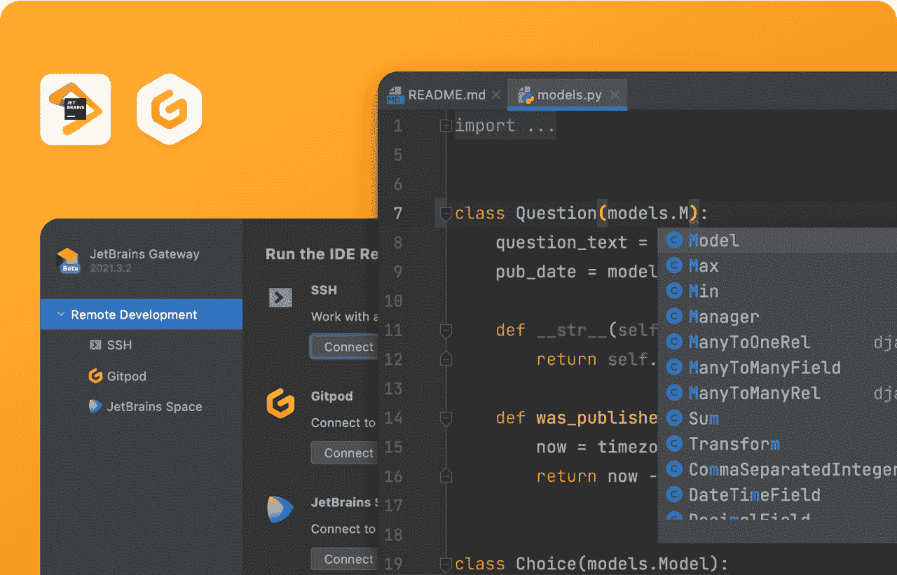

# Gitpod 为 JetBrains IDEs 带来了自动化环境

> 原文：<https://thenewstack.io/gitpod-brings-automated-environments-to-jetbrains-ides/>

超过 10 种特定语言集成开发环境(ide)的制造商 JetBrains 已经与自动化开发环境的开源平台 [Gitpod](https://www.gitpod.io/) 合作，根据一份声明，他们称之为“长期合作伙伴关系”，这将导致“他们平台之间的深度技术集成”。集成的主要表现形式是，至少现在是，JetBrains 的许多 ide 能够使用 Gitpod 提供的自动化的、基于云的开发环境。

就像容器如何抽象出特定开发人员环境的个别需求，以便在一台机器上工作的代码可以在任何其他机器上工作一样，GitPod 的自动化、基于云的开发人员环境使开发人员不必将他们的环境与他们公司使用的环境相匹配。在幕后，Gitpod 使用带有 Linux shell 的 Linux 容器，其中包含 root/sudo、文件系统、Docker 和所有其他运行在 Linux 上的工具和二进制文件。这种设置为用户提供了一个易于访问的自动化环境。

“这基本上让每个开发人员都放心，他们不需要为依赖性或维护他们的本地开发环境而斗争。相反，他们只需点击一个按钮，然后就能发挥创造力，编写代码，”Gitpod 的联合创始人兼首席合规官[约翰内斯·兰德格拉夫](https://www.linkedin.com/in/johanneslandgraf/?originalSubdomain=de)解释道。

最近，JetBrains 宣布他们将通过推出 [JetBrains 网关](https://www.jetbrains.com/remote-development/gateway/)来支持远程开发。兰德格拉夫说，正是这一声明，加上开发人员对 JetBrains ide 的广泛使用，足以开始讨论合作伙伴关系。

Landgraf 说:“你们有一家公司正在构建世界上最专业和最好的 ide，你们有 Gitpod，他们真正专注于后台的流程编排和自动化平台。“通过合作，我们将这两者结合在一起，允许开发人员继续使用他们的本地桌面 IDE，但交换计算，并在 Gitpod 提供和自动化的云中运行他们的工作负载。”

## 远程开发的时代

随着疫情期间远程工作的快速推进，两个团队都认为这是增加工具可用性以促进远程开发环境的大好时机。兰德格拉夫说，2021 年真的是远程开发的转折点，像浏览器中的 [GitHub 代码空间](https://github.com/features/codespaces)和 [Visual Studio 代码](https://thenewstack.io/this-week-in-programming-visual-studio-code-arrives-on-the-web/)这样的工具的到来。他预计，2022 年将带来这一领域的进一步发展。

“我们真的进入了远程开发的时代，”兰德格拉夫说。“越来越多的人会意识到，这实际上是一个非常有效的选择，而且比我们现在的做法更好。”

来源:Gitpod 和 JetBrains

Landgraf 说 Gitpod 认为它的位置不是支持任何一个 IDE 胜过另一个，而是将远程开发带到开发者已经在的地方。

“我们不是要求开发者进入浏览器，”他解释道。“我们不会告诉他们‘你需要改变你的工作流程。’我们实际上是在告诉他们:使用您经常使用的工具，但享受自动化后端和整个开发环境的好处，并在云中提供所有开发人员体验、协作和安全性好处。"

【JetBrains 的全球营销项目经理 Mikhail Vink 说，远程开发不仅仅是让开发者更有效率。他说，它还提供了更高的安全性，源代码安全性就是一个例子。

“在这种转变之前，许多安全严格或受监管的公司会禁止员工将源代码带回家，但现在这是不可能的，源代码一直驻留在开发人员的笔记本电脑上，或者员工必须连接到远程桌面，这是不稳定和不方便的，”Vink 解释道，并指出疫情期间远程工作引起的变化远程开发工作流降低了风险，因为开发人员将他们的客户端 IDE 连接到源代码所在的远程开发环境，并且不会将源代码复制到开发人员的机器上。"

Vink 说，另一个好处是 Gitpod 和 JetBrains 之间的合作为公司提供了远程开发，否则他们可能负担不起。例如，Citrix 不仅需要企业成本，还需要团队来设置和运行它，而 JetBrains 和 Gitpod 更具成本效益，并且易于启动和运行。

“正在发生的事情基本上是实现远程开发解决方案的民主化，降低准入门槛，以便更多的公司，而不仅仅是企业，可以去那里，”Vink 说。

<svg xmlns:xlink="http://www.w3.org/1999/xlink" viewBox="0 0 68 31" version="1.1"><title>Group</title> <desc>Created with Sketch.</desc></svg>