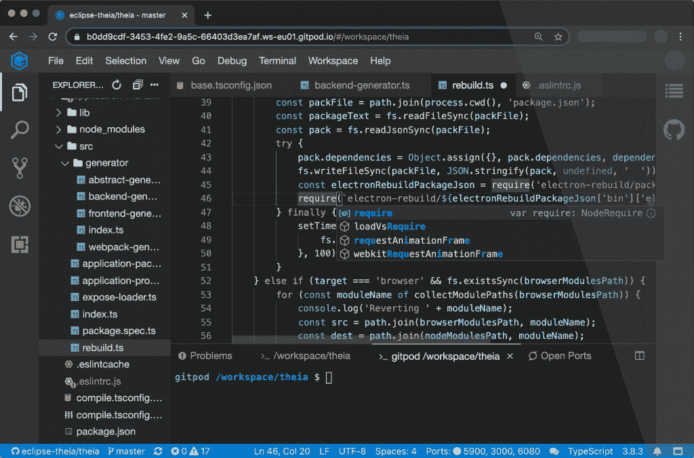

# Gitpod 开源“整体集成开发环境”

> 原文：<https://thenewstack.io/gitpod-open-sources-a-holistic-ide/>

Gitpod 本周发布了其集成开发环境(IDE)的开源版本，它称之为“一种新的基于云的 IDE，从根本上改变了软件开发人员构建应用程序的方式。”当你听到 IDE 这个词时，你可能会想到像 Visual Studio Code 或 Eclipse 或 Sublime 这样的代码编辑器，但 Gitpod 的联合创始人兼首席执行官[斯文·埃夫廷格](https://www.linkedin.com/in/efftinge/?originalSubdomain=de)解释说，Gitpod 的“IDE”是指更全面的环境。

“当我们说开发环境时，我们主要不是在谈论界面，而是更多的是为了提高开发人员的工作效率而需要的整体环境。它包括用户区——你需要的所有工具。它包括 git 库，也包括你在检查某个分支或 git 库后所做的一切，即生成代码、运行编译器、下载依赖项和所有这些事情，”Efftinge 说。“好的一面是，我们允许你用代码编写脚本。类似于你如何将基础设施作为你在开发管道中使用的其他环境的代码，你也可以描述开发环境。”

这并不是说 Gitpod 不提供代码编辑器。在帮助创建了作为 ide 基础的 [Eclipse 忒伊亚](https://projects.eclipse.org/proposals/eclipse-theia)之后，比如 Red Hat 的 [CodeReady Workspaces](https://developers.redhat.com/products/codeready-workspaces/overview) ，Eclipse Foundation 自己的 [Eclipse Che](https://www.eclipse.org/che/) 和 [Google Cloud Shell](https://cloud.google.com/shell) ，Efftinge 评论说编辑器本身并不那么重要。目前，Gitpod 使用忒伊亚作为其代码编辑器，但 Efftinge 表示，他们很可能会开放使用其他人。他说，更重要的是，Gitpod 是“DevOps 工具管道中缺失的一块”，它将自动化引入了开发环境，而不仅仅是代码创建之后的东西。

Gitpod 不仅仅是一个代码编辑器，它可以观察存储库中的变化，为每一个变化准备开发环境，设置工具，检查 git 分支，编译代码，下载所有依赖项并初始化一切。就像在版本控制系统中如何引用和恢复代码更改一样，每个开发人员环境都可以保存为快照，这有助于故障排除。

“在核心处，有一个 YAML 文件，您可以将其签入到您的存储库中，这与您使用 CI 工具的方式非常相似，它引用了一个 Docker 文件，您可以在其中安装所有需要的 Linux 工具。然后，您还可以运行脚本，就像在持续集成配置文件中一样。最后，我们给整个事情拍一个快照，这个快照等待着开发人员。每当开发人员需要开发环境时，他们就会得到该快照的副本，”Efftinge 解释道。“您可以对您的开发环境中的任何状态进行快照，然后您可以获得一个链接，该链接可以获得该环境、该具体情况的副本。”

Efftinge 进一步解释说，快照对于重现棘手的问题特别有用，否则可能会遇到经常听到的反驳“它在我的机器上工作。”除了故障排除之外，开发人员环境的快照还意味着开发人员可以从一台计算机移动到另一台计算机，仍然可以享受完全相同的环境，而无需花费任何时间进行配置和设置。Gitpod 还允许特定的软件版本与特定的环境版本相一致，这意味着如果您需要处理旧代码，您可以使用与之兼容的环境。能够在开发人员环境中使用版本控制也有助于减少配置偏差，因为您甚至可以跨团队控制开发人员环境。

Gitpod 目前以 SaaS 的身份提供，但对于那些不想对外公开源代码的人来说，这个版本也可以在 Kubernetes 集群上自托管，并且可以与“几乎任何代码托管平台”一起工作，包括 GitLab、GitHub Enterprise 和 Bitbucket。

<svg xmlns:xlink="http://www.w3.org/1999/xlink" viewBox="0 0 68 31" version="1.1"><title>Group</title> <desc>Created with Sketch.</desc></svg>