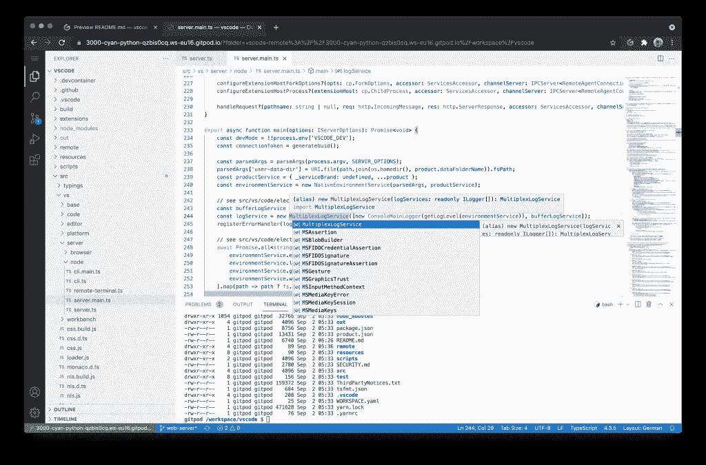

# GitPod OpenVSCode 服务器将 Visual Studio 代码带到浏览器中

> 原文：<https://thenewstack.io/gitpod-openvscode-server-brings-visual-studio-code-to-the-browser/>

允许开发人员在云中运行自动化云开发环境的 GitPod 公司已经发布了开源的 [OpenVSCode Server](https://github.com/gitpod-io/openvscode-server) ，它允许开发人员在浏览器中运行上游 Visual Studio 代码(VS 代码)。

此次发布是继去年 GitHub 和微软在 T4 推出 GitHub Codespaces 之后，GitHub 联合创始人兼首席执行官 [Sven Efftinge](https://www.linkedin.com/in/efftinge/?originalSubdomain=de) 指出 GitHub Codespaces 仍然是封闭源代码，没有以其他方式提供的明显计划。

“微软还没有公布在浏览器中运行该软件所需的秘密源代码，因为有那么多人找到我们，问‘我们该怎么做？’我们认为这可能是一个好主意，只是提取秘密来源，把它放入自己的项目，然后发布它，”埃夫廷格说。

Efftinge 说，值得注意的是，GitPod 和 GitHub 代码空间“远不止是 web IDE”，但提供对开发人员最喜欢的工具的访问仍然是一个关键部分。许多公司都加入了支持 GitPod 的 OpenVSCode 服务器的行列，包括 VMware、优步、SAP 和 Sourcegraph，其中许多公司已经在内部为他们的团队构建了远程开发环境。

然而，OpenVSCode Server 为个人开发人员带来了 VS 代码 IDE，Efftinge 提供了 RStudio 作为示例，在这种情况下，远程访问 VS 代码将非常有用。

“VS 代码技术是构建下一代数据科学 IDE 的重要基础。它通过 VS 代码扩展为数据科学工作提供了一个非常好的集成。所以他们对在他们的 SaaS 解决方案中运行 VS 代码感兴趣。“鉴于这个项目，我们还与优步和 Spotify 进行了交谈，结果发现他们都有这些内部项目，在某种意义上，他们为他们的用户提供开发环境，他们希望为他们提供 VS 代码接口。”

Efftinge 表示，总的来说，他们看到公司出于各种原因转向远程开发的趋势，包括开发人员机器的限制以及微服务架构和数据科学等日益突出的事物，这些事物需要的能力超过了笔记本电脑所能提供的能力。

使用 OpenVSCode Server，开发人员只需运行 Docker 命令，就可以在本地桌面计算机上安装项目，然后从低功耗设备(如 iPad 或 Chromebook)上远程工作。此外，他们可以将 OpenVSCode 服务器安装到云中，该项目包括在 AWS 和 Google Cloud 上运行的指南，例如，用于数据科学用例。

在让开发人员访问他们最喜欢的 IDE 的简单行为背后，Efftinge 概述了这个项目背后的一些其他原因。首先，他指出基于浏览器的 ide 正在成为一种商品,“这不再是公司应该花费在竞争上的东西，而是他们应该真正地合作和一起工作。这就是我们把它作为开源软件的原因。没有理由任何人需要建立一个竞争对手或一个新的解决方案。你知道，这就像是 ide 的 Linux。”

除此之外，GitPod 联合创始人和首席运营官 [Johannes Landgraf](https://www.linkedin.com/in/johanneslandgraf/?originalSubdomain=de) 补充道，“我们看到人们黑 VS 代码，大规模修补它，做许多不必要的事情，因为他们并不真正理解架构。我们只是认为这没有必要。”

因此，OpenVSCode Server，Landgraf 说它只有几百行代码，为浏览器中的上游 VS 代码提供了这种维护的远程服务器，消除了对分叉和碎片的需要。Efftinge 说，保持项目小而简单，实际上是项目前进的整个计划。

“我们希望保持小而精。这里的重点实际上不是在 VS 代码上构建什么东西，而只是用能够在各种上下文中运行它来补充它。我们不会向代码库添加功能或最终用户功能或类似的东西。我希望，也许最终，VS 代码团队自己会发现这一点，这样就不需要下游项目了，”他说。

<svg xmlns:xlink="http://www.w3.org/1999/xlink" viewBox="0 0 68 31" version="1.1"><title>Group</title> <desc>Created with Sketch.</desc></svg>