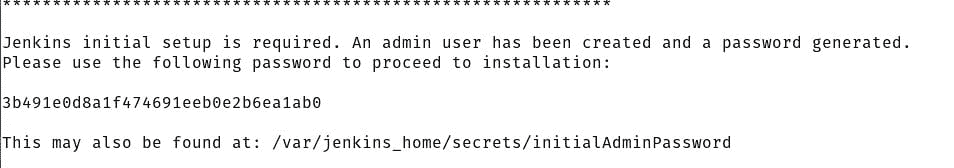
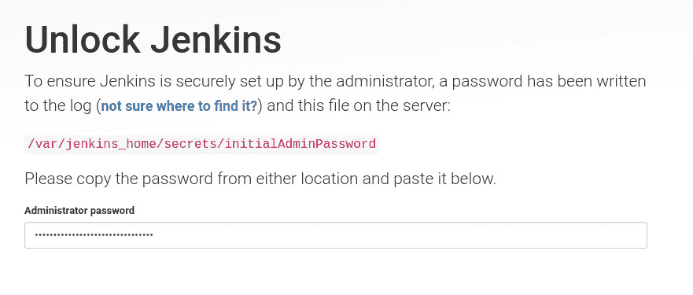
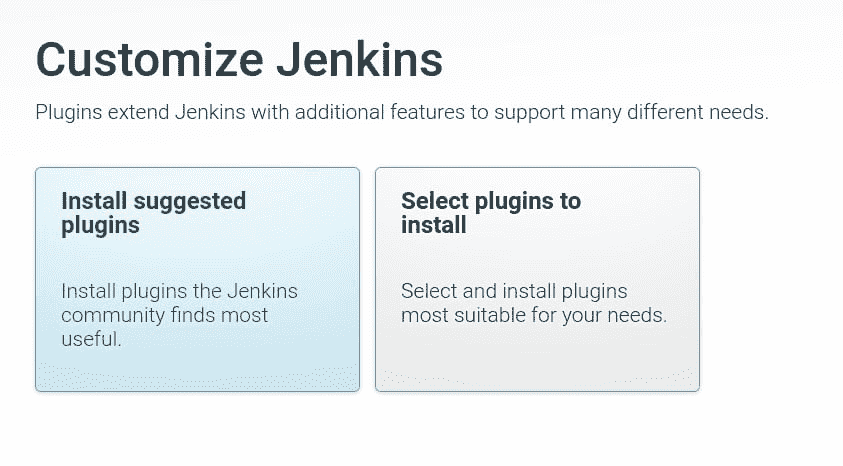
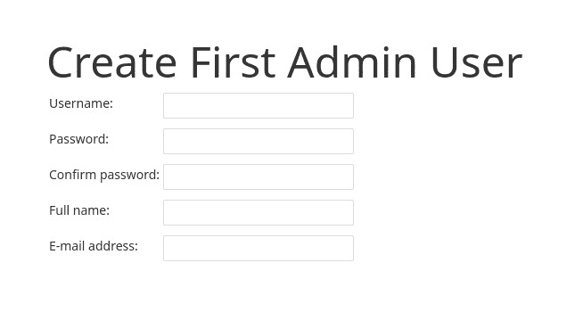
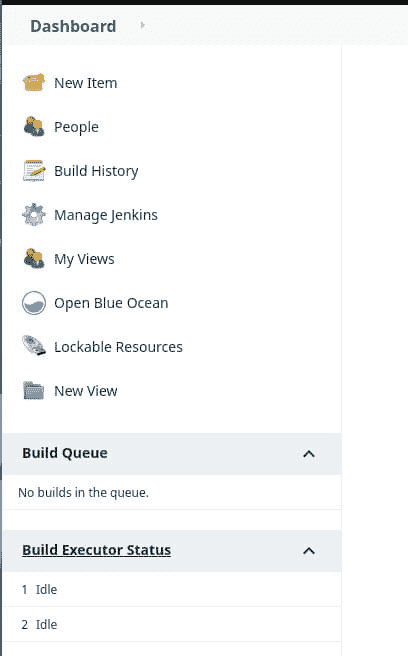
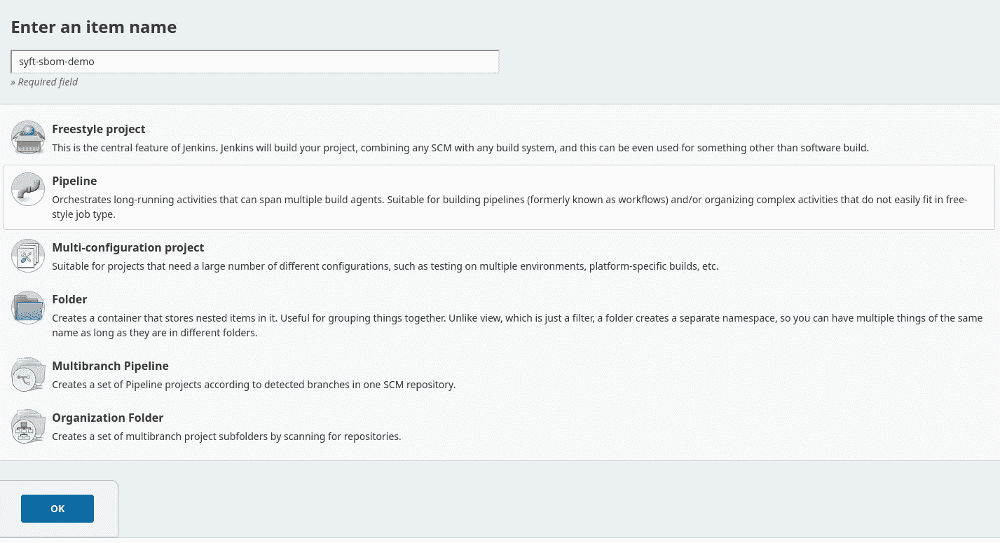
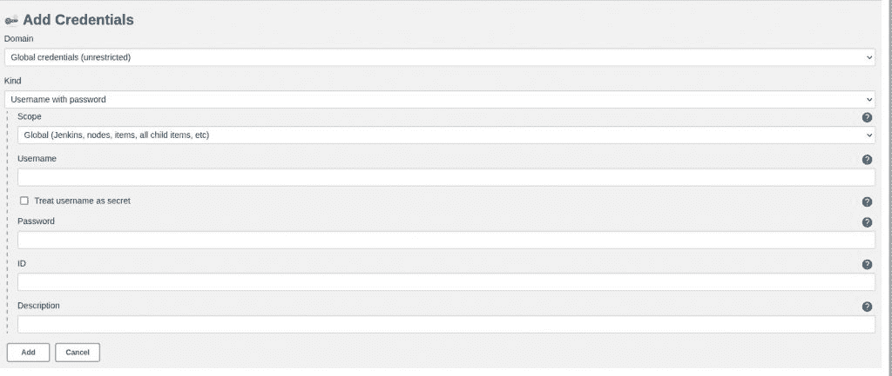
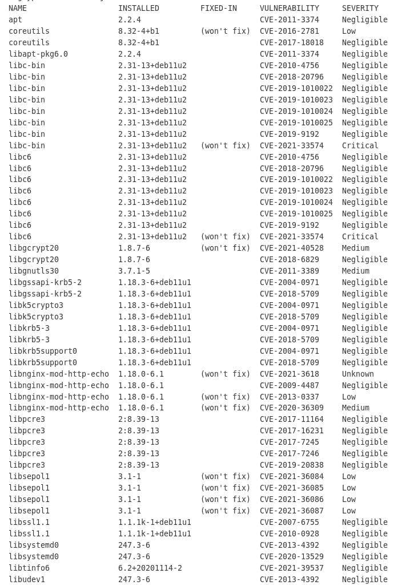

# 用 Syft 给 Jenkins 一份软件材料清单

> 原文：<https://thenewstack.io/give-jenkins-a-software-bill-of-materials-with-syft/>

自从美国白宫今年早些时候发布其[网络安全行政命令](https://www.whitehouse.gov/briefing-room/presidential-actions/2021/05/12/executive-order-on-improving-the-nations-cybersecurity/)以来，呼吁政府机构提高其安全性，供应链安全至关重要这一点变得相当明显。其中一个主要原因是，在过去的一年里，我们已经看到了许多供应链受到攻击的例子。这导致了对不安全感的全面打击。

帮助这一尝试的一个方法是提供所谓的软件材料清单(SBOM)。我最近[写了一个教程](https://thenewstack.io/generate-a-software-bill-of-materials-for-a-container-image-with-syft/)关于如何使用一个叫做 [Syft](https://github.com/anchore/syft) 的命令行工具生成一个 SBOM。

对于某些人来说，命令行是完成这一任务的完美工具。它高效、简单、有效。然而，对于其他人来说，基于 web 或 GUI 的解决方案是必要的。幸运的是，云原生开发者反应迅速，因为他们已经准备好了大部分内容，所以很快就有了解决方案。所述解决方案涉及 Syft、 [Grype 漏洞工具](https://github.com/anchore/grype)和 [CloudBees](https://www.cloudbees.com/?utm_content=inline-mention) ' [CI/CD 软件 Jenkins](https://www.cloudbees.com/jenkins) 的组合。有了这三个工具，您可以在几秒钟内从 git 存储库生成一个 SBOM……所有这些都是在基于 web 的 Jenkins 中完成的，这是一个许多云原生开发人员已经知道的工具。

那么这是怎么做到的呢？让我展示给你看。

## 安装 Docker

为了快速、轻松地完成这项工作，我们将在 Docker 的帮助下完成所有的安装。所以我们必须做的第一件事就是安装 Docker。我将在 Ubuntu Server 20.04 上演示，所以如果您使用不同的 Linux 发行版，请确保根据需要修改指令。

要在 Ubuntu 服务器上安装 Docker，请登录并发出以下命令:

`sudo apt-get install docker.io -y`

安装完成后，使用以下命令启动并启用 Docker 服务:

`sudo systemctl enable docker`

`sudo systemctl start docker`

最后，使用以下命令将您的用户添加到 docker 组:

`sudo usermod -aG docker $USER`

注销并重新登录，以使更改生效。

## 如何通过 Docker 部署 Jenkins

接下来，我们将使用以下命令将 Jenkins 部署为 Docker 容器:

`docker run -u root -d --name jenkins --rm -p 8080:8080 -p 50000:50000 -v /var/run/docker.sock:/var/run/docker.sock -v /tmp/jenkins-data:/var/jenkins_home jenkinsci/blueocean`

给容器一点时间启动。启动时，您需要使用以下命令定位 Jenkins 容器名称的前四位数字:

`docker ps -a`

有了这四个数字，查看 Jenkins 日志:

`docker logs ID`

其中 ID 是 Jenkins 容器的 ID。在该日志文件的输出中，您应该看到 Jenkins 初始设置要求下的一长串字符(**图 1** )。

图 docker logs 命令的输出显示了初始的管理员密码。

打开浏览器，指向 http://SERVER:8080(其中 SERVER 是您的服务器的 IP 地址)。您将看到一个窗口，要求输入初始管理员密码(**图 2** )。

图 2:在这里粘贴您的初始管理员密码。

粘贴密码后，点按“继续”。

在下一个窗口中(**图 3** ，点击安装建议插件。

图 3:为 Jenkins 安装所有推荐的插件只需点击一下鼠标。

插件安装需要一些时间才能完成。这时，您将看到一个窗口，允许您创建一个新的管理员用户(**图 4** )。

图 4:在 Jenkins 中创建您的第一个管理员用户。

输入管理员用户的详细信息，然后单击保存并继续。

## 安装 Syft 和 Grype

当该过程完成时，通过返回到终端窗口并发出以下两个命令来安装 Syft 和 Gype:

`docker exec jenkins bash -c 'curl -sSfL https://raw.githubusercontent.com/anchore/syft/main/install.sh | sh -s -- -b /usr/local/bin'`

`docker exec jenkins bash -c 'curl -sSfL https://raw.githubusercontent.com/anchore/grype/main/install.sh | sh -s -- -b /usr/local/bin'`

现在，您已经准备好生成第一个 SBOM 了。

## 生成 SBOM

使用您的新管理员用户凭据登录 Jenkins。在主窗口(**图 5** )中，点击左侧导航栏中的新建项目。

图 Jenkins 侧边栏是您管理所有构建的地方。

在出现的窗口中(**图 6** ，将新项目命名为 syft-sbom-demo，点击 Pipeline，然后点击 OK。

图 6:为 Syft SBOM 创建新的管道。

在“管道配置”窗口中，选择以下选项:

*   定义–来自 SCM 的管道脚本
*   供应链管理–Git
*   资源库 URL–https://github.com/pvnovarese/syft-sbom-demo(尽管您可以使用任何 GitHub 资源库进行演示)。

从 Credentials 下拉菜单中，选择 Jenkins，然后在弹出的窗口中(**图 7** )，根据需要填写您的 GitHub 凭证。

图 7:为 GitHub 创建凭证。

完成凭据配置后，单击添加。

单击保存，然后单击立即构建。

构建将克隆一个 alpine base 映像，称为 Syft，并生成 SBOM。然后，您可以通过单击构建历史中的#1(因为这是您的第一个构建)并单击控制台输出来查看 SBOM。向下滚动直到看到 SBOM ( **图 8** )。

图 8:我们的 SBOM，由 Syft 通过 Jenkins 生成。

这就是使用 Jenkins 和 Syft 为您的 GitHub 托管项目生成软件材料清单的全部内容。这个演示将为您提供为所有依赖于容器映像的云原生 GitHub 项目生成 SBOMs 的方法。让你的项目工作起来可能需要额外的努力(与演示相反)，但是现在你已经知道它是如何工作的了，你应该能够集成到你自己的工作流程中了。

<svg xmlns:xlink="http://www.w3.org/1999/xlink" viewBox="0 0 68 31" version="1.1"><title>Group</title> <desc>Created with Sketch.</desc></svg>