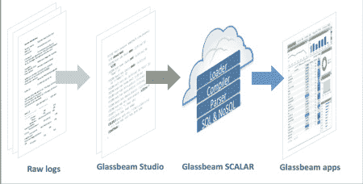

# Glassbeam 将机器分析扩展到其核心医疗保健市场之外

> 原文：<https://thenewstack.io/glassbeam-hones-healthcare-machine-analytics/>

Splunk 之于物联网日志数据，正如 Glassbeam 之于物联网机器日志数据。

Glassbeam 创始人兼首席执行官[庞迪特](https://www.linkedin.com/in/puneetpandit/)、[说:“我们经常被拿来和 Splunk 比较，尽管我们在市场上处于非常不同的位置。“Splunk 在教育市场挖掘机器日志数据的价值方面做得非常出色。…当你进入物联网市场时，那里有许多不同种类的机器和东西，格式变得更加非结构化和多结构化。”](https://www.glassbeam.com/)

这家总部位于加州圣克拉拉的公司成立于 2004 年，虽然它的起源是数据中心的日志记录，但在 2018 年，它的重点是价值数十万美元的医院成像设备。

包括医院和制造商自己在内的客户使用这些数据来减少停机时间，跟踪利用率，并发现员工何时需要更多培训来更有效地使用机器。

“我们的云平台可以挖掘关于机器如何工作的数据，以便计划外事件变成更有计划的维护。使用我们的模型，如果您插入五台核磁共振成像机和五台 CT 扫描仪，正常运行时间可以节省 300 万到 400 万美元的收入，还可以节省数十万美元的维护费用，”Pandit 说。

## 利用机器数据

[Harbor Research](http://harborresearch.com/) 预计，到 2022 年，利用医疗成像设备的复杂机器数据将产生 111 亿美元的潜在收入价值。

It [认为](https://www.glassbeam.com/harbor-research-report)大多数用户仅仅触及了他们机器数据的全部价值的表面。采用分析来了解机器用途和行为的新工具可以提高生产率，发现运营风险，并有助于提高安全性。然而，这些工具需要规范化不同数据类型和融合不同数据集的能力。

“从聚合的大规模传感器和复杂的机器日志数据中检测模式的能力是智能系统的圣杯，”它在一份研究报告中说。

然而，“……没有更好的数据转换工具，再多收集的数据也无法有效分析；这是物联网和机器数据发展过程中的‘薄弱环节’。”

Pandit 将 Glassbeam 平台描述为三个步骤:数据摄取，可以是流或批处理文件；转型和分析。

Glassbeam 代理是一个基于 Java 的小程序，由 [PTC ThingWorx](https://www.ptc.com/en/products/iot/thingworx-platform) 提供支持，包括一个 [ActiveMQ](http://activemq.apache.org/) 代理来监听实时消息，并向 Glassbeam 分析云提供安全的数据传输。这个代理可以运行在网关服务器上，也可以运行在云上。这些数据是关于机器本身的，而不是敏感的患者信息。

SaaS 平台使用[符号解析语言](https://cloud-computing-today.com/tag/semiotic-parsing-language/) (SPL)，一种特定领域的语言来解析、标记、建模和存储数据。它可以处理 3000 多种格式，不仅可以在日志之间变化，也可以在单个日志文件中变化，包括 CSV、JSON 和 XML，以及半结构化数据，如表格、名称-值对、Syslog 格式和非结构化文本，它在一篇博客文章中指出。

Harbor Research 将 Glassbeam 的云平台称为 SCALAR，并将其与 SPL 称为该公司的主要竞争优势:

该平台利用 Glassbeam 的 SPL 将数据解析、ETL 和规则/操作结合到单个处理元素中(能够在一个开发步骤中处理非结构化和结构化数据)

它将其规则引擎称为“复杂的事件处理技术，可以模拟和捕获阈值和异常情况，然后在满足预定义的条件时发送警报。”

例如，室温是 MRI 机器正常运行的关键因素。依赖历史批次数据可能会产生问题，并导致停机。然而，实时警报可以警告温度波动，并防止停机和设备损坏。

这个平台和它上面的应用程序运行在 Amazon Web Services 上，尽管它们也可以运行在其他云或者防火墙内部的私有云上。

除了自己的技术，Glassbeam 还使用 Apache Cassandra 和 Vertica 进行数据存储，Solr 索引数据进行搜索，并与 Spark 集成进行机器学习。潘迪特说，它将在 2018 年第一季度为 Kafka 增加集成。

Harbor Research 表示:“Glassbeam 将核心机器和设备制造商的分析需求视为一个统一的挑战，可以通过一个可扩展的端到端解决方案来解决，从而避开了当前的市场噪音和对物联网的痴迷。”

根据 451 Research 的研究，Glassbeam 将与 Splunk、Sumo Logic、Loggly 和其他公司进行比较，因为它们在分析的日志数据类型方面有所扩展，并且从 TIBCO、Software AG 和 SAP 等供应商那里获得了数据流和复杂事件处理技术。它预测其机会在于更紧密地关注物联网和边缘分析。

为了缩短开发人员用 SPL 构建应用程序的时间，Glassbeam 开发了 Studio，这是一个图形开发环境，有三个构建块:数据准备和转换；app 可视化；和云支持。

其搜索应用程序 Glassbeam Explorer 结合了全文和参数搜索、日志查看器和配置更改浏览器。

其边缘计算技术 Glassbeam Edge 包括基于消息总线和异步处理的弹性容错架构；可编程的解析引擎，以及动态更改上下文、解析和应用基于事件的规则的能力。

为了与医疗保健组织更紧密地合作，它最近公布了其临床工程分析(CLEAN)蓝图，以缩短实施时间。

通过 Pixabay 的特征图像。

<svg xmlns:xlink="http://www.w3.org/1999/xlink" viewBox="0 0 68 31" version="1.1"><title>Group</title> <desc>Created with Sketch.</desc></svg>