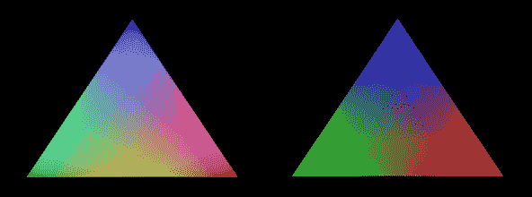

# Glium 图书馆展示了 Rust 最好的一面

> 原文：<https://thenewstack.io/glium-library-showcases-rust-best/>

Rust 自成立以来发展迅速，拥有一批忠诚的用户，致力于 Mozilla 的 OSS 语言。Rust 给了 Mozilla 一个[新的关联](http://readwrite.com/2015/07/02/mozilla-rust-programming-language-potential)，并且经常在与编程语言相同的背景下被讨论，例如刚刚发布了 1.5 版本的的 [Go。就此而言，Rust 刚刚发布了 1.2 版本的](https://golang.org/doc/go1.5)[，1.3 版本的 beta](http://www.i-programmer.info/news/98-languages/8872-rust-release-new-versions.html)。

对于那些从事游戏设计和开发的人来说，Rust 为改进老项目开辟了新的可能性。Tomaka 已经使用 Rust 创建了 Glium 库，该项目围绕当前的 OpenGL 库，为那些使用 OpenGL 进行游戏设计、开发或数学用途的人提供系统改进、代码快捷方式和生活质量升级。

Tomaka 在一篇中型文章中强调了当前 OpenGL 库的缺陷，介绍了 Glium 将为那些选择将其与当前 OpenGL 库一起安装的人带来的变化。Tomaka 非常关注 OpenGL 中存在的性能问题以及安全问题。除了从 OpenGL 4 开始不强制内存安全之外，OpenGL 使用全局状态。因此，Tomaka 开始致力于 Glium，试图通过使用 Rust 来提高 OpenGL 的性能和安全性。

Rust 编程长期以来一直因其安全性和易于在任何通常输入 C++的地方交换而受到吹捧。随着越来越多的开发人员转向 Rust，寻求其在安全性、速度和代码编译方面的改进，越来越多的项目被创建出来，以拓展 Rust 的能力。Rust 的现代开发生态系统提高了那些希望学习 Rust 的人的生活质量，而该语言的编译为初学者和老手灌输了最佳实践。

通过插件和包管理的使用，Rust 与 C++的区别还在于它自动化了这个过程，使开发人员不必自己手动获取、下载和编译库。Rust 抓住了 C++或用 C++编写的项目的常见痛点，并提供了用干净、安全的代码解决这些痛点的新方法。

## Glium 库简介

Glium 希望通过包装 OpenGL 4 来解决 OpenGL 4 存在的问题，使用户能够使用他们熟悉的 OpenGL，同时添加一些功能，以节省时间并减少在 OpenGL 中工作时的常见问题。Tomaka 指出，用户仍然必须管理纹理、缓冲区和程序，但将能够在一个更加用户友好的环境中这样做。Glium 为用户提供了一个更好的初始化上下文的方法，即使用 Glutin OpenGL 上下文创建库。这在明胶的当前窗口上实现了`backend`特性，使得曾经繁琐的过程变得更加简单。为了用 Glium 初始化一个窗口，Tomaka 指示用户运行下面的代码:

```
let display  =  glutin::WindowBuilder::new().build_glium().unwrap();

```

Tomaka 向那些使用旧系统的人保证 Glium 库几乎可以在任何框架上使用，除了 OpenGL ES 1。希望使用 Glium 进行移动开发的开发人员可以在 OpenGL ES 2 中使用这个库。旧版本的 OpenGL 与 Glium 兼容，尽管它只正式支持 OpenGL ES 2 和 3。

由于在 OpenGL 中移除内存安全后，安全是使用 OpenGL 的主要问题，Tomaka 试图通过 Glium 中的大量安全功能和改进来正面解决这一问题。Glium 通过确保 OpenGL 的对象都不实现`Send`函数来确保安全的上下文管理，确保它们不能离开它们的 thead。如果用户调用一个函数，Glium 会调用当前的上下文内容，以确保该上下文是最新的版本。如果不是这样，Glium 在指定的上下文中调用`MakeCurent`。

这使得用户能够运行多个 OpenGL 库或上下文，而不会遇到崩溃。我们鼓励用户手动处理缓冲区，Glium 提供了一个持久映射的缓冲区选项。执行使用缓冲区段的命令将创建一个同步栅栏来跟踪对缓冲区的访问。持久映射的缓冲区极大地提高了系统性能，从而在绘制数据流时显著提高了 FPS。

## Glium 提升系统性能

Tomaka 与 Glium 合作的一个亮点是其对 sRGB 价值观的处理。对于那些从事游戏设计或需要严格颜色输出的数学图形应用程序，Glium 使用 Rust 来指定 sRGB 和 RGB，假设默认情况下片段着色器返回 RGB 值。然后它会要求 OpenGL 将这些值转换成 sRGB。

[](https://thenewstack.io/wp-content/uploads/2015/08/1-Oj3C5-ndlB5ASl1CYT459A.png)

左图:Glium 的 sRGB 修正了 OpenGL Hello 三角形。右图:未校正的 RGB OpenGL Hello 三角形。

在研究 Glium 如何处理绘图过程时，Tomaka 还解决了 OpenGL 中存在的核心性能问题。因此，Glium 提供了一个通用的绘图过程，使用户能够释放资源，否则每次调用 OpenGL 函数时都会占用 CPU。这可以防止不必要的调用，尽管 Tomaka 指出，用户仍然应该按照纹理、程序或参数对绘制调用进行分组，以帮助提高系统性能。

由于内存安全是自 OpenGL 4 以来 OpenGL 用户的另一个痛点，Tomaka 通过自动调用`glMemoryFence`和`glFenceSync`将内存安全引入 Glium with Rust。Tomaka 指出，如果确实发生了错误，就会引发恐慌，鼓励开发人员报告问题。Glium 还利用了`GL_KHR_no_error`和`EGL_KHR_create_context_no_error`扩展，允许用户在上下文创建期间传递标志。Tomaka 指出，虽然这些扩展尚未获得批准，目前也不受支持，但它们在其他 Rust 应用中有潜力。通过 Glium 在编译时避免 OpenGL 错误，用户可以启用这些标志，从而体验到显著的性能提升。

Glium 仍在开发中，OpenGL GitHub 问题概述了尚未实现的新功能。Tomaka 指出，如果使用该库，使用 Firefox Nightly 版本的 rustc 应该会大大提高速度和性能。Glium 是用 Rust 编写的最大的单机箱代码项目之一，随着越来越多的项目转向 Rust 以获得没有错误的安全代码，它展示了该语言的优势。

Tomaka 开发了 Glium 来改进 OpenGL 库，但这个项目证明了人们可以如何使用 Rust 来支持曾经依赖于 C++的项目。Glium GitHub 库提供了 Glium 未来改进的路线图，以及 Rust 社区可以贡献的[开放问题](https://github.com/tomaka/glium/issues)。

特征图片:[Mikael Hvidtfeldt Christensen](https://www.flickr.com/photos/syntopia/)创作的: [Jugend Tree 2D](https://www.flickr.com/photos/syntopia/1233629110) 由 2.0 在 [CC 下授权。](https://creativecommons.org/licenses/by/2.0/)

<svg xmlns:xlink="http://www.w3.org/1999/xlink" viewBox="0 0 68 31" version="1.1"><title>Group</title> <desc>Created with Sketch.</desc></svg>