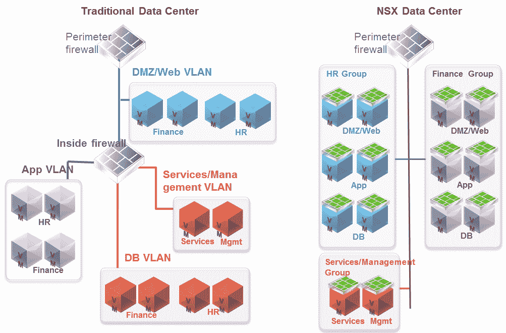
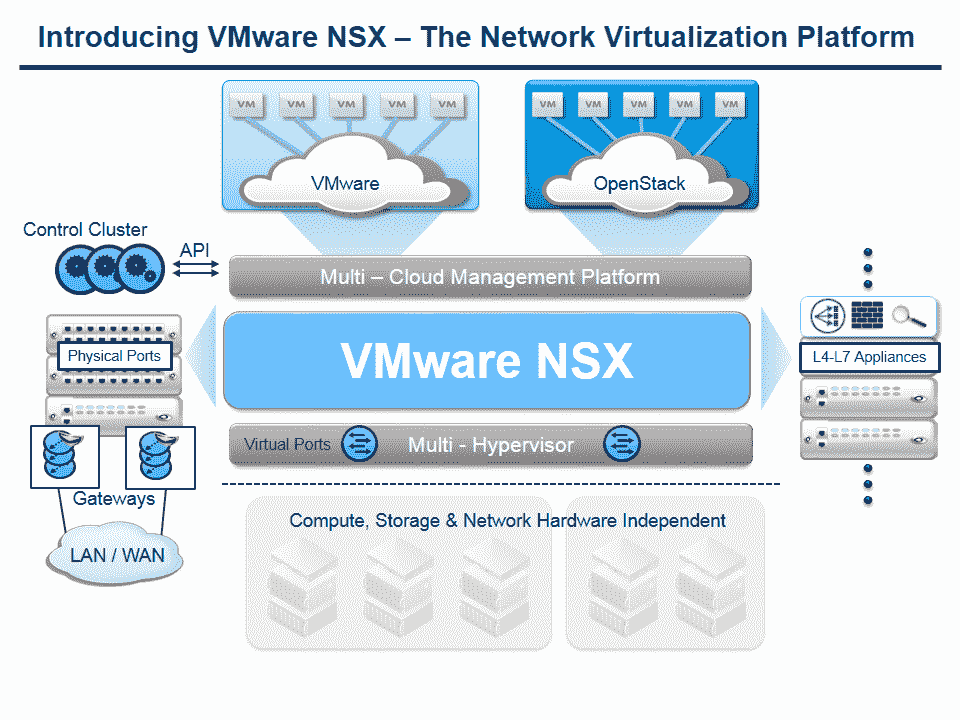

# Global Speech Networks 借助 VMWare NSX 分公司拥抱软件定义的网络

> 原文：<https://thenewstack.io/global-speech-networks-embraces-software-defined-networking-vmware-nsx/>

总部位于澳大利亚的联络中心云提供商 Global Speech Networks (GSN)在使用软件定义网络(SDN)方面取得了飞跃，以确保客户隐私并加快开发时间。

通过采用 [VMWare 的 NSX 平台](https://www.vmware.com/products/nsx)(一种 SDN 部署)，GSN [能够](https://www.youtube.com/watch?v=rkcl8yIkgNg)整合其开发环境并简化其运营部署。由于采用虚拟化在该公司专注于电信的同行中被视为一种风险，该公司能够通过快速应用部署、整合管理成本以及在需要时对其环境进行更改的能力来获得竞争优势，这一切都归功于 SDN 架构。

GSN 采用 NSX 的部分原因是它专注于[微分段](https://blogs.vmware.com/tribalknowledge/2015/04/eili4-micro-segmentation.html)，这是一种将系统分成非常小的颗粒以获得更好的控制和安全性的方法。GSN 技术运营主管 Blake Douglas 表示:“然后，我们能够将数据分配到第二层或第三层，将细分推向产品层，然后强制实施。

图为:VMWare NSX 上的微分段

在实时通信行业工作时，客户隐私是一个值得关注的问题。数据分段有助于解决这一问题。隔离多租户网络有助于确保敏感数据保持安全，同时组织可以在其现有技术堆栈上运行 NSX，以确保他们不必编写全新的软件来确保客户数据在其网络上保持安全。

借助 VMWare NSX，用户可以将其软件平台扩展到他们选择的任何数据服务。这对于那些考虑从传统物理架构转向虚拟化数据中心的人尤其有用。

“过去，想要数据中心解决方案的人会出去购买硬件和软件，然后与 it 捆绑在一起。现在他们可以拥有平台无关的技术，”道格拉斯说。SDN 还为 GSN 等 NSX 客户带来了加密其数据中心通信的机会。

## 向虚拟化飞跃

虚拟机允许开发人员从在物理服务器上工作可能产生的问题中抽象出来。Douglas 指出，GSN 还可以将其物理工作负载直接从物理数据中心转移到 NSX，这样就可以从 VLAN 转移到虚拟网桥。

图为:VMWare NSX 平台上的网络虚拟化

这在将代码投入生产之前测试应用程序时特别有用。GSN 在 NSX 子网上运行的虚拟环境中对其物理工作负载进行测试。然后，其开发人员从物理工作负载切换到虚拟工作负载。如果测试在虚拟环境中失败，他们可以回滚并再次执行测试。

“旅程现在显而易见。它曾经被视为“唯一的”虚拟化，而现在[SDN]是软件定义的数据中心解决方案的重要组成部分，”Douglas 说。

VMware 是新体系的赞助商。

Blickpixel 的特色图片“服务器机柜”,根据 [Creative Commons CC0](http://creativecommons.org/publicdomain/zero/1.0/deed.en) 授权

<svg xmlns:xlink="http://www.w3.org/1999/xlink" viewBox="0 0 68 31" version="1.1"><title>Group</title> <desc>Created with Sketch.</desc></svg>