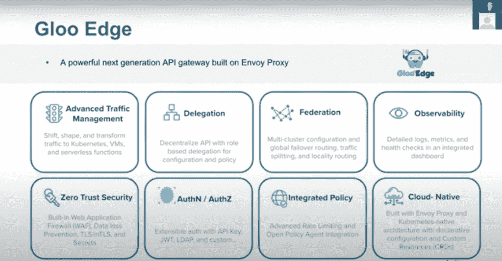
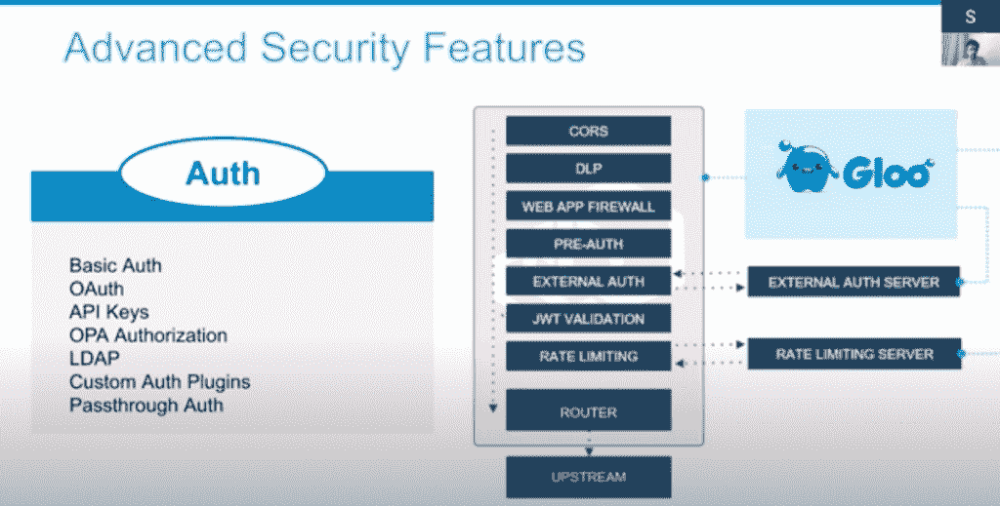

# Gloo Edge 2.0:面向多个集群的完全 Istio 集成 API 网关

> 原文：<https://thenewstack.io/gloo-edge-2-0-a-fully-istio-integrated-api-gateway-for-multiple-clusters/>

Solo.io 的 Gloo Edge 2.0 版本将整合 [Istio](https://istio.io/latest/docs/concepts/what-is-istio/) 服务网格，这样一来，入口控制器 [Gloo Edge](https://docs.solo.io/gloo-edge/latest/introduction/) 和开源 Istio 服务网格将形成一个单一的控制平面，Solo.io 本周在其 [SoloCon 2021 虚拟会议](https://solocon.io/)上表示，Gloo Edge 2.0 的测试版将于 6 月底发布。

作为一个完全集成的 Istio API 网关，Gloo Edge 2.0 将其微服务管理功能扩展到 Kubernetes 集群和应用程序连接的多个实例，因此 Istio 现在可以由 Gloo Edge 通过其 API 自动配置。其中一个好处是，组织不必为不同的 Kubernetes 集群单独添加和配置 Istio，因为这个过程是由 Gloo Mesh 自动完成的。

企业管理协会(EMA)的分析师 Torsten Volk 说，降低 Istio 的“威胁因素”对于 DevOps 团队“开始真正受益于服务网格”至关重要。

“大多数组织都认为 Istio 是‘一旦变得更加平易近人和易于管理就可以攻击’的东西，”Volk 说。这些 Solo.io 公告可能会在这个“人人服务”的新时代响起。"

在 SoloCon 2021 期间的演示演讲[“使用 Web Assembly 扩展 Istio 和 Gloo Mesh”](https://sched.co/i7e4)中，Solo.io 软件工程师[沙恩·安东内尔](https://www.linkedin.com/in/irishshane/)描述了一个 Gloo Edge 2.0 部署场景。Gloo Edge 可用于管理入口 API，作为管理进出集群的南北流量的 API 网关。同时，对于集群，Istio 控制平面可以管理集群内部东西向流量的服务网格。

“当我们看 Gloo Edge 和 Isto 的功能集时，我们会发现这里有很多重叠之处:它们都发现服务和上游来发送流量，它们都配置特使代理，”安东内尔说。“它们的不同之处在于 Gloo Edge 提供了一些边缘功能，Istio 提供了一些东西向功能，但这真的足以证明必须控制飞机吗？我们不这么认为。”

安东内尔说，由于 Gloo Edge 和 Istio 现在形成了一个单一的控制平面，因此 Gloo Edge 2.0 在一个单一的控制平面中提供了所有的发现能力、特使配置、边缘流量和东西流量。“它更易于管理，尤其是当您开始扩展环境时。”

为了扩展 Gloo Edge 2.0 的 Edge 和 Isto 控制平面功能，Gloo Mesh 允许在“我们增加到 50 个集群，突然有 50 个东西需要管理”时管理多个集群

“Gloo mesh 帮助您在多网格和多集群环境中管理所有集群的配置，”安东内尔说。这是通过 Gloo 边缘统一 API 在 Gloo 网格管理平面的顶部进行配置来完成的，以便将配置传播到每个集群中的控制平面。

最后，这些控制平面将转换该配置并将其应用于您的特使代理，而不管他们的特使代理侧柜是否在您的服务网格中的 Istio 中运行，或者他们是否是在您的群集边缘运行的 Edge API 网关或入口

简而言之，Gloo Edge 2.0 现在“位于这个新增强的 Istio 环境之上，而这个环境本身又位于 Envoy 之上，”安东内尔说。“因此，您从所有这些低级别层获得了大量功能，但您只需处理进入管理层的高级配置。”

Gloo Edge 2.0 的安全管理功能包括:

*   Web 应用程序防火墙(WAF)保护和数据丢失防护(DLP)。
*   响应和请求转换。
*   限速。
*   “开箱即用”的可插拔外部认证，包括 OIDC、OPA、active directory 或选项。
*   支持 WebAssembly (WASM)模块。

<svg xmlns:xlink="http://www.w3.org/1999/xlink" viewBox="0 0 68 31" version="1.1"><title>Group</title> <desc>Created with Sketch.</desc></svg>