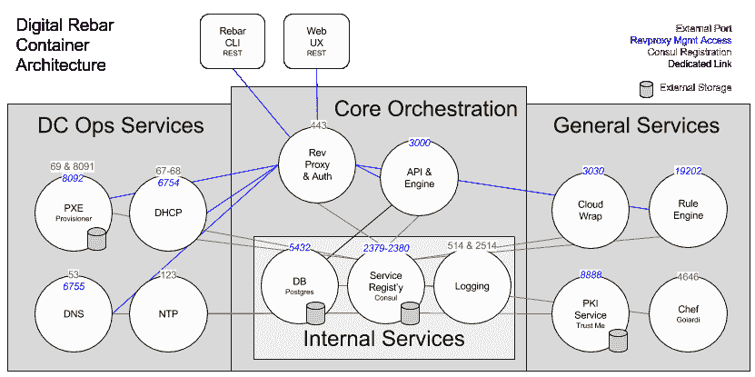

# 使用反向代理保护码头化服务架构

> 原文：<https://thenewstack.io/go-faster-reverse-proxy-exploring-dockerized-service-architecture/>

 [罗布·希施菲尔德

罗布·希施菲尔德是 RackN 的首席执行官兼联合创始人，该公司为以容器为中心的数据中心提供编排软件。他已经在云计算和基础设施领域工作了近 15 年，从早期的 ESX 测试版开始工作，到在 OpenStack Foundation 董事会任职四届。作为数字 Rebar 项目的联合创始人，Rob 创建了新一代 DevOps 编排工具，以利用容器和面向服务的运营。他认为，在云上运行数据中心和应用程序的技术只是更大故事的一部分。作为一名工业工程师，他热衷于将精益和敏捷流程应用到软件交付中。](http://robhirschfeld.com/digital-rebar/) 

我们的公司, [RackN](http://rackn.com/) ,多年来一直在从单一代码库(OpenCrowbar)向基于微服务的平台(Digital Rebar)转型。我已经在[上发表了关于我们如何在重构](https://thenewstack.io/digital-rebar-changed-architecture-not-code/)期间重新思考服务注册和持久性的文章。在这篇文章中，我将谈论我们的网络和服务控制器所需的改变，包括控制 API 和反向代理。

[Digital Rebar](http://rebar.digital/) 编排服务和配置任务，以在云和物理基础设施上运行集群。

作为一个微服务应用程序，Digital Rebar 由多个独立的服务组成，这些服务共同提供整体体验。我之前详细介绍过[我们如何使用 Docker Compose](https://thenewstack.io/digital-rebar-changed-architecture-not-code/) 作为服务注册中心，以便服务可以找到彼此；然而，这只是使架构工作的一小部分。大多数数字 Rebar 服务都有内部和外部公开的组件。

我们的服务包括 DNS、DHCP、PKI 和供应，必须以标准方式公开这些服务，以便 Digital Rebar 完成其工作。该平台还需要公开自己的 API 和用户界面，以及内部专用服务，如 PostgreSQL 数据库和[consult](https://www.consul.io/)。他们还需要控制 API，以便我们可以基于系统编排来管理服务。控制 API 必须受到跨所有 API 的一致安全策略(身份验证和授权)的保护。

【T2

## 保护服务

我们决定使用反向代理(也是数字钢筋容器)来保护环境。反向代理充当所有服务 API 的单一网关。当请求进入网关时，会对其进行检查和验证，从而允许我们为用户提供授权单点登录(SSO ),并根据用户策略授权访问。这使我们能够集中用户安全，从而不会成为服务作者的负担。

将用户安全性委托给反向代理产生了一个问题:服务必须相信入站请求是合法的。

如果有人能够直接向服务控制 API 发送请求，那么他们就可以危害整个系统。我们的解决方案是创建一个内部 PKI ( [也作为服务](https://robhirschfeld.com/2016/11/16/provisioned-secure-by-default/)公开)，它生成一个特定于部署的信任区域。只有区域内的服务具有必要的加密以进行通信。由于没有其他方被给予证书，反向代理成为唯一的系统入口点。

内部专用的[传输层安全](https://tools.ietf.org/html/rfc5246) (TLS)让我们不用担心服务从单一系统转移到全球分布。

RackN 团队的一个重要认识是数字 Rebar 服务需要外部端口和控制 API。这种模式使我们无法用额外的控制接口来过载像 DHCP 这样的标准服务。我们希望保持这些服务简单，并严格符合标准。通过添加管理 API，我们可以提供一个安全的控制通道。如果我们想使用替代服务，如现场 DNS 服务器，我们也可以使用管理 API 作为垫片。

另一个设计考虑是关注用于控制的 API，而不是依赖于集中的数据。因为我们拥有这些服务，所以它们可以直接指向数字 Rebar 数据来获取配置信息；相反，我们选择限制对 API 和引擎服务的数据库访问。这种方法提供了多种好处:更少的数据库入口点，更少的对服务地理分布的关注，以及更简单的服务替换，因为没有对服务访问内部数据的假设。

我们为数字钢筋背后的建筑思想感到自豪，也认识到这是一项正在进行的工作。我们不断地根据我们看到的实际性能和模式来检查和改进我们的设计。

我希望我们的分享能给你自己的建筑带来一些灵感，你也能和我们分享。

关于数字钢筋的更多信息，请查看 RackN 丰富的视频教程页面。

[英特尔的尼克·韦弗讨论编排](https://thenewstack.simplecast.com/episodes/intels-nick-weaver-discusses-orchestration)

Docker 和英特尔是新堆栈的赞助商。

通过 Pixabay 的特征图像。

<svg xmlns:xlink="http://www.w3.org/1999/xlink" viewBox="0 0 68 31" version="1.1"><title>Group</title> <desc>Created with Sketch.</desc></svg>