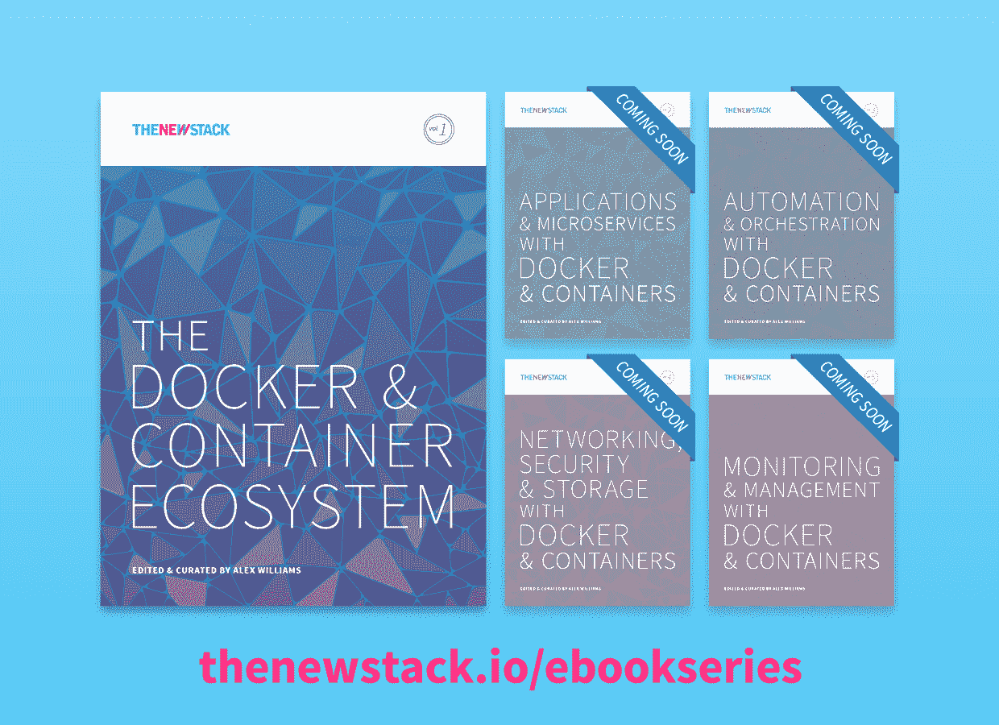

# Go 编程语言如何帮助 Docker 和容器生态系统

> 原文：<https://thenewstack.io/go-programming-language-helps-docker-container-ecosystem/>

为了构建 Docker，开发人员做出了有点新奇的选择，使用了 Google 相对较新的 Go 编程语言。

鉴于 Docker 的虚拟化技术需要快速响应，更传统的选择可能是 c 之类的低级语言。然而，使用 Go 被证明是一个明智的决定。Go 为 Docker 团队提供了一种简单而强大的语言，用于他们最初选择的操作系统 Linux。

更重要的是，它还为用户提供了将 Docker 的功能集成到他们自己的环境中的简单途径。Go 是专门为在分布式系统上实现快速开发而构建的。它允许开发人员和系统管理员为云计算环境快速构建程序和系统工具，而不必过多担心诸如依赖管理或并发编程等问题。

对于开发人员来说，Go 使得打包代码功能变得容易，然后通过组装这些包来构建应用程序。这些包也可以很容易地被其他应用程序重用。

正如 Go 有助于开发一样，它也使部署过程变得更加简单。Go 程序实现起来很简单，因为一旦被编译，它通常不需要外部库。在大多数情况下，大型标准核心库提供了程序员可能需要的所有功能。这意味着管理员可以开发一个 Go 程序，把它复制到任何一个安装了 Go 版本的远程服务器上，而不用担心程序需要额外的库，而服务器上可能没有。

[cyclone slider id = " ebook-1-赞助商-2 "]

有了 Docker，整个过程变得更加简单。Docker Hub 中有一个语言的[特殊版本，可以在编译过程中将应用程序打包到 Docker 镜像中，以便可以立即部署。开发人员甚至可以在容器内部构建他们的应用程序](https://blog.golang.org/docker)。他们甚至不需要在自己的电脑上安装围棋。

正如在 Docker 中安装和运行 Go 程序很容易一样，用 Go 管理 Docker 容器也非常容易。Docker 提供了一个 API 库，用于使用 Go 与 Docker 容器进行交互。

## 客户采用

Go 于 2009 年推出，并于 2012 年投入生产使用。从那以后，它被世界各地的开发者所接受，尤其是在中国，[这是它使用最频繁的地方](https://www.google.com/trends/explore#q=Golang)(尽管这种差异是否像数据显示的那样大还存在争议)。

事实上，数量惊人的大企业已经采用了 Go，包括雪佛龙、威瑞森、迪士尼、沃尔玛、康卡斯特、通用电气甚至微软。IBM 已经使用 Go 为物联网建立了一个安全库，也为一大群 Docker 容器建立了网络连接软件。

许多网络规模的公司也采用了 Go。不仅仅是谷歌，脸书和亚马逊也跟着走了。

当然，谷歌本身提供了一个托管的 Go 运行时，作为其平台服务的谷歌应用引擎集合的一部分，尽管其他云提供商，如亚马逊网络服务，也支持这种语言。

据最新统计，GitHub 托管了超过 [86，600 个基于 Go 的软件项目](https://api.github.com/search/repositories?q=language:Go)，而这些仅仅是开源的公共项目。毫无疑问，许多私有和专有软件项目都是在 Go 中构建的。这不仅仅是什么公司使用了 Go 的问题——许多开发者报告说他们计划在不久的将来使用 Go。

在 2015 年 StackOverflow 开发者调查中，19%的 DevOps 开发者表示他们计划在未来使用 Go，这比目前使用 Go 的 10%有所增加。总的来说，8%的开发者计划在明年使用 Go。

计划在不久的将来采用 Go 的开发者分类。

除了 Docker，Go 中还开发了其他容器支持软件，包括 Kubernetes 容器管理软件和 Hashicorp 的 Nomad 集群管理软件。

很容易看出，在未来的许多年里，Go 将成为容器生态系统的核心语言。Docker 和 Go 之间有一种协同作用:如果有人看到 Docker 中的一个错误需要修复，或者希望以某种方式改进软件，他们就使用 Go，因此他们加入了全球 Go 程序员联盟。

## 新老精华

Go 的吸引力部分来自于它如何结合了传统静态类型编程语言和更新的动态类型语言的最佳实践，后者通常用于构建 web 应用程序。

Go 是由只能被称为资深程序员的超级团队创建的:Robert Griesemer，他从事 V8 JavaScript 引擎和 Google 文件系统的工作；罗布·派克，Unix 和 UTF-8 字符编码格式；以及 Unix 和 C 的共同创造者 Ken Thompson。到 2007 年，这三个人都在谷歌工作过，并且都对现有语言的局限性感到沮丧。当时的语言不太适合系统编程。所以他们开始着手构建 Go 来直接解决这个任务。

传统的静态类型语言，如 Java 和 C++，对数据类型提供了更严格的控制，这使得它们更安全、更快速。然而，它们的强制规则使它们更难使用。

因此，在过去十年中，许多面向网络的初创公司都倾向于一种新型的动态类型语言，如 Ruby 或 JavaScript，它们不强制数据的强类型化。

虽然这种动态类型化可以简化程序员的工作，但在运行时，额外的成本会以测试和调试成本增加的形式偷偷溜走。如果数据类型不是从一开始就强制执行的话，调试就会变得更加令人头疼，特别是对于大型程序。用动态语言编写的程序也往往比静态类型的程序慢，尤其是当扩展到大型工作负载时。

Go 的美妙之处在于，它结合了动态类型语言的易开发性和静态类型语言的严格性和速度。

因此，Go 程序比用动态语言编写的程序运行得更快，这直接转化为那些在云中运行 web 应用程序的公司每月的使用费用更低。

咨询公司 Iron.io 了解到这一点，它为客户建立了一个消息系统，后来作为产品发布，名为 IronWorker。IronWorker 的第一个版本是用 Ruby 构建的，该公司发现它的扩展性不好。之后，程序在 Go 中被重写，Iron.io 能够[将运行 IronWorker 所需的虚拟服务器数量](https://www.iron.io/blog/2013/03/how-we-went-from-30-servers-to-2-go.html)从 30 个减少到 2 个。

此外，Go 还面向分布式计算。它有许多支持并发的内置特性，或者跨多个处理器运行程序的能力。它可以执行许多低级系统调用，使它能够直接与操作系统一起工作，从而加快处理时间。

这种语言对程序员来说也是友好的。Go 的构建是为了让开发人员可以通过一个命令行调用文档。测试也可以通过一个命令来执行。

总之，Docker 不可能找到比它在 Go 中更好的合作伙伴了。

<svg xmlns:xlink="http://www.w3.org/1999/xlink" viewBox="0 0 68 31" version="1.1"><title>Group</title> <desc>Created with Sketch.</desc></svg>