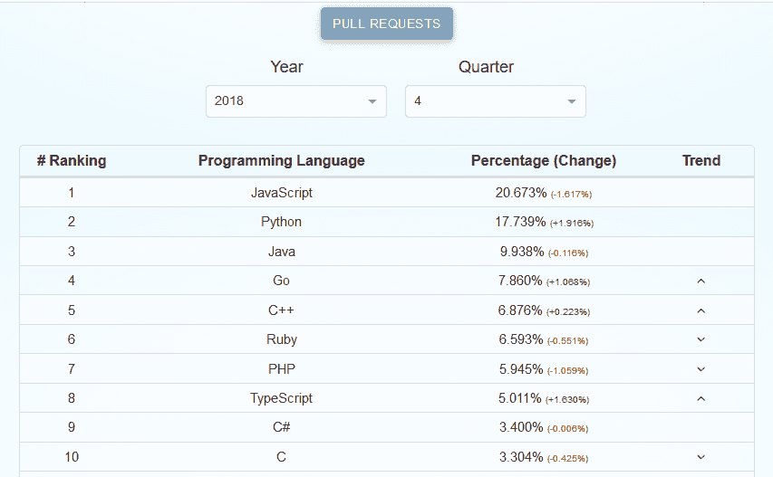

# Go，云的编程语言

> 原文：<https://thenewstack.io/go-the-programming-language-of-the-cloud/>

随着 AWS Lambda 等主要云供应商支持 Go，谷歌诞生的 Golang 正迅速成为许多云原生操作的首选语言。2016 年加入谷歌成为其 Go 产品负责人的史蒂夫法兰克王国最近分享了他对其在云操作和其他方面的使用的见解。

他还分享了 Go Cloud 开发工具包的最新状态更新，同时深入探讨了 Go 不仅是云基础设施的语言，甚至还将成为整个云的语言这一命题。

史蒂夫·法兰克王国，谷歌的首席执行官

**我想问你关于 Go 在 Docker 和 Kubernetes 中的角色。你曾经是 Docker 的副总裁兼首席操作员…**

是的，我个人不再参与 Docker，但我可以说，作为我们 Go 生态系统的一员，你知道——Go 在 Docker、Kubernetes、Istio 和许多其他云相关技术的创建中发挥了重要作用。事实上，你知道，我认为说现代的云是用 Go 写的是合理的。几年前，一位分析师写道，go 是云基础设施的语言，我认为这已经被证明是绝对正确的——大多数云基础设施都是用 Go 编写的。

我们越来越多地看到，Go 不仅是云基础设施的语言，也是整个云的语言。我们看到，与其他语言相比，Go 应用程序在云上的应用越来越多，我们还看到，很多人都在寻找 Go。它非常适合云计算，内置了异步功能。它的原生功能集非常适合云中非常常见的微服务架构，以及它的性能和成本节约。因此，这种三重特性集对许多人来说是一个巨大的吸引力，他们希望在 Go…

**他们对谷歌内部的围棋有什么看法？我知道 Go 在谷歌的生产中被广泛使用。那么谷歌开发者对 Go 怎么说呢？**

你知道，整个谷歌都支持它。我认为用我们自己创造的语言工作是令人兴奋的，你知道吗？我们在谷歌看到了良好和稳定的采用。我不能提供太多细节，但 Go 在整个公司的很多地方都有使用。我们对此感到非常兴奋…

这是一个有趣的地方，因为很明显，我代表 Go 团队，但我们也是谷歌的赞助者和一部分，谷歌是云供应商之一。作为其中的一部分，我们努力保持中立。

**那么，Go 在主要云供应商中的地位如何？**

我们今年一直在进行的一个更令人兴奋的项目是——作为云的语言，我们已经建立了一个项目，它或多或少是云应用程序的标准库。我们称之为——让我想想，我们今天早上刚刚确定了一个名称，所以我想让它完全正确……它就是“ [Go 云开发套件](https://github.com/google/go-cloud)”实际上，它就像是云的标准库。我们希望在本季度晚些时候发布更重要的消息。

现在我们正在对一部分用户进行早期测试。它已经被集成到许多主要的开源项目中，我参与了其中的一个，但是*(笑)*我实际上并没有参与其中。Hugo 是我们用 go 编写的更受欢迎的网站引擎之一，我们最近使用 Go 云开发工具包库增加了对云发布的支持…

就像 Go 标准库可能会遇到的情况一样，你可以编写一个应用程序，只需为 Mac 编译，为 Linux 或 Windows 或不同的架构编译，它就可以运行，而且运行时不需要任何额外的代码。所以，你知道，真正的可移植性的承诺，Go 标准库实现得很好。我们的目标是为云做同样的事情。

最初，我们支持三大巨头——亚马逊、Azure 和谷歌云平台。我们也在进行开放开发，并且我们已经和许多其他的云提供商谈过为它提供他们自己的后端。我们也在与微软合作，所以我们已经得到了来自云提供商的贡献。

这是我们认为非常重要的一项举措。

**我们在 9 月份做了一项调查，发现 27%的无服务器开发者[表示他们计划在未来 18 个月内使用 Go](https://thenewstack.io/add-it-up-prepare-for-an-onslaught-of-go-language-serverless-functions/)。你在野外见过什么有趣的围棋项目吗？**

是的，毫无疑问，在许多不同的领域，围棋确实产生了相当重大的影响。我们经常首先想到云，但是 web 也是一个非常重要的地方，在那里许多 Go 项目都很重要。此外，你知道——谈论这个很有趣，但即使是加密货币领域也已经被围棋打乱了。以太坊主要是用围棋写的。许多网络项目都是用 Go 编写的——当然，还有 Kubernetes、Docker 和 Istio……

**11 月，GitHub 的年度“Octoverse 状态”报告得出结论，今年编写 Go 的贡献者比去年多 1.5 倍。你是否也看到了新移民的激增？**

是的，在过去的 18 个月里，我们看到 Go 用户有了非常显著的增长。你知道，所以我们有一些硬数字。根据追踪所有这些事情的堆栈溢出调查，从 2017 年到 2018 年增加了 76%。

*【Steve 后来向我们提供了基于 Stack Overflow 开发者调查中 Go 用户百分比的计算结果——乘以 Evans 数据中对总开发者人数的估计。]*

2018
所有受访者:[7.1%使用 Go](https://insights.stackoverflow.com/survey/2018#most-popular-technologies)
预计 Go 开发者: [23M](https://evansdata.com/reports/viewRelease.php?reportID=9) * 7.1% = 1.633M

2017

我们还看到了其他一些东西。GitHub 是另一个强有力的指标，随着 GitHub 上的拉请求计数，Go 看到了非常显著的增长…

**甚至仅仅从 [2016](https://octoverse.github.com/2016/) 到 [2017](https://octoverse.github.com/2017/#build) ，Go 在 GitHub 上又增加了 96，879 个拉请求——增长了 51.4%(达到 285，000)。但是你对现在围棋界发生的事情有什么看法呢？**

此时，它是 GitHub 的 [#4 语言，由 pull 请求](https://madnight.github.io/githut/#/pull_requests/2018/4)。这是惊人的。

GitHut 2.0 第四季度统计数据

所以，是的，我们看到了非常显著的增长…

这是一个激动人心的时刻。像 IntelliJ、微软的 Visual Studio 代码、JFrog Artifactory 这样的供应商都开始意识到 Go 是很多开发者想去的地方，所以他们已经建立并发布了支持产品。我们从许多其他供应商那里也看到了这一点。显然，云平台非常了解 Go，并且正在创建解决方案，通常以 Go 为先。

这是一个激动人心的时刻。在机构群体方面，我们看到了世界各地的许多努力。会议数量正在显著增长，年增长率约为 30%。我不记得确切的数字，但我认为今年我们在全球范围内有 15 到 20 个会议，与会者的数量也在增加，所以这是一个激动人心的时刻。所有的会议都是由社区成员组织的，所以这是非常基层的努力…我们在南美用他们的母语召开会议，在日本用他们的母语召开会议，在中国用他们的母语召开会议，在世界各地用各种语言召开会议…

真正的意义是将 Go 带给人们，他们所在的地方。

<svg xmlns:xlink="http://www.w3.org/1999/xlink" viewBox="0 0 68 31" version="1.1"><title>Group</title> <desc>Created with Sketch.</desc></svg>