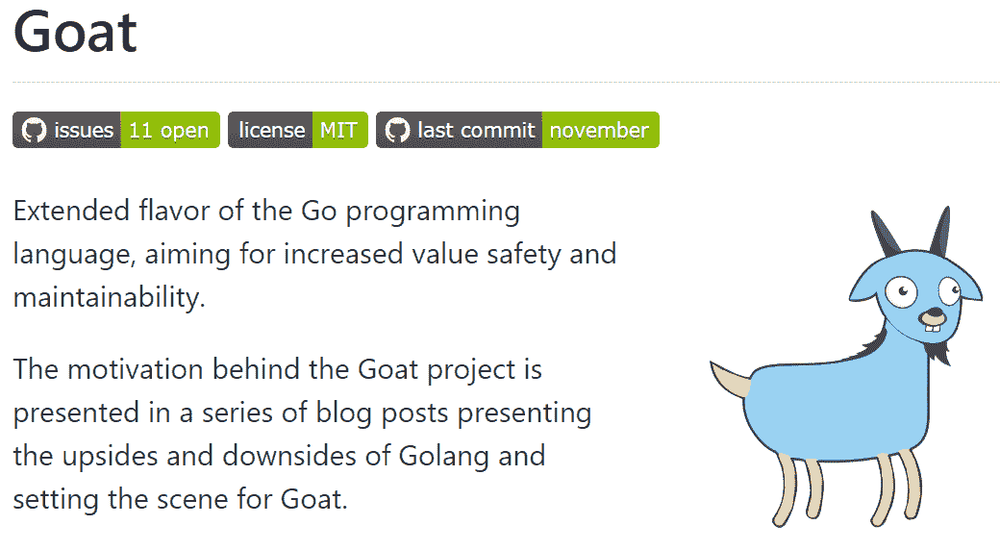

# Goat:一种被提议的 Go 编程语言的“扩展版本”

> 原文：<https://thenewstack.io/goat-a-proposed-extended-flavor-of-the-go-programming-language/>

这个想法是在四月份产生的。在 Changelog 的“Go Time”播客上长达一小时的讨论结束时，在一个名为“不受欢迎的观点”的片段中，软件工程师[克里斯·布兰道](https://github.com/skriptble)随口说道“我认为是时候让 Go 有一个分叉了…

当时，编程语言的核心团队刚刚[增加了泛型](https://go.dev/blog/intro-generics)——一种更灵活的“未指定”变量类型——布兰多认为这是向“更学术、更研究风格的东西”的转变 Brandow 认为，在 Go 的社区中存在未被承认的裂痕，需要得到承认，“然后可能需要更正式的对话。因为我觉得我们就像一个社区——我们现在并不都在一起，我想我们是在假装我们在一起……”

播客随后结束，嘉宾们开玩笑地集思广益，讨论 Go 分叉的可能名称，包括 Gone、NoGo、Stay、Goto、oG、Stop 和 Go++，甚至更糟的是 Go#。

在后来的网上投票中，69 名投票者中有 34.8%的人说他们同意布兰多的观点。

但是有 17498 人听了这个播客，其中一个是后端架构师 Aviv Carmi，他提出了这个想法并付诸实践。他写了[三篇](https://itnext.io/what-makes-go-the-best-language-159322c2206a) [博客](https://itnext.io/we-need-to-talk-about-the-bad-sides-of-go-568a1e5adbc6) [帖子](https://itnext.io/a-proposition-for-a-better-future-for-go-a0d0b43d086a)最后提议将实验性的新功能放入一个单独的分支(或“扩展版”)。

“这将允许保持语言的原始设计，”卡尔米写道，“同时允许语言的扩展风格得以发展。”

随着博客帖子在 Reddit 上[流传，Carmi 还在 GitHub 上为可能的项目创建了一个存储库](https://www.reddit.com/r/programming/comments/y7b9ml/we_need_to_talk_about_the_bad_sides_of_go/)，在那里他一直在仔细查看问题文件夹，以获取任何新的评论和建议。(迄今为止的问题？11 个打开，两个关闭…)

这一切最终可能只不过是网上聊天——博客帖子、知识库和四月播客的最后一集评论。但是不管发生什么，它显示了一个正在行动的社区——或者至少是社区的一部分——感觉被赋予了足够的力量来发出声音，并对他们语言的未来提出戏剧性的建议。对话开始了，讨论开始了，每个人都在权衡他们认为最能支持社区的方向…

那么卡尔米到底在提议什么呢？

## 一种叫做“山羊”的味道

“我希望看到一个编译时环境，看起来更像 Go，但允许开发人员更有表现力，”卡尔米的博客系列文章[总结](https://itnext.io/a-proposition-for-a-better-future-for-go-a0d0b43d086a)，“以获得可维护性和运行时安全性。”

例如，Carmi 希望为变量和函数的可见性添加基于关键字的修饰符(如 Java 中的关键字“public”和“private”)，而不是遵循 Go 当前的做法，即对任何以大写字母开头的内容授予包外可见性。Carmi 还希望看到一种支持枚举的语法——一种有限的变量(在其他语言中可以找到),带有一组预定义的可能的常量值。

他的[最后一篇博客文章](https://itnext.io/a-proposition-for-a-better-future-for-go-a0d0b43d086a)又提出了五个类似的深思熟虑的建议——但综合起来，卡尔米希望看到一个简单的围棋“扩展版本”的诞生，他称之为*山羊*。

在编译时，Goat code“将产生标准的、兼容的、高性能的 Go 文件，这些文件与任何其他 Go 项目完全兼容。这意味着他们可以导入常规的 Go 文件，也可以安全地从任何其他 Go 文件导入。”根据 GitHub 的官方知识库[的说法，实际的实现将“最有可能作为代码生成工具或产生常规 Go 文件的 transpiler 交付”。](https://github.com/goatlang/goat)

那一页强调“我们的基本原则是不要在 Goat 语法中制造碎片。”

Carmi 在他的第一篇博文中强调了这一点，他写道，如果 fork 或 extended flavor 出现，他希望它共享 Go 的原始生态系统——相同的库和运行时环境——“以确保我们仍然是一个拥有单一生态系统的单一社区，相信相同的核心理念。”知识库还强调，提议的项目仍将基于“保持简单的前提”——这是 Carmi 在《今日之路》中所称赞的。

但在他的在线文章中，Carmi 写道，在某些时候，对简单的承诺意味着你正在失去生产力。然而，卡尔米写道，大多数变革提议都遭到了拒绝——他认为这表明人们对尝试新功能有着被压抑的兴趣。(Carmi 的博客文章提到了 GitHub 上 Go 官方知识库的“LanguageChange”文件夹中的 [118 个开放提案](https://github.com/golang/go/labels/LanguageChange)。)

Carmi 最近在 Reddit 上的[评论](https://www.reddit.com/r/golang/comments/yr9888/why_no_enums/ivtwd56/?context=3)中承认“虽然核心 Go 团队在接受建议时很严格，但他们在给予反馈和提出问题的空间方面相当开放。”然而，他在一次电子邮件采访中告诉我，当 Reddit 论坛将读者送到 Carmi 的博客帖子时，点击进入知识库的少数读者“似乎对他自己的围棋扩展版本的不断发展的规范感兴趣”。

Carmi 的博客文章认为讨论围棋的未来很重要。随着“大公司和小初创公司热情地采用它，它越来越接近成为云原生系统的标准语言”

最后，卡尔米给出了另一个观察结果。他的第一篇博客文章称赞了“[是什么让 go 成为最好的语言](https://itnext.io/what-makes-go-the-best-language-159322c2206a)”但他随后发了一篇名为“[我们需要谈谈围棋](https://itnext.io/we-need-to-talk-about-the-bad-sides-of-go-568a1e5adbc6)的不好的一面”的帖子——正是这篇帖子获得了比其他任何帖子都多四倍的流量。

卡尔米称之为“迄今为止我写过的最成功的博客文章”

## 专注于改进

那么他会如何描述这种反应呢？最重要的观众是 Go 的核心开发团队，他们还没有回复他的帖子，“恕我直言，我不指望很快会有人回复，”卡尔米告诉我，并补充道，“他们有很多事情要做。”(The New Stack 还联系了一家与 Go 团队合作的公关机构，但该团队无法置评。)卡尔米认为，他的项目需要进一步发展，才值得引起任何认真的关注。

他想让围棋界放心，他只专注于改进。“我不想写一种新的语言，”卡尔米在他的电子邮件中补充道。“我希望增强现有工具的能力，并为地鼠提供无缝使用额外工具的能力。每只地鼠都可以自由选择是否以及何时使用 Goat，以及对于特定的使用情况，它将提供最佳服务。”

他着重强调了这一点。“我希望向 Gophers 强调，Goat 项目的本质是增强 Go 社区的能力。”

卡尔米也认为这是有先例的。在他的博客文章中，他引用了 Scala 和 Kotlin 如何最终加强了围绕 Java 虚拟机的社区。"所有这三种语言都有助于一个更强大的单一社区，并获得更强大的库和集成."

在我们的电子邮件采访中，卡尔米深入研究了第二个例子。“如果你看看 Typescript 和它为 Javascript 社区所做的事情，它只会使它变得更强大，并为工程师提供一个新的、强大的工具，他们可以随时随地使用它。我想吃类似的东西。帮助许多地鼠拥有他们感觉缺失的功能，同时也让 Go 本身保持不变。”

那么现在情况怎么样了？“目前该项目正处于设计语言规范的阶段，”Carmi 在他的电子邮件中告诉我，指着其 GitHub 库中的 11 个公开讨论，“每个都涉及该语言的一个不同特性，我们还没有决定如何最终确定。

"现在加入讨论的是那些对影响语言规范最感兴趣的人."但是卡尔米预测，当有一种真正的新语言可以尝试时，人们会更感兴趣。

贯穿他评论的是一个更大的主题:需要对新思想保持开放——以及对它们的讨论。Carmi 告诉我，他非常清楚围棋界一些人对这门语言的保护意识。他指出另一个 Reddit 讨论中，一个用户问为什么 Go 目前不支持 enum——这个问题在 Reddit 上被 15%的投票者否决了。

在那次讨论中，卡尔米给[留下了他自己的评论。“许多地鼠倾向于有点体育迷的心态，在这种心态下，一切可能被视为批评的东西都会被一些人自动否决……”](https://www.reddit.com/r/golang/comments/yr9888/why_no_enums/ivtwd56/?context=3)

"一个追求卓越的社区应该总是乐于提出问题和回答问题。"

<svg xmlns:xlink="http://www.w3.org/1999/xlink" viewBox="0 0 68 31" version="1.1"><title>Group</title> <desc>Created with Sketch.</desc></svg>