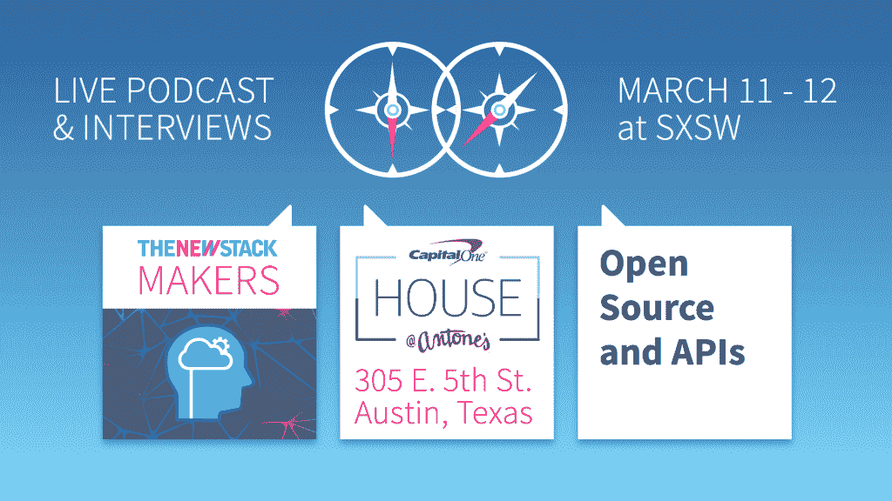

# GoDaddy 为何构建容器即服务平台

> 原文：<https://thenewstack.io/godaddy-built-container-service-platform/>

在第 130 集[新堆栈分析师](https://thenewstack.io/podcasts/analysts)播客中，我们重点关注 GoDaddy 开发容器即服务(CaaS)平台的历程。主持讨论的是 GoDaddy 的高级工程总监 [Shaheeda Nizar](https://www.linkedin.com/in/shaheeda-nizar-6674532/) ，GoDaddy CaaS 工程主管 [Micah Rupersburg](https://www.linkedin.com/in/rupersburg/) 也参加了讨论。451 研究的负责人唐尼·伯克霍尔茨和 TNS 创始人亚历克斯·威廉姆斯一起接受了采访。

在整个对话中，Nizar 和 Rupersburg 解释说，由于 GoDaddy 开发人员看到了将应用程序容器化和将依赖项打包在一起的优势，因此有必要构建一个平台来运行、编排和管理这些容器。

[# 130:go daddy 为何打造容器即服务平台](https://thenewstack.simplecast.com/episodes/130-why-godaddy-built-a-container-as-a-service-platform)

本播客由 GoDaddy 赞助。

来自 GoDaddy 的特征图像。

<svg xmlns:xlink="http://www.w3.org/1999/xlink" viewBox="0 0 68 31" version="1.1"><title>Group</title> <desc>Created with Sketch.</desc></svg>