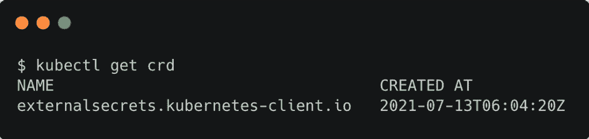
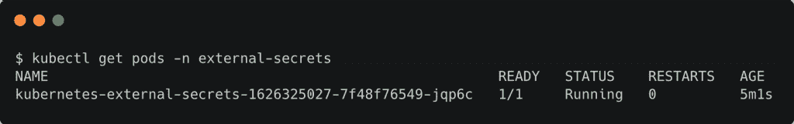
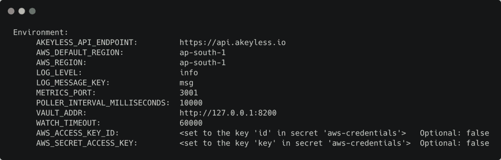
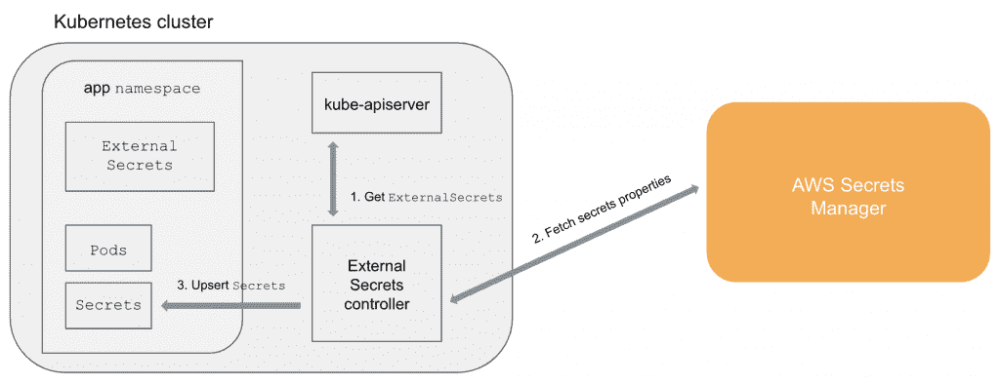
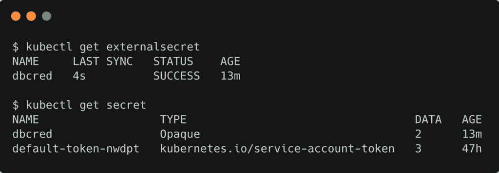

# GoDaddy 的项目，以保护，旋转 Kubernetes 的秘密

> 原文：<https://thenewstack.io/godaddys-innovative-project-to-secure-and-rotate-kubernetes-secrets/>

Kubernetes 有一个简单灵活的机制，通过秘密的概念来存储和检索敏感数据。操作员可以很容易地在 Kubernetes 名称空间中创建和存储秘密，比如数据库密码。编写应用程序的开发人员可以通过存储在众所周知的位置的环境变量或文件来检索秘密。通过 Kubernetes 基于角色的访问控制(RBAC)，对秘密的访问可以被限制在授权用户和应用程序。

但是，虽然 Kubernetes 的秘密提供了简单性和灵活性，但它们也有一些限制，可能会变成 DevOps 的噩梦。

首先，Kubernetes 的秘密并不是真正的秘密。它们只是 base64 编码的字符串，可以被任何用户或有权限访问机密的 pod 轻松解码。如果 Kubernetes 控制平面被配置为支持[加密的秘密](https://kubernetes.io/docs/tasks/administer-cluster/encrypt-data/)，您也许能够保护它们。但是，大多数托管的 Kubernetes 服务没有为机密启用加密。

其次，Kubernetes 的秘密不能从一个单一的真相来源填充或旋转。随着 Kubernetes 在边缘的崛起，客户正在创建和部署数万个集群。虽然 GitOps 拯救了边缘集群的大规模部署，但它没有解决集中秘密管理的问题。将秘密存储在 Git 存储库中的静态 YAML 文件中并不是一个好主意。

最后，Kubernetes secrets 没有利用基于云的秘密存储和提供企业级保护的密钥管理服务。公共云中的大多数托管机密存储都有自动轮换策略和强大的机密生命周期管理。但是将基于云的秘密管理服务和 Kubernetes 的秘密联系起来是非常具有挑战性的。

## Kubernetes 外部秘密概述

领先的网络托管公司之一 GoDaddy 开源了一个名为 Kubernetes External Secrets 的内部项目。它准确地解决了上面讨论的挑战。

GoDaddy 广泛依赖于[亚马逊网络服务](https://aws.amazon.com/?utm_content=inline-mention)EKS 来运行他们的 Kubernetes 基础设施。GoDaddy 的工程团队意识到，EKS 和其他托管服务(如 Amazon Secrets Manager 和 AWS Systems Manager)之间没有集成。为了弥合两者之间的差距，他们构建了一个 Kubernetes 定制控制器和一个名为 External Secrets 的定制资源定义。

Kubernetes 外部秘密项目最初致力于使 EKS 集群能够将 Kubernetes 秘密与 AWS 秘密管理器同步。这是通过利用 IAM 角色与 Kubernetes 服务帐户的集成来实现的。当 Kubernetes 服务帐户与 AWS IAM 角色相关联时，使用相同服务帐户的 pod 将承担该角色。这类似于 EC2 实例承担 IAM 角色来访问 AWS 管理的服务。

但是很快，Kubernetes 外部秘密项目的范围已经扩展到支持非 EKS 集群和运行在 AWS 之外的 Kubernetes 集群。可以使用传递 AWS 访问密钥和秘密密钥来调用 AWS 秘密管理器 API 的典型方法来配置控制器。

目前，Kubernetes 外部秘密项目支持在主流公共云平台上运行的各种秘密管理器后端。您可以将 Kubernetes secrets 与 AWS Secrets Manager、AWS Systems Manager 代理、AKeyless Vault、Azure Key Vault、Google Cloud Secret Manager、HashiCorp Vault 等同步。

## 库伯内特的建筑外部秘密

当您在集群中安装 Kubernetes External Secrets 时，它会部署一个名为`externalsecrets.kubernetes-client.io`的 CRD，为外部 Secrets 定制资源定义规范。

它还创建了一个运行自定义控制器的 pod。

定制控制器将 AWS 凭证作为环境变量传递，以访问 AWS Secrets Manager。

下面是 GoDaddy 的 Kubernetes 外部秘密控制器的高层架构:

定制控制器为 pods 可以访问的每个外部秘密对象创建一个相应的 Kubernetes 秘密。

在下面的截图中，您可以看到`dbsecret`外部 Secret 对象被转换为 Kubernetes secret。

Kubernetes External Secrets 的一个关键优势是，它不断地将本地秘密与基于云的秘密存储同步。上面截图中的最后一次同步状态显示，这个秘密就在几秒钟前被刷新了。这使得在云中启用秘密旋转并自动将其传播到边缘成为可能。轮询间隔是控制器的一个可配置参数，可以轻松调整以满足您的要求。

GoDaddy 的 Kubernetes 外部秘密是大规模管理秘密的理想工具。其 GitOps 友好型架构支持在多集群边缘部署中大规模创建、管理和轮换机密。

在下一篇文章中，我将带您完成配置和部署由 AWS Secrets Manager 支持的 Kubernetes 外部秘密的步骤。周一回来查看本教程的第二部分！

<svg xmlns:xlink="http://www.w3.org/1999/xlink" viewBox="0 0 68 31" version="1.1"><title>Group</title> <desc>Created with Sketch.</desc></svg>