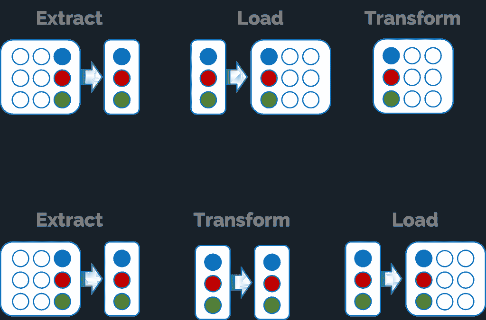
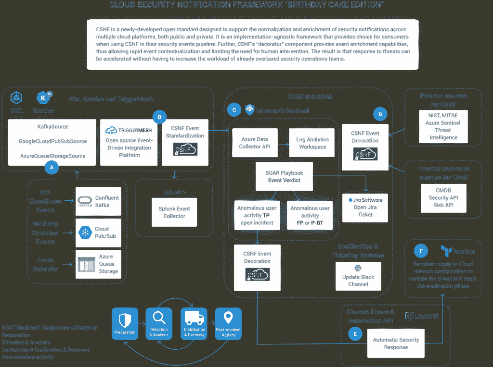

# 从 COBOL 到原生云

> 原文：<https://thenewstack.io/going-from-cobol-to-cloud-native/>

如今，几乎所有的技术出版物都充满了云故事，通常是关于 webscale 公司在云领域取得的成功。然而，与网飞、Twitter 和脸书不同的是，大多数公司都有着先于云计算出现的传统。

 [马克·辛克尔

Mark 在新兴技术和开源领域有着悠久的历史。在共同创立 TriggerMesh 之前，他是 Node.js 基金会的执行董事，也是 Citrix、Cloud.com 和 Zenoss 的高管，在那里他领导了开源项目。](https://www.linkedin.com/in/markrhinkle/) 

与这些相对年轻的公司不同，这些公司的优势是起步较晚，并在云原生时代发展成熟，有无数的公司可能会觉得他们被遗留的基础架构所束缚，由于风险、合规性或兼容性的原因，这些基础架构无法迁移到云。

仅仅因为您有一项迁移会造成中断的传统投资，并不意味着您不能采用云或云原生系统来实现新的数字计划，并仍然利用这些传统投资。但是，这确实意味着您需要找到以无中断方式集成的方法。

您可以实施一些实践来实现云原生环境，同时仍然使用您现有的传统投资。我提倡采用云原生实践和架构模式，这些实践和模式可以逐步简化您的云计算实现，这包括在内部采用云计算架构模式。

## **用可组合的基础设施解构独石**

在互联网的早期，栈的概念很流行。在提供基于网络的服务方面，微软有 WIMSA (Windows、IIS、SQL Server 和 ASP)，开源用户有 LAMP (Linux、Apache、MySQL、PHP)。LAMP stack 是最民主的，允许您为自己的堆栈选择供应商，如果出现问题，供应商会提供“一个单一的咽喉”。选择堆栈的层是许多传统技术用户今天可能没有意识到的好处。

当你看今天的应用程序时，可靠性的黄金标准是 Java。尽管您需要管理 JVM，但是您需要调优堆栈并使用垃圾收集来管理内存。您还需要一个应用服务器来服务这些实例。采用基于容器的方法来运行单个服务，您可以利用 Kubernetes 和 Knative(都位于 CNCF)，这可以通过根据需要自动放大和缩小容器来简化事情。

Kubernetes 和 containers 使得应用程序环境可以从内部移植到云，然后再移植回来。如何两全其美的一个例子是考虑 Spring Boot，这是一个面向 Java 开发人员的开源框架，旨在实现云原生部署，可以部署在可以在 Kubernetes 内部或云中运行的容器中。

使用可组合的基础设施是最佳实践，采用最好的技术和解决方案来构建分离但集成良好的系统。Gartner [将](https://www.gartner.com/smarterwithgartner/gartner-keynote-the-future-of-business-is-composable)可组合企业描述为由可互换的构件组成的可组合业务，并遵循可组合业务的四个原则:模块化、自主性、编排和发现。任何系统或应用程序都可以从可组合性中获益的想法经常被忽视。任何东西都可以成为可组合基础设施的一部分，而不仅仅是云服务。

## **更快地传送数据**

我们每天都经历批处理。我们的银行通常会在夜间处理我们的存款，直到批处理完成后，我们才会在我们的银行应用程序中看到这一点。同样的事情也适用于我们按月处理使用情况的实用程序，我们一个月只看到一次使用情况。

使用批处理是因为数据仓库上的负载可能会中断或减慢业务运营。因此，我们的目标是迁移到一个能够在不中断当前业务运营的情况下提高数据交付速度的架构。这就是提取、加载和转换(ELT)和事件驱动架构(EDA)可以发挥作用的地方。

### **通过从 ETL 迁移到 ELT 来复制和同步数据**

很多时候，我们互换使用术语复制数据和同步数据。从技术上讲，有一个重要的区别。复制意味着维护数据(或其子集)的副本，以使数据更接近用户，这通常是出于性能或延迟的原因。同步意味着数据的两个或多个副本保持最新，但不一定每个副本都包含所有数据，尽管有这样的想法，即在数据源之间保持一定的一致性。

使用像 Apache Kafka 这样的事件流技术，您可以从只读数据生产者(数据库、ERP 系统，因为您没有向数据库授予写权限，所以保持攻击面较小)复制数据。您还可以选择只复制其他系统(如移动应用程序、门户网站和其他面向客户的系统)所需的内容，而不必让它们将负载放在规范数据库上。

图 1.1 —提取、转换和加载与提取、加载和转换

### **事件驱动架构(EDA)**

当你观察任何主要的云提供商时，事件驱动架构的模式是普遍的。例如，在 AWS 中，服务被解耦并响应事件而运行。它们由三种类型的基础设施组成:事件生产者、事件消费者和事件路由器。

虽然 AWS 专门处理服务，但是您的企业可能拥有诸如消息总线和记录服务器上活动的服务器软件之类的东西。这些系统可以是事件生产者。它们可以通过 Kafka 进行流式传输，也可以通过事件路由器直接从您的日志服务器中使用。在这种用法中，我建议我从事的项目，开源 [TriggerMesh 云原生集成平台](https://www.triggermesh.com/product-overview)来连接、拆分、丰富和转换这些事件源。

例如，您可以使用 IBM MQ 消息总线从您的大型机转发消息，以集成您的遗留和云服务，如雪花。使用事件有效负载，您可以创建数据复制，而不会给生成器带来额外的负载。通过动态地更改事件或丰富事件，可以将事件更改为事件消费者可使用的格式。

通过分离事件消费者和生产者，您可以在更改供应商(从 AWS 转移到 Google)或添加可能想要复制数据的其他源时更改目的地。与等待成批数据到达相比，您还可以获得实时创建同步的好处。

埃达不是银弹。有时候，您可能需要进行同步 API 调用。使用 API，您可以基于一些无法预料的条件进行[查询](https://nordicapis.com/5-examples-of-apis-we-use-in-our-everyday-lives/)。在这种情况下，我喜欢使用开源的云原生技术，比如[孔的 API 网关](https://thenewstack.io/what-devs-must-know-about-apis-before-designing-and-using-them/)。

### **湿式或干式集成**

当你谈论代码时，你可能听说过“湿的”(写两遍)这个词，而不是“干的”(不要重复)。在开发领域，湿的是指需要重写的糟糕的代码，干的是编写不需要重写的更高效的代码。在集成中，这不是一个精确的相关性，但我相信同步 API 集成往往是湿的；您编写 API，然后编写 API 返回的响应。

当您需要完成一个需要查找和复杂答案的复杂集成时，有很多很好的理由这样做。然而，它可能会矫枉过正。

事件驱动架构(EDA)通过提供可以被动使用的事件流，为干式集成提供了一种方法。有很多好处。如果您通过事件流转发更改，您甚至可以执行所谓的更改数据捕获(CDC)。

变更数据捕获是一个软件过程，用于识别和跟踪数据库中数据的变更。CDC 通过在新的数据库事件发生时连续移动和处理数据，提供实时或接近实时的数据移动。事件驱动的架构可以通过使用已经编写好的事件来实现这一点，但是这些事件可以流式传输到多个源。

## **传统现代化:将大型机引入云**

许多公司都面临着云中最根深蒂固的遗留技术之一。虽然，直到我去挖掘，我没有意识到这一点的全部程度。大型机仍然运行大量的 COBOL。事实上，我们整个金融系统依赖的技术在不久的将来不太可能转移到云上。

我遇到的最有趣和不可预见的集成之一是大型机与云的集成。虽然亚马逊没有 AWS 大型机即服务，但在大型机和云之间集成工作流是有好处的。我工作的一家全球汽车租赁公司有一个广泛的工作流，该工作流获取存储在 IBM 大型机复制本中的数据，并将其转换为事件，这些事件用于自动化 AWS SQS 的工作流。

您可能出于多种原因想要转发大型机流量，不仅仅是为了工作流，还为了数据复制、实时控制面板或利用没有数据中心对等物的云服务。此外，因为您没有登录到产生事件的系统，所以只暴露事件流而不暴露主机系统的较小的攻击面可能有一个安全好处。

## **案例研究—可组合基础设施:安全通知框架**

我坚信未来将会有两种主要的基础设施:由云提供商提供的服务和开源软件。开源吃了全世界。Linux 是云计算和数据中心的主流操作系统。Kubernetes 正在成为云的开源云原生结构。此外，还有大量来自价值数十亿美元的公司、财团和创新型初创企业的免费开源数据中心软件。

一个非常有趣的可组合基础设施的例子是 [ONUG 云安全通知框架](https://github.com/onug/CSNF)。CSNF 是由联邦快递、雷神和 Cigna 牵头的一项开源计划，旨在解决由大量事件和安全状态消息引起的为大规模的多个云提供安全保证的困难。当使用多个云服务提供商(CSP)时，由于 CSP 之间缺乏标准化的事件和警报，问题变得更加复杂。

图 1.2–ONUG 云安全通知框架的可组合基础设施的架构图

这种差距转化为企业云消费者的工作量增加和效率降低。由 ONUG 协作组织的自动化云治理(ACG)工作组开发的云安全通知框架(CSNF)正致力于在不牺牲创新的情况下创建一个标准化流程。

CSNF 的有趣之处在于，它是一组松散耦合的技术，可以结合云服务和内部部署技术。虽然最初的目标是将来自云提供商的安全事件标准化为单一格式，但它也可以根据需要整合任意数量的其他工具和数据源。

## **总结**

虽然您现有的基础设施可能不完全现代化，但是您没有理由不能通过集成从现代技术和云服务中受益。首先，一体化可以说是现代化的关键，而不需要令人恐惧的提升和转移。如果你看看现在的集成层，我会考虑一些策略:

*   分离系统——寻找机会分离系统，这样您就可以为每个单独的需求选择最好的技术，而不是一个单一的“包罗万象”的堆栈。
*   集成、自动化、然后替换技术—通过分离系统，您可以引入能够协调基础架构和自动化事物的技术。鉴于[缺乏合格的云人才](https://thenewstack.io/you-cant-hire-your-way-out-of-the-cloud-skills-shortage/)，自动化和让更少的员工更有效率是一个更好的策略。
*   消除阻碍技术——消除阻碍信息流和降低系统响应能力的技术，包括寻找事件驱动的 ELT 解决方案，而不是批处理技术。

为了让 IT 运营蓬勃发展，他们需要采用 DevOps 等敏捷实践以及开源、事件驱动和云原生的技术。虽然，即使你有 IT 遗产要考虑，这并不意味着你停留在过去。在开源云原生技术的现代世界中，您仍然可以在没有大规模迁移到云的情况下获益。

<svg xmlns:xlink="http://www.w3.org/1999/xlink" viewBox="0 0 68 31" version="1.1"><title>Group</title> <desc>Created with Sketch.</desc></svg>