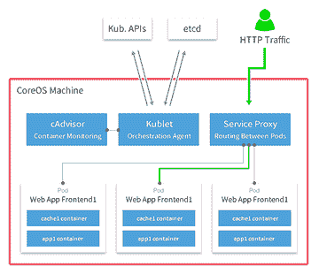

# Eldarion 如何将可扩展 Python、Django 引入刚铎

> 原文：<https://thenewstack.io/gondor-delivers-better-system-monitoring-kubernetes/>

当平台即服务提供商 [Gondor](https://gondor.io) (不要与《指环王》虚构的[王国](http://lotr.wikia.com/wiki/Gondor)同名)希望让其 Python 和 [Django](https://www.djangoproject.com/) 服务更具可扩展性时，它指望开源的 Kubernetes 编排引擎来完成这项工作。

而且，鉴于这种新的基于微服务的架构将有许多容器随着客户启动和关闭工作负载而出现和消失，Gondor 与咨询公司 [Eldarion](http://eldarion.com/) (不要与阿尔温和阿拉贡的[儿子](http://lotr.wikia.com/wiki/Eldarion)混淆，阿拉贡是一个虚构人物，也居住在 LotR)签约建立一套监控工具。

Eldarion 从帮助客户了解他们的堆栈随时间推移发生了什么的角度来进行监控。无论这意味着收集系统性能、容量或调试方面的指标，Gondor 的监控系统都能让客户更好地分析可能出现的系统问题。

## 多层次的监控

Eldarion 如何进行监控是一个独特的分层视角，展示了自 2015 年 7 月迁移到该平台以来，它如何充分利用 Google Kubernetes 和 CoreOS 的力量。

刚铎的首席建筑师兼管家布莱恩·罗斯纳(Brian Rosner)指出，“监控发生在许多不同的层面。因此，有集群、系统和容器指标。容器指标在很大程度上可以被视为应用指标，因为不是应用指标的容器和系统指标之间的界限非常模糊。”

CoreOS 上的 K8s 基础设施

在收集这些指标时，Eldarion 使用报告的信息来帮助理解刚铎为什么以及何时需要扩展。

Rosner 指出，Gondor 的开发人员关注包括 CPU、磁盘 I/O、网络 I/O 和 RAM 在内的系统指标，以更好地了解其节点在压力下的表现。在此基础上，其团队可以更好地了解 Gondor 服务规模类别以及它们在各种节点类型中的表现。Rosner 进一步解释说，Gondor 的开发团队还关注“集群级指标:每个节点的容器、调度和容器创建速率，以了解我们何时需要扩大或缩小规模。”

为什么要大费周章地为 Gondor 分解每个节点的性能指标呢？对 Gondor 来说，答案很简单:为客户提供更好的服务。虽然 Kubernetes 和 CoreOS 为其团队提供了很多灵活性和功能，但 Rosner 说，“了解集群如何随着时间的推移而表现仍然至关重要”。

过渡到 Kubernetes 使 Gondor 能够让客户更加灵活地扩展其基础设施，同时还允许 Gondor 客户选择在私有云上运行客户端。监控 Kubernetes 集群变得更加简单，这不仅是因为它能够利用诸如 Mesos 之类的调度程序，还因为 Kubernetes 本身的网络结构。

## 刚铎的未来

自从在 Kubernetes 上重建了 Gondor 之后，Eldarion 的团队已经向社区发布了两个开源项目，还会有更多。 [k8s-http-router](https://github.com/eldarion-gondor/k8s-http-router) 顾名思义，是一个 http 路由器，它使用 HTTP 主机头将 HTTP 请求路由到 Kubernetes 服务。 [Piper](https://github.com/eldarion-gondor/piper) 是一个帮助在本地运行进程的库，但实际上，它是通过使用 [WebSockets](http://www.websocket.org/) 的远程连接来运行的。虽然这两种服务仍在开发中，但 Gondor 希望为 Kubernetes 社区提供更多的开源项目。

Gondor:计划任务像 Cron 一样运行，原始仪表板

刚铎等级体系由站点、实例和服务组成。“站点有实例，而实例有服务。实例为您的问答过程提供了一个抽象层次。您可以分别运行生产、试运行和开发实例，并且可以轻松地在它们之间移动代码和数据，”Rosner 说。Rosner 解释说，Gondor 服务由单独的 web 或工作进程组成，如 PostgreSQL 数据库或 Redis 缓存。

刚铎:主要部署，原始仪表板

刚开始使用 Gondor 的开发人员首先会注意到，它的应用程序提供了一个 Procfile，告诉 Gondor 为给定的服务运行什么。其余的配置相当简单，通过 gondor.yml 文件及其 API 进行处理，通过 CLI 客户端进行交互。Rosner 指出，Gondor 负责剩下的工作，允许开发人员更快地开始部署他们的软件。

如果你有兴趣亲自体验一下 Gondor 的新 Kubernetes 支持的解决方案，请在这里注册它的私人测试版。

CoreOS 是新堆栈的赞助商。

特征图像[通过](http://www.cloudclipart.com/clipart/other-clipart/escudo-gondor-detail)云剪贴画；通过 [CoreOS](https://coreos.com/) 和 [Gondor](https://gondor.io) 嵌入图像。

<svg xmlns:xlink="http://www.w3.org/1999/xlink" viewBox="0 0 68 31" version="1.1"><title>Group</title> <desc>Created with Sketch.</desc></svg>