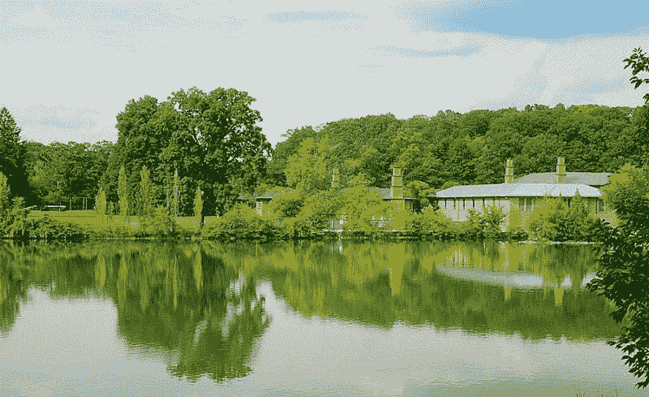
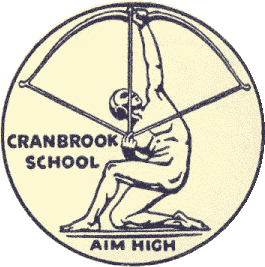
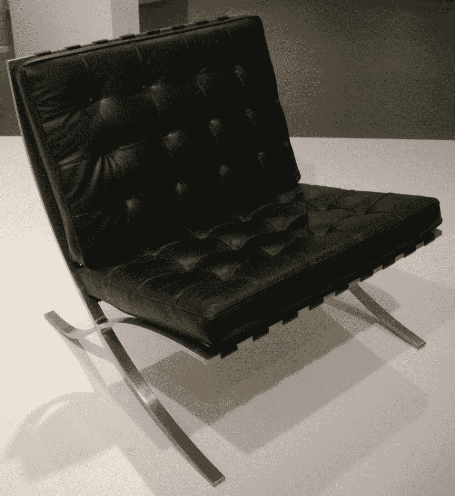

# 好设计，好生意:佛罗伦萨·诺尔如何定义现代办公空间

> 原文：<https://thenewstack.io/good-design-good-business-how-florence-knoll-defined-the-modern-office-space/>

传奇家具设计师弗洛伦斯·诺尔的作品已经悄悄地影响了我们工作的办公室。“她彻底改变了我们生活和工作的空间，”Knoll.com 上的一小段视频解释道，这是她和丈夫汉斯在 20 世纪 40 年代创立的公司的网站。

弗洛伦斯·诺尔上周去世，离她 102 岁生日只有 4 个月。《纽约时报》[将她的](https://www.nytimes.com/2019/01/25/style/florence-knoll-bassett-dead.html)铭记为“创造了战后美国公司办公室现代外观和感觉的先锋设计师和企业家”,其时尚、艺术的家具帮助创造了一个“整洁、自由流动”的环境。

在史蒂夫·乔布斯痴迷于 iPhone 的设计细节的几十年前，弗洛伦斯·诺尔就致力于追求伟大的家具设计。

她出生于第一次世界大战期间，12 岁时成为孤儿。“我对父亲最深刻的记忆之一是[给我看他桌上的蓝图](https://www.thoughtco.com/florence-knoll-designer-corporate-board-room-177364)，”她后来回忆道。"对一个五岁的孩子来说，它们似乎太大了，但尽管如此，我还是被它们迷住了。"

她在密歇根州的萨吉诺长大，已经对建筑表现出了兴趣，在父母双亡后，她的法定监护人将她送到了布鲁姆菲尔德山田园诗般的金斯伍德女子预备学校。

诺尔后来说，金斯伍德的艺术总监引导我进入建筑和设计的世界，教她规划和起草的基本知识。她的第一个项目是设计一栋房子。

她后来回到了邻近的克兰布鲁克艺术学院。这两所学校都是由一位雄心勃勃的慈善家建立的，占地 300 英亩，距离底特律 20 英里。《纽约时报》曾写道，“克兰布鲁克及其毕业生和教师对这个国家的自然环境产生了深远的影响……克兰布鲁克，肯定比任何其他机构都更有资格认为自己是当代美国设计的同义词。”

或者，正如 Knoll company 网站所说，“她在克兰布鲁克建立的联系和发展的技能是佛罗伦萨·舒斯特令人难以置信的设计教育和开拓性职业的基础，”

《纽约时报杂志》1984 年的一篇简介也提到了埃利尔·沙里宁的作用，他是一位著名的芬兰建筑师，设计了校园，后来成为校长，引进了几位著名的艺术家来领导学校的各个部门。萨里宁“实际上收养了”诺尔，带她去欧洲过暑假，让她接触到了高雅艺术的世界。她的学业继续进行，但被第二次世界大战的爆发打断了。她在伦敦建筑协会学习了两年，在哥伦比亚大学的建筑学院又呆了两年，后来在芝加哥的伊利诺伊理工学院获得了建筑学学士学位(在芝加哥，她的一位老师是传奇建筑师[路德维希·密斯·凡·德罗](https://www.theartstory.org/artist-mies-van-der-rohe-ludwig.htm))。20 多岁时，她为著名建筑师华莱士·k·哈里森工作，后者帮助设计了洛克菲勒中心、联合国和林肯中心。

她与家具设计师汉斯·诺尔合作，最终鼓励他扩展到室内设计领域。这对夫妇创立了 Knoll Associates，根据 Knoll 网站的说法，“凭借佛罗伦萨的设计技能和汉斯的商业头脑和销售技巧，这对于 1946 年结婚的夫妇将这家新生的公司发展成为风格和设计的国际仲裁者”。

佛罗伦萨·诺尔“在她的家具和室内装饰中促进了建筑、艺术和实用性的现代主义融合，”记得《泰晤士报》，并补充说“特别是——尽管不是唯一的——办公室。”到 1957 年，《泰晤士报》已经对她的作品好评如潮。“美国大使馆和许多美国公司的海外办事处把这个国家最好的一面放在设计上，这不是偶然的。”

弗洛伦斯·诺尔曾告诉《泰晤士报》，“好的设计是设计师经验的总和。它源于通过有组织的思考和想象来分析和解决问题的能力。”

多年后，《纽约时报》记得她还有另一个更简单的信条——“好设计就是好生意。”

> 《纽约时报》杂志认为，诺尔和她的丈夫“在创造现代、时尚的战后美国办公室方面，可能比其他任何一个人都做得更多。”

Knoll“定义了战后美国现代企业内部的标准”，据该公司网站称，她创建了一个办公室规划单位，该单位“严格研究和调查每一个客户——评估他们的需求，定义使用模式和理解公司层级——然后提出一个全面的设计，以现代主义的原则为依据，并完美地执行……”

佛罗伦斯和规划部门负责美国一些大公司的室内设计，包括 IBM、GM 和 CBS。《纽约时报》1957 年的一篇简介指出，她的影响无处不在——在匹兹堡美国铝业大厦的 250 间行政办公室里，在密歇根大学安娜堡分校有 600 个房间的宿舍里，在美国驻哈瓦那、斯德哥尔摩和哥本哈根的大使馆里。这里有耶鲁大学的美术馆、弗吉尼亚美术博物馆，还有康涅狄格通用人寿保险公司的 2000 名员工的办公室。《纽约时报》杂志认为，诺尔和她的丈夫“在创造现代、时尚的战后美国办公室方面，可能比其他任何一个人都做得更多。”

《纽约时报》记得，她带来了许多世界上最好的设计师，还获得了其他标志性设计的权利，包括现在无处不在的巴塞罗那椅(最初是为西班牙皇室设计的，用于监督 1929 年世界博览会的开幕式)。“每次你在大厅里看到巴塞罗那的椅子和桌子，那就是她，”费城艺术博物馆馆长凯瑟琳·希辛格在 2004 年接受《纽约时报》采访时说。

她最初但简单的中世纪设计是现代主义的缩影，并在设计界的短暂时尚中幸存下来。(该公司的 40 多件设计陈列在纽约现代艺术博物馆的永久设计收藏中。)时代杂志注意到她的设计“简洁、紧绷的线条”。

1955 年，她的丈夫在古巴的一场车祸中去世后，Florence Knoll 接管了公司，并作为他们的建筑师、设计顾问和家具设计师继续她的开创性工作。在她任职的最后十年里，公司规模扩大了一倍，他们的网站指出，在 20 世纪 50 年代，她设计了他们在纽约、米兰、旧金山和洛杉矶的展厅。

《时代》杂志指出，1961 年，克诺是第一位获得美国建筑师协会颁发的工业设计金奖的女性——那一年，她推出了佛罗伦萨·克诺的桌子，这是她描述为必不可少的“肉和土豆”系列的一部分

> “我设计了让房间运转起来所需的建筑元素，比如墙壁、[桌子]和沙发。”— [佛罗伦萨小镇](https://www.knoll.com/designer/Florence-Knoll)

"我这样做是因为我需要这件家具来工作，但它不在那里，所以我设计了它……"她曾经说过。“我设计了让房间运转起来所需的建筑元素，比如墙壁、[桌子]和沙发。”

“20 年来，她在将 Knoll Associates 打造为同类中最大、最负盛名的高端设计公司方面发挥了重要作用，”《纽约时报》报道称，该报在 1964 年称她为“现代设计领域最具影响力的人物”

“革新现代企业设计显然已经足够了，”[在 2004 年的一篇文章](https://www.nytimes.com/2004/10/10/magazine/the-remix-the-classy-knoll.html)中调侃道，并指出她在 1965 年离开了同名企业——在五年前卖掉了自己的股份——“退居幕后。”(除了偶尔在她佛罗里达的私人建筑/设计事务所完成私人委托。)Knoll 网站补充说，她的退休是“在开创了一个行业并定义了公司办公室的景观和美学之后，”她最后一个公司内部项目是在额罗·沙里宁去世后监督 CBS 大楼的完工，并规划其所有内部——开放式办公室、接待区和行政办公室。(其中包括一把巴塞罗那椅。)

《泰晤士报》后来报道，在接下来的几十年里，她要求任何个人露面或采访都有私人飞机。她的第二任丈夫是迈阿密第一国民银行的行长，也是她的前客户。他于 1991 年去世。但是 Knoll 的设计天赋一直很强，Knoll 网站上的一篇传记回忆道。当她在 2000 年把她的论文捐赠给美国艺术档案馆时，她把它们都放在定制的盒子里，仔细地给每个文件标上颜色。

87 岁时，她突然参与了费城艺术博物馆的一个名为“佛罗伦萨·诺尔·巴塞特:定义现代”的特别展览(甚至建议墙上应该用什么颜色的油漆。博物馆的设计负责人凯瑟琳·希辛格说:“她一丝不苟，令人难以置信。她告诉《泰晤士报》，“她发给我们的物品清单是一件艺术品，非常细致。”

诺尔似乎下定决心要发表声明。她在自己设计的室内空间的标志性照片后面安装了彩色面板，这些照片挂在相同家具的样品上。“这次展览展示了佛罗伦萨·诺尔·巴塞特敏锐的眼光和不妥协的眼光，她用这些来优雅地定义现代，”诺尔网站指出。

然而她没有参加展览的开幕式。“她对那种公开表演不感兴趣，”希辛格回忆道。

2003 年，她被授予美国国家艺术奖章，2017 年，为了庆祝她的 100 岁生日，诺尔公司恢复了她在 1948 年首次推出的[小凳子兼桌子](https://www.knoll.com/product/florence-knoll-hairpin-stacking-table?section=design)，以及[佛罗伦萨诺尔餐桌](https://www.knoll.com/product/florence-knoll-dining-tables?section=design)和[佛罗伦萨诺尔迷你书桌](https://www.knoll.com/product/florence-knoll-mini-desk-48x26)。他们还发布了 Florence Knoll [休闲沙发](https://www.knoll.com/product/florence-knoll-relaxed-sofa)、[长椅](https://hivemodern.com/pages/product1163/knoll-florence-knoll-settee)和[躺椅](https://www.knoll.com/product/florence-knoll-relaxed-lounge-chair)的修订版——它们

这是一个受欢迎的提醒，她作为设计师的愿景将被人们亲切地记住。

设计师查尔斯·伊姆斯曾经告诉她，每当他遇到她的一个项目时，“我都很感激你在一个平庸无奇的世界里做这样的工作。”

* * *

# WebReduce

特征图片:[小圆](https://www.knoll.com/designer/Florence-Knoll)。

<svg xmlns:xlink="http://www.w3.org/1999/xlink" viewBox="0 0 68 31" version="1.1"><title>Group</title> <desc>Created with Sketch.</desc></svg>